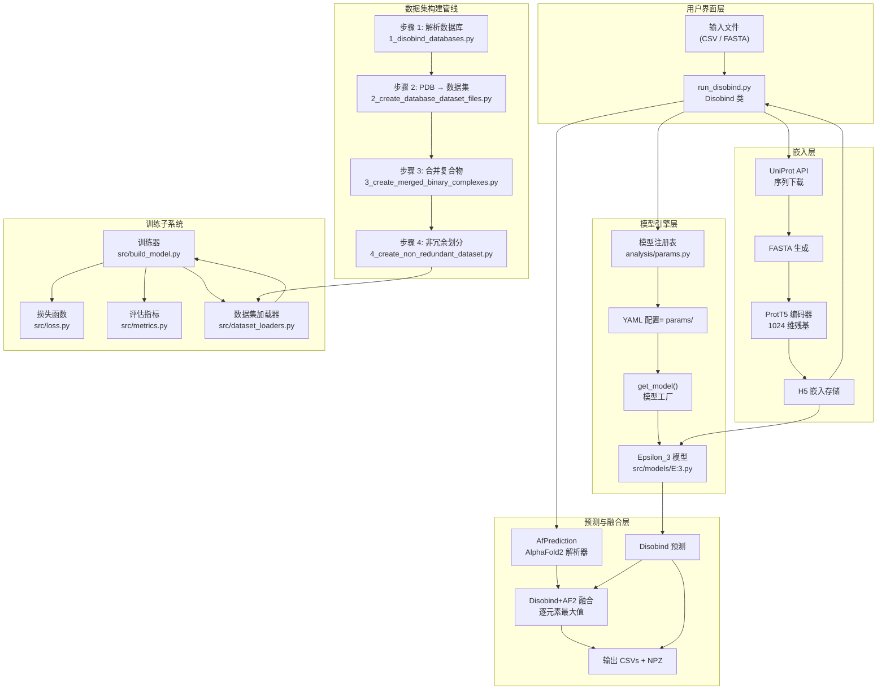
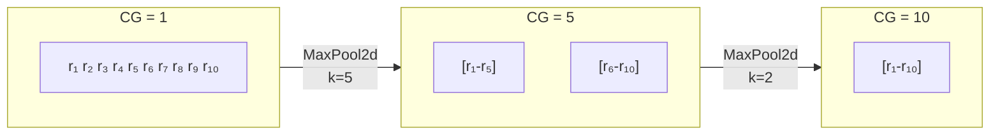
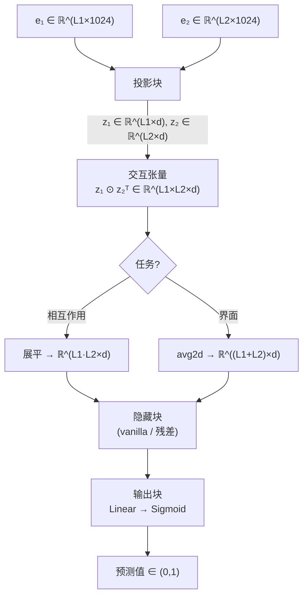
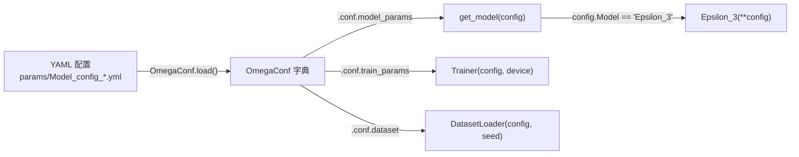
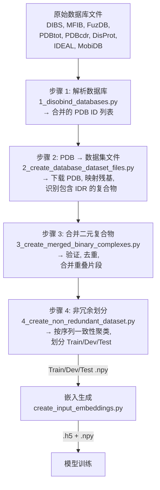

---
slug:4-architecture-overview
blog_type:normal
---


Disobind 是一个**双重用途的深度学习系统**，用于预测内在无序区域 (IDR) 与其结构化伴侣蛋白之间的残基级相互作用，并可选择将其预测结果与 AlphaFold2 结构置信度信号相融合。该架构横跨四个概念层——面向用户的预测编排器、基于 Epsilon_3 模型家族构建的神经网络引擎、蛋白质语言模型嵌入管线，以及多阶段数据集构建框架——每一层都具有明确的职责和数据契约。本页映射了完整的系统拓扑，追踪了主要的数据流，并标识了控制这些层交互方式的关键抽象边界。

## 系统拓扑

下图一览无余地展示了完整的 Disobind 架构，从用户输入到嵌入生成、模型推理和可选的 AF2 融合，直至生成已部署模型的数据集构建和训练子系统。



来源: [run_disobind.py](/run_disobind.py#L1-L60), [src/models/get_model.py](/src/models/get_model.py#L1-L27), [analysis/params.py](/analysis/params.py#L1-L60)

## 预测编排器 — `Disobind` 类

`run_disobind.py` 中的 `Disobind` 类是所有推理工作流的**唯一入口点**。它接受指定一个或多个 IDR-伴侣蛋白对的 CSV 或 FASTA 输入，并协调完整的预测生命周期：下载 UniProt 序列、生成 ProtT5 嵌入、加载适当的模型变体、跨所有请求的任务和粗粒化级别运行推理、可选择解析 AlphaFold2 结构，以及融合预测结果。

该编排器维护一个包含四个参数的 `self.objective` 列表——`[task_type, bin_size, bin_input, single_output]`——该列表通过 `apply_settings()` 针对每个模型变体进行动态重配置。这允许相同的 Epsilon_3 架构在**相互作用**（接触图）和**界面**（残基分类）预测任务之间切换，以及在细粒度 (CG=1) 和粗粒度 (CG=5, 10) 分辨率之间切换，而无需任何架构上的更改。

| 编排器属性 | 用途 | 默认值 |
|---|---|---|
| `embedding_type` | 用于嵌入的蛋白质语言模型 | `"T5"` (ProtT5) |
| `scope` | 全局与局部嵌入上下文 | `"global"` |
| `threshold` | 接触概率二值化截断值 | `0.5` |
| `dist_threshold` | AF2 接触定义的距离截断值 (Å) | `8` |
| `plddt_threshold` | AF2 的 pLDDT 置信度截断值 | `70` |
| `pae_threshold` | AF2 的 PAE 置信度截断值 | `5` |
| `batch_size` | 每个嵌入批次的蛋白质对数 | `200` |
| `parameters` | 模型版本 → 参数文件映射 | `parameter_files(19)` |

<CgxTip>来自 `analysis/params.py` 的 `parameters` 字典是**核心模型注册表**——它将每个 `(objective, CG)` 组合映射到特定的模型版本和检查点文件名。将 `parameter_files()` 的 `model_version` 参数更改为不同的值，即可在完全不同的模型家族之间切换。</CgxTip>

来源: [run_disobind.py](/run_disobind.py#L46-L107), [run_disobind.py](/run_disobind.py#L155-L198)

## 双重预测任务

Disobind 同时处理两个互补的预测目标，每个目标均提供三种粗粒化分辨率：

| 任务 | 输出形状 | 语义含义 | 模型家族 |
|---|---|---|---|
| **相互作用** | `[L1, L2]` | 每对残基的接触概率 | Epsilon_3 v6.x |
| **界面** | `[L1+L2, 1]` | 每个残基的界面隶属概率 | Epsilon_3 v16.x |

**粗粒化 (CG)** 将连续的残基合并为大小为 *k* 的“珠子”，沿每个蛋白质轴将输出维度缩减 *k* 倍。CG=1 为残基级别；CG=5 将 5 个残基分为一珠；CG=10 将 10 个残基分为一珠。此操作通过训练期间对目标执行 `MaxPool2d` 和推理期间对输出执行 `MaxPool2d` 实现，无需修改输入嵌入。这种权衡在于空间分辨率与长序列的预测置信度之间。



来源: [run_disobind.py](/run_disobind.py#L108-L154), [src/utils.py](/src/utils.py#L72-L170), [analysis/params.py](/analysis/params.py#L27-L60)

## Epsilon_3 模型架构

**Epsilon_3** 模型是目前 Disobind 中部署的唯一神经网络架构。它实现了**投影-交互-处理-输出**管线，将两条蛋白质嵌入序列转换为成对相互作用预测。前向传播经过四个不同的块：



### 投影块

每条蛋白质的 1024 维 ProtT5 嵌入通过可配置的层序列投影到较低维空间 (*d* = 128 或 256)。`projection_layer` 配置参数 `[dim, type, bias, multiplier, sharing]` 控制五个属性：

- **dim**: 投影维度 (128 或 256)
- **type**: 归一化放置位置 — `vanilla` (Linear→Activation)、`ln1` (LayerNorm→Linear→Activation)、`ln2` (Linear→Activation→LayerNorm)，以及 `in1/in2/bn1/bn2` 变体
- **sharing**: `"separate"` 创建两个独立的投影层（每条蛋白质一个）；`""` 共享单个层

### 交互张量

投影后的嵌入 *z₁* 和 *z₂* 通过类外积操作组合，形成形状为 `[N, L1, L2, d]` 的交互张量。对于**相互作用**任务，该张量被直接展平为 `[N, L1×L2, d]`。对于**界面**任务，掩码 `avg2d` 操作沿每个轴降维，生成按蛋白质划分的界面特征向量，并拼接为 `[N, L1+L2, d]`。

### 隐藏块与输出块

隐藏块支持两种模式：**vanilla**（带下采样→上采样层的直接直通）和**残差**（带跳跃连接和可选 AddNorm）。输出块应用最终的 `Linear(d, 1)` 投影，随后进行 Sigmoid 激活。可选的**温度缩放**参数可以通过学习或固定以进行校准。

来源: [src/models/Epsilon_3.py](/src/models/Epsilon_3.py#L28-L145), [src/models/get_layers.py](/src/models/get_layers.py#L1-L100), [src/models/get_activation.py](/src/models/get_activation.py#L1-L78)

## 模型工厂与配置管线

模型实例化遵循严格的**配置驱动工厂模式**。`params/` 目录中的 YAML 文件定义了完整的模型架构、数据集路径和训练超参数。`src/models/get_model.py` 中的 `get_model()` 工厂从配置中读取 `Model` 字段，并分派给相应的构造函数。



`model_versions.py` 脚本是**配置生成器**——它以编程方式从 Python 字典构建完整的 YAML 配置，支持对投影维度、层数、丢弃率和激活函数进行消融扫描。这种分离确保了每个已部署的模型检查点都有一个对应的可复现配置文件。

| 配置部分 | 关键参数 | 控制内容 |
|---|---|---|
| `model_params` | `emb_size`, `projection_layer`, `num_hid_layers`, `dropouts`, `activation1/2`, `objective` | Epsilon_3 架构 |
| `dataset` | `input_files`, `train/dev/test_file`, `batch_size`, `batch_shuffle` | 数据加载 |
| `train_params` | `loss`, `optimizer`, `learning_rate`, `scheduler`, `max_epochs`, `contact_threshold` | 训练循环 |

来源: [src/models/get_model.py](/src/models/get_model.py#L1-L27), [src/model_versions.py](/src/model_versions.py#L1-L154), [params/Model_config_Epsilon_3_16.1.yml](/params/Model_config_Epsilon_3_16.1.yml#L1-L121)

## 嵌入生成管线

Disobind 使用**蛋白质语言模型嵌入**作为其唯一的输入表示——在推理时不需要进化信息 (MSA) 或结构特征。`dataset/create_input_embeddings.py` 中的 `Embeddings` 类协调该管线：

1. **序列检索**: 通过 UniProt API 将 UniProt ID 解析为氨基酸序列（使用多进程并行）
2. **FASTA 生成**: 将序列写入 FASTA 文件，可以是全序列（全局范围）或仅片段（局部范围）
3. **编码器推理**: 将 FASTA 文件输入蛋白质语言模型编码器，生成以 HDF5 格式存储的逐残基嵌入

| 编码器 | 嵌入维度 | 来源 | 状态 |
|---|---|---|---|
| **ProtT5** (默认) | 1024 | ProtTrans / HuggingFace | 主要 |
| ProstT5 | 1024 | ProtTrans (3D 感知) | 受支持 |
| ESM2-650M | 1280 | Meta ESM | 受支持 |
| protBERT | 1024 | ProtBERT | 受支持 |
| ProSE | 6165 | ProSE | 受支持 |

默认的 **ProtT5 全局嵌入**在完整蛋白质序列的上下文中对每个残基进行编码，捕获与无序相关的序列模式，而无需任何结构输入。

来源: [dataset/create_input_embeddings.py](/dataset/create_input_embeddings.py#L38-L131), [dataset/utility.py](/dataset/utility.py#L96-L140)

## AlphaFold2 融合 (Disobind+AF2)

当用户提供 AlphaFold2 预测结构和 PAE JSON 文件时，Disobind 执行**互补融合**策略。`AfPrediction` 类解析 AF2 结构以提取高置信度的链间接触（按 pLDDT > 70 和 PAE < 5 进行过滤），随后编排器计算 Disobind 概率图与二值化 AF2 接触图之间的逐元素最大值：

```
diso_af2[i,j] = max(disobind_pred[i,j], af2_contact[i,j])
```

该融合策略的动机在于其互补优势：Disobind 捕获了 AF2 经常遗漏的 IDR 特异性相互作用模式（由于无序区域的 pLDDT 较低），而 AF2 在其预测可靠时提供高置信度的结构接触。其结果是 **Disobind+AF2 恢复了任何单一方法都会遗漏的接触**。

来源: [run_disobind.py](/run_disobind.py#L700-L770), [run_disobind.py](/run_disobind.py#L1100-L1200)

## 训练子系统

`src/build_model.py` 中的 `Trainer` 类扩展了 `nn.Module`，并封装了完整的训练生命周期。它支持多种优化器（Adam、AdamW、带 amsgrad 的 SGD）、学习率调度器（指数、循环、多步、线性、SWA）和梯度裁剪。训练循环通过可插拔的损失函数注册表计算损失，使用 `torchmetrics` 二分类指标进行评估，并可选择应用事后校准（Platt 缩放、Beta 校准、等渗回归）。

`src/loss.py` 中的损失函数库包括 **BCE**、**BCEWithLogits**（带类权重和位置权重）、**Focal Loss**、**奇点增强损失**（默认的 `se_loss`）以及复合损失。奇点增强损失专为接触图中极端的类别不平衡而设计，通过应用不对称惩罚来放大少数（接触）类的梯度。

来源: [src/build_model.py](/src/build_model.py#L24-L90), [src/loss.py](/src/loss.py#L1-L60), [src/metrics.py](/src/metrics.py#L1-L62)

## 数据集构建管线

训练数据在 `dataset/` 目录中流经**四步管线**，将原始数据库条目转换为非冗余的、预先划分的 numpy 数组，为嵌入生成做好准备：



- **步骤 1** 解析五个结构数据库（DIBS、MFIB、FuzDB、PDBtot-cdr）和三个无序数据库（DisProt、IDEAL、MobiDB），以生成包含复合物中 IDR 的合并 PDB ID 列表
- **步骤 2** 下载 PDB 结构，通过 SIFTS 映射 UniProt→PDB 残基位置，并识别二元 IDR-伴侣复合物
- **步骤 3** 验证复合物，合并来自不同 PDB 沉积的重叠片段，并从 Cα 坐标创建接触图
- **步骤 4** 按序列一致性进行聚类，以确保训练、开发和测试划分之间的非冗余性

来源: [dataset/1_disobind_databases.py](/dataset/1_disobind_databases.py#L1-L50), [dataset/2_create_database_dataset_files.py](/dataset/2_create_database_dataset_files.py#L1-L50), [dataset/3_create_merged_binary_complexes.py](/dataset/3_create_merged_binary_complexes.py#L1-L50)

## 项目目录结构

```
disobind/
├── run_disobind.py            # 预测编排器 (Disobind + AfPrediction 类)
├── src/
│   ├── models/
│   │   ├── Epsilon_3.py       # 核心神经网络架构
│   │   ├── get_model.py       # 模型工厂 (配置 → 模型实例)
│   │   ├── get_layers.py      # 层构造器 (投影, 上/下采样)
│   │   └── get_activation.py  # 激活函数注册表
│   ├── build_model.py         # 训练器类 (训练循环, 优化器, 调度器)
│   ├── dataset_loaders.py     # 数据集划分与 DataLoader 创建
│   ├── loss.py                # 损失函数库 (BCE, Focal, SE 等)
│   ├── metrics.py             # 评估指标 (torchmetrics 包装器)
│   ├── model_versions.py      # 配置生成器 (Python → YAML)
│   └── utils.py               # 输入准备, 过采样, 绘图工具
├── dataset/
│   ├── 1_disobind_databases.py       # 步骤 1: 解析结构/无序数据库
│   ├── 2_create_database_dataset_files.py  # 步骤 2: PDB 下载与 IDR 识别
│   ├── 3_create_merged_binary_complexes.py # 步骤 3: 合并与验证复合物
│   ├── 4_create_non_redundant_dataset.py   # 步骤 4: 非冗余划分
│   ├── create_input_embeddings.py    # ProtT5 嵌入生成
│   ├── from_APIs_with_love.py        # API 客户端 (UniProt, PDB, SIFTS)
│   ├── utility.py                    # PDB 解析, 接触图, 坐标提取
│   └── prepare_entry_from_pdb.py     # 单个 PDB 条目处理
├── models/                    # 训练好的模型检查点 (Epsilon_3/Version_*)
├── params/                    # 每个模型版本的 YAML 配置文件
├── analysis/                  # 评估脚本, 基准分析, 参数注册表
│   └── params.py              # 模型版本 → 检查点映射 (注册表)
└── database/
    ├── input_files/           # 处理后的数据库 CSV, 合并的 PDB 列表
    └── raw/                   # 原始数据库下载 (DIBS, DisProt, IDEAL 等)
```

<CgxTip>`models/` 和 `params/` 目录**按约定配对**：每个 `models/Epsilon_3/Version_X/Y.pth` 检查点都有一个对应的 `params/Model_config_Epsilon_3_X.yml`。`analysis/params.py` 注册表是从 `(task, CG)` → `(model_version, checkpoint_filename)` 的权威映射。</CgxTip>

来源: [run_disobind.py](/run_disobind.py#L1-L60), [src/models/Epsilon_3.py](/src/models/Epsilon_3.py#L28-L80), [dataset/3_create_merged_binary_complexes.py](/dataset/3_create_merged_binary_complexes.py#L55-L100)

## 架构设计原则

三大原则指导着 Disobind 架构：

**嵌入与推理分离。** 蛋白质语言模型嵌入被预计算并存储在磁盘上 (HDF5)，将昂贵的编码器前向传播与轻量级的 Epsilon_3 推理解耦。这使得能够批量嵌入数千个蛋白质对，随后进行快速的模型评估。

**配置驱动的模型多样性。** 单个 Epsilon_3 架构类仅通过 YAML 配置即可服务于所有六个已部署的模型变体（2 个任务 × 3 个 CG 级别）。在相互作用和界面预测之间切换，或在细粒度和粗粒度分辨率之间切换，无需任何代码更改。

**互补融合而非替代。** Disobind+AF2 融合策略反映了一种架构洞察：IDR 相互作用需要专门的模型 (Disobind) 来捕获通用结构预测器 (AF2) 所遗漏的信息，而不是与它们竞争。逐元素最大值融合是这一原则的最简单实例化——未来的扩展可以学习自适应融合权重。

## 建议阅读路径

- 了解神经网络内部机制: [Epsilon_3 模型架构](5-epsilon_3-model-architecture) → [投影与交互张量](6-projection-and-interaction-tensor) → [粗粒化预测策略](7-coarse-grained-prediction-strategy)
- 运行预测: [使用 ProtT5 生成嵌入](8-embedding-generation-with-prott5) → [Disobind 及 Disobind+AF2 预测](9-disobind-and-disobind-af2-prediction) → [输出解释](10-output-interpretation)
- 训练自定义模型: [模型训练工作流](11-model-training-workflow) → [损失函数与校准](12-loss-functions-and-calibration) → [YAML 配置参数](17-yaml-config-parameters)
- 构建数据集: [无序蛋白数据库](14-disorder-protein-databases) → [四步数据集管线](15-four-step-dataset-pipeline) → [非冗余数据集划分](16-non-redundant-dataset-splitting)