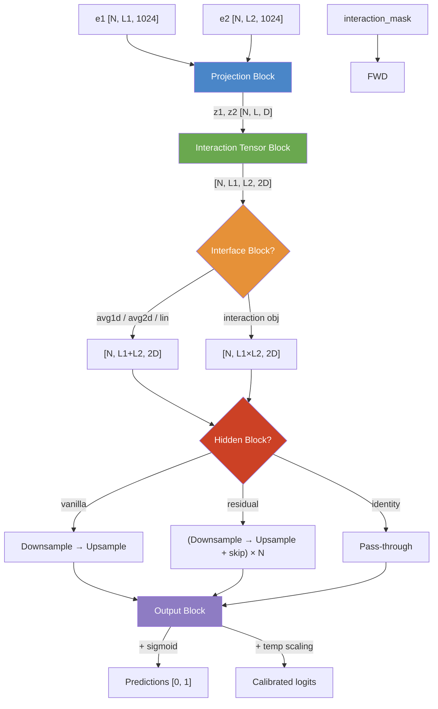

---
slug:5-epsilon_3-model-architecture
blog_type:normal
---


**Epsilon_3** 模型是 Disobind 的核心神经网络——一种孪生网络架构，它将残基级的蛋白质嵌入投影到共享潜空间，由两个投影序列构建成对交互张量，然后通过瓶颈隐藏块对该张量进行精炼，最后输出残基级或残基对级的预测结果。其设计刻意保持模块化：五个顺序块——**投影 → 交互张量 → 接口 → 隐藏 → 输出**——每个块均可通过 YAML 参数文件独立配置，使得同一个 `Epsilon_3` 类无需修改代码即可同时服务于接触图预测（交互任务）和结合区域预测（接口任务）。

来源：[Epsilon_3.py](src/models/Epsilon_3.py#L1-L21), [get_model.py](src/models/get_model.py#L1-L27)

## 高层数据流

前向传播严格按照顺序协调这五个块。给定输入嵌入 **e1** 和 **e2**（来自 ProtT5，形状均为 `[N, L, 1024]`）以及标记有效残基对的 **interaction_mask**，模型会生成预测张量 **o**，其形状取决于目标：

```
e1, e2 ──► 投影块 ──► z1, z2 ──► 交互张量 ──► 接口块 ──► 隐藏块 ──► 输出块 ──► o
[N,L,C]     [N,L,D]              [N,L1,L2,2D]    [N, L1+L2, 2D]     [N, L1+L2, state2]   [N, L1+L2, 1]
```

下面的 Mermaid 图展示了相同的流程，并包含每种配置变体的分支路径：



来源：[Epsilon_3.py](src/models/Epsilon_3.py#L131-L151)

## 投影块

投影块将高维 ProtT5 嵌入（1024维）映射到维度为 `projection_dim`（通常为 128 或 256）的紧凑潜空间中。它是**唯一接触原始嵌入的块**；所有后续块均基于投影表示进行操作。

### 共享与独立投影

当 `projection_layer[4] == "separate"` 时，会实例化两个独立的投影网络（`projection_layer1` 和 `projection_layer2`）——每个蛋白质链各对应一个。当设置为 `""`（空字符串，所有内置配置的默认值）时，**两条链共享同一个投影网络**，这施加了孪生约束，确保两种蛋白质被映射到相同的潜在几何结构中。这种共享权重设计对于使外积交互张量具有几何意义至关重要：在 z 空间中，相同的距离代表相同的相互作用潜能程度，无论残基属于哪条链。

来源：[Epsilon_3.py](src/models/Epsilon_3.py#L64-L80), [Epsilon_3.py](src/models/Epsilon_3.py#L155-L178)

### 投影层变体

`get_layers.py` 中的 `create_projection_layers` 工厂支持七种归一化放置方式，每种都由一个 `Linear → Activation` 核心与可选的预归一化或后归一化组合而成：

| 类型 | 结构 | 归一化位置 |
|------|-----------|------------------------|
| `vanilla` | Linear → Activation | 无 |
| `ln1` | LayerNorm → Linear → Activation | 预激活，作用于输入特征 |
| `ln2` | Linear → Activation → LayerNorm | 后激活，作用于输出特征 |
| `in1` | Permute → InstanceNorm1d → Permute → Linear → Activation | 预激活，作用于输入特征 |
| `in2` | Linear → Activation → Permute → InstanceNorm1d → Permute | 后激活，作用于输出特征 |
| `bn1` | Permute → BatchNorm1d → Permute → Linear → Activation | 预激活，作用于输入特征 |
| `bn2` | Linear → Activation → Permute → BatchNorm1d → Permute | 后激活，作用于输出特征 |

所有内置配置均使用 **`ln2`**（Linear → ELU → LayerNorm），它通过在非线性操作之后进行归一化来稳定投影表示。`Permute` 辅助模块交换 `[N, L, C] ↔ [N, C, L]`，因为 PyTorch 的 `InstanceNorm1d` 和 `BatchNorm1d` 期望通道维在首位。

来源：[get_layers.py](src/models/get_layers.py#L8-L84)

### 投影后 Dropout

投影之后，在 z1 和 z2 从 `projection_block` 方法返回之前，会分别对它们应用 `Dropout(p=dropouts[0])`。所有配置的默认比率均为 0.2。

来源：[Epsilon_3.py](src/models/Epsilon_3.py#L175-L178)

## 交互张量块

交互张量是 Epsilon_3 捕获两个投影序列之间**成对残基-残基关系**的机制。它是架构的核心所在——在这一步中，两个独立投影的链被组合成一个联合表示。

### 聚合操作

`capture_interaction` 方法在投影嵌入 z1 和 z2 之间实现了九种二元操作。对于内置模型，最重要的是：

| 操作 | 公式 | 输出形状 | 语义 |
|-----------|---------|-------------|----------|
| `op` (外积) | z1.unsqueeze(2) × z2.unsqueeze(1) | [N, L1, L2, D] | 双线性交互强度 |
| `od` (外差) | \|z1.unsqueeze(2) − z2.unsqueeze(1)\| | [N, L1, L2, D] | 逐特征差异性 |
| `os` (外和) | z1.unsqueeze(2) + z2.unsqueeze(1) | [N, L1, L2, D] | 加法组合 |
| `add` | z1 + z2 | [N, L, D] | 逐元素求和（等长） |
| `multiply` | z1 * z2 | [N, L, D] | Hadamard 乘积 |
| `dot` | Σ(z1 * z2) | [N, L, 1] | 标量相似度 |
| `cosine` | cos_sim(z1, z2) | [N, L, 1] | 归一化相似度 |

### 双操作策略

`input_layer` 配置指定了一种**复合操作**，如 `"op-od"`，它以连字符分割并独立应用这两种操作，然后沿特征维度拼接结果。使用 `op-od` 时，最终的交互张量形状为 `[N, L1, L2, 2D]`——外积捕获双线性耦合，外差捕获逐特征的差异性。这种双通道设计为下游层提供了互补的视角：乘积突出显示两个残基特征在符号和幅度上何时对齐，而绝对差突出显示它们何时发散。

### 拼接模式

当 `input_layer[1] == "vanilla"`（默认值）时，这两种操作在原始 (z1, z2) 对上计算。当设置为 `"concat"` 时，序列首先沿长度维度 `[N, L1+L2, D]` 进行拼接，然后这两种操作都应用于自对 `(z, z)`，生成一个方形的 `[N, L1+L2, L1+L2, 2D]` 张量——这在必须同时建模链内相互作用时非常有用。

来源：[Epsilon_3.py](src/models/Epsilon_3.py#L228-L296)

## 接口块

接口块将 4D 交互张量 `[N, L1, L2, C]` 降维至 2D 残基级表示 `[N, L1+L2, C]`，适用于预测**哪些残基参与结合**（而不是哪些特定残基对发生相互作用）。提供了三种降维策略：

| 策略 | 机制 | 细节 |
|----------|-----------|--------|
| `avg1d` | 沿 W 轴求平均 | 简单坍缩：`torch.mean(tensor, axis=2)` |
| `avg2d` | 带掩码的双向平均 | 分别沿 L2 和 L1 轴计算带有填充感知掩码的平均值，然后拼接 |
| `lin` | 可学习的线性投影 | 沿每个序列轴应用共享的 `Linear(L, 1)`，然后拼接 |

**`avg2d`** 策略是接口模型（16.x 版本）的默认策略。其实现经过精心设计，以在平均计算中排除填充元素：掩码加权和除以有效位置计数（加上 ε = 10⁻⁴ 以保证数值稳定性），生成两个向量 I1 `[N, L1, C]` 和 I2 `[N, L2, C]`，它们被拼接成 `[N, L1+L2, C]`。这是将成对张量转换为每链残基表示的关键步骤。

对于**交互**目标（6.x 版本），接口块被完全绕过——4D 张量只需重塑为 `[N, L1×L2, C]` 即可用于扁平的残基对预测。

来源：[Epsilon_3.py](src/models/Epsilon_3.py#L181-L225)

## 隐藏块

隐藏块通过**下采样-然后-上采样瓶颈**处理（现已为 2D 的）表示的特征维度。支持两种架构变体，由 `hidden_block[0]` 控制：

### Vanilla 块

单次传递：**下采样 → 上采样**。无残差连接。适用于瓶颈较浅（每个方向 1-3 层）的情况。

### 残差块

重复 `num_blocks` 次迭代：**(Dropout → 下采样 → 上采样 + skip)** × N。跳跃连接使用以下三种策略之一将块的输入与其输出合并：

| 残差类型 | 公式 | 备注 |
|---------------|---------|-------|
| `None` | o = output (无加法) | 实质上无残差；仅迭代瓶颈 |
| `vanilla` | o = output + input | 标准加性跳跃 |
| `addnorm` | o = LayerNorm(output + input) | 归一化残差 |
| `addactivnorm` | o = LayerNorm(Activation(output + input)) | 先激活再归一化 |

对于 InstanceNorm 或 BatchNorm 变体，张量在归一化前被置换为 `[N, C, L]`，归一化后再置换回来。

### 下采样和上采样层

每个下采样层将特征维度减半：`state → state/scale_factor`，每个上采样层将其加倍恢复：`state → state × scale_factor`。每一层均遵循 **Norm/Dropout → Linear → Activation** 模式，其中归一化与 Dropout 之间的选择是互斥的（由 `norm[0]` 控制）。特征宽度的变化会在构建时被跟踪并打印（例如，`"256 --> 128 --> 64"`）。

**通道状态算术**在初始化时计算：`state0 = 2 × projection_dim`（张量拼接后），`state1 = state0 / scale^downsample_layers`（瓶颈），`state2 = state1 × scale^upsample_layers`（恢复）。最终的隐藏维度 `state2` 决定了输出线性层的输入大小。

来源：[Epsilon_3.py](src/models/Epsilon_3.py#L49-L54), [Epsilon_3.py](src/models/Epsilon_3.py#L300-L335), [get_layers.py](src/models/get_layers.py#L87-L212)

## 输出块

输出块是一个简单的线性投影，后跟可选的后处理：

1. **线性投影**：带有可配置偏置的 `nn.Linear(state2, output_dim)`，将隐藏表示映射为每个残基（或残基对）的单个 logit。
2. **温度缩放**：如果 `temperature` 不为 `None`，logit 将除以一个可学习（或固定）的标量温度参数——这是一种事后校准技术，用于软化或锐化 sigmoid 输出。
3. **激活**：如果 `activation2[1]` 为 `True`，则应用最终的 sigmoid，生成 [0, 1] 范围内的概率。否则，返回原始 logit（用于训练期间的 `BCEWithLogitsLoss`）。

来源：[Epsilon_3.py](src/models/Epsilon_3.py#L338-L354)

## 激活函数注册表

`get_activation` 工厂支持 13 种激活函数，允许在同一架构内进行广泛的实验：

| 激活函数 | 可训练参数 | 用例 |
|------------|-----------------|----------|
| `relu` | 无 | 标准基线 |
| `leakyrelu` | 无 (或固定斜率) | 处理死亡神经元 |
| `elu` | 无 | **activation1 的默认值** — 在零点处平滑 |
| `gelu` | 无 | 高斯近似 |
| `celu` | 无 | 连续可微的 ELU |
| `prelu` | 是 (逐通道) | 可学习的负斜率 |
| `silu` | 无 | Swish — 自门控 |
| `mish` | 无 | 平滑非单调 |
| `sigmoid` | 无 | **activation2 的默认值** — 有界输出 |
| `tanh` | 无 | 零中心有界 |
| `softmax` | 无 | 多类分布 |
| `logistic_activation` | 是 (η, x₀) | 具有可训练陡度的广义 sigmoid |

`LogisticActivation` 类实现了一个参数化的 sigmoid `1/(1 + exp(−η(x − x₀)))`，其中 η 控制斜率，x₀ 控制中点——这在无需单独温度参数的情况下对输出置信度进行校准非常有用。

来源：[get_activation.py](src/models/get_activation.py#L1-L77)

## 配置驱动的架构变体

所有架构选择均通过 `projection_layer`、`input_layer`、`num_hid_layers` 和 `objective` 配置元组指定——同一个 Python 类可实例化出截然不同的网络。下表比较了六种内置模型配置：

| 参数 | V6 (交互, bin=10) | V6.1 (交互, bin=5) | V6.2 (交互, 完整) | V16 (接口, 完整) | V16.1 (接口, bin=5) | V16.2 (接口, bin=10) |
|-----------|--------------------------|---------------------------|--------------------------|------------------------|--------------------------|---------------------------|
| **目标** | `interaction_bin` | `interaction_bin` | `interaction` | `interface` | `interface_bin` | `interface_bin` |
| **分箱大小** | 10 | 5 | 1 | 1 | 5 | 10 |
| **投影维度** | 128 | 128 | 256 | 128 | 128 | 128 |
| **投影类型** | ln2 | ln2 | ln2 | ln2 | ln2 | ln2 |
| **交互操作** | op-od | op-od | op-od | op-od | op-od | op-od |
| **接口降维** | — | — | — | avg2d | avg2d | avg2d |
| **下采样层** | 0 | 0 | 0 | 0 | 0 | 0 |
| **上采样层** | 3 | 3 | 3 | 0 | 0 | 0 |
| **缩放因子** | 2 | 2 | 2 | 0 | 0 | 0 |
| **隐藏块** | vanilla | vanilla | vanilla | vanilla | vanilla | vanilla |
| **activation1** | elu | elu | elu | elu | elu | elu |
| **activation2** | sigmoid | sigmoid | sigmoid | sigmoid | sigmoid | sigmoid |

<CgxTip>6.x 版本系列和 16.x 版本系列在基础架构方式上存在根本差异：V6 模型通过展平交互张量来生成**逐对**预测（接触图），而 V16 模型通过 avg2d 边缘化交互张量来生成**逐残基**预测（接口标签）。V6 中的隐藏瓶颈 (upsample=3, scale=2) 将 256 维拼接特征扩展通过 256→512→1024→2048，而 V16 完全跳过了隐藏块——avg2d 降维已经为接口任务提供了强大的归纳偏置。</CgxTip>

<CgxTip>`state0 → state1 → state2` 算术决定了整个特征宽度的轨迹。对于 projection_dim=128 的 V6：state0=256，state1=256（0 个下采样层），state2=256×2³=2048（3 个上采样层）。因此，输出线性层映射 2048→1——这是一种巨大的扩展，为最终分类提供了充足的容量，以理清被压缩在 128 维投影中的交互模式。</CgxTip>

来源：[Model_config_Epsilon_3_6.yml](params/Model_config_Epsilon_3_6.yml#L1-L56), [Model_config_Epsilon_3_6.1.yml](params/Model_config_Epsilon_3_6.1.yml#L1-L57), [Model_config_Epsilon_3_6.2.yml](params/Model_config_Epsilon_3_6.2.yml#L1-L57), [Model_config_Epsilon_3_16.yml](params/Model_config_Epsilon_3_16.yml#L1-L56), [Model_config_Epsilon_3_16.1.yml](params/Model_config_Epsilon_3_16.1.yml#L1-L56), [Model_config_Epsilon_3_16.2.yml](params/Model_config_Epsilon_3_16.2.yml#L1-L56)

## 构造函数参数映射

`Epsilon_3.__init__` 签名接受 17 个参数，每个参数均通过 `get_model` 从 YAML 配置映射而来。下表记录了每个参数及其配置键和作用：

| 构造函数参数 | 配置键 | 类型 | 描述 |
|-------------------|-----------|------|-------------|
| `emb_size` | `emb_size` | int | 输入嵌入维度（T5 为 1024） |
| `projection_layer` | `projection_layer` | list | `[dim, type, bias, multiplier, separate]` |
| `output_dim` | `output_dim` | int | 输出类数量（二分类为 1） |
| `activation1` | `activation1` | tuple | 隐藏激活的 `[name, param]` |
| `activation2` | `activation2` | tuple | 输出激活的 `[name, apply_bool]` |
| `input_layer` | `input_layer` | list | `[ops, concat_mode, interface_reduce, ...]` |
| `num_samples` | `num_samples` | int | MC dropout 采样数（0 = 禁用） |
| `num_hid_layers` | `num_hid_layers` | list | `[up_layers, down_layers, blocks, scale, block_type, residual_type]` |
| `bias` | `bias` | bool | 线性层是否包含偏置 |
| `max_len` | `max_seq_len` | int | 最大填充序列长度 |
| `dropouts` | `dropouts` | list | `[proj, residual, upsample, downsample, mc]` 比率 |
| `norm` | `norm` | list | `[apply_bool, type]`，其中 type ∈ {LN, BN, IN} |
| `temperature` | `temperature` | float/None | 温度缩放值（None = 禁用） |
| `output_layer` | `output_layer` | str | 输出层变体名称 |
| `objective` | `objective` | list | `[task, bin_size, pool, bin_post_proj, bin_input, single_output]` |
| `device` | `device` | str | 计算设备（`cuda` 或 `cpu`） |

来源：[Epsilon_3.py](src/models/Epsilon_3.py#L16-L20), [get_model.py](src/models/get_model.py#L4-L26)

## 接下来去哪

Epsilon_3 架构的交互张量是该模型的数学核心。要了解外积/外差策略的几何解释及其保留方向交互信息的原因，请参阅 [投影与交互张量](6-projection-and-interaction-tensor)。有关粗粒度分箱如何降低计算成本同时保持预测准确率的详细说明，请参阅 [粗粒度预测策略](7-coarse-grained-prediction-strategy)。要追踪训练后的模型在预测时如何使用真实蛋白质输入进行调用，请参阅 [Disobind 和 Disobind+AF2 预测](9-disobind-and-disobind-af2-prediction)。