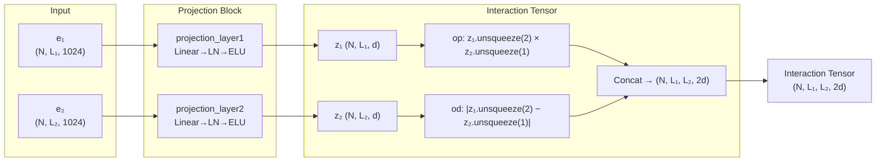

---
slug:6-projection-and-interaction-tensor
blog_type:normal
---


**投影与交互张量**是 Epsilon_3 模型的架构核心——一种两阶段的计算机制：首先将高维蛋白质嵌入压缩至紧凑的潜在空间，随后构造一个 4D 张量，编码两条蛋白质链之间残基与残基的成对关系。该机制将独立的逐链表示转换为具备交互感知的联合表示，使其成为连接孤立蛋白质理解与结合预测之间的数学桥梁。

## 架构角色与数据流

在 Epsilon_3 的前向传播中，投影与交互张量阶段占据了五阶段流水线中前两个关键位置：**投影 → 交互张量 → 接口降维 → 隐藏层处理 → 输出**。前向方法通过在执行任何下游处理之前，依次委派给 `projection_block` 和 `get_interaction_tensor`，明确体现了这一流程。



交互张量 **T** ∈ ℝ^{N × L₁ × L₂ × 2d} 是核心数据结构：每个空间位置 (i, j) 包含一个 2d 维的特征向量，编码链 1 的残基 i 与链 2 的残基 j 之间的关系。根据目标不同，该张量具有双重用途——作为交互预测的完整接触图表示，或作为接口预测的降维算子输入。

来源: [Epsilon_3.py](src/models/Epsilon_3.py#L131-L151)

## 投影块：维度压缩

投影块将原始 ProtT5 嵌入从 1024 维映射至维度为 `projection_dim`（通常为 128 或 256）的紧凑潜在空间。这种压缩兼顾了计算效率与表示目的——强制模型学习一个信息瓶颈，仅保留与交互相关的特征。

### 共享与独立投影

模型支持由 `projection_layer[4]` 控制的两种投影配置。当设置为 `"separate"` 时，每条链拥有各自独立的投影层（`projection_layer1` 和 `projection_layer2`），允许非对称特征提取。当设置为 `""`（空字符串，默认值）时，两条链应用**单一共享投影层**——强制实施权重绑定，将两条链视为源自同一蛋白质空间，这是所有已发布模型版本的标准配置。

来源: [Epsilon_3.py](src/models/Epsilon_3.py#L64-L80), [Epsilon_3.py](src/models/Epsilon_3.py#L155-L178)

### 投影层变体

`create_projection_layers` 工厂函数生成六种归一化感知变体，每种变体将线性变换与配置的激活函数（在所有已发布版本中为 ELU）相结合。命名约定遵循位置模式：前缀指示归一化类型，后缀指示相对于“线性-激活”序列的放置位置。

| 变体 | 架构 | 归一化位置 | 备注 |
|---------|-------------|----------------|-------|
| `vanilla` | Linear → Activation | None | 基线，无归一化 |
| `ln1` | LayerNorm → Linear → Activation | 线性层前 | 归一化输入特征 |
| **`ln2`** | **Linear → Activation → LayerNorm** | **激活后** | **所有已发布模型的默认配置** |
| `in1` | InstanceNorm1d → Linear → Activation | 线性层前 | 逐样本归一化 |
| `in2` | Linear → Activation → InstanceNorm1d | 激活后 | 逐样本归一化 |
| `bn1` | BatchNorm1d → Linear → Activation | 线性层前 | 批次级归一化 |
| `bn2` | Linear → Activation → BatchNorm1d | 激活后 | 批次级归一化 |

`ln2` 变体在所有六个已发布配置（版本 6、6.1、6.2、16、16.1、16.2）中均被普遍使用。激活后归一化（后缀 `2`）通过在应用非线性后进行归一化来稳定投影表示，从而防止特征幅度在训练步中漂移——当投影嵌入直接输入到外积操作中时，这一点尤为重要，因为不受控制的幅度将产生复合效应。

<CgxTip>`in1`/`in2` 和 `bn1`/`bn2` 变体需要 `Permute` 包装器，在应用 1D 归一化之前转置序列和特征维度，因为 `InstanceNorm1d` 和 `BatchNorm1d` 期望通道优先格式 (N, C, L)，而模型以序列优先格式 (N, L, C) 运行。</CgxTip>

来源: [get_layers.py](src/models/get_layers.py#L17-L85)

## 交互张量构建

`get_interaction_tensor` 方法是将逐链投影嵌入转换至联合交互空间的机制。它根据 `input_layer[1]` 在两种可配置模式下运行。

### Vanilla 模式 (`input_layer[1] = "vanilla"`)

这是所有已发布模型使用的默认模式。两个投影输出 **z₁** ∈ ℝ^{N × L₁ × d} 和 **z₂** ∈ ℝ^{N × L₂ × d} 分别经过两个二元交互算子处理，然后沿特征维度拼接：

```
z_i1 = capture_interaction(z1, z2, op1)    →  ℝ^{N × L₁ × L₂ × d}
z_i2 = capture_interaction(z1, z2, op2)    →  ℝ^{N × L₁ × L₂ × d}
interaction_tensor = cat([z_i1, z_i2], dim=-1)  →  ℝ^{N × L₁ × L₂ × 2d}
```

### Concat 模式 (`input_layer[1] = "concat"`)

一种替代模式，其中 z₁ 和 z₂ 首先沿序列维度拼接形成 z ∈ ℝ^{N × (L₁+L₂) × d}，随后两个算子均应用于该组合表示与其自身的交互。这会生成一个更大的 (L₁+L₂) × (L₁+L₂) 交互矩阵，包含链内交互，但计算成本显著增加。

来源: [Epsilon_3.py](src/models/Epsilon_3.py#L267-L296)

## 捕获交互算子

`capture_interaction` 方法实现了九种用于组合投影嵌入的二元算子。这些算子根据其输出几何特征分为三类：

### 逐元素算子（同形状输出）

这些算子需要形状完全相同的输入，并生成逐元素的组合。它们用于单位置比较，但**无法**生成成对残基-残基预测所需的 4D 交互张量。

| 算子 | 公式 | 输出形状 | 用途 |
|----------|---------|-------------|------|
| `add` | z₁ + z₂ | (N, L, d) | 逐元素求和 |
| `subtract` | z₁ − z₂ | (N, L, d) | 逐元素求差 |
| `mag` | \|z₁ − z₂\| | (N, L, d) | 差的模长 |
| `multiply` | z₁ ⊙ z₂ | (N, L, d) | Hadamard 乘积 |
| `dot` | Σ(z₁ ⊙ z₂) | (N, L, 1) | 标量点积 |
| `cosine` | cos(z₁, z₂) | (N, L, 1) | 余弦相似度 |

### 外积算子（4D 张量输出）

这些是交互张量构建的**主要算子**。它们使用 `unsqueeze` 将逐链嵌入广播至成对比较空间，生成关键的 4D 张量。

| 算子 | 公式 | 输出形状 | 几何解释 |
|----------|---------|-------------|------------------------|
| **`op`** | z₁.unsqueeze(2) ⊙ z₂.unsqueeze(1) | (N, L₁, L₂, d) | **外积**——每个残基对的乘性交互 |
| **`od`** | \|z₁.unsqueeze(2) − z₂.unsqueeze(1)\| | (N, L₁, L₂, d) | **外差**——每个残基对的基于距离的交互 |
| `os` | z₁.unsqueeze(2) + z₂.unsqueeze(1) | (N, L₁, L₂, d) | 外和——每个残基对的加性交互 |

### 默认 `op-od` 组合

所有已发布模型均使用 `input_layer[0] = "op-od"`，组合了外积和外差算子。该配对捕获了**互补的几何信息**：外积编码乘性特征相关性（跨残基对哪些特征共同激活），而外差编码特征空间距离（每个残基对的相异程度）。它们的拼接为每个残基对产生一个 2d 维的特征向量，富含相似性与相异性信号。

<CgxTip>`op` 算子在数学上等价于无学习权重的双线性形式——它同时计算所有特征对的 Hadamard 乘积。结合后续的线性输出层，这等价于为每个输出维度学习一个独立的双线性权重矩阵，但参数成本远低，因为双线性被分解到了投影过程中。</CgxTip>

来源: [Epsilon_3.py](src/models/Epsilon_3.py#L228-L263)

## 接口降维：从 4D 张量到逐链预测

当目标为接口预测（而非完整的交互/接触图预测）时，4D 交互张量必须降维为每条链的逐残基预测。`interface_block` 方法提供三种降维策略：

| 策略 | `input_layer[2]` | 机制 | 输出形状 |
|----------|-------------------|-----------|-------------|
| `avg1d` | `"avg1d"` | 沿轴 2 求平均（折叠 L₂） | (N, L₁, 2d) |
| **`avg2d`** | **`avg2d`** | **沿双轴的掩码感知平均** | **(N, L₁+L₂, 2d)** |
| `lin` | `"lin"` | 学习的线性折叠 | (N, L₁+L₂, 2d) |

**`avg2d`** 策略用于所有接口预测模型（版本 16、16.1、16.2）。它沿交互张量的两个空间轴计算掩码感知平均值，生成两个独立的逐链摘要：I₁ ∈ ℝ^{N × L₁ × 2d}（对链 2 残基求平均）和 I₂ ∈ ℝ^{N × L₂ × 2d}（对链 1 残基求平均）。该掩码确保填充残基不会污染平均计算——只有有效（非填充）位置对每个残基的摘要向量有贡献。

`lin` 策略应用一个学习的线性层，每次应用折叠一个空间维度，允许模型在相反链的残基上学习类注意力权重。其通过置换交互张量、应用共享线性投影，然后拼接双向折叠的结果来运行。

来源: [Epsilon_3.py](src/models/Epsilon_3.py#L181-L225)

## 已发布版本的配置

投影与交互张量配置在六个已发布模型版本中有所不同，反映了不同的投影维度与目标：

| 版本 | proj_dim | proj_type | 1算子 | 模式 | 降维 | 目标 |
|---------|----------|-----------|-----------|------|-----------|-----------|
| 6 | 128 | ln2, | op-od | vanilla | — | interaction_bin (bin=10) |
| 6.1 | 128 | ln2 | op-od | vanilla | — | interaction_bin (bin=5) |
| 6.2 | **256** | ln2 | op-od | vanilla | — | interaction |
| 16 | 128 | ln2 | op-od | vanilla | avg2d | interface |
| 16.1 | 128 | ln2 | op-od | vanilla | avg2d | interface_bin (bin=5) |
| 16.2 | 128 | ln2 | op-od | vanilla | avg2d | interface_bin (bin=10) |

版本 6 系列针对**接触图预测**——保留完整的 (L₁ × L₂) 交互张量并展平以进行下游处理。版本 16 系列针对**接口预测**——交互张量通过 avg2d 降维为逐链的残基级表示。版本 6.2 独特地使用了 256 维投影空间，使交互张量的特征深度倍增至 512。

来源: [Model_config_Epsilon_3_6.yml](params/Model_config_Epsilon_3_6.yml#L11-L21), [Model_config_Epsilon_3_6.2.yml](params/Model_config_Epsilon_3_6.2.yml#L11-L21), [Model_config_Epsilon_3_16.2.yml](params/Model_config_Epsilon_3_16.2.yml#L11-L21)

## 数学总结

默认配置下的完整投影与交互张量计算可表示为：

1. **投影**：zₖ = LayerNorm(ELU(Wₚ · eₖ + bₚ))，其中 k ∈ {1, 2}，Wₚ ∈ ℝ^{d×1024}
2. **外积**：T^(op)_{i,j} = z₁ᵢ ⊙ z₂ⱼ（投影特征的逐元素乘积）
3. **外差**：T^(od)_{i,j} = |z₁ᵢ − z₂ⱼ|（投影特征的绝对差）
4. **交互张量**：T_{i,j} = [T^(op)_{i,j} ; T^(od)_{i,j}]（沿特征轴拼接）

对于接口预测，第五步应用掩码感知平均：
5. **接口降维**：I₁ᵢ = (1/|V₂|) Σⱼ∈V₂ T_{i,j}，I₂ⱼ = (1/|V₁|) Σᵢ∈V₁ T_{i,j}，I = [I₁ ; I₂]

其中 V₁、V₂ 表示每条链的有效（非填充）残基索引集合。

该公式确保每个残基对的交互均由其特征空间相关结构（op）和特征空间距离结构（od）共同表征，提供互补信号，使下游线性输出层能够对其进行选择性加权，以完成最终的逐残基或逐对预测。