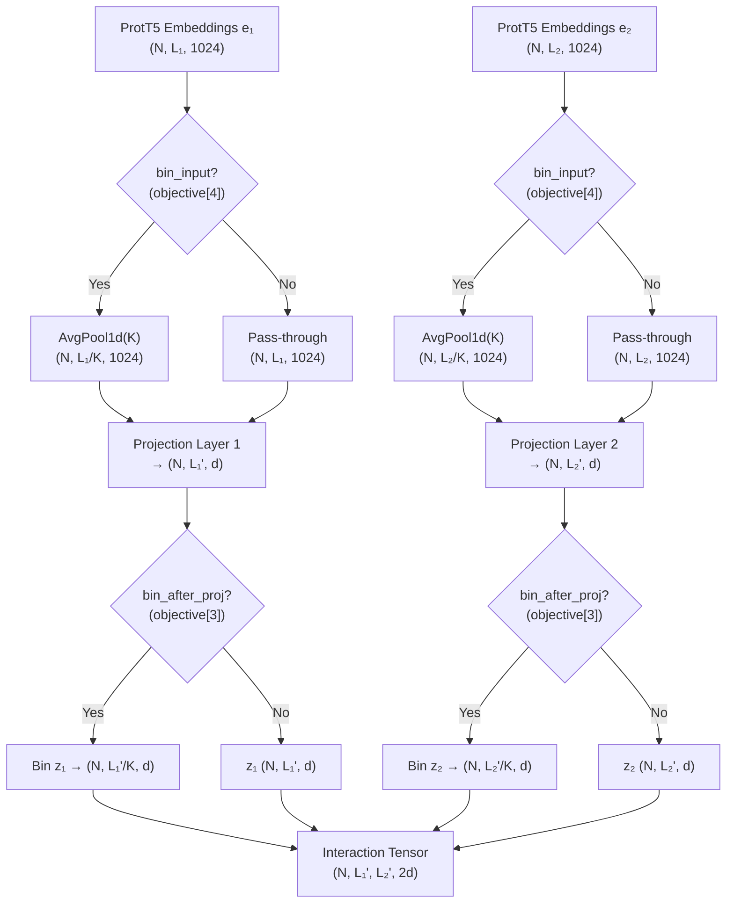
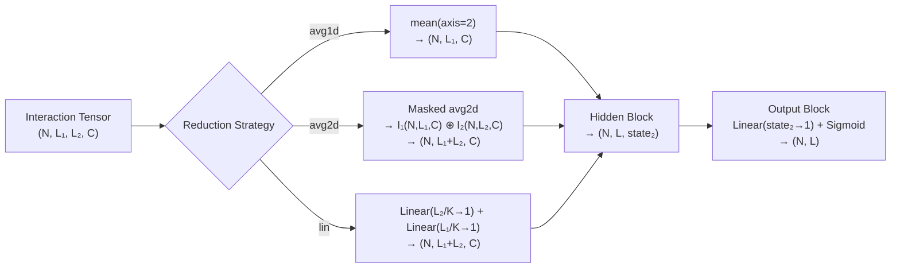

---
slug:7-coarse-grained-prediction-strategy
blog_type:normal
---

Disobind 的**粗粒度预测策略**是一种多分辨率推理框架，它将残基级别的预测划分到固定大小的分箱中，以空间粒度换取统计鲁棒性和计算效率。该模型不再对可能数千个残基对逐一预测交互概率，而是将连续的残基聚合成粗粒度单元，在降低后的分辨率上进行预测，并可选择细化回残基级别的细节。该策略由 `objective` 配置参数控制——这是一个 6 元组，控制着预测任务类型、分箱大小、聚合方法、投影阶段分箱、输入分箱和单输出模式。

来源：[Epsilon_3.py](src/models/Epsilon_3.py#L15-L48), [utils.py](src/utils/utils.py#L92-L120)

## Objective 参数：粗粒化控制结构剖析

`objective` 元组是控制整个粗粒度预测策略的唯一配置项。元组中的每个位置控制着分箱流水线的不同方面：

| 索引 | 字段 | 描述 | 示例值 |
|-------|-------|-------------|----------------|
| 0 | `objective_type` | 预测任务：GF(`G098(交互), `/interaction@&%` | `interface_bin` |
| 1 | `bin_size` | 粗化的卷积核大小；将 `bin_size` 个连续残基分为一组 | `1`, `5`, `10` |
| 2 | `bin_method` | 目标聚合的池化方法 | `avg`, `max` |
| 3 | `bin_after_projection` | 是否在投影块*之后*对投影嵌入进行分箱 | `true`, `false` |
| 4 | `bin_input` | 是否在进入模型前对输入嵌入进行平均池化 | `true`, `false` |
| 5 | `single_output` | 将多输出（按链）转换为单输出预测 | `true`, `false` |

`interaction_bin` / `interface_bin` 中的 `_bin` 后缀表明目标标签在数据准备阶段已被粗粒化。`bin_size` 参数随后决定了分辨率：值为 `10` 意味着每 10 个连续残基被折叠为一个粗粒度单元，从而将 100 个残基的链减少为 10 个预测目标。

来源：[utils.py](src/utils.py#L92-L120), [Model_config_Epsilon_3_16.2.yml](params/Model_config_Epsilon_3_16.2.yml#L50-L56)

## 双阶段分箱：输入与投影

Disobind 的粗粒化在前向传播的**两个不同阶段**进行，每个阶段的目的各不相同：

**阶段 1 — 输入分箱** (`bin_input = objective[4]`)：启用时，原始 ProtT5 嵌入在进入投影块*之前*沿序列维度进行平均池化。这在 `prepare_input()` 中使用 `nn.AvgPool1d` 实现，其中 `kernel_size = bin_size` 且 `stride = bin_size`。输入分箱降低了两个蛋白质嵌入的序列长度，从而直接将后续的交互张量从 `[N, L₁, L₂, 2C]` 缩小至 `[N, L₁/K, L₂/K, 2C]`，其中 K 为分箱大小。这为交互张量带来了二次方的内存节省。

**阶段 2 — 投影后分箱** (`objective[3]`)：在投影块将嵌入从维度 1024 映射到 `projection_dim` 之后，投影表示 `z1` 和 `z2` 使用 `self.bin_residues`（一个池化层）进行分箱。此操作在*投影后的*特征空间而非原始嵌入空间上进行，允许投影在聚合前首先提取与任务相关的特征。在代码中，这由 `projection_block()` 中的 `if self.objective[3]:` 守卫，该条件会对维度进行置换、应用池化，然后再置换回来。

<CgxTip>当同时启用 `bin_input=True` 和 `bin_after_projection=True` 时（例如 Version 6 和 Version 16.2 配置），输入会先进行平均池化以缩小交互张量的大小，随后投影嵌入会再次进行分箱。这种双重分箱仅在投影层不改变序列长度时才有意义——由于 `create_projection_layers` 仅在特征维度上操作，这两个阶段可以自然组合。</CgxTip>

来源：[Epsilon_3.py](src/models/Epsilon_3.py#L155-L178), [utils.py](src/utils.py#L129-L142)

## 目标分箱：在粗粒度分辨率下准备真值

当 `bin_size > 1` 时，`prepare_input()` 函数处理目标的粗粒化。该机制根据目标类型有所不同：

**对于 `interaction_bin`**：形状为 `(N, L₁, L₂)` 的接触图目标使用 `nn.MaxPool2d` 进行缩减，其中 `kernel_size = bin_size` 且 `stride = bin_size`，生成 `(N, L₁/K, L₂/K)`。选择 MaxPool2d 是为了确保只要粗粒度单元内**任意**残基对发生交互，该单元就会被标记为交互——从而保留对稀疏接触的敏感度。随后，生成的目标被展平为 `(N, L₁/K × L₂/K)`，供交互预测头使用。

**对于 `interface_bin`**：接触图首先经过 MaxPool2d 处理为 `(N, L₁/K, L₂/K)`，然后通过沿每个轴投影导出界面目标：蛋白质 1 的交互残基通过对蛋白质 2 的残基进行边缘化求和得到，反之亦然。界面目标被拼接为 `(N, L₁/K + L₂/K)` 形状。

**目标掩码分箱**遵循相同的 MaxPool2d 路径，确保填充位置在粗粒化后不会引入虚假信号。

来源：[utils.py](src/utils.py#L129-L193)

## 分辨率层级：从细粒度到粗粒度

Disobind 通过 `--cg` 命令行参数暴露了四种粗粒化分辨率，它们映射到具体的 `bin_size` 值：

| `--cg` 值 | `bin_size` | 实际分辨率 | 适用场景 |
|:---:|:---:|:---:|:---|
| 0 | 1, 5, 10 | 所有分辨率 | 综合分析 |
| 1 | 1 | 逐残基 | 细粒度结合位点识别 |
| 5 | 5 | 5 残基分箱 | 针对中等长度 IDR 的适度粗化 |
| 10 | 10 | 10 残基分箱 | 针对长 IDR 的最大粗化 |

当 `--cg=0` 时，Disobind 会在所有三种分辨率下对 `interaction` 和 `interface` 任务运行预测。`get_required_tasks()` 方法枚举了 `{interaction, interface} × {1, 5, 10}` 的完整笛卡尔积，每对蛋白质最多产生六次模型调用。当 `bin_size > 1` 时，系统会发出运行时警告，指出**如果蛋白质长度不是卷积核大小的整数倍，C 端残基将会丢失**——这是非重叠池化的基本后果。

来源：[run_disobind.py](run_disobind.py#L130-L165)

## 跨分辨率的模型配置

细粒度和粗粒度变体之间的模型架构差异显著。这不仅仅是 `bin_size` 的改变——**整个网络拓扑结构都会适应**分辨率：

| 配置版本 | Objective | `bin_size` | `bin_input` | `projection_dim` | 下采样层 | 缩放因子 | 隐藏块 |
|:-:|:-:|:-:|:-:|:-:|:-:|:-:|:-:|
| 6 | `interaction_bin` | 10 | `true` | 128 | 0 | — | vanilla |
| 6.2 | `interaction` | 1 | `false` | 256 | 3 | 2 | vanilla |
| 16 | `interface` | 1 | `false` | 128 | 0 | — | vanilla |
| 16.2 | `interface_bin` | 10 | `true` | 128 | 0 | — | vanilla |

细粒度交互模型（Version 6.2）需要**更深的瓶颈架构**，包含 3 个下采样层和 3 个上采样层，缩放因子为 2（256→128→64→32→64→128→256），以处理大得多的交互张量。相比之下，粗粒度交互模型（Version 6）在缩小了 10×10=100 倍的张量上操作，使其能够使用**零隐藏层**和仅为 128 的微小投影维度——但依然能取得具有竞争力的性能，因为统计信噪比在更粗的分辨率下得到了提升。

来源：[Model_config_Epsilon_3_6.yml](params/Model_config_Epsilon_3_6.yml#L50-L57), [Model_config_Epsilon_3_6.2.yml](params/Model_config_Epsilon_3_6.2.yml#L50-L57), [Model_config_Epsilon_3_16.yml](params/Model_config_Epsilon_3_16.yml#L50-L56), [Model_config_Epsilon_3_16.2.yml](params/Model_config_Epsilon_3_16.2.yml#L50-L56)

## 从交互张量进行界面降维

对于界面预测任务，交互张量 `(N, L₁, L₂, C)` 必须降维为逐链界面预测 `(N, L₁ + L₂, C)`。`interface_block()` 实现了由 `input_layer[2]` 控制的三种降维策略：

**`avg1d`** — 沿着伴侣轴的简单均值：`I = mean(interaction_tensor, axis=2)`。这会折叠蛋白质 2 的维度，生成表示蛋白质 1 界面信号的 `(N, L₁, C)` 张量。速度快，但忽略了掩码结构。

**`avg2d`** — 掩码平均池化，在均值计算中排除填充位置。`avg2d()` 方法计算 `I₁ = sum(masked_tensor, dim=2) / (count(mask, dim=2) + ε)` 和 `I₂ = sum(masked_tensor, dim=1) / (count(mask, dim=1) + ε)`，然后将 `[I₁; I₂]` 拼接为 `(N, L₁ + L₂, C)` 形状。ε=1e-4 防止了对全掩码位置进行零除。这是界面模型的默认策略。

**`lin`** — 学习型线性降维，沿伴侣轴应用 `nn.Linear(L, 1)` 层。交互张量被置换为 `(N, C, L_partner, L_self)`，线性层将 `L_partner` 折叠为 1，然后将结果置换回来。此操作对两种蛋白质方向独立应用，并将结果拼接。当 `bin_size > 1` 时，输入特征大小设置为 `max_len // bin_size` 以匹配粗粒化后的序列长度。

来源：[Epsilon_3.py](src/models/Epsilon_3.py#L180-L225)

## 粗粒化目标下的前向传播

在粗粒化目标下的完整前向传播经过五个块，分箱逻辑穿插在精确的位置：

1. **投影块** — 嵌入 `e₁, e₂` 通过 `projection_layer1/2` 投影到 `projection_dim` 维度。如果 `objective[3]=True`，投影后的 `z₁, z₂` 随后沿序列轴进行分箱。分箱后对 `z₁, z₂` 应用 Dropout。

2. **交互张量** — `get_interaction_tensor()` 方法使用 `input_layer[0]` 中指定的操作（例如，`op-od` = 外积与外差拼接）组合 `z₁` 和 `z₂`，生成 `(N, L₁', L₂', 2d)` 张量。

3. **界面块**（针对界面目标） — 通过选定的降维策略将交互张量降维为 `(N, L₁'+L₂', C)`。

4. **隐藏块** — 使用 `vanilla_block`（下采样 → 上采样）或 `residual_block`（带跳跃连接的重复下/上采样）处理特征序列。在粗粒度分辨率下，此块通常为空（`num_hid_layers = [0,0,0,0]`）。

5. **输出块** — 线性层映射到 `output_dim=1`，可选择应用温度缩放（`logit / T`），最后应用 Sigmoid 激活以产生 [0, 1] 范围内的概率。

<CgxTip>核心要点在于粗粒化**并非均匀应用**——输入分箱在交互张量形成前缩减张量（节省内存），而投影后分箱在特征提取后缩减已学习的表示。目标则始终独立进行 MaxPool2d 处理。这种非对称设计允许模型在投影阶段查看全分辨率特征，同时仍在紧凑的交互张量上进行运算。</CgxTip>

来源：[Epsilon_3.py](src/models/Epsilon_3.py#L131-L151), [Epsilon_3.py](src/models/Epsilon_3.py#L338-L353)

## 何时使用粗粒度预测

分辨率的选择涉及**空间精度**和**预测置信度**之间的基本权衡：

| 判据 | 细粒度（`bin_size=1`） | 粗粒度（`bin_size=5,10`） |
|-----------|:-:|:-:|
| 空间分辨率 | 逐残基 | 逐分箱（5–10 个残基） |
| 交互张量大小 | L₁ × L₂ | (L₁/K) × (L₂/K) |
| 内存消耗 | 高（与 L 呈二次方关系） | 低（缩减 K² 倍） |
| 信噪比 | 较低（稀疏接触） | 较高（聚合信号） |
| 所需模型容量 | 较大（更深的瓶颈） | 较小（浅层或无需隐藏层） |
| C 端残基丢失 | 无 | 若 L mod K ≠ 0 则可能丢失 |
| 最适用场景 | 短 IDR，精确的结合位点 | 长 IDR，全局结合区域 |

对于**长内在无序区域**（例如，>100 个残基），粗粒度模型既提供了实际优势（减少内存和计算量），也提供了统计优势（分箱内的聚合预测平均了逐残基的噪声）。对于**短 IDR**，当精确的结合位点边界至关重要时，尽管计算成本较高，细粒度模型（`bin_size=1`）仍是首选。

来源：[run_disobind.py](run_disobind.py#L142-L151), [Model_config_Epsilon_3_6.yml](params/Model_config_Epsilon_3_6.yml#L50-L57), [Model_config_Epsilon_3_6.2.yml](params/Model_config_Epsilon_3_6.2.yml#L50-L57)

## 与相邻架构组件的关系

粗粒度策略与另外两个架构元素紧密交互。[投影与交互张量](6-projection-and-interaction-tensor)页面详细说明了投影层如何将原始嵌入映射到发生分箱的空间，以及外积/外差操作如何形成最终被分箱压缩的张量。[Disobind 与 Disobind+AF2 预测](9-disobind-and-disobind-af2-prediction)页面解释了推理流水线中的 `--cg` 标志如何选择要加载的预训练粗粒度模型，以及不同分辨率下的预测如何与 AlphaFold2 结构信号相结合。