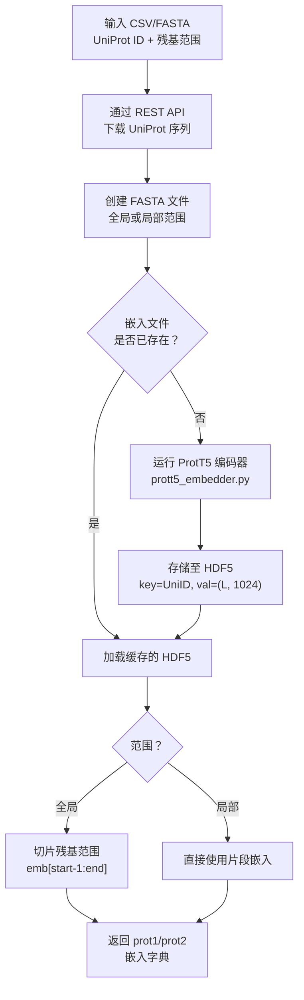

---
slug:8-embedding-generation-with-prott5
blog_type:normal
---


Disobind 依赖于逐残基的蛋白质语言模型嵌入作为其主要输入表示。**ProtT5-XL-U50** 编码器——源自 ProtTrans 项目——为**每个氨基酸残基生成一个 1024 维的向量**，将原始序列转换为富含进化、结构和物理化学信号的上下文表示。本页将解释这些嵌入在 Disobind 预测流程中是如何生成、存储和使用的。

## 嵌入在 Disobind 中的作用

每一次 Disobind 预测都始于嵌入的生成。神经网络永远不会直接处理原始氨基酸序列——它仅在对预计算的逐残基向量进行操作。对于长度分别为 L₁ 和 L₂ 的蛋白质对 (prot1, prot2)，模型接收两个形状分别为 **(L₁, 1024)** 和 **(L₂, 1024)** 的嵌入矩阵，随后将它们投影为一个交互张量。这种设计将计算开销较大的语言模型推理与轻量级的 Disobind 预测器解耦，一旦嵌入被缓存，即可实现快速的批量预测。

来源: [run_disobind.py](/run_disobind.py#L63-L78), [create_input_embeddings.py](/dataset/create_input_embeddings.py#L35-L38)

## 支持的嵌入类型

虽然 ProtT5 是默认且推荐的编码器，但 `utility.py` 中的 `get_embeddings` 调度器支持多种蛋白质语言模型。编码器的选择决定了嵌入的维度和计算开销。

| 编码器 | HuggingFace ID | 嵌入维度 | Disobind 中的默认选项 |
|---------|---------------|---------------|-------------------|
| **ProtT5** | `Rostlab/prot_t5_xl_uniref50_enc` | **1024** | ✅ 是 |
| ProstT5 | `Rostlab/prostT5` | 1024 | 否 |
| ESM2-650M | `esm2_t33_650M_UR50D` | 1280 | 否 |
| ESM2-3B | `esm2_t36_3B_UR50D` | 2560 | 否 |
| ESM2-15B | `esm2_t48_15B_UR50D` | 5120 | 否 |
| protBERT | `Rostlab/prot_bert` | 1024 | 否 |
| ProSE | — | 6165 | 否 |

`Embeddings` 类中的 `embedding_type` 参数用于选择编码器，`emb_size` 也会相应设置——**ProtT5 为 1024**，这是预训练的 Epsilon_3 模型权重所期望的唯一维度。

来源: [utility.py](/dataset/utility.py#L155-L181), [create_input_embeddings.py](/dataset/create_input_embeddings.py#L35-L38)

## 嵌入生成流水线

从原始蛋白质标识符到模型可用的嵌入张量的完整流水线分为五个阶段，由 `Embeddings` 类和 `Disobind` 推理运行器协调执行。



### 阶段 1：序列获取

在推理时，`Disobind` 类读取用户提供的输入（CSV 或 FASTA），并提取所有唯一的 UniProt 入库 ID。随后，它使用 `get_uniprot_seq()` 从 UniProt REST API 下载相应的全长序列，该方法通过带有指数退避重试逻辑（最多 10 次尝试）查询 `http://www.uniprot.org/uniprot/{uni_id}.fasta`。序列被缓存在本地的 `UniProt_seq.json` 文件中，以避免跨批次重复下载。

来源: [from_APIs_with_love.py](/dataset/from_APIs_with_love.py#L158-L186), [run_disobind.py](/run_disobind.py#L402-L430)

### 阶段 2：FASTA 文件创建

`create_fasta_from_headers()` 方法会写入一个 FASTA 文件，其中每个条目对应一个需要嵌入的蛋白质。**范围（scope）** 参数控制 FASTA 中的内容：

- **全局范围**（默认）：每个唯一的 UniProt ID 及其**全长序列**仅出现一次。嵌入稍后会被切片至所请求的残基范围。这将完整蛋白质的嵌入成本分摊到了多个片段查询中。
- **局部范围**：每个唯一片段（由 `UniID:start:end` 标识）仅出现该残基范围的**子序列**。嵌入被直接使用，无需切片。

```python
# 全局范围：FASTA 中为完整序列
w.writelines(f">{uni_id1}\n{self.all_Uniprot_seq[uni_id1]}\n\n")

# 局部范围：FASTA 中为片段序列
w.writelines(f">{head1}\n{self.all_Uniprot_seq[uni_id1][start1-1:end1]}\n\n")
```

来源: [create_input_embeddings.py](/dataset/create_input_embeddings.py#L186-L235)

### 阶段 3：ProtT5 编码

`ProtT5_embeddings()` 函数将任务委托给位于 `ProtTrans/Embedding/` 目录中的外部脚本 `prott5_embedder.py`（在安装期间从 `ProtTrans.tar.gz` 解压得出）。该调用通过子进程执行：

```python
subprocess.call(["python", "prott5_embedder.py",
                 "--input", input_file,
                 "--output", output_file])
```

路径解析在训练（`../ProtTrans/Embedding/`）和推理（`os.path.abspath("ProtTrans/Embedding/")`）之间有所不同，由 `eval_` 标志控制。ProtT5 编码器处理 FASTA 文件中的每个序列，并将**逐残基表示**写入 HDF5 文件，其中每个数据集以 FASTA 头部为键，包含一个形状为 **(L, 1024)** 的数组，以 **float16** 精度存储以减少磁盘占用。

来源: [utility.py](/dataset/utility.py#L342-L372), [install.sh](/install.sh#L1-L4)

### 阶段 4：嵌入检索与切片

生成 HDF5 文件后，`initialize()` 方法会加载嵌入并填充 `p1_frag_emb` 和 `p2_frag_emb` 字典。检索策略取决于范围：

**全局范围** — `get_global_embeddings()`：从 HDF5 加载完整序列的嵌入，然后使用 Python 索引（`start-1:end`，从基于 1 的 UniProt 位置转换为基于 0 的数组索引）将其切片至目标残基范围：

```python
emb1 = np.array(hf1[uni_id1], dtype=np.float16)
self.p1_frag_emb[head] = emb1[int(start1)-1:int(end1)]
```

**局部范围** — `get_local_embeddings()`：使用复合头部键（`UniID:start:end`）直接加载片段嵌入，无需切片：

```python
self.p1_frag_emb[head] = np.array(hf1[head1], dtype=np.float16)
```

来源: [create_input_embeddings.py](/dataset/create_input_embeddings.py#L239-L348)

### 阶段 5：用于模型输入的张量准备

在推理时，`Disobind.get_input_tensors()` 方法将 numpy 嵌入数组转换为 PyTorch 张量，增加批次维度，并通过 `prepare_input()` 应用任何粗粒化变换。张量被移动至目标设备（CPU 或 CUDA）并转换为 float32 以进行计算：

```python
prot1 = torch.from_numpy(prot1).unsqueeze(0).float()
prot2 = torch.from_numpy(prot2).unsqueeze(0).float()
```

来源: [run_disobind.py](/run_disobind.py#L610-L664), [utils.py](/src/utils.py#L92-L156)

## 推理时的嵌入工作流

在预测期间，`Disobind` 类默认以**每批 200 个蛋白质对**处理输入。对于每个批次，它会创建嵌入，运行所有必需的预测任务，然后**删除中间的 FASTA 和 HDF5 文件**以管理磁盘空间：

```python
for start in np.arange(0, total_pairs, self.batch_size):
    batch = prot_pairs[start:end]
    self.create_embeddings(batch)       # 为批次生成嵌入
    batch_preds = self.predict(required_tasks, af_dict)  # 运行预测
    subprocess.call(["rm", f"{self.emb_file}", f"{self.fasta_file}"])  # 清理
```

`create_embeddings()` 方法实例化 `Embeddings` 类，设置 `eval_=True`（推理模式）、`load_cmap=False`（不加载真实接触图），并返回直接送入预测循环的 `p1_frag_emb`/`p2_frag_emb` 字典。

来源: [run_disobind.py](/run_disobind.py#L184-L206), [run_disobind.py](/run_disobind.py#L510-L530)

## 嵌入存储格式

嵌入以 **HDF5** 格式持久化存储（通过 `h5py` 库），选择此格式是因为它支持分层的键控存储和高效的部分 I/O。文件结构是扁平的：每个顶级数据集以蛋白质标识符命名，包含一个 2D float16 数组。

| 属性 | 值 |
|-----------|-------|
| 文件格式 | HDF5 (`.h5`) |
| 数据集键 | UniProt ID（全局）或 `UniID:start:end`（局部） |
| 数据类型 | `float16`（半精度） |
| 每个数据集的形状 | `(L, 1024)`，其中 L = 序列长度 |
| 计算时的精度 | `float32`（在张量准备期间向上转型） |

与 float32 相比，float16 存储将磁盘占用减半，而对下游神经网络预测的信息损失可忽略不计。嵌入仅在为模型前向传播创建张量时才向上转型为 float32。

来源: [utility.py](/dataset/utility.py#L205-L224), [create_input_embeddings.py](/dataset/create_input_embeddings.py#L290-L314)

## 配置摘要

下表总结了控制嵌入生成的关键参数、其默认值以及设置位置。

| 参数 | 默认值 | 位置 | 描述 |
|-----------|---------|----------|-------------|
| `embedding_type` | `"T5"` | `Disobind.__init__` | 使用的编码器 (T5, ProstT5, ESM2, BERT, ProSE) |
| `scope` | `"global"` | `Disobind.__init__` | 嵌入完整序列 (`global`) 或片段 (`local`) |
| `emb_size` | `1024` | `Embeddings.__init__` | 嵌入维度 (ProtT5 = 1024) |
| `batch_size` | `200` | `Disobind.__init__` | 每个嵌入批次的蛋白质对数量 |
| `max_len` | `100` | `Embeddings.__init__` | 训练时的最大填充序列长度 |
| `eval_` | `True`/`False` | `create_embeddings` / `forward` | 推理与训练的路径解析 |

<CgxTip>在运行 Disobind 处理共享相同 UniProt ID 的多个蛋白质对时，请使用**全局范围**（默认值）。这会在每个批次中仅对每个完整蛋白质序列嵌入一次，然后按查询进行切片，这比重复嵌入同一蛋白质快得多。</CgxTip>

<CgxTip>在运行预测之前预先生成并缓存 HDF5 嵌入文件，可以避免冗余的 ProtT5 推理。代码会检查 `os.path.exists(self.emb_file)` 并在文件存在时跳过嵌入生成——因此你可以预计算嵌入并在多次预测运行中复用它们。</CgxTip>

## 与下游流水线的关系

1024 维的 ProtT5 嵌入作为 Epsilon_3 模型的**唯一输入**。在可选的粗粒化（对残基分箱取平均）之后，prot1 和 prot2 嵌入矩阵被送入**投影与交互张量**模块，该模块计算一个外积交互图，供网络用于预测残基-残基接触。因此，这些嵌入的质量和维度是 Disobind 预测准确性的基础。

关于流水线的下一步，请参阅 [Disobind 和 Disobind+AF2 预测](9-disobind-and-disobind-af2-prediction)。关于使用这些嵌入的模型架构，请参阅 [Epsilon_3 模型架构](5-epsilon_3-model-architecture)。