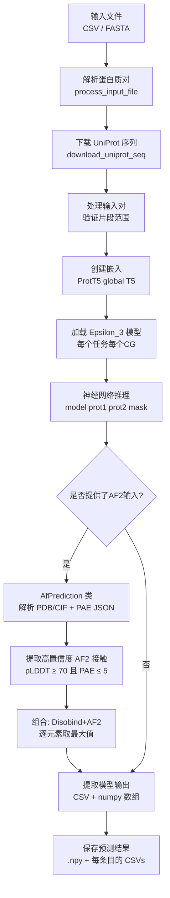
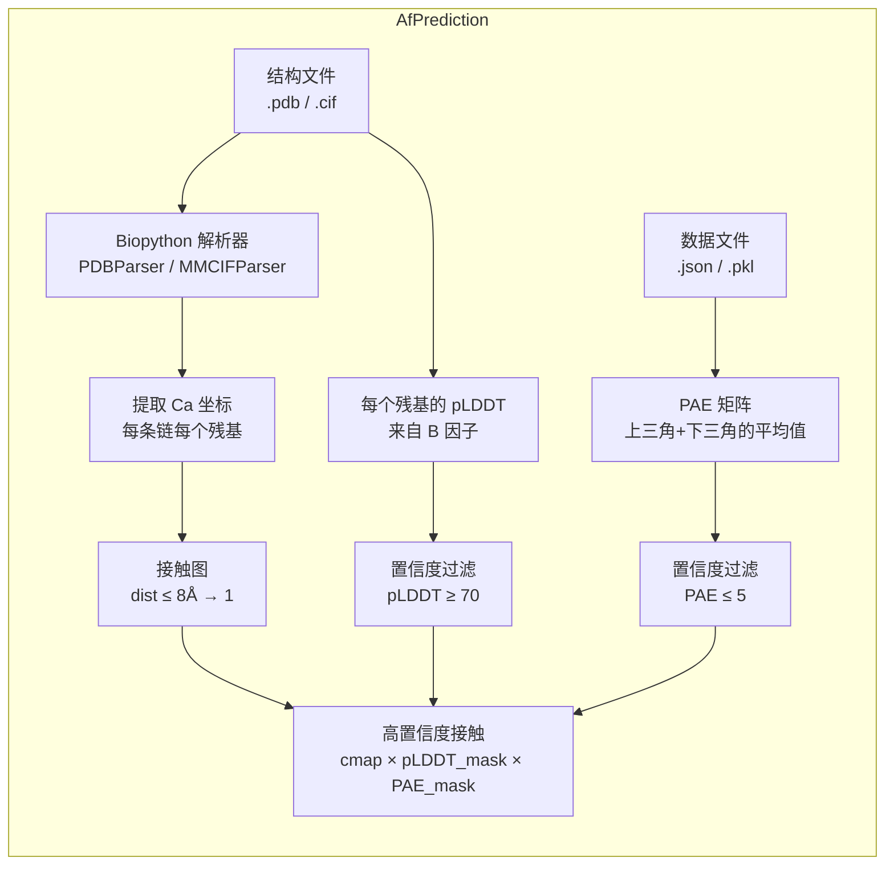

---
slug:9-disobind-and-disobind-af2-prediction
blog_type:normal
---


预测阶段是 Disobind 的神经架构与生物学现实交汇之处——将学习到的内在无序区域及其结构化伴侣的表征，转化为可操作的交互图和界面残基分配。本文档介绍了流程的两种操作模式：**Disobind-only** 预测（序列到接触）和 **Disobind+AF2** 预测（序列与结构到接触），并解释了它们的数据流、组合策略以及所有支持的粗粒度分辨率的输出结构。

来源: [run_disobind.py](/run_disobind.py#L1-L14)

## 预测流程概述

完整的预测工作流由 `run_disobind.py` 中的 `Disobind` 类编排，它协调五个连续阶段：**输入解析**、**UniProt 序列检索**、**ProtT5 嵌入生成**、**神经网络推理**，以及可选的 **AF2 结构整合**。该流程以批次处理（默认大小为 200）来管理大型输入集的内存，每个批次在清理其临时文件之前，都会循环完成完整的 嵌入→预测→组合 序列。



`forward()` 方法编码了此顶层控制流：它调用 `process_input_file()` 获取条目标识符和 AF2 元数据，然后调用 `process_input_pairs()` 验证并格式化所有蛋白质对，最后调用 `get_predictions()` 迭代批次、创建嵌入、运行推理，并将结果累积到 `self.predictions` 中。

来源: [run_disobind.py](/run_disobind.py#L111-L127), [run_disobind.py](/run_disobind.py#L168-L207)

## 输入规范与配对编码

预测流程接受两种输入格式，每种格式携带不同级别的 AF2 结构信息。**CSV 格式**适用于跨多个蛋白质复合物的批量预测，而 **FASTA 格式**支持 UniProt 中不可用的自定义序列（限制每个文件仅包含一对）。

| 格式 | Disobind-Only 字段 | Disobind+AF2 附加字段 |
|--------|---------------------|-------------------------------|
| **CSV** | `Uni_ID1, start1, end1, Uni_ID2, start2, end2` | `+ af2_struct_file, af2_json_file, chain1, chain2, offset1, offset2` |
| **FASTA** | `>prot1,start1,end1` / `>prot2,start2,end2` | `+ model_file_path, pkl_file_path, chain, offset` (每个头部) |

在内部，每个蛋白质对被编码为具有标准格式 `UniID1:start1:end1--UniID2:start2:end2_0` 的 **entry_id**。尾部的 `_0` 表示复合物索引。对于 Disobind+AF2 模式，AF2 元数据存储在以 entry_id 为键的并行 `af_dict` 中，包含预测结构文件（`.pdb` 或 `.cif`）、PAE 数据文件（`.json` 或 `.pkl`）、链标识符和残基偏移量的路径。

来源: [run_disobind.py](/run_disobind.py#L212-L359)

## 任务与目标配置

Disobind 沿两个正交维度进行预测——**目标类型**和**粗粒度分辨率**——产生一个专门化模型输出矩阵。`get_required_tasks()` 方法根据用户指定的标志枚举活动的任务组合。

| 目标 | 描述 | 输出形状 | 标志控制 |
|-----------|-------------|--------------|--------------|
| **interaction** | prot1 和 prot2 残基之间的二元接触图 | `[L1, L2]` | 设置 `--cm` 标志时启用 |
| **interface** | 两个蛋白质的界面残基分类 | `[L1+L2, 1]` | 始终计算 |

| CG 分辨率 | 核大小 | 效果 | 警告 |
|---------------|-------------|--------|---------|
| **1** | 1 (残基级别) | 全分辨率预测 | 无 |
| **5** | 5 | 每个珠子包含 5 个残基组 | 如果长度不能被 5 整除，则会丢失末端残基 |
| **10** | 10 | 每个珠子包含 10 个残基组 | 如果长度不能被 10 整除，则会丢失末端残基 |

`required_cg` 参数（0 = 所有，或特定值）和 `predict_cmap` 标志（启用 interaction 任务）共同决定加载和执行哪些模型。每个 `(objective, cg)` 组合都会从模型目录中加载一个**单独训练的模型变体**。

来源: [run_disobind.py](/run_disobind.py#L130-L165), [run_disobind.py](/run_disobind.py#L568-L606)

## Disobind-Only 预测

核心的 Disobind 预测遵循一条确定性路径，经过嵌入准备、张量构建和模型推理。对于每个条目和每个活动任务：

1. **模型加载** — `apply_settings()` 加载与当前 `(objective, cg)` 任务对应的预训练 Epsilon_3 模型，设置 `self.objective`（一个控制目标类型、分箱大小、输入分箱和单输出模式的 4 元素列表），并将模型置于 `eval()` 模式。

2. **张量准备** — `get_input_tensors()` 接收 prot1 `[L1, 1024]` 和 prot2 `[L2, 1024]` 的 ProtT5 嵌入，创建全 1 的目标掩码，并调用 `prepare_input()` 处理填充、输入嵌入的粗粒度分箱（当 `bin_input=True` 时）以及为模型重塑形状。所有张量都被移动到指定的设备（CPU/CUDA）。

3. **推理** — 在 `torch.no_grad()` 下的一次前向传播产生原始输出，该输出针对 interaction 被重塑为 `[m, n]`，或针对 interface 被重塑为 `[m+n, 1]`（其中 `m, n` 是粗粒度化后的有效长度）。

4. **输出提取** — `extract_model_output()` 将填充的输出修剪为有效维度，以 0.5 为阈值识别高置信度的接触/界面残基，并将预测映射回残基位置（或 CG > 1 时的珠子范围）。结果同时保存为 numpy 数组和人类可读的 CSV 文件。

来源: [run_disobind.py](/run_disobind.py#L667-L796), [run_disobind.py](/run_disobind.py#L610-L664)

## Disobind+AF2 预测

当蛋白质复合物有 AlphaFold2（或 AlphaFold3）的结构预测可用时，Disobind 可以通过 **Disobind+AF2** 模式利用它们。这不是一种重新训练或微调方案——它是一种**事后逐元素组合**，在输出层面合并两种方法的互补优势。

### AfPrediction 类

`AfPrediction` 类（在 `run_disobind.py` 中内联定义）封装了从 AF2/3 预测结构中提取高置信度交互信号的所有逻辑。它由三个输入实例化：结构文件路径（`.pdb` 或 `.cif`）、PAE 数据文件路径（`.json`）以及指定所需链和残基偏移量的字典。



`get_confident_interactions()` 方法（在预测期间调用）对每个蛋白质片段对执行以下步骤：

- **残基选择** — 使用链标识符和残基偏移量将 AF2 结构的内部编号映射到 UniProt 片段位置。`get_required_residues()` 方法在应用偏移量后，仅产生属于指定 `[start, end]` 范围的残基。

- **接触图创建** — 计算 prot1 和 prot2 残基之间的成对 Cα–Cα 距离；8Å 以内的对被标记为接触。

- **置信度掩码** — 构建二元 pLDDT 掩码（当配对中**两个**残基的 pLDDT ≥ 70 时为 1）和二元 PAE 掩码（当 PAE ≤ 5 时为 1）。最终的高置信度接触图是逐元素的乘积：`cmap × pLDDT_mask × PAE_mask`。

来源: [run_disobind.py](/run_disobind.py#L966-L1091), [run_disobind.py](/run_disobind.py#L750-L783)

### 组合策略：逐元素取最大值

Disobind+AF2 的组合方式极其简单却非常有效。在获得 Disobind 输出（连续概率）和 AF2 高置信度接触图（二元）后，组合预测计算如下：

```
Diso+AF2[i,j] = max( Disobind[i,j], AF2_confident[i,j] )
```

在展平数组上的这种逐元素最大值操作——通过 `np.stack()` 后跟 `np.max(axis=1)` 实现——确保了如果**任一**方法高置信度地识别出接触，则预测为接触。其基本原理在于架构差异：Disobind 擅长检测涉及缺乏稳定 3D 结构的无序区域的相互作用（而 AF2 在这些区域因低 pLDDT 而表现不佳），而 AF2 则以高几何精度捕获结构化的界面接触（而 Disobind 仅依赖序列的视角可能缺乏分辨率）。

<CgxTip>逐元素取最大值的组合方式之所以有效，是因为这两种方法具有**互补的失败模式**：AF2 在无序区域上失败（低 pLDDT → 被置零），而 Disobind 可能会遗漏纯粹由结构决定的接触。最大值操作符在每个残基对上从两种方法中恢复更强的信号。</CgxTip>

来源: [run_disobind.py](/run_disobind.py#L764-L777)

### AF2 预测的粗粒度化处理

当目标使用 CG > 1 时，必须对 AF2 的二元接触图进行降采样，以匹配 Disobind 输出的分辨率。`process_af2_pred()` 方法应用 `kernel_size = stride = cg` 的 `MaxPool2d`，如果该珠子内**任何**残基对处于接触状态，则将该粗粒度珠子分配为接触状态。对于 interface 目标，粗粒度接触图进一步被缩减为每个蛋白质的界面残基向量，具体做法是标记参与至少一次接触的任何残基（或珠子）。

来源: [run_disobind.py](/run_disobind.py#L799-L828)

## 输出结构

对于每个蛋白质对和每个活动任务，预测字典存储六个条目，以捕获完整的 Disobind、AF2 和组合视角：

| 键 | 类型 | 内容 |
|-----|------|---------|
| `Disobind` | `np.float32` | 原始 Disobind 预测（连续概率或二元值） |
| `AF2` | `np.float32` | AF2 高置信度接触图（二元值，若无 AF2 输入则为零） |
| `Diso+AF2` | `np.float32` | Disobind 和 AF2 的逐元素最大值（若无 AF2 输入则为零） |
| `Final_diso_preds` | `pd.DataFrame` | 带有残基标签的阈值化 Disobind 接触/界面 |
| `Final_af2_preds` | `pd.DataFrame` | 带有残基标签的阈值化 AF2 接触/界面 |
| `Final_af2_diso_preds` | `pd.DataFrame` | 带有残基标签的阈值化组合接触/界面 |

DataFrame 将预测映射回具有生物学意义的标识符。对于 **interaction** 任务，每行包含超过 0.5 阈值的 `(Protein1, Residue1, Protein2, Residue2)` 对。对于 **interface** 任务，每行列出两种蛋白质的界面残基/珠子。在 CG > 1 时，珠子标识符使用范围表示法（例如，跨越残基 25–34 的 CG-10 珠子表示为 `"25-34"`）。

所有预测在输出目录中被序列化为单个 `.npy` 文件（`Predictions.npy`），并附带提供人类可读的阈值化结果的每条目 CSV 文件。

来源: [run_disobind.py](/run_disobind.py#L787-L796), [run_disobind.py](/run_disobind.py#L893-L960)

## 置信度阈值与参数

预测流程使用几个阈值参数来控制过滤和输出二值化。它们在 `Disobind.__init__()` 构造函数和 `AfPrediction.__init__()` 构造函数中设置为默认值：

| 参数 | 默认值 | 用途 | 类 |
|-----------|---------|---------|-------|
| `threshold` | 0.5 | 用于二值化 Disobind 和组合输出的概率阈值 | `Disobind` |
| `dist_threshold` | 8 (Å) | 定义结构中接触的 Cα–Cα 距离截断值 | `Disobind`, `AfPrediction` |
| `plddt_threshold` / `plddt_cutoff` | 70 | pLDDT 低于此值 → 残基被视为低置信度 | `Disobind`, `AfPrediction` |
| `pae_threshold` / `pae_cutoff` | 5 | PAE 高于此值 → 残基间位置被视为低置信度 | `Disobind`, `AfPrediction` |

<CgxTip>pLDDT 阈值 70 和 PAE 阈值 5 是标准的 AF2 置信度截断值。无序区域中 pLDDT < 70 的残基被**有意从** AF2 预测中**过滤掉**，这正是 Disobind 基于序列的方法发挥价值之处——它不需要结构置信度即可做出预测。</CgxTip>

来源: [run_disobind.py](/run_disobind.py#L69-L76), [run_disobind.py](/run_disobind.py#L976-L980)

## 批处理与资源管理

流程以批处理方式处理蛋白质对，以在内存使用（ProtT5 嵵入和模型张量）和吞吐量之间取得平衡。对于跨越索引 `[start, start + batch_size)` 的每个批次：

1. 通过 `create_embeddings()` 为整个批次生成嵌入，生成 `prot1_emb` 和 `prot2_emb` 字典。
2. 批次中的每个条目按顺序加载并运行所有特定任务的模型。
3. 每个批次后，通过 `subprocess.call(["rm", ...])` 删除临时嵌入文件（`.fasta` 和 `.h5`）。

UniProt 序列下载使用带有 `imap_unordered` 的 `multiprocessing.Pool` 在 CPU 核心之间并行化，并且 JSON 缓存（`UniProt_seq.json`）可防止跨运行重复下载。

来源: [run_disobind.py](/run_disobind.py#L184-L207), [run_disobind.py](/run_disobind.py#L402-L430)

## 面向评估的预测（分析模式）

`analysis/get_disobind_predictions.py` 模块提供了 `Prediction` 类——这是一个面向评估的、与面向用户的 `Disobind` 类对应的类。它通过无序数据库查找（DisProt、IDEAL、MobiDB）、LIP（局部相互作用肽）掩码生成和促无序氨基酸掩码创建来扩展预测流程。此类用于在 OOD 测试集上对 Disobind 进行基准测试，而不是用于用户预测。

类似地，`analysis/get_af_prediction.py` 提供了 `AF2MPredictions` 类，用于针对同一 OOD 测试集批量评估 AF2-Multimer 或 AF3 预测，同时支持 AF2（`.pdb` + `.pkl` 结果文件）和 AF3（`.cif` + `.json` 置信度文件），并通过 `ranking_debug.json`（AF2）或 `summary_confidences` JSON（AF3）自动选择最佳模型。AF3 还支持在不期望基于结构坐标的图时直接从 `contact_probs` 数组提取接触图。

来源: [analysis/get_disobind_predictions.py](/analysis/get_disobind_predictions.py#L38-L131), [analysis/get_af_prediction.py](/analysis/get_af_prediction.py#L28-L93)

## 后续步骤

- 要了解如何解释和可视化预测结果，请参阅 [输出解释](10-output-interpretation)。
- 要了解产生原始预测的神经网络架构，请参阅 [Epsilon_3 模型架构](5-epsilon_3-model-architecture)。
- 要了解预测之前的嵌入生成步骤，请参阅 [使用 ProtT5 生成嵌入](8-embedding-generation-with-prott5)。
- 要了解如何训练模型以优化这些预测输出，请参阅 [模型训练工作流](11-model-training-workflow)。