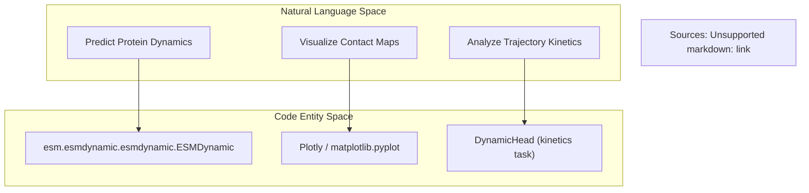
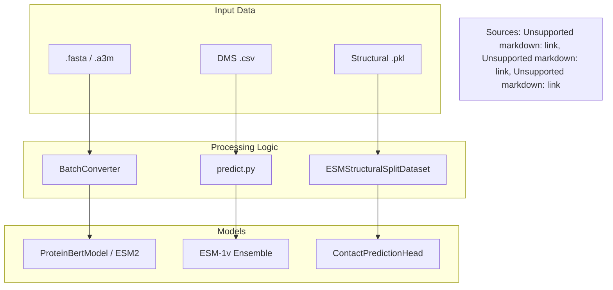

# Applications and Examples

> **Relevant source files**
> * [examples/README.md](https://github.com/MaybeBio/esmdynamic/blob/b3c7f04f/examples/README.md?plain=1)
> * [examples/contact_prediction.ipynb](https://github.com/MaybeBio/esmdynamic/blob/b3c7f04f/examples/contact_prediction.ipynb)
> * [examples/esm_structural_dataset.ipynb](https://github.com/MaybeBio/esmdynamic/blob/b3c7f04f/examples/esm_structural_dataset.ipynb)
> * [examples/esmdynamic/esmdynamic.ipynb](https://github.com/MaybeBio/esmdynamic/blob/b3c7f04f/examples/esmdynamic/esmdynamic.ipynb)
> * [examples/variant-prediction/predict.py](https://github.com/MaybeBio/esmdynamic/blob/b3c7f04f/examples/variant-prediction/predict.py)

This section provides an overview of the practical applications and tutorial notebooks bundled with the `esmdynamic` repository. These tools demonstrate how to leverage ESM models for structural analysis, variant effect prediction, and post-processing dynamic protein data.

## ESMDynamic Interactive Inference

The primary entry point for exploring protein dynamics is the `esmdynamic.ipynb` notebook. It provides a Google Colab-compatible environment to run the `ESMDynamic` model, which extends `ESMFold` with dynamic contact prediction heads.

* **Key Features**: * Installation of dependencies including `openfold` and `esmdynamic` [examples/esmdynamic/esmdynamic.ipynb L68-L81](https://github.com/MaybeBio/esmdynamic/blob/b3c7f04f/examples/esmdynamic/esmdynamic.ipynb#L68-L81) * Loading the `ESMDynamic` model and merging it with base `ESMFold` weights [examples/esmdynamic/esmdynamic.ipynb L136-L141](https://github.com/MaybeBio/esmdynamic/blob/b3c7f04f/examples/esmdynamic/esmdynamic.ipynb#L136-L141) * Support for single sequences or homo-oligomeric predictions via the `copies` parameter [examples/esmdynamic/esmdynamic.ipynb L42-L43](https://github.com/MaybeBio/esmdynamic/blob/b3c7f04f/examples/esmdynamic/esmdynamic.ipynb#L42-L43) * Output generation including dynamic contact maps in text, PNG, and interactive HTML formats [examples/esmdynamic/esmdynamic.ipynb L44](https://github.com/MaybeBio/esmdynamic/blob/b3c7f04f/examples/esmdynamic/esmdynamic.ipynb#L44-L44)

### Workflow Overview: Natural Language to Code Entities

The following diagram maps user-level tasks to the specific code entities used in the dynamic inference notebook.

| User Task | Code Entity | File Reference |
| --- | --- | --- |
| **Model Setup** | `esmdynamic.ESMDynamic` | [examples/esmdynamic/esmdynamic.ipynb L136](https://github.com/MaybeBio/esmdynamic/blob/b3c7f04f/examples/esmdynamic/esmdynamic.ipynb#L136-L136) |
| **Weight Loading** | `torch.load("esmdynamic.pt")` | [examples/esmdynamic/esmdynamic.ipynb L140](https://github.com/MaybeBio/esmdynamic/blob/b3c7f04f/examples/esmdynamic/esmdynamic.ipynb#L140-L140) |
| **Inference Execution** | `esmdynamic_model.infer(...)` | [examples/esmdynamic/esmdynamic.ipynb L235](https://github.com/MaybeBio/esmdynamic/blob/b3c7f04f/examples/esmdynamic/esmdynamic.ipynb#L235-L235) |
| **Visualizing Maps** | `px.imshow` / `Plotly` | [examples/esmdynamic/esmdynamic.ipynb L181](https://github.com/MaybeBio/esmdynamic/blob/b3c7f04f/examples/esmdynamic/esmdynamic.ipynb#L181-L181) |

## Application Domains

### 6.1 Contact Prediction and Structural Datasets

This application focuses on predicting static residue-residue contacts and utilizing curated structural datasets. It features the `ContactPredictionHead` which uses attention maps to derive contacts, often refined with Average Product Correction (APC).

* **Notebooks**: `contact_prediction.ipynb`, `esm_structural_dataset.ipynb`.
* **Data**: Uses the `ESMStructuralSplitDataset` to load SCOPe 2.07 data, including sequences, distance maps, and 3D coordinates [examples/esm_structural_dataset.ipynb L41-L125](https://github.com/MaybeBio/esmdynamic/blob/b3c7f04f/examples/esm_structural_dataset.ipynb#L41-L125)
* **For details, see [Contact Prediction and Structural Datasets](/MaybeBio/esmdynamic/6.1-contact-prediction-and-structural-datasets)**.

### 6.2 Zero-Shot Variant Effect Prediction

This suite evaluates the impact of mutations on protein function without task-specific fine-tuning. It employs an ensemble of `ESM-1v` models or the `MSATransformer` to score mutations.

* **Script**: `examples/variant-prediction/predict.py`.
* **Strategies**: Supports `wt-marginals`, `masked-marginals`, and `pseudo-ppl` (pseudo-perplexity) scoring [examples/variant-prediction/predict.py L85-L90](https://github.com/MaybeBio/esmdynamic/blob/b3c7f04f/examples/variant-prediction/predict.py#L85-L90)
* **For details, see [Zero-Shot Variant Effect Prediction](/MaybeBio/esmdynamic/6.2-zero-shot-variant-effect-prediction)**.

### 6.3 ESMDynamic Downstream Analysis: CV Selection Pipeline

This application demonstrates how to use `ESMDynamic` outputs to guide molecular dynamics (MD) simulations. By analyzing predicted dynamic contacts, users can identify Collective Variables (CVs) that represent significant conformational changes.

* **Notebook**: `cv_selection_pipeline.ipynb`.
* **Pipeline**: Post-processes `.npy` contact maps using hierarchical clustering to select representative residue pairs for MD biasing.
* **For details, see [ESMDynamic Downstream Analysis: CV Selection Pipeline](/MaybeBio/esmdynamic/6.3-esmdynamic-downstream-analysis:-cv-selection-pipeline)**.

## Example Data and Assets

The `examples/data/` directory contains various file formats required for these applications:

* **FASTA/A3M**: MSA files for `MSATransformer` and `contact_prediction.ipynb` [examples/README.md L4-L10](https://github.com/MaybeBio/esmdynamic/blob/b3c7f04f/examples/README.md?plain=1#L4-L10)
* **DMS Data**: Deep Mutational Scan CSVs for variant prediction (e.g., `P62593.fasta`) [examples/README.md L6](https://github.com/MaybeBio/esmdynamic/blob/b3c7f04f/examples/README.md?plain=1#L6-L6)
* **Scripts**: Specialized inference scripts like `esm2_infer_fairscale_fsdp_cpu_offloading.py` for handling the 15B parameter model [examples/README.md L11](https://github.com/MaybeBio/esmdynamic/blob/b3c7f04f/examples/README.md?plain=1#L11-L11)

### Entity Relationship Diagram: Data to Processing

Sources: [examples/esmdynamic/esmdynamic.ipynb L33-L146](https://github.com/MaybeBio/esmdynamic/blob/b3c7f04f/examples/esmdynamic/esmdynamic.ipynb#L33-L146)

 [examples/README.md L1-L12](https://github.com/MaybeBio/esmdynamic/blob/b3c7f04f/examples/README.md?plain=1#L1-L12)

 [examples/variant-prediction/predict.py L45-L104](https://github.com/MaybeBio/esmdynamic/blob/b3c7f04f/examples/variant-prediction/predict.py#L45-L104)

 [examples/esm_structural_dataset.ipynb L96-L125](https://github.com/MaybeBio/esmdynamic/blob/b3c7f04f/examples/esm_structural_dataset.ipynb#L96-L125)