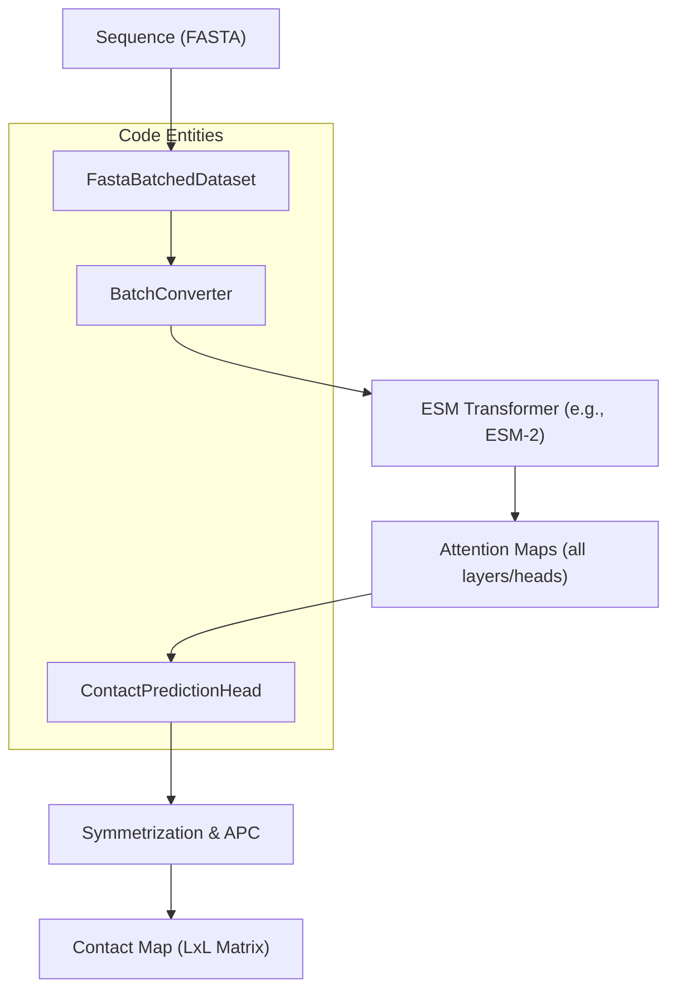
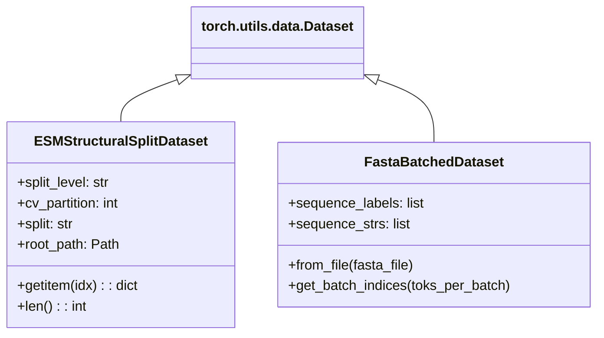

# Contact Prediction and Structural Datasets

> **Relevant source files**
> * [esm/data.py](https://github.com/MaybeBio/esmdynamic/blob/b3c7f04f/esm/data.py)
> * [examples/README.md](https://github.com/MaybeBio/esmdynamic/blob/b3c7f04f/examples/README.md?plain=1)
> * [examples/contact_prediction.ipynb](https://github.com/MaybeBio/esmdynamic/blob/b3c7f04f/examples/contact_prediction.ipynb)
> * [examples/esm_structural_dataset.ipynb](https://github.com/MaybeBio/esmdynamic/blob/b3c7f04f/examples/esm_structural_dataset.ipynb)
> * [scripts/extract.py](https://github.com/MaybeBio/esmdynamic/blob/b3c7f04f/scripts/extract.py)
> * [tests/test_alphabet.py](https://github.com/MaybeBio/esmdynamic/blob/b3c7f04f/tests/test_alphabet.py)

This section covers the tools and datasets within the ESMDynamic repository for predicting protein residue-residue contacts and utilizing structural data. It focuses on the attention-based contact prediction mechanism, the `ESMStructuralSplitDataset` for supervised learning, and the provided demonstration notebooks.

## Contact Prediction Overview

ESM models, particularly ESM-1b and ESM-2, contain information about protein structure within their attention maps. The repository provides a `ContactPredictionHead` that aggregates these attention patterns to predict the probability that two residues are in contact (typically defined as $C_{\alpha}-C_{\alpha}$ distance < 8Å).

### Contact Prediction Pipeline

The flow from a raw protein sequence to a predicted contact map involves tokenization, transformer processing, and a specialized head that applies Symmetrization and Average Product Correction (APC).

**Data Flow: Sequence to Contact Map**



**Sources:** [esm/data.py L19-L90](https://github.com/MaybeBio/esmdynamic/blob/b3c7f04f/esm/data.py#L19-L90)

 [esm/data.py L241-L279](https://github.com/MaybeBio/esmdynamic/blob/b3c7f04f/esm/data.py#L241-L279)

 [scripts/extract.py L87-L132](https://github.com/MaybeBio/esmdynamic/blob/b3c7f04f/scripts/extract.py#L87-L132)

### ContactPredictionHead and APC

The `ContactPredictionHead` (defined in `esm/modules.py`) treats contact prediction as a supervised task trained on top of frozen or fine-tuned transformer representations. A key post-processing step used is **Average Product Correction (APC)**, which reduces the impact of phylogenetic bias and high-entropy positions in the attention maps.

In the `contact_prediction.ipynb` notebook, the prediction is executed via the `model.predict_contacts(tokens)` method, which handles the internal extraction of attention and application of the regression head.

**Sources:** [examples/contact_prediction.ipynb L250-L350](https://github.com/MaybeBio/esmdynamic/blob/b3c7f04f/examples/contact_prediction.ipynb#L250-L350)

 [scripts/extract.py L82-L132](https://github.com/MaybeBio/esmdynamic/blob/b3c7f04f/scripts/extract.py#L82-L132)

---

## ESMStructuralSplitDataset

The `ESMStructuralSplitDataset` is a specialized data loader designed for structural biology tasks. It is based on the **SCOPe 2.07** database and provides rigorous structural holdouts at the Family, Superfamily, and Fold levels to ensure models generalize to unseen protein architectures.

### Dataset Structure

Each sample in the dataset is a dictionary containing both sequence and ground-truth structural information:

* `seq`: The primary amino acid sequence (string).
* `ssp`: Secondary structure labels (string).
* `dist`: A distance matrix ($L \times L$ numpy array).
* `coords`: 3D coordinates ($L \times 3$ numpy array).

### Initialization and Partitions

The dataset supports five-fold cross-validation across three levels of structural similarity.

| Split Level | Description |
| --- | --- |
| `family` | Most granular; holdouts are at the SCOPe family level. |
| `superfamily` | Intermediate; ensures no superfamily overlap between train/test. |
| `fold` | Most rigorous; ensures entirely new folds in the test set. |

**Code Example: Loading a Split**

```javascript
from esm.data import ESMStructuralSplitDatasetdataset = ESMStructuralSplitDataset(    split_level='superfamily',     cv_partition='4',     split='train',     root_path='~/.cache/torch/data/esm',    download=True)
```

**Sources:** [esm/data.py L281-L350](https://github.com/MaybeBio/esmdynamic/blob/b3c7f04f/esm/data.py#L281-L350)

 [examples/esm_structural_dataset.ipynb L96-L112](https://github.com/MaybeBio/esmdynamic/blob/b3c7f04f/examples/esm_structural_dataset.ipynb#L96-L112)

 [examples/esm_structural_dataset.ipynb L120-L125](https://github.com/MaybeBio/esmdynamic/blob/b3c7f04f/examples/esm_structural_dataset.ipynb#L120-L125)

---

## Implementation Detail: Structural Data Handling

The structural dataset management involves automated downloading of `.tar.gz` files containing pickled structural data and split definitions.

**Structural Dataset Architecture**



**Sources:** [esm/data.py L19-L25](https://github.com/MaybeBio/esmdynamic/blob/b3c7f04f/esm/data.py#L19-L25)

 [esm/data.py L281-L300](https://github.com/MaybeBio/esmdynamic/blob/b3c7f04f/esm/data.py#L281-L300)

 [examples/esm_structural_dataset.ipynb L146-L160](https://github.com/MaybeBio/esmdynamic/blob/b3c7f04f/examples/esm_structural_dataset.ipynb#L146-L160)

---

## Notebook Examples

The repository includes two primary notebooks for exploring these features:

### 1. contact_prediction.ipynb

Demonstrates how to:

* Load pretrained ESM-1b or ESM-2 models.
* Run inference on sequences from `.a3m` or `.fasta` files.
* Extract attention maps and convert them to contact probabilities.
* Visualize the predicted contact map against a ground truth (if available).
* Apply APC correction to improve precision.

### 2. esm_structural_dataset.ipynb

Demonstrates how to:

* Initialize the `ESMStructuralSplitDataset` with specific `split_level` and `cv_partition`.
* Iterate through the dataset to access sequences, secondary structure (SSP) labels, and distance maps.
* Visualize 3D coordinates using standard plotting libraries.

**Sources:** [examples/contact_prediction.ipynb L1-L15](https://github.com/MaybeBio/esmdynamic/blob/b3c7f04f/examples/contact_prediction.ipynb#L1-L15)

 [examples/esm_structural_dataset.ipynb L1-L15](https://github.com/MaybeBio/esmdynamic/blob/b3c7f04f/examples/esm_structural_dataset.ipynb#L1-L15)

 [examples/README.md L5-L10](https://github.com/MaybeBio/esmdynamic/blob/b3c7f04f/examples/README.md?plain=1#L5-L10)