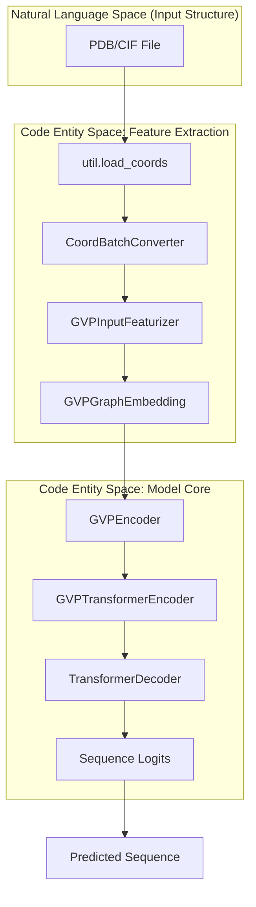
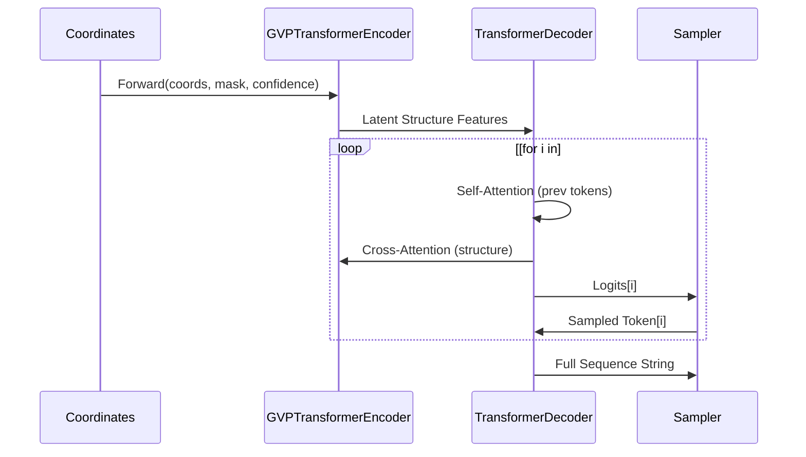

# ESM-IF1 Architecture: GVP Encoder and Transformer Decoder

> **Relevant source files**
> * [esm/inverse_folding/__init__.py](https://github.com/MaybeBio/esmdynamic/blob/b3c7f04f/esm/inverse_folding/__init__.py)
> * [esm/inverse_folding/features.py](https://github.com/MaybeBio/esmdynamic/blob/b3c7f04f/esm/inverse_folding/features.py)
> * [esm/inverse_folding/gvp_encoder.py](https://github.com/MaybeBio/esmdynamic/blob/b3c7f04f/esm/inverse_folding/gvp_encoder.py)
> * [esm/inverse_folding/gvp_modules.py](https://github.com/MaybeBio/esmdynamic/blob/b3c7f04f/esm/inverse_folding/gvp_modules.py)
> * [esm/inverse_folding/gvp_transformer.py](https://github.com/MaybeBio/esmdynamic/blob/b3c7f04f/esm/inverse_folding/gvp_transformer.py)
> * [esm/inverse_folding/gvp_transformer_encoder.py](https://github.com/MaybeBio/esmdynamic/blob/b3c7f04f/esm/inverse_folding/gvp_transformer_encoder.py)
> * [esm/inverse_folding/gvp_utils.py](https://github.com/MaybeBio/esmdynamic/blob/b3c7f04f/esm/inverse_folding/gvp_utils.py)
> * [esm/inverse_folding/transformer_decoder.py](https://github.com/MaybeBio/esmdynamic/blob/b3c7f04f/esm/inverse_folding/transformer_decoder.py)
> * [esm/inverse_folding/util.py](https://github.com/MaybeBio/esmdynamic/blob/b3c7f04f/esm/inverse_folding/util.py)
> * [examples/variant-prediction/README.md](https://github.com/MaybeBio/esmdynamic/blob/b3c7f04f/examples/variant-prediction/README.md?plain=1)
> * [tests/test_inverse_folding.py](https://github.com/MaybeBio/esmdynamic/blob/b3c7f04f/tests/test_inverse_folding.py)

The ESM-IF1 model is a sequence-to-structure inverse folding system designed to predict protein sequences that natively fold into a target backbone geometry. The architecture combines **Geometric Vector Perceptrons (GVP)** for invariant structural processing with a **Transformer decoder** for autoregressive sequence generation [esm/inverse_folding/gvp_transformer.py L24-L30](https://github.com/MaybeBio/esmdynamic/blob/b3c7f04f/esm/inverse_folding/gvp_transformer.py#L24-L30)

## Architectural Overview

The `GVPTransformerModel` is composed of two primary stages:

1. **Structural Encoding**: A `GVPTransformerEncoder` that processes 3D coordinates (N, CA, C) into latent representations [esm/inverse_folding/gvp_transformer_encoder.py L23-L32](https://github.com/MaybeBio/esmdynamic/blob/b3c7f04f/esm/inverse_folding/gvp_transformer_encoder.py#L23-L32)
2. **Sequence Decoding**: A `TransformerDecoder` that generates the amino acid sequence token-by-token, conditioned on the encoder's structural features [esm/inverse_folding/transformer_decoder.py L24-L35](https://github.com/MaybeBio/esmdynamic/blob/b3c7f04f/esm/inverse_folding/transformer_decoder.py#L24-L35)

### System Data Flow

The following diagram illustrates the transformation from physical coordinate space to the final predicted sequence.

**Sources:** [esm/inverse_folding/util.py L77-L88](https://github.com/MaybeBio/esmdynamic/blob/b3c7f04f/esm/inverse_folding/util.py#L77-L88)

 [esm/inverse_folding/gvp_transformer.py L69-L86](https://github.com/MaybeBio/esmdynamic/blob/b3c7f04f/esm/inverse_folding/gvp_transformer.py#L69-L86)

 [esm/inverse_folding/gvp_encoder.py L18-L23](https://github.com/MaybeBio/esmdynamic/blob/b3c7f04f/esm/inverse_folding/gvp_encoder.py#L18-L23)

 [esm/inverse_folding/features.py L77-L93](https://github.com/MaybeBio/esmdynamic/blob/b3c7f04f/esm/inverse_folding/features.py#L77-L93)

---

## GVP Encoder: Geometric Invariance

The structural encoder utilizes Geometric Vector Perceptrons (GVP) to maintain rotation and translation invariance. It treats the protein backbone as a graph where residues are nodes and spatial neighbors are edges [esm/inverse_folding/gvp_encoder.py L47-L56](https://github.com/MaybeBio/esmdynamic/blob/b3c7f04f/esm/inverse_folding/gvp_encoder.py#L47-L56)

### Node and Edge Featurization

The `GVPInputFeaturizer` extracts geometric primitives from the backbone [esm/inverse_folding/features.py L77-L80](https://github.com/MaybeBio/esmdynamic/blob/b3c7f04f/esm/inverse_folding/features.py#L77-L80)

:

* **Scalar Features**: Dihedral angles ($\phi, \psi, \omega$) lifted to the circle using sine and cosine [esm/inverse_folding/features.py L113-L136](https://github.com/MaybeBio/esmdynamic/blob/b3c7f04f/esm/inverse_folding/features.py#L113-L136)
* **Vector Features**: Local orientations (forward/backward vectors along CA atoms) and idealized sidechain directions [esm/inverse_folding/features.py L95-L110](https://github.com/MaybeBio/esmdynamic/blob/b3c7f04f/esm/inverse_folding/features.py#L95-L110)
* **Edge Features**: Pairwise distances (encoded via RBF bins) and relative positional encodings [esm/inverse_folding/features.py L138-L164](https://github.com/MaybeBio/esmdynamic/blob/b3c7f04f/esm/inverse_folding/features.py#L138-L164)

### GVP Transformation

The `GVP` module processes tuples of $(s, V)$, where $s$ are scalars and $V$ are vectors in $\mathbb{R}^3$ [esm/inverse_folding/gvp_modules.py L114-L128](https://github.com/MaybeBio/esmdynamic/blob/b3c7f04f/esm/inverse_folding/gvp_modules.py#L114-L128)

 The transformation ensures that if the input coordinates are rotated, the scalar outputs remain unchanged and the vector outputs rotate accordingly [tests/test_inverse_folding.py L61-L71](https://github.com/MaybeBio/esmdynamic/blob/b3c7f04f/tests/test_inverse_folding.py#L61-L71)

**Sources:** [esm/inverse_folding/gvp_modules.py L148-L190](https://github.com/MaybeBio/esmdynamic/blob/b3c7f04f/esm/inverse_folding/gvp_modules.py#L148-L190)

 [esm/inverse_folding/features.py L77-L136](https://github.com/MaybeBio/esmdynamic/blob/b3c7f04f/esm/inverse_folding/features.py#L77-L136)

 [esm/inverse_folding/gvp_encoder.py L31-L45](https://github.com/MaybeBio/esmdynamic/blob/b3c7f04f/esm/inverse_folding/gvp_encoder.py#L31-L45)

---

## Transformer Decoder: Sequence Generation

The `TransformerDecoder` generates the sequence autoregressively. It uses the standard Transformer architecture but is conditioned on the `GVPTransformerEncoder` output via cross-attention [esm/inverse_folding/transformer_decoder.py L92-L126](https://github.com/MaybeBio/esmdynamic/blob/b3c7f04f/esm/inverse_folding/transformer_decoder.py#L92-L126)

### Key Components

* **Positional Embeddings**: Uses `SinusoidalPositionalEmbedding` to maintain sequence order [esm/inverse_folding/transformer_decoder.py L64-L67](https://github.com/MaybeBio/esmdynamic/blob/b3c7f04f/esm/inverse_folding/transformer_decoder.py#L64-L67)
* **Incremental State**: During sampling, the decoder stores `incremental_state` (K/V caches) to avoid redundant computations of previous tokens [esm/inverse_folding/gvp_transformer.py L115-L127](https://github.com/MaybeBio/esmdynamic/blob/b3c7f04f/esm/inverse_folding/gvp_transformer.py#L115-L127)
* **Span Masking & Partial Sequences**: The `sample` method supports providing a `partial_seq`, allowing the model to fill in missing residues (in-painting) while keeping fixed parts of the structure [esm/inverse_folding/gvp_transformer.py L88-L113](https://github.com/MaybeBio/esmdynamic/blob/b3c7f04f/esm/inverse_folding/gvp_transformer.py#L88-L113)

### Sequence Sampling Logic

The sampling process is implemented in `GVPTransformerModel.sample` [esm/inverse_folding/gvp_transformer.py L88](https://github.com/MaybeBio/esmdynamic/blob/b3c7f04f/esm/inverse_folding/gvp_transformer.py#L88-L88)

:

1. The encoder runs once to process the backbone structure [esm/inverse_folding/gvp_transformer.py L119](https://github.com/MaybeBio/esmdynamic/blob/b3c7f04f/esm/inverse_folding/gvp_transformer.py#L119-L119)
2. A start token (`<cath>`) is prepended [esm/inverse_folding/gvp_transformer.py L110](https://github.com/MaybeBio/esmdynamic/blob/b3c7f04f/esm/inverse_folding/gvp_transformer.py#L110-L110)
3. The decoder predicts the next token's probability distribution.
4. A token is sampled using `torch.multinomial` adjusted by a `temperature` parameter [esm/inverse_folding/gvp_transformer.py L128-L132](https://github.com/MaybeBio/esmdynamic/blob/b3c7f04f/esm/inverse_folding/gvp_transformer.py#L128-L132)

**Sources:** [esm/inverse_folding/gvp_transformer.py L100-L136](https://github.com/MaybeBio/esmdynamic/blob/b3c7f04f/esm/inverse_folding/gvp_transformer.py#L100-L136)

 [esm/inverse_folding/transformer_decoder.py L186-L202](https://github.com/MaybeBio/esmdynamic/blob/b3c7f04f/esm/inverse_folding/transformer_decoder.py#L186-L202)

---

## Handling Missing Data and Multichains

### Span Masking and Confidence

ESM-IF1 handles missing coordinates using a `confidence` tensor. Residues with missing data are flagged, and the `GVPInputFeaturizer` incorporates a `coord_mask` to prevent the model from relying on invalid geometric data [esm/inverse_folding/features.py L80-L87](https://github.com/MaybeBio/esmdynamic/blob/b3c7f04f/esm/inverse_folding/features.py#L80-L87)

 In the encoder, confidence scores are embedded via Radial Basis Functions (RBF) [esm/inverse_folding/gvp_transformer_encoder.py L101-L102](https://github.com/MaybeBio/esmdynamic/blob/b3c7f04f/esm/inverse_folding/gvp_transformer_encoder.py#L101-L102)

### Multichain Complex Conditioning

The model is capable of designing sequences for multimeric complexes. The `multichain_util` provides helpers to process multiple chains as a single discontinuous backbone, ensuring that inter-chain interfaces are considered during the design process [esm/inverse_folding/util.py L27-L59](https://github.com/MaybeBio/esmdynamic/blob/b3c7f04f/esm/inverse_folding/util.py#L27-L59)

**Sources:** [esm/inverse_folding/util.py L108-L122](https://github.com/MaybeBio/esmdynamic/blob/b3c7f04f/esm/inverse_folding/util.py#L108-L122)

 [esm/inverse_folding/gvp_transformer_encoder.py L73-L81](https://github.com/MaybeBio/esmdynamic/blob/b3c7f04f/esm/inverse_folding/gvp_transformer_encoder.py#L73-L81)

 [esm/inverse_folding/features.py L157-L165](https://github.com/MaybeBio/esmdynamic/blob/b3c7f04f/esm/inverse_folding/features.py#L157-L165)