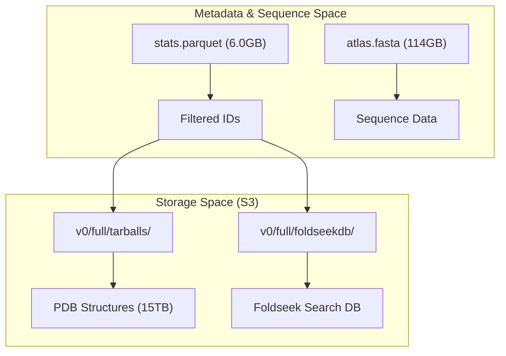
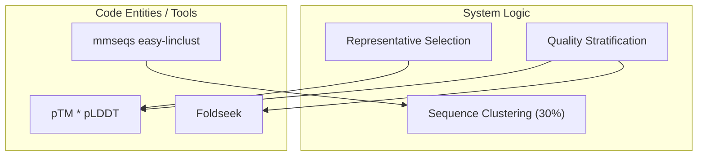

# ESM Metagenomic Atlas

> **Relevant source files**
> * [scripts/atlas/README.md](https://github.com/MaybeBio/esmdynamic/blob/b3c7f04f/scripts/atlas/README.md?plain=1)
> * [scripts/atlas/v0/full/bins.txt](https://github.com/MaybeBio/esmdynamic/blob/b3c7f04f/scripts/atlas/v0/full/bins.txt)
> * [scripts/atlas/v0/full/foldseekdb.txt](https://github.com/MaybeBio/esmdynamic/blob/b3c7f04f/scripts/atlas/v0/full/foldseekdb.txt)
> * [scripts/atlas/v0/full/tarballs.txt](https://github.com/MaybeBio/esmdynamic/blob/b3c7f04f/scripts/atlas/v0/full/tarballs.txt)

The **ESM Metagenomic Atlas** is a massive database containing over 617 million metagenomic protein structures predicted using the `esm.pretrained.esmfold_v0()` model [scripts/atlas/README.md L1-L9](https://github.com/MaybeBio/esmdynamic/blob/b3c7f04f/scripts/atlas/README.md?plain=1#L1-L9)

 It provides a comprehensive structural characterization of the MGnify database, enabling large-scale structural bioinformatics without the need for manual MSA generation or experimental determination.

## Data Access and Metadata

The atlas is hosted on public S3 buckets and organized for efficient bulk retrieval. A central metadata file, `stats.parquet`, serves as the index for the entire collection [scripts/atlas/README.md L19-L21](https://github.com/MaybeBio/esmdynamic/blob/b3c7f04f/scripts/atlas/README.md?plain=1#L19-L21)

### Metadata Structure (stats.parquet)

The index file contains 617,051,007 records with the following schema:

| Column | Description |
| --- | --- |
| `id` | The MGnify sequence identifier [scripts/atlas/README.md L23](https://github.com/MaybeBio/esmdynamic/blob/b3c7f04f/scripts/atlas/README.md?plain=1#L23-L23) |
| `ptm` | Predicted TM-score (0 to 1) [scripts/atlas/README.md L24](https://github.com/MaybeBio/esmdynamic/blob/b3c7f04f/scripts/atlas/README.md?plain=1#L24-L24) |
| `plddt` | Predicted average lDDT (0 to 1) [scripts/atlas/README.md L25](https://github.com/MaybeBio/esmdynamic/blob/b3c7f04f/scripts/atlas/README.md?plain=1#L25-L25) |
| `num_conf` | Number of residues with pLDDT > 0.7 [scripts/atlas/README.md L26](https://github.com/MaybeBio/esmdynamic/blob/b3c7f04f/scripts/atlas/README.md?plain=1#L26-L26) |
| `len` | Total residue count [scripts/atlas/README.md L27](https://github.com/MaybeBio/esmdynamic/blob/b3c7f04f/scripts/atlas/README.md?plain=1#L27-L27) |

### Data Flow: From Metadata to Structure

The following diagram illustrates how researchers interact with the Atlas data entities.

**Atlas Data Retrieval Flow**



**Sources:** [scripts/atlas/README.md L17-L30](https://github.com/MaybeBio/esmdynamic/blob/b3c7f04f/scripts/atlas/README.md?plain=1#L17-L30)

 [scripts/atlas/README.md L65-L70](https://github.com/MaybeBio/esmdynamic/blob/b3c7f04f/scripts/atlas/README.md?plain=1#L65-L70)

## MGnify30 High-Quality Subset

To facilitate analysis of well-structured proteins, the Atlas provides a "High Quality" subset based on a 30% sequence identity clustering of MGnify90 [scripts/atlas/README.md L11-L12](https://github.com/MaybeBio/esmdynamic/blob/b3c7f04f/scripts/atlas/README.md?plain=1#L11-L12)

### Clustering and Selection Pipeline

The high-quality subset was generated using a multi-stage pipeline:

1. **Clustering**: MGnify90 was clustered to 30% similarity using `mmseqs easy-linclust` with specific parameters: `--kmer-per-seq 100 -cluster-mode 2 --cov-mode 1 -c 0.8` [scripts/atlas/README.md L44](https://github.com/MaybeBio/esmdynamic/blob/b3c7f04f/scripts/atlas/README.md?plain=1#L44-L44)
2. **Filtering**: Only structures with both `pTM > 0.7` and `pLDDT > 0.7` were retained [scripts/atlas/README.md L45](https://github.com/MaybeBio/esmdynamic/blob/b3c7f04f/scripts/atlas/README.md?plain=1#L45-L45)
3. **Representative Selection**: Within each cluster, the structure with the highest `pTM * pLDDT` product was selected as the representative [scripts/atlas/README.md L46](https://github.com/MaybeBio/esmdynamic/blob/b3c7f04f/scripts/atlas/README.md?plain=1#L46-L46)

The resulting subset is approximately 1TB in size [scripts/atlas/README.md L15](https://github.com/MaybeBio/esmdynamic/blob/b3c7f04f/scripts/atlas/README.md?plain=1#L15-L15)

**Clustering Logic Association**



**Sources:** [scripts/atlas/README.md L43-L47](https://github.com/MaybeBio/esmdynamic/blob/b3c7f04f/scripts/atlas/README.md?plain=1#L43-L47)

 [scripts/atlas/README.md L59](https://github.com/MaybeBio/esmdynamic/blob/b3c7f04f/scripts/atlas/README.md?plain=1#L59-L59)

## Quality-Stratified Organization

The full database (15TB) is stratified into bins based on `pTM` and `pLDDT` ranges to allow users to download only the data meeting their specific quality requirements [scripts/atlas/README.md L63-L66](https://github.com/MaybeBio/esmdynamic/blob/b3c7f04f/scripts/atlas/README.md?plain=1#L63-L66)

### Bins and Naming Convention

Bins are defined in `v0/full/bins.txt` and follow a strict naming convention: `tm_[START]_[END]_plddt_[START]_[END]` [scripts/atlas/v0/full/bins.txt L1-L43](https://github.com/MaybeBio/esmdynamic/blob/b3c7f04f/scripts/atlas/v0/full/bins.txt#L1-L43)

Examples of available bins include:

* `tm_.80_.90_plddt_.80_.90.DB` (High confidence in both global and local structure) [scripts/atlas/README.md L68](https://github.com/MaybeBio/esmdynamic/blob/b3c7f04f/scripts/atlas/README.md?plain=1#L68-L68)
* `tm_0_.40_plddt_0_.40` (Low confidence/disordered structures) [scripts/atlas/v0/full/bins.txt L43](https://github.com/MaybeBio/esmdynamic/blob/b3c7f04f/scripts/atlas/v0/full/bins.txt#L43-L43)

### Distribution Formats

1. **Tarball Bundles**: PDB files are grouped into bundles of 1 million structures each. URLs are provided in text files corresponding to the quality bin (e.g., `v0/full/tarballs/tm_.60_.70_plddt_.80_.90.txt`) [scripts/atlas/README.md L69-L70](https://github.com/MaybeBio/esmdynamic/blob/b3c7f04f/scripts/atlas/README.md?plain=1#L69-L70)
2. **Foldseek Databases**: For structural similarity searching, each bin is available as a Foldseek-compatible database consisting of multiple component files (`.DB`, `.dbtype`, `.index`, `.lookup`, `.source`, `.DB_ca`, `.DB_h`, `.DB_ss`) [scripts/atlas/v0/full/foldseekdb.txt L1-L14](https://github.com/MaybeBio/esmdynamic/blob/b3c7f04f/scripts/atlas/v0/full/foldseekdb.txt#L1-L14)

## Download Procedures

The repository recommends using `aria2c` or `s5cmd` for high-throughput downloads from the S3 backend [scripts/atlas/README.md L32](https://github.com/MaybeBio/esmdynamic/blob/b3c7f04f/scripts/atlas/README.md?plain=1#L32-L32)

**Command Template:**

```
aria2c --dir=/path/to/download/to --input-file=v0/highquality_clust30/foldseekdb.txt
```

[scripts/atlas/README.md L36](https://github.com/MaybeBio/esmdynamic/blob/b3c7f04f/scripts/atlas/README.md?plain=1#L36-L36)

 [scripts/atlas/README.md L59](https://github.com/MaybeBio/esmdynamic/blob/b3c7f04f/scripts/atlas/README.md?plain=1#L59-L59)

**Sources:**

* [scripts/atlas/README.md L1-L88](https://github.com/MaybeBio/esmdynamic/blob/b3c7f04f/scripts/atlas/README.md?plain=1#L1-L88)
* [scripts/atlas/v0/full/bins.txt L1-L43](https://github.com/MaybeBio/esmdynamic/blob/b3c7f04f/scripts/atlas/v0/full/bins.txt#L1-L43)
* [scripts/atlas/v0/full/foldseekdb.txt L1-L82](https://github.com/MaybeBio/esmdynamic/blob/b3c7f04f/scripts/atlas/v0/full/foldseekdb.txt#L1-L82)
* [scripts/atlas/v0/full/tarballs.txt L1-L83](https://github.com/MaybeBio/esmdynamic/blob/b3c7f04f/scripts/atlas/v0/full/tarballs.txt#L1-L83)