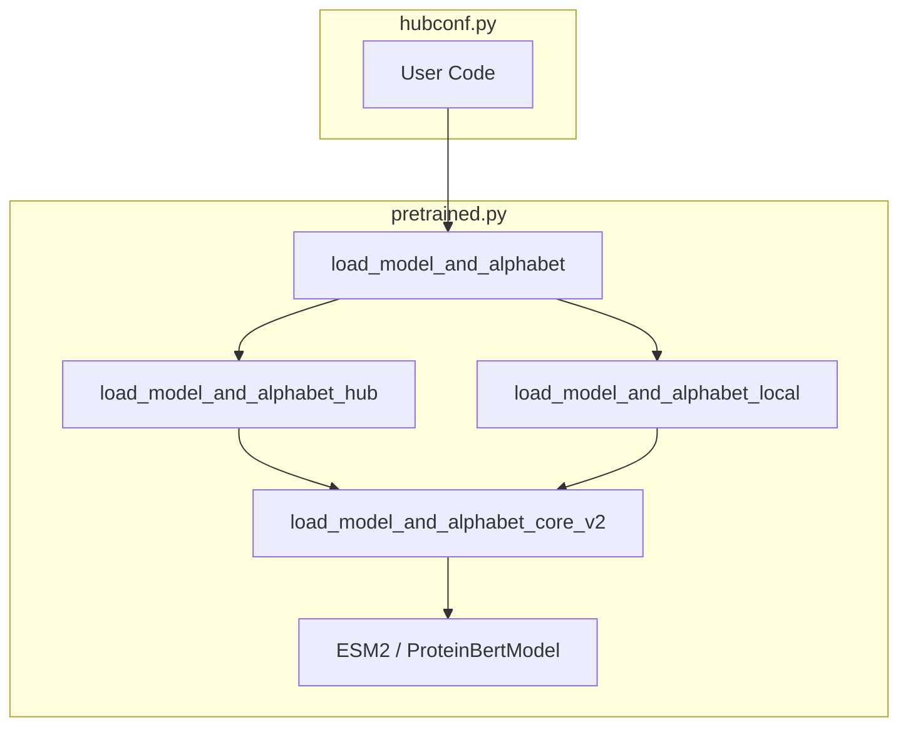

# ESM Protein Language Models

> **Relevant source files**
> * [esm/data.py](https://github.com/MaybeBio/esmdynamic/blob/b3c7f04f/esm/data.py)
> * [esm/model/esm1.py](https://github.com/MaybeBio/esmdynamic/blob/b3c7f04f/esm/model/esm1.py)
> * [esm/model/esm2.py](https://github.com/MaybeBio/esmdynamic/blob/b3c7f04f/esm/model/esm2.py)
> * [esm/model/msa_transformer.py](https://github.com/MaybeBio/esmdynamic/blob/b3c7f04f/esm/model/msa_transformer.py)
> * [esm/pretrained.py](https://github.com/MaybeBio/esmdynamic/blob/b3c7f04f/esm/pretrained.py)
> * [esm/rotary_embedding.py](https://github.com/MaybeBio/esmdynamic/blob/b3c7f04f/esm/rotary_embedding.py)
> * [scripts/extract.py](https://github.com/MaybeBio/esmdynamic/blob/b3c7f04f/scripts/extract.py)
> * [tests/test_alphabet.py](https://github.com/MaybeBio/esmdynamic/blob/b3c7f04f/tests/test_alphabet.py)

The ESM (Evolutionary Scale Modeling) family represents a suite of transformer-based protein language models designed to extract biological information from protein sequences and Multiple Sequence Alignments (MSAs). These models utilize unsupervised masked language modeling (MLM) to learn representations that capture secondary structure, tertiary contacts, and functional sites.

This page provides a high-level overview of the model family, their shared tokenization infrastructure, and the registry system used to load pretrained weights.

## Model Family Overview

The repository supports several generations of ESM models, each characterized by specific architectural improvements and training scales:

* **ESM-1 (ProteinBertModel):** The original transformer architecture using sinusoidal positional embeddings [esm/model/esm1.py L64-L65](https://github.com/MaybeBio/esmdynamic/blob/b3c7f04f/esm/model/esm1.py#L64-L65)
* **ESM-1b (ProteinBertModel):** An improved version of ESM-1 using learned positional embeddings and a modified LayerNorm strategy [esm/model/esm1.py L60-L62](https://github.com/MaybeBio/esmdynamic/blob/b3c7f04f/esm/model/esm1.py#L60-L62)
* **ESM-1v:** A variant specifically tuned for zero-shot variant effect prediction, often used as an ensemble.
* **ESM-2 (ESM2):** The current state-of-the-art generation, utilizing Rotary Positional Embeddings (RoPE) and scaled up to 15 billion parameters [esm/model/esm2.py L14-L22](https://github.com/MaybeBio/esmdynamic/blob/b3c7f04f/esm/model/esm2.py#L14-L22)
* **MSA Transformer (MSATransformer):** A specialized architecture that takes MSAs as input and uses axial attention to process both sequence and evolutionary information [esm/model/msa_transformer.py L21-L87](https://github.com/MaybeBio/esmdynamic/blob/b3c7f04f/esm/model/msa_transformer.py#L21-L87)

For a deep dive into the specific layers and embedding strategies of each model, see **[Model Architectures: ESM-1, ESM-2, and MSA Transformer](/MaybeBio/esmdynamic/2.1-model-architectures:-esm-1-esm-2-and-msa-transformer)**.

### Model Class Mapping

| Model Name | Implementation Class | Primary Positional Encoding |
| --- | --- | --- |
| ESM-1 | `ProteinBertModel` | `SinusoidalPositionalEmbedding` |
| ESM-1b | `ProteinBertModel` | `LearnedPositionalEmbedding` |
| ESM-2 | `ESM2` | `RotaryEmbedding` |
| MSA Transformer | `MSATransformer` | `LearnedPositionalEmbedding` (Row) + MSA-specific (Column) |

**Sources:** [esm/model/esm1.py L49-L66](https://github.com/MaybeBio/esmdynamic/blob/b3c7f04f/esm/model/esm1.py#L49-L66)

 [esm/model/esm2.py L49-L61](https://github.com/MaybeBio/esmdynamic/blob/b3c7f04f/esm/model/esm2.py#L49-L61)

 [esm/model/msa_transformer.py L112-L144](https://github.com/MaybeBio/esmdynamic/blob/b3c7f04f/esm/model/msa_transformer.py#L112-L144)

## Tokenization and Data Pipeline

All ESM models share a common tokenization framework centered around the `Alphabet` class [esm/data.py L91](https://github.com/MaybeBio/esmdynamic/blob/b3c7f04f/esm/data.py#L91-L91)

 This system maps amino acid characters to integer IDs and handles special tokens like `<cls>` (start of sequence), `<eos>` (end of sequence), and `<mask>` (for MLM tasks).

The data pipeline is designed for efficiency, supporting:

* **Batching:** The `BatchConverter` [esm/data.py L136-L140](https://github.com/MaybeBio/esmdynamic/blob/b3c7f04f/esm/data.py#L136-L140)  transforms lists of raw sequences into padded tensors.
* **MSA Handling:** The `MSABatchConverter` handles the 3D tensor requirements (Batch x Alignments x Length) for MSA Transformer [esm/data.py L137-L138](https://github.com/MaybeBio/esmdynamic/blob/b3c7f04f/esm/data.py#L137-L138)
* **Dynamic Loading:** `FastaBatchedDataset` allows for streaming sequences from large FASTA files with automated batch index calculation based on token counts [esm/data.py L19-L89](https://github.com/MaybeBio/esmdynamic/blob/b3c7f04f/esm/data.py#L19-L89)

For details on how sequences are converted to tensors, see **[Tokenization and Data Pipeline](/MaybeBio/esmdynamic/2.2-tokenization-and-data-pipeline)**.

**Sources:** [esm/data.py L91-L174](https://github.com/MaybeBio/esmdynamic/blob/b3c7f04f/esm/data.py#L91-L174)

 [esm/data.py L19-L57](https://github.com/MaybeBio/esmdynamic/blob/b3c7f04f/esm/data.py#L19-L57)

 [tests/test_alphabet.py L6-L25](https://github.com/MaybeBio/esmdynamic/blob/b3c7f04f/tests/test_alphabet.py#L6-L25)

## Pretrained Model Registry

The repository provides a centralized API for accessing pretrained weights through `load_model_and_alphabet` [esm/pretrained.py L24](https://github.com/MaybeBio/esmdynamic/blob/b3c7f04f/esm/pretrained.py#L24-L24)

 This utility handles both local file paths and automatic downloads from the FAIR-ESM hub.

The registry manages:

* **State Dict Upgrading:** Automatically maps legacy checkpoint keys to the current architecture definitions [esm/pretrained.py L85-L170](https://github.com/MaybeBio/esmdynamic/blob/b3c7f04f/esm/pretrained.py#L85-L170)
* **Regression Weights:** Loads auxiliary weights required for contact prediction heads [esm/pretrained.py L46-L49](https://github.com/MaybeBio/esmdynamic/blob/b3c7f04f/esm/pretrained.py#L46-L49)
* **Hub Integration:** Interfaces with `torch.hub` for seamless model fetching [esm/pretrained.py L31-L43](https://github.com/MaybeBio/esmdynamic/blob/b3c7f04f/esm/pretrained.py#L31-L43)

For a full list of available model names and weight loading details, see **[Pretrained Model Registry and Weight Loading](/MaybeBio/esmdynamic/2.3-pretrained-model-registry-and-weight-loading)**.

**Sources:** [esm/pretrained.py L24-L77](https://github.com/MaybeBio/esmdynamic/blob/b3c7f04f/esm/pretrained.py#L24-L77)

 [esm/pretrained.py L85-L161](https://github.com/MaybeBio/esmdynamic/blob/b3c7f04f/esm/pretrained.py#L85-L161)

## System Architecture: Sequence to Representation

The following diagram illustrates the flow from a raw protein sequence to the final model representations and contact predictions, highlighting the primary code entities involved.

### Representation Extraction Flow

**Sources:** [esm/data.py L19-L140](https://github.com/MaybeBio/esmdynamic/blob/b3c7f04f/esm/data.py#L19-L140)

 [esm/model/esm2.py L77-L144](https://github.com/MaybeBio/esmdynamic/blob/b3c7f04f/esm/model/esm2.py#L77-L144)

 [scripts/extract.py L74-L95](https://github.com/MaybeBio/esmdynamic/blob/b3c7f04f/scripts/extract.py#L74-L95)

## Inference and Scaling

While smaller ESM models can run on standard GPUs, the largest variants (e.g., ESM-2 15B) require distributed strategies. The codebase integrates with Fairscale to support **Fully Sharded Data Parallel (FSDP)** and CPU offloading, allowing models that exceed single-GPU memory to be executed by sharding parameters across multiple devices or offloading them to system RAM.

For instructions on running large-scale inference, see **[Large-Scale Inference with FSDP and CPU Offloading](/MaybeBio/esmdynamic/2.4-large-scale-inference-with-fsdp-and-cpu-offloading)**.

### Model Loading Logic

**Sources:** [esm/pretrained.py L24-L30](https://github.com/MaybeBio/esmdynamic/blob/b3c7f04f/esm/pretrained.py#L24-L30)

 [esm/pretrained.py L164-L170](https://github.com/MaybeBio/esmdynamic/blob/b3c7f04f/esm/pretrained.py#L164-L170)