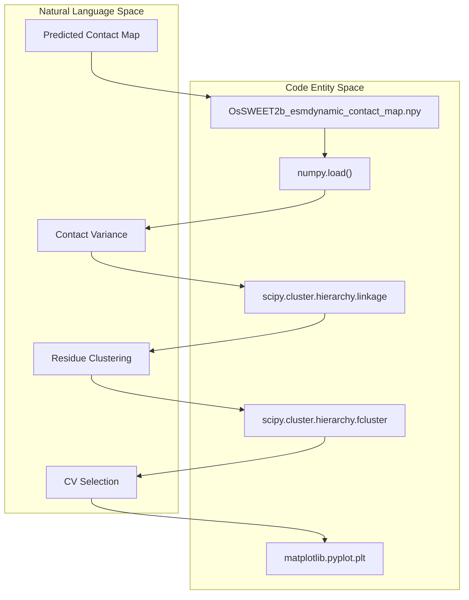
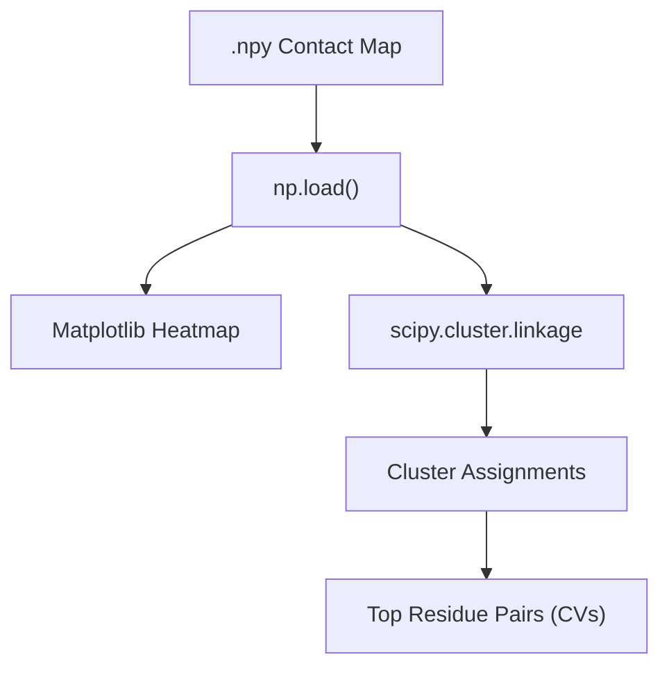

# ESMDynamic Downstream Analysis: CV Selection Pipeline

> **Relevant source files**
> * [examples/esmdynamic/OsSWEET2b_esmdynamic_contact_map.npy](https://github.com/MaybeBio/esmdynamic/blob/b3c7f04f/examples/esmdynamic/OsSWEET2b_esmdynamic_contact_map.npy)
> * [examples/esmdynamic/cv_selection_pipeline.ipynb](https://github.com/MaybeBio/esmdynamic/blob/b3c7f04f/examples/esmdynamic/cv_selection_pipeline.ipynb)
> * [examples/esmdynamic/example.csv](https://github.com/MaybeBio/esmdynamic/blob/b3c7f04f/examples/esmdynamic/example.csv)
> * [examples/esmdynamic/example.fasta](https://github.com/MaybeBio/esmdynamic/blob/b3c7f04f/examples/esmdynamic/example.fasta)

This page documents the downstream analysis workflow for processing ESMDynamic predictions. The primary goal of this pipeline is to transform high-dimensional dynamic contact map predictions into actionable insights, such as selecting **Collective Variables (CVs)** for enhanced sampling Molecular Dynamics (MD) simulations. The pipeline utilizes hierarchical clustering to identify residue pairs that exhibit significant conformational changes.

## Pipeline Overview

The downstream analysis is implemented in the `cv_selection_pipeline.ipynb` notebook. It processes the raw `.npy` or `.pt` output from `run_esmdynamic` to identify structural features that characterize protein flexibility.

### Data Flow

1. **Input**: Dynamic contact map files (e.g., `OsSWEET2b_esmdynamic_contact_map.npy`) generated by the inference script.
2. **Processing**: Loading data into NumPy, computing distance metrics between contact states, and performing hierarchical clustering.
3. **Output**: Visualization of contact map clusters and a prioritized list of residue pairs (CVs) for MD simulations.

### System to Code Entity Mapping

The following diagram bridges the conceptual steps of CV selection to the specific libraries and data structures used in the codebase.

**CV Selection Logic Flow**

*Sources: [examples/esmdynamic/cv_selection_pipeline.ipynb L1-L31](https://github.com/MaybeBio/esmdynamic/blob/b3c7f04f/examples/esmdynamic/cv_selection_pipeline.ipynb#L1-L31)*

## Implementation Details

### 1. Loading ESMDynamic Outputs

The pipeline begins by loading the contact map. For the `OsSWEET2b` example, the data is stored as a 2D NumPy array representing the probability or occupancy of contacts across the sequence length (212 residues).

* **File**: `examples/esmdynamic/OsSWEET2b_esmdynamic_contact_map.npy` [examples/esmdynamic/OsSWEET2b_esmdynamic_contact_map.npy L1](https://github.com/MaybeBio/esmdynamic/blob/b3c7f04f/examples/esmdynamic/OsSWEET2b_esmdynamic_contact_map.npy#L1-L1)
* **Loading**: `np.load("OsSWEET2b_esmdynamic_contact_map.npy")` [examples/esmdynamic/cv_selection_pipeline.ipynb L30](https://github.com/MaybeBio/esmdynamic/blob/b3c7f04f/examples/esmdynamic/cv_selection_pipeline.ipynb#L30-L30)

### 2. Hierarchical Clustering

To identify functional domains or residues that move in concert, the pipeline applies hierarchical clustering to the contact map data.

* **Linkage**: Uses `scipy.cluster.hierarchy.linkage` to build a cluster tree based on the similarity of contact profiles [examples/esmdynamic/cv_selection_pipeline.ipynb L12](https://github.com/MaybeBio/esmdynamic/blob/b3c7f04f/examples/esmdynamic/cv_selection_pipeline.ipynb#L12-L12)
* **Flattening**: Uses `fcluster` to assign residues to specific clusters based on a distance threshold [examples/esmdynamic/cv_selection_pipeline.ipynb L12](https://github.com/MaybeBio/esmdynamic/blob/b3c7f04f/examples/esmdynamic/cv_selection_pipeline.ipynb#L12-L12)

### 3. Collective Variable (CV) Selection

In MD simulations, CVs are specific degrees of freedom (like distances between residue centers) used to drive the simulation between states (e.g., inward-facing to outward-facing in transporters).

The pipeline identifies these by:

1. Locating residue pairs with the highest variance in predicted dynamic contact probability.
2. Selecting pairs that bridge different clusters identified in the previous step.

**CV Extraction Architecture**

*Sources: [examples/esmdynamic/cv_selection_pipeline.ipynb L10-L31](https://github.com/MaybeBio/esmdynamic/blob/b3c7f04f/examples/esmdynamic/cv_selection_pipeline.ipynb#L10-L31)*

## Example Case: OsSWEET2b

The repository provides an example using `OsSWEET2b`, a sugar transporter. The sequence is defined in the example files:

* **Sequence ID**: `SWEET2b` [examples/esmdynamic/example.fasta L3](https://github.com/MaybeBio/esmdynamic/blob/b3c7f04f/examples/esmdynamic/example.fasta#L3-L3)
* **Sequence**: `DSLYDISCFAAGLAGNIFALALFLSPVTTFKRILKAKSTERFDGLPYLFSLLNCLICLWYGLPWVADGRLLVATVNGIGAVFQLAYICLFIFYADSRKTRMKIIGLLVLVVCGFALVSHASVFFFDQPLRQQFVGAVSMASLISMFASPLAVMGVVIRSESVEFMPFYLSLSTFLMSASFALYGLLLRDFFIYFPNGLGLILGAMQLALYAY` [examples/esmdynamic/example.csv L3](https://github.com/MaybeBio/esmdynamic/blob/b3c7f04f/examples/esmdynamic/example.csv#L3-L3)

The `cv_selection_pipeline.ipynb` demonstrates how to take the 212x212 contact map [examples/esmdynamic/OsSWEET2b_esmdynamic_contact_map.npy L1](https://github.com/MaybeBio/esmdynamic/blob/b3c7f04f/examples/esmdynamic/OsSWEET2b_esmdynamic_contact_map.npy#L1-L1)

 and visualize the dynamic regions that correspond to the transporter's gating mechanism.

## Integration with MD Workflows

The outputs of this notebook are intended to be fed into MD engines like GROMACS or OpenMM. By using ESMDynamic's sequence-based predictions to choose CVs, researchers can bypass the need for multiple experimental structures to initialize enhanced sampling protocols like Metadynamics or Umbrella Sampling.

*Sources: [examples/esmdynamic/cv_selection_pipeline.ipynb L1-L31](https://github.com/MaybeBio/esmdynamic/blob/b3c7f04f/examples/esmdynamic/cv_selection_pipeline.ipynb#L1-L31)

 [examples/esmdynamic/example.fasta L3-L4](https://github.com/MaybeBio/esmdynamic/blob/b3c7f04f/examples/esmdynamic/example.fasta#L3-L4)

 [examples/esmdynamic/example.csv L3](https://github.com/MaybeBio/esmdynamic/blob/b3c7f04f/examples/esmdynamic/example.csv#L3-L3)*