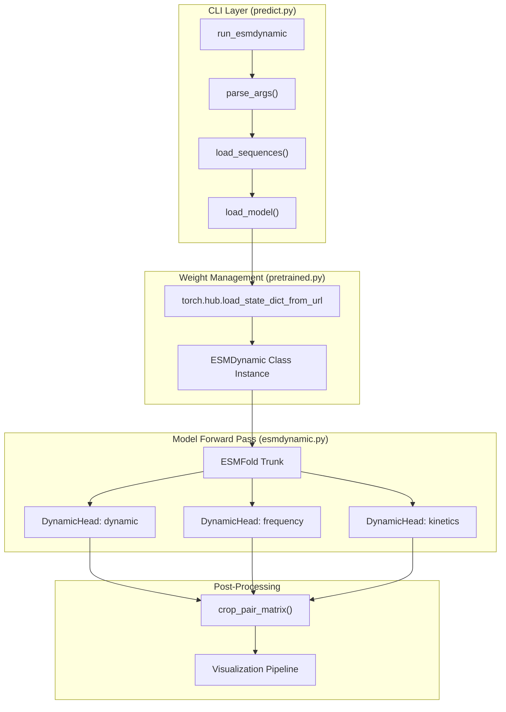
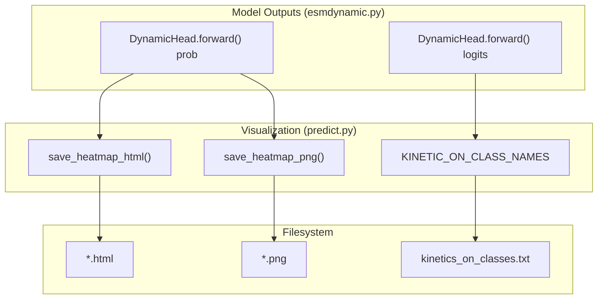

# ESMDynamic Inference: run_esmdynamic CLI

> **Relevant source files**
> * [Dockerfile](https://github.com/MaybeBio/esmdynamic/blob/b3c7f04f/Dockerfile)
> * [README.md](https://github.com/MaybeBio/esmdynamic/blob/b3c7f04f/README.md?plain=1)
> * [esm/esmdynamic/esmdynamic.py](https://github.com/MaybeBio/esmdynamic/blob/b3c7f04f/esm/esmdynamic/esmdynamic.py)
> * [esm/esmdynamic/predict.py](https://github.com/MaybeBio/esmdynamic/blob/b3c7f04f/esm/esmdynamic/predict.py)
> * [esm/esmdynamic/pretrained.py](https://github.com/MaybeBio/esmdynamic/blob/b3c7f04f/esm/esmdynamic/pretrained.py)
> * [examples/esmdynamic/example.csv](https://github.com/MaybeBio/esmdynamic/blob/b3c7f04f/examples/esmdynamic/example.csv)
> * [examples/esmdynamic/example.fasta](https://github.com/MaybeBio/esmdynamic/blob/b3c7f04f/examples/esmdynamic/example.fasta)
> * [output_interpretation.md](https://github.com/MaybeBio/esmdynamic/blob/b3c7f04f/output_interpretation.md?plain=1)
> * [tests/test_readme.py](https://github.com/MaybeBio/esmdynamic/blob/b3c7f04f/tests/test_readme.py)
> * [viz_plotly.gif](https://github.com/MaybeBio/esmdynamic/blob/b3c7f04f/viz_plotly.gif)

The `run_esmdynamic` command-line interface (CLI) is the primary entry point for performing protein dynamics predictions using the ESMDynamic model. It enables users to input protein sequences in various formats and generates a comprehensive suite of outputs, including dynamic contact maps, contact occupancy (frequency), and kinetic timescales across five simulated temperatures [esm/esmdynamic/predict.py L37-L39](https://github.com/MaybeBio/esmdynamic/blob/b3c7f04f/esm/esmdynamic/predict.py#L37-L39)

## Input Modes and Sequence Handling

The CLI supports three distinct input modes to accommodate different scales of inference [esm/esmdynamic/predict.py L40-L47](https://github.com/MaybeBio/esmdynamic/blob/b3c7f04f/esm/esmdynamic/predict.py#L40-L47)

| Flag | Input Type | Description |
| --- | --- | --- |
| `--sequence` | String | A single protein sequence provided directly in the command line. |
| `--fasta` | File Path | Path to a standard FASTA file. Record IDs are used as protein identifiers. |
| `--csv` | File Path | Path to a CSV file where the first column is the ID and the second is the sequence. |

### Multimer Handling

For multimer complexes, chains must be separated by a colon (`:`) in the input string [README.md L115](https://github.com/MaybeBio/esmdynamic/blob/b3c7f04f/README.md?plain=1#L115-L115)

 The pipeline automatically handles these by inserting a 25-residue poly-G linker during model processing, which is subsequently removed during the cropping phase to ensure output matrices align with the physical residues [esm/esmdynamic/predict.py L134-L164](https://github.com/MaybeBio/esmdynamic/blob/b3c7f04f/esm/esmdynamic/predict.py#L134-L164)

### Sequence Processing Flow

1. **Loading**: `load_sequences` parses the input source into a list of tuples `(id, sequence)` [esm/esmdynamic/predict.py L113-L127](https://github.com/MaybeBio/esmdynamic/blob/b3c7f04f/esm/esmdynamic/predict.py#L113-L127)
2. **Sanitization**: IDs are cleaned of special characters using `sanitize_id` to ensure safe filesystem paths [esm/esmdynamic/predict.py L130-L131](https://github.com/MaybeBio/esmdynamic/blob/b3c7f04f/esm/esmdynamic/predict.py#L130-L131)
3. **Masking**: `get_crop_mask_labels_and_boundaries` generates a boolean mask to identify valid residue positions vs. linkers [esm/esmdynamic/predict.py L134-L164](https://github.com/MaybeBio/esmdynamic/blob/b3c7f04f/esm/esmdynamic/predict.py#L134-L164)

**Sources:** [esm/esmdynamic/predict.py L37-L164](https://github.com/MaybeBio/esmdynamic/blob/b3c7f04f/esm/esmdynamic/predict.py#L37-L164)

 [README.md L113-L115](https://github.com/MaybeBio/esmdynamic/blob/b3c7f04f/README.md?plain=1#L113-L115)

## Performance and Resource Management

ESMDynamic is computationally intensive, particularly for long sequences. The CLI provides several flags to manage hardware resources:

* **`--batch_size`**: Controls the number of sequences processed in a single forward pass [esm/esmdynamic/predict.py L49](https://github.com/MaybeBio/esmdynamic/blob/b3c7f04f/esm/esmdynamic/predict.py#L49-L49)
* **`--chunk_size`**: Sets the internal sub-batching size for the `FoldingTrunk` operations to reduce peak VRAM usage (default: 256) [esm/esmdynamic/predict.py L50](https://github.com/MaybeBio/esmdynamic/blob/b3c7f04f/esm/esmdynamic/predict.py#L50-L50)
* **`--low_memory`**: A specialized mode that executes the three prediction heads (Dynamic, Frequency, Kinetics) sequentially rather than in parallel. This significantly reduces memory footprint at the cost of increased execution time [esm/esmdynamic/predict.py L70-L73](https://github.com/MaybeBio/esmdynamic/blob/b3c7f04f/esm/esmdynamic/predict.py#L70-L73)
* **`--device`**: Allows manual selection between `cpu` and `cuda` [esm/esmdynamic/predict.py L51-L56](https://github.com/MaybeBio/esmdynamic/blob/b3c7f04f/esm/esmdynamic/predict.py#L51-L56)

**Sources:** [esm/esmdynamic/predict.py L49-L73](https://github.com/MaybeBio/esmdynamic/blob/b3c7f04f/esm/esmdynamic/predict.py#L49-L73)

 [README.md L124-L126](https://github.com/MaybeBio/esmdynamic/blob/b3c7f04f/README.md?plain=1#L124-L126)

## Prediction Pipeline and Weight Loading

The CLI utilizes a centralized loader to fetch pretrained weights from the Illinois Data Bank if they are not present locally.

### Pretrained Weight Loader

The `_load_model` function in `esm/esmdynamic/pretrained.py` handles the initialization of the `ESMDynamic` class and the population of its state dict. It performs strictness checks on "essential" keys (the dynamic heads) while allowing flexibility for the underlying `esmfold` backbone keys [esm/esmdynamic/pretrained.py L6-L29](https://github.com/MaybeBio/esmdynamic/blob/b3c7f04f/esm/esmdynamic/pretrained.py#L6-L29)

### Data Flow Diagram: CLI to Model

The following diagram illustrates how the CLI entities interact with the core model architecture.

**ESMDynamic Inference Logic Flow**

**Sources:** [esm/esmdynamic/predict.py L37-L110](https://github.com/MaybeBio/esmdynamic/blob/b3c7f04f/esm/esmdynamic/predict.py#L37-L110)

 [esm/esmdynamic/pretrained.py L6-L36](https://github.com/MaybeBio/esmdynamic/blob/b3c7f04f/esm/esmdynamic/pretrained.py#L6-L36)

 [esm/esmdynamic/esmdynamic.py L32-L118](https://github.com/MaybeBio/esmdynamic/blob/b3c7f04f/esm/esmdynamic/esmdynamic.py#L32-L118)

## Output Formats and Visualization

The CLI produces outputs organized by temperature (320K, 348K, 379K, 413K, 450K) [esm/esmdynamic/predict.py L15](https://github.com/MaybeBio/esmdynamic/blob/b3c7f04f/esm/esmdynamic/predict.py#L15-L15)

### Output Files

* **Interactive HTML (`--save_html`)**: Uses Plotly to generate zoomable heatmaps with residue labels [esm/esmdynamic/predict.py L231-L252](https://github.com/MaybeBio/esmdynamic/blob/b3c7f04f/esm/esmdynamic/predict.py#L231-L252)
* **Static PNG (`--save_png`)**: Generates standard matplotlib plots of contact maps and per-residue confidence/error vectors [esm/esmdynamic/predict.py L193-L228](https://github.com/MaybeBio/esmdynamic/blob/b3c7f04f/esm/esmdynamic/predict.py#L193-L228)
* **Raw Data (`--save_txt`)**: Exports matrices as `.txt` files (via `np.savetxt`) and residue vectors as `.csv` [esm/esmdynamic/predict.py L181-L191](https://github.com/MaybeBio/esmdynamic/blob/b3c7f04f/esm/esmdynamic/predict.py#L181-L191)
* **PyTorch Bundle (`--save_raw_pt`)**: A single `.pt` file containing a dictionary of all cropped tensors for a sequence, ideal for programmatic downstream analysis [esm/esmdynamic/predict.py L90-L93](https://github.com/MaybeBio/esmdynamic/blob/b3c7f04f/esm/esmdynamic/predict.py#L90-L93)  [output_interpretation.md L179-L196](https://github.com/MaybeBio/esmdynamic/blob/b3c7f04f/output_interpretation.md?plain=1#L179-L196)

### Visualization Pipeline

The visualization logic maps the numerical outputs of the `DynamicHead` (logits and probabilities) into human-readable formats. For the Kinetics head, it maps class indices to specific time bins (e.g., `1to10ns`, `always_on`) [esm/esmdynamic/predict.py L17-L33](https://github.com/MaybeBio/esmdynamic/blob/b3c7f04f/esm/esmdynamic/predict.py#L17-L33)

**Code Entity Association: Output Mapping**

**Sources:** [esm/esmdynamic/predict.py L15-L252](https://github.com/MaybeBio/esmdynamic/blob/b3c7f04f/esm/esmdynamic/predict.py#L15-L252)

 [output_interpretation.md L12-L115](https://github.com/MaybeBio/esmdynamic/blob/b3c7f04f/output_interpretation.md?plain=1#L12-L115)

 [esm/esmdynamic/esmdynamic.py L144-L180](https://github.com/MaybeBio/esmdynamic/blob/b3c7f04f/esm/esmdynamic/esmdynamic.py#L144-L180)