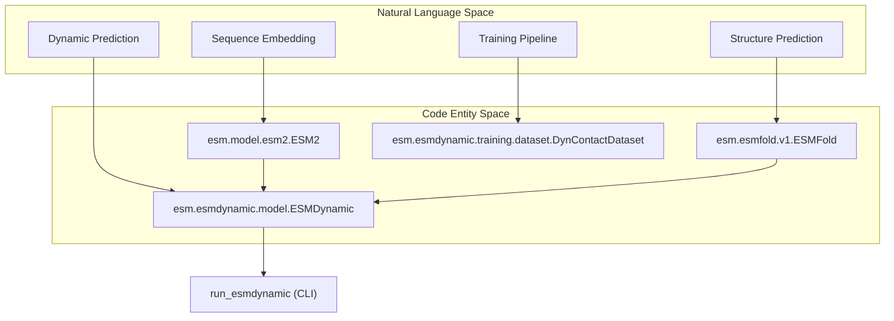
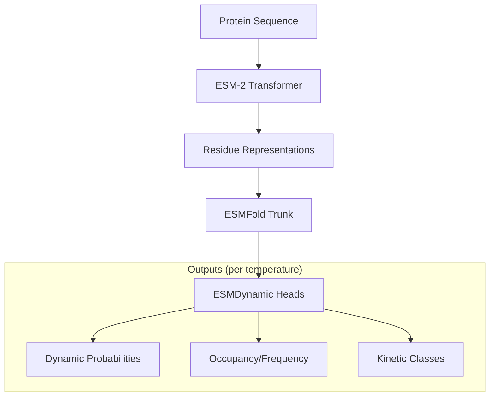

# ESMDynamic Repository Overview

> **Relevant source files**
> * [README.md](https://github.com/MaybeBio/esmdynamic/blob/b3c7f04f/README.md?plain=1)
> * [esm/__init__.py](https://github.com/MaybeBio/esmdynamic/blob/b3c7f04f/esm/__init__.py)
> * [esm/esmdynamic/__init__.py](https://github.com/MaybeBio/esmdynamic/blob/b3c7f04f/esm/esmdynamic/__init__.py)
> * [esm/esmdynamic/training/__init__.py](https://github.com/MaybeBio/esmdynamic/blob/b3c7f04f/esm/esmdynamic/training/__init__.py)
> * [model_scheme.png](https://github.com/MaybeBio/esmdynamic/blob/b3c7f04f/model_scheme.png)
> * [output_interpretation.md](https://github.com/MaybeBio/esmdynamic/blob/b3c7f04f/output_interpretation.md?plain=1)
> * [setup.py](https://github.com/MaybeBio/esmdynamic/blob/b3c7f04f/setup.py)
> * [tests/test_readme.py](https://github.com/MaybeBio/esmdynamic/blob/b3c7f04f/tests/test_readme.py)

ESMDynamic is a computational framework for predicting protein dynamic contact maps, contact occupancy, and kinetics from single sequences [README.md L1-L7](https://github.com/MaybeBio/esmdynamic/blob/b3c7f04f/README.md?plain=1#L1-L7)

 It extends the **Evolutionary Scale Modeling (ESM)** ecosystem by integrating structural representations from ESM-2 and ESMFold with a specialized dynamic prediction architecture [README.md L8-L10](https://github.com/MaybeBio/esmdynamic/blob/b3c7f04f/README.md?plain=1#L8-L10)

The system allows researchers to move beyond static structure prediction by estimating how residue-residue contacts fluctuate over time across a range of simulated temperatures (320K to 450K) [output_interpretation.md L33-L41](https://github.com/MaybeBio/esmdynamic/blob/b3c7f04f/output_interpretation.md?plain=1#L33-L41)

## System Relationship and Architecture

ESMDynamic is built upon the `fair-esm` codebase [setup.py L26-L29](https://github.com/MaybeBio/esmdynamic/blob/b3c7f04f/setup.py#L26-L29)

 It utilizes pretrained ESM-2 models for sequence representation and incorporates components of ESMFold for structural context [esm/__init__.py L8-L12](https://github.com/MaybeBio/esmdynamic/blob/b3c7f04f/esm/__init__.py#L8-L12)

### Conceptual to Code Mapping

The following diagram bridges the high-level functional concepts to their respective implementations within the repository.

**System Concept to Code Entity Mapping**

Sources: [esm/__init__.py L8-L12](https://github.com/MaybeBio/esmdynamic/blob/b3c7f04f/esm/__init__.py#L8-L12)

 [setup.py L38-L42](https://github.com/MaybeBio/esmdynamic/blob/b3c7f04f/setup.py#L38-L42)

 [output_interpretation.md L143-L145](https://github.com/MaybeBio/esmdynamic/blob/b3c7f04f/output_interpretation.md?plain=1#L143-L145)

## Key Capabilities

ESMDynamic provides three primary prediction heads that characterize the conformational ensemble of a protein [output_interpretation.md L5-L9](https://github.com/MaybeBio/esmdynamic/blob/b3c7f04f/output_interpretation.md?plain=1#L5-L9)

:

1. **Dynamic Contact Classification**: Predicts if a residue pair transitions between contact and non-contact states [output_interpretation.md L47-L49](https://github.com/MaybeBio/esmdynamic/blob/b3c7f04f/output_interpretation.md?plain=1#L47-L49)
2. **Frequency (Occupancy) Regression**: Estimates the fraction of time a contact is formed in the ensemble [output_interpretation.md L73-L75](https://github.com/MaybeBio/esmdynamic/blob/b3c7f04f/output_interpretation.md?plain=1#L73-L75)
3. **Kinetics Classification**: Categorizes contact "On-time" (lifetime) and "Off-time" (formation time) into nanosecond-regime bins [output_interpretation.md L97-L102](https://github.com/MaybeBio/esmdynamic/blob/b3c7f04f/output_interpretation.md?plain=1#L97-L102)

### Data Flow Overview

The diagram below illustrates how a single sequence is transformed into dynamic insights through the model hierarchy.

**ESMDynamic Data Flow**

Sources: [README.md L10-L11](https://github.com/MaybeBio/esmdynamic/blob/b3c7f04f/README.md?plain=1#L10-L11)

 [output_interpretation.md L5-L9](https://github.com/MaybeBio/esmdynamic/blob/b3c7f04f/output_interpretation.md?plain=1#L5-L9)

 [output_interpretation.md L33-L41](https://github.com/MaybeBio/esmdynamic/blob/b3c7f04f/output_interpretation.md?plain=1#L33-L41)

## Codebase Organization

The repository is organized into several key modules, maintaining compatibility with the original ESM structure while adding dynamic prediction features:

| Directory/File | Description |
| --- | --- |
| `esm/esmdynamic/` | Core implementation of the ESMDynamic model and inference logic [setup.py L34](https://github.com/MaybeBio/esmdynamic/blob/b3c7f04f/setup.py#L34-L34) |
| `esm/model/` | Base protein language models including `ESM2` and `MSATransformer` [esm/__init__.py L10-L11](https://github.com/MaybeBio/esmdynamic/blob/b3c7f04f/esm/__init__.py#L10-L11) |
| `esm/esmfold/` | Implementation of the ESMFold structure prediction pipeline [setup.py L34](https://github.com/MaybeBio/esmdynamic/blob/b3c7f04f/setup.py#L34-L34) |
| `esm/inverse_folding/` | Tools for designing sequences from structures (ESM-IF1) [setup.py L34](https://github.com/MaybeBio/esmdynamic/blob/b3c7f04f/setup.py#L34-L34) |
| `scripts/` | Utility scripts for representation extraction and data processing [tests/test_readme.py L98-L101](https://github.com/MaybeBio/esmdynamic/blob/b3c7f04f/tests/test_readme.py#L98-L101) |
| `examples/` | Jupyter notebooks and sample data for quick start and downstream analysis [README.md L3-L4](https://github.com/MaybeBio/esmdynamic/blob/b3c7f04f/README.md?plain=1#L3-L4) |

Sources: [setup.py L34-L42](https://github.com/MaybeBio/esmdynamic/blob/b3c7f04f/setup.py#L34-L42)

 [esm/__init__.py L8-L12](https://github.com/MaybeBio/esmdynamic/blob/b3c7f04f/esm/__init__.py#L8-L12)

 [README.md L33-L38](https://github.com/MaybeBio/esmdynamic/blob/b3c7f04f/README.md?plain=1#L33-L38)

## Child Sections

For detailed technical documentation, refer to the following sub-pages:

* **[Getting Started: Installation and Environment Setup](/MaybeBio/esmdynamic/1.1-getting-started:-installation-and-environment-setup)** Covers environment configuration via Conda or Docker, weight downloads, and basic execution.
* **[Repository Structure and Package Layout](/MaybeBio/esmdynamic/1.2-repository-structure-and-package-layout)** Detailed breakdown of the directory hierarchy, package namespaces, and entry points like `run_esmdynamic`.

---

*For details on interpreting specific model outputs like `dynamic_prob` or kinetic bins, see the [Output Interpretation Guide](https://github.com/MaybeBio/esmdynamic/blob/b3c7f04f/Output Interpretation Guide)*