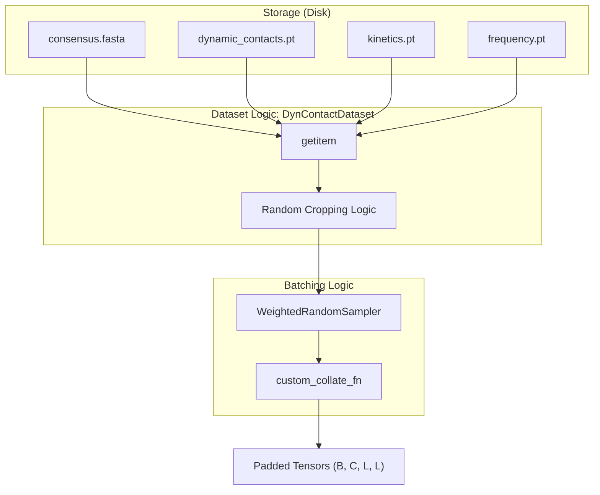
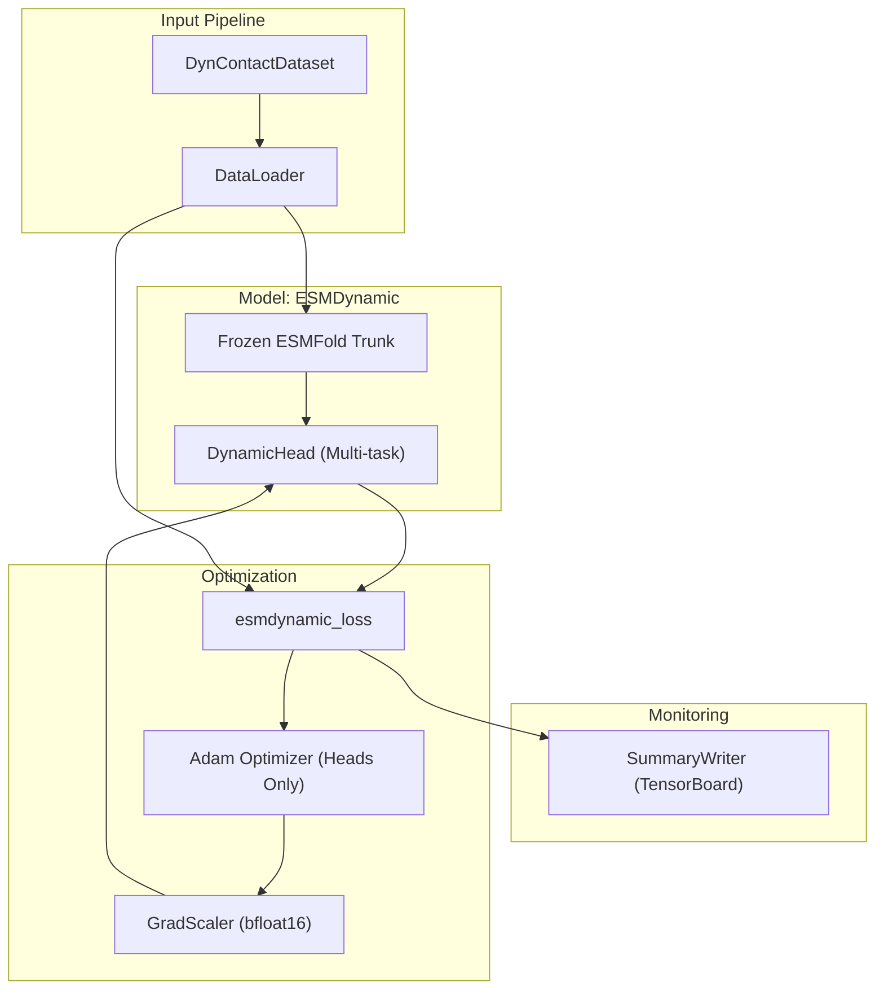

# ESMDynamic Training Pipeline

> **Relevant source files**
> * [esm/esmdynamic/training/convert_csv_to_torch.py](https://github.com/MaybeBio/esmdynamic/blob/b3c7f04f/esm/esmdynamic/training/convert_csv_to_torch.py)
> * [esm/esmdynamic/training/data_reader.py](https://github.com/MaybeBio/esmdynamic/blob/b3c7f04f/esm/esmdynamic/training/data_reader.py)
> * [esm/esmdynamic/training/loss.py](https://github.com/MaybeBio/esmdynamic/blob/b3c7f04f/esm/esmdynamic/training/loss.py)
> * [esm/esmdynamic/training/train.py](https://github.com/MaybeBio/esmdynamic/blob/b3c7f04f/esm/esmdynamic/training/train.py)

The ESMDynamic training pipeline is designed to fine-tune specialized prediction heads on top of the frozen ESMFold trunk. It enables the model to predict dynamic contact maps, kinetic rates, and contact frequencies across five temperature conditions (320K, 350K, 380K, 410K, and 450K). The system utilizes a multi-head loss function combining classification and regression tasks, supported by a specialized data loading infrastructure for MD-derived protein dynamics.

## Data Loading and Preprocessing

The training system relies on the `DynContactDataset` class to handle protein sequences and their corresponding dynamic labels derived from Molecular Dynamics (MD) simulations.

### Dataset Structure

The dataset expects a directory structure where each protein identifier contains four primary files:

* `consensus.fasta`: The protein sequence [esm/esmdynamic/training/data_reader.py L24-L26](https://github.com/MaybeBio/esmdynamic/blob/b3c7f04f/esm/esmdynamic/training/data_reader.py#L24-L26)
* `dynamic_contacts.pt`: Binary contact maps of shape `(5, L, L)` [esm/esmdynamic/training/data_reader.py L28-L31](https://github.com/MaybeBio/esmdynamic/blob/b3c7f04f/esm/esmdynamic/training/data_reader.py#L28-L31)
* `kinetics.pt`: Kinetic rate bins (on-time and off-time) of shape `(5, 2, L, L)` [esm/esmdynamic/training/data_reader.py L33-L35](https://github.com/MaybeBio/esmdynamic/blob/b3c7f04f/esm/esmdynamic/training/data_reader.py#L33-L35)
* `frequency.pt`: Contact occupancy frequencies of shape `(5, L, L)` [esm/esmdynamic/training/data_reader.py L37-L39](https://github.com/MaybeBio/esmdynamic/blob/b3c7f04f/esm/esmdynamic/training/data_reader.py#L37-L39)

### Sampling and Cropping

To handle variable-length proteins and memory constraints:

1. **WeightedRandomSampler**: The `weighted_random_sampler` method uses sequence length as a proxy for sampling weights to ensure balanced exposure to different protein sizes [esm/esmdynamic/training/data_reader.py L87-L101](https://github.com/MaybeBio/esmdynamic/blob/b3c7f04f/esm/esmdynamic/training/data_reader.py#L87-L101)
2. **Random Cropping**: If a sequence exceeds the `crop_length`, a random contiguous segment is selected. All associated 2D tensors (contacts, kinetics, frequencies) are cropped to match the sequence window [esm/esmdynamic/training/data_reader.py L117-L130](https://github.com/MaybeBio/esmdynamic/blob/b3c7f04f/esm/esmdynamic/training/data_reader.py#L117-L130)
3. **Custom Collation**: The `custom_collate_fn` handles batching by padding sequences and tensors to the maximum length (`Lmax`) within the current batch [esm/esmdynamic/training/data_reader.py L44-L82](https://github.com/MaybeBio/esmdynamic/blob/b3c7f04f/esm/esmdynamic/training/data_reader.py#L44-L82)

### Data Flow Entity Mapping

The following diagram maps the logical data components to the implementation classes and file outputs.

**Data Preparation to Batching Flow**

Sources: [esm/esmdynamic/training/data_reader.py L10-L132](https://github.com/MaybeBio/esmdynamic/blob/b3c7f04f/esm/esmdynamic/training/data_reader.py#L10-L132)

 [esm/esmdynamic/training/train.py L38-L64](https://github.com/MaybeBio/esmdynamic/blob/b3c7f04f/esm/esmdynamic/training/train.py#L38-L64)

## Loss Functions and Optimization

ESMDynamic uses a composite loss function, `esmdynamic_loss`, which aggregates losses from multiple active heads.

### Multi-Head Loss Components

| Head Type | Loss Function | Implementation Details |
| --- | --- | --- |
| **Dynamic Logits** | `sigmoid_focal_loss` | Addresses class imbalance in contact maps (alpha=0.25, gamma=2) [esm/esmdynamic/training/loss.py L38-L54](https://github.com/MaybeBio/esmdynamic/blob/b3c7f04f/esm/esmdynamic/training/loss.py#L38-L54) |
| **Kinetic Logits** | `cross_entropy` | Predicts bins for "on-time" and "off-time" using specific `kin_class_weights` [esm/esmdynamic/training/loss.py L71-L103](https://github.com/MaybeBio/esmdynamic/blob/b3c7f04f/esm/esmdynamic/training/loss.py#L71-L103) |
| **Frequency** | `MSE` (Mean Squared Error) | Regresses the contact occupancy frequency [esm/esmdynamic/training/loss.py L122-L130](https://github.com/MaybeBio/esmdynamic/blob/b3c7f04f/esm/esmdynamic/training/loss.py#L122-L130) |
| **Confidence** | `MSE` | Regresses per-residue accuracy for dynamic and kinetic predictions [esm/esmdynamic/training/loss.py L56-L64](https://github.com/MaybeBio/esmdynamic/blob/b3c7f04f/esm/esmdynamic/training/loss.py#L56-L64)    [esm/esmdynamic/training/loss.py L106-L116](https://github.com/MaybeBio/esmdynamic/blob/b3c7f04f/esm/esmdynamic/training/loss.py#L106-L116) |

### Training Loop Features

* **Bfloat16 Autocast**: The training loop utilizes `torch.cuda.amp.autocast(dtype=torch.bfloat16)` to optimize memory usage and speed on supported hardware [esm/esmdynamic/training/train.py L265-L285](https://github.com/MaybeBio/esmdynamic/blob/b3c7f04f/esm/esmdynamic/training/train.py#L265-L285)
* **Gradient Accumulation**: Supports effective larger batch sizes by accumulating gradients over multiple steps before calling `optimizer.step()` [esm/esmdynamic/training/train.py L287-L291](https://github.com/MaybeBio/esmdynamic/blob/b3c7f04f/esm/esmdynamic/training/train.py#L287-L291)
* **Head-Only Training**: The trunk (ESMFold) remains frozen; the optimizer is initialized only for the parameters of the active `DynamicHead` modules [esm/esmdynamic/training/train.py L89-L97](https://github.com/MaybeBio/esmdynamic/blob/b3c7f04f/esm/esmdynamic/training/train.py#L89-L97)
* **Checkpointing**: Saves state dicts for specific heads (e.g., `kinetic_head_best_...pt`) rather than the entire model to minimize storage [esm/esmdynamic/training/train.py L106-L112](https://github.com/MaybeBio/esmdynamic/blob/b3c7f04f/esm/esmdynamic/training/train.py#L106-L112)

Sources: [esm/esmdynamic/training/loss.py L146-L184](https://github.com/MaybeBio/esmdynamic/blob/b3c7f04f/esm/esmdynamic/training/loss.py#L146-L184)

 [esm/esmdynamic/training/train.py L220-L330](https://github.com/MaybeBio/esmdynamic/blob/b3c7f04f/esm/esmdynamic/training/train.py#L220-L330)

## Training System Architecture

The training pipeline connects the `ESMDynamic` model architecture with the data and loss modules.

**Training Pipeline Architecture**

Sources: [esm/esmdynamic/training/train.py L78-L86](https://github.com/MaybeBio/esmdynamic/blob/b3c7f04f/esm/esmdynamic/training/train.py#L78-L86)

 [esm/esmdynamic/training/train.py L265-L310](https://github.com/MaybeBio/esmdynamic/blob/b3c7f04f/esm/esmdynamic/training/train.py#L265-L310)

 [esm/esmdynamic/training/loss.py L155-L184](https://github.com/MaybeBio/esmdynamic/blob/b3c7f04f/esm/esmdynamic/training/loss.py#L155-L184)

## Target Construction

Specialized helper functions transform raw labels into training targets:

* **Confidence Targets**: `build_confidence_targets_dynamic` and `build_confidence_targets_kinetic` calculate per-residue accuracy (mean over partners) to serve as ground truth for the confidence heads [esm/esmdynamic/training/train.py L131-L182](https://github.com/MaybeBio/esmdynamic/blob/b3c7f04f/esm/esmdynamic/training/train.py#L131-L182)
* **Residual Targets**: `build_frequency_residual_target` calculates the difference between predicted and true frequencies for the residual refinement head [esm/esmdynamic/training/train.py L185-L192](https://github.com/MaybeBio/esmdynamic/blob/b3c7f04f/esm/esmdynamic/training/train.py#L185-L192)
* **Masking**: `length_mask_2d` and `length_mask_1d` ensure that loss is only computed on valid residues, ignoring padding tokens [esm/esmdynamic/training/loss.py L14-L31](https://github.com/MaybeBio/esmdynamic/blob/b3c7f04f/esm/esmdynamic/training/loss.py#L14-L31)

Sources: [esm/esmdynamic/training/train.py L115-L192](https://github.com/MaybeBio/esmdynamic/blob/b3c7f04f/esm/esmdynamic/training/train.py#L115-L192)

 [esm/esmdynamic/training/loss.py L14-L31](https://github.com/MaybeBio/esmdynamic/blob/b3c7f04f/esm/esmdynamic/training/loss.py#L14-L31)