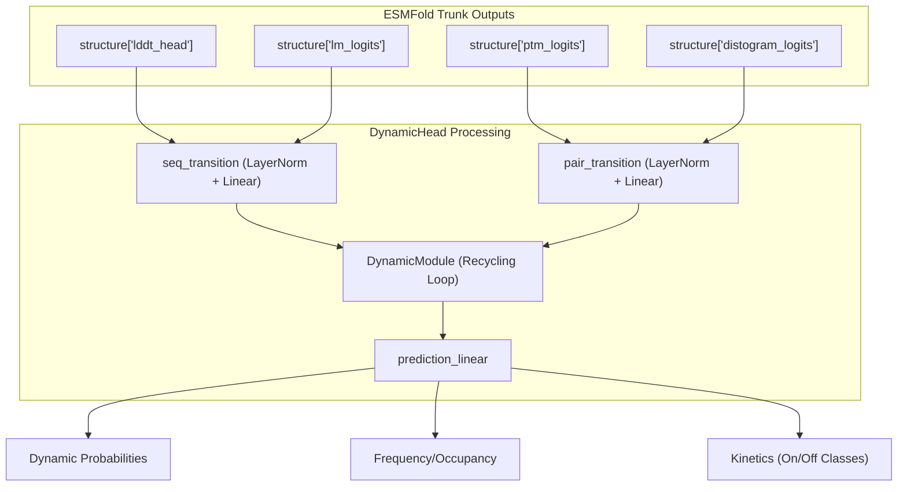

# ESMDynamic: Protein Dynamics Prediction

> **Relevant source files**
> * [Dockerfile](https://github.com/MaybeBio/esmdynamic/blob/b3c7f04f/Dockerfile)
> * [README.md](https://github.com/MaybeBio/esmdynamic/blob/b3c7f04f/README.md?plain=1)
> * [esm/esmdynamic/esmdynamic.py](https://github.com/MaybeBio/esmdynamic/blob/b3c7f04f/esm/esmdynamic/esmdynamic.py)
> * [esm/esmdynamic/predict.py](https://github.com/MaybeBio/esmdynamic/blob/b3c7f04f/esm/esmdynamic/predict.py)
> * [esm/esmdynamic/pretrained.py](https://github.com/MaybeBio/esmdynamic/blob/b3c7f04f/esm/esmdynamic/pretrained.py)
> * [model_scheme.png](https://github.com/MaybeBio/esmdynamic/blob/b3c7f04f/model_scheme.png)
> * [output_interpretation.md](https://github.com/MaybeBio/esmdynamic/blob/b3c7f04f/output_interpretation.md?plain=1)
> * [tests/test_readme.py](https://github.com/MaybeBio/esmdynamic/blob/b3c7f04f/tests/test_readme.py)

ESMDynamic is a specialized extension of the ESMFold architecture designed to predict the conformational ensemble properties of proteins directly from their primary sequence. While ESMFold focuses on predicting a single static 3D structure, ESMDynamic leverages the internal representations of the ESM-2 language model to estimate dynamic contact behaviors, including the probability of contact formation, the fraction of time contacts are maintained (occupancy), and the kinetic timescales of formation and breakage.

The system is trained on the **mdCATH** dataset, providing predictions across five distinct temperature conditions (320K, 348K, 379K, 413K, and 450K), allowing users to explore protein flexibility and potential disorder [output_interpretation.md L33-L43](https://github.com/MaybeBio/esmdynamic/blob/b3c7f04f/output_interpretation.md?plain=1#L33-L43)

### Core Prediction Heads

The model utilizes three specialized heads, each defined within the `DynamicHead` class [esm/esmdynamic/esmdynamic.py L32-L117](https://github.com/MaybeBio/esmdynamic/blob/b3c7f04f/esm/esmdynamic/esmdynamic.py#L32-L117)

 to capture different aspects of protein dynamics:

| Head | Task Type | Output Description |
| --- | --- | --- |
| **Dynamic Module** | `classification` | Predicts if a residue pair transitions between contact and non-contact states [esm/esmdynamic/esmdynamic.py L26](https://github.com/MaybeBio/esmdynamic/blob/b3c7f04f/esm/esmdynamic/esmdynamic.py#L26-L26) |
| **Frequency Module** | `regression` | Predicts contact occupancy (fraction of time in contact) [esm/esmdynamic/esmdynamic.py L28](https://github.com/MaybeBio/esmdynamic/blob/b3c7f04f/esm/esmdynamic/esmdynamic.py#L28-L28) |
| **Kinetic Module** | `kinetics` | Predicts coarse-grained timescales for "On-time" (lifetime) and "Off-time" (formation) [esm/esmdynamic/esmdynamic.py L27](https://github.com/MaybeBio/esmdynamic/blob/b3c7f04f/esm/esmdynamic/esmdynamic.py#L27-L27) |

For details on the implementation of these components, see [ESMDynamic Model Architecture](/MaybeBio/esmdynamic/4.1-esmdynamic-model-architecture).

### Integration with ESMFold

ESMDynamic functions as a downstream processor of ESMFold's internal states. It intercepts the `lddt_head`, `lm_logits`, `ptm_logits`, and `distogram_logits` from the ESMFold trunk [esm/esmdynamic/esmdynamic.py L121-L130](https://github.com/MaybeBio/esmdynamic/blob/b3c7f04f/esm/esmdynamic/esmdynamic.py#L121-L130)

 These features are passed through sequence and pair transitions before entering a `DynamicModule` recycling loop, which iteratively refines the dynamic predictions [esm/esmdynamic/esmdynamic.py L133-L135](https://github.com/MaybeBio/esmdynamic/blob/b3c7f04f/esm/esmdynamic/esmdynamic.py#L133-L135)

#### Data Flow: ESMFold to ESMDynamic Heads

The following diagram illustrates how ESMFold internal tensors are routed into the ESMDynamic prediction heads.



**Sources:** [esm/esmdynamic/esmdynamic.py L67-L76](https://github.com/MaybeBio/esmdynamic/blob/b3c7f04f/esm/esmdynamic/esmdynamic.py#L67-L76)

 [esm/esmdynamic/esmdynamic.py L121-L131](https://github.com/MaybeBio/esmdynamic/blob/b3c7f04f/esm/esmdynamic/esmdynamic.py#L121-L131)

 [esm/esmdynamic/esmdynamic.py L142-L175](https://github.com/MaybeBio/esmdynamic/blob/b3c7f04f/esm/esmdynamic/esmdynamic.py#L142-L175)

### Temperature and Kinetic Classes

Predictions are not single-valued but are distributed across a temperature axis and categorical bins for kinetics.

* **Temperature Axis:** The model outputs results for 320K, 348K, 379K, 413K, and 450K [esm/esmdynamic/predict.py L15](https://github.com/MaybeBio/esmdynamic/blob/b3c7f04f/esm/esmdynamic/predict.py#L15-L15)
* **Kinetic Bins:** Kinetics are classified into six categories ranging from "always on/off" to specific nanosecond regimes (1-10ns, 10-100ns, 100-300ns, >300ns) [esm/esmdynamic/predict.py L17-L33](https://github.com/MaybeBio/esmdynamic/blob/b3c7f04f/esm/esmdynamic/predict.py#L17-L33)

For guidance on analyzing these values, see [Interpreting ESMDynamic Outputs](/MaybeBio/esmdynamic/4.4-interpreting-esmdynamic-outputs).

### User Interface and Inference

The primary entry point for users is the `run_esmdynamic` CLI, implemented in `esm/esmdynamic/predict.py`. It supports single sequences, FASTA files, and CSV inputs [esm/esmdynamic/predict.py L41-L47](https://github.com/MaybeBio/esmdynamic/blob/b3c7f04f/esm/esmdynamic/predict.py#L41-L47)

 The script automates the generation of interactive HTML heatmaps using Plotly and standard PNG plots via Matplotlib [esm/esmdynamic/predict.py L75-L84](https://github.com/MaybeBio/esmdynamic/blob/b3c7f04f/esm/esmdynamic/predict.py#L75-L84)

#### Inference Command Example

```
run_esmdynamic --sequence "MKTVRQERLKSIVRILERSKEPVSGAQLAEELSVSRQVIVQDIAYLRSLGYNIVATPRGYVLAGG" --save_html --save_png
```

For full CLI documentation and performance flags, see [ESMDynamic Inference: run_esmdynamic CLI](/MaybeBio/esmdynamic/4.2-esmdynamic-inference:-run_esmdynamic-cli).

### Training and Data Pipeline

ESMDynamic is trained using the `DynContactDataset`, which loads pre-computed dynamic contact maps and kinetic labels [esm/esmdynamic/train.py L108-L111](https://github.com/MaybeBio/esmdynamic/blob/b3c7f04f/esm/esmdynamic/train.py#L108-L111)

 The training process utilizes a multi-head loss function, `esmdynamic_loss`, which combines Focal Loss for classification tasks and Mean Squared Error (MSE) for occupancy regression [esm/esmdynamic/train.py L416-L430](https://github.com/MaybeBio/esmdynamic/blob/b3c7f04f/esm/esmdynamic/train.py#L416-L430)

For details on the training loop and dataset structure, see [ESMDynamic Training Pipeline](/MaybeBio/esmdynamic/4.3-esmdynamic-training-pipeline).

### Related Pages

* [ESMDynamic Model Architecture](/MaybeBio/esmdynamic/4.1-esmdynamic-model-architecture) — Detailed coverage of the `ESMDynamic` class and `DynamicHead` logic.
* [ESMDynamic Inference: run_esmdynamic CLI](/MaybeBio/esmdynamic/4.2-esmdynamic-inference:-run_esmdynamic-cli) — Documentation for the command-line prediction tool.
* [ESMDynamic Training Pipeline](/MaybeBio/esmdynamic/4.3-esmdynamic-training-pipeline) — Technical details on the training loop and `DynContactDataset`.
* [Interpreting ESMDynamic Outputs](/MaybeBio/esmdynamic/4.4-interpreting-esmdynamic-outputs) — A guide to understanding temperature scales, occupancy, and kinetic classes.

**Sources:** [README.md L80-L111](https://github.com/MaybeBio/esmdynamic/blob/b3c7f04f/README.md?plain=1#L80-L111)

 [esm/esmdynamic/esmdynamic.py L24-L29](https://github.com/MaybeBio/esmdynamic/blob/b3c7f04f/esm/esmdynamic/esmdynamic.py#L24-L29)

 [esm/esmdynamic/predict.py L15-L33](https://github.com/MaybeBio/esmdynamic/blob/b3c7f04f/esm/esmdynamic/predict.py#L15-L33)

 [output_interpretation.md L5-L9](https://github.com/MaybeBio/esmdynamic/blob/b3c7f04f/output_interpretation.md?plain=1#L5-L9)