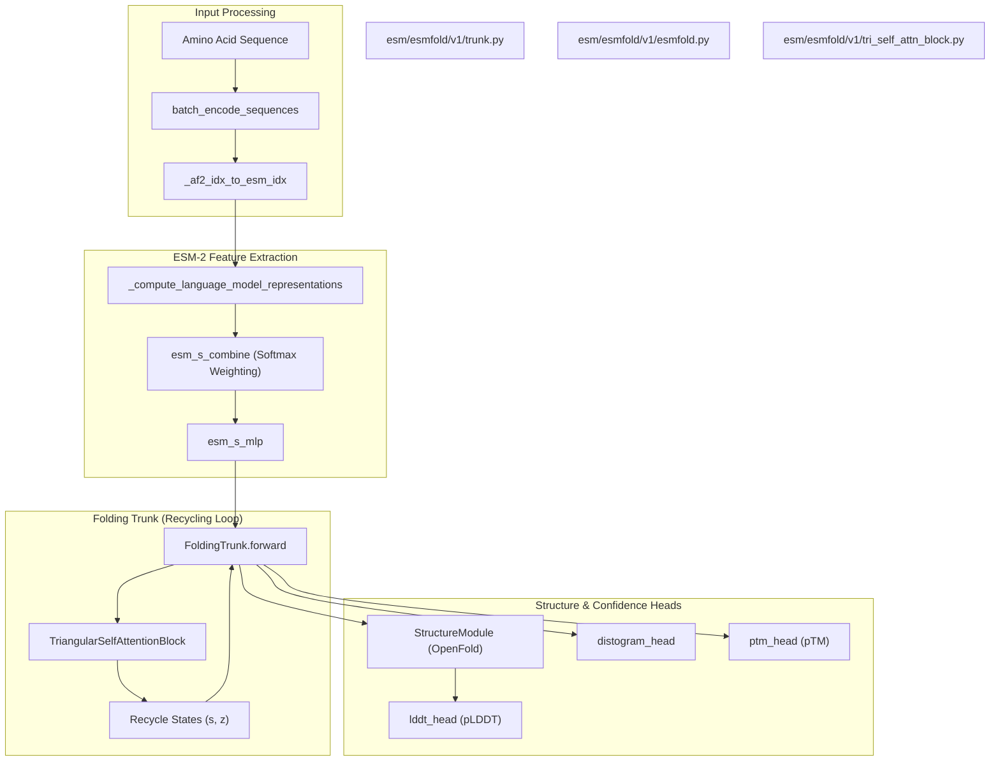
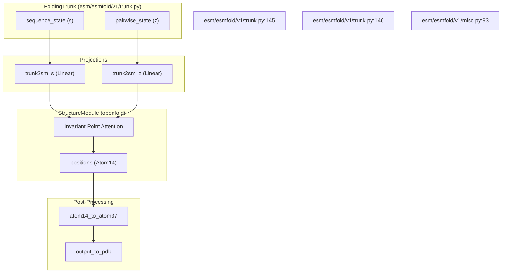

# ESMFold Architecture: FoldingTrunk and Structure Module

> **Relevant source files**
> * [environment.yml](https://github.com/MaybeBio/esmdynamic/blob/b3c7f04f/environment.yml)
> * [esm/esmdynamic/dynamic_module.py](https://github.com/MaybeBio/esmdynamic/blob/b3c7f04f/esm/esmdynamic/dynamic_module.py)
> * [esm/esmfold/v1/__init__.py](https://github.com/MaybeBio/esmdynamic/blob/b3c7f04f/esm/esmfold/v1/__init__.py)
> * [esm/esmfold/v1/categorical_mixture.py](https://github.com/MaybeBio/esmdynamic/blob/b3c7f04f/esm/esmfold/v1/categorical_mixture.py)
> * [esm/esmfold/v1/esmfold.py](https://github.com/MaybeBio/esmdynamic/blob/b3c7f04f/esm/esmfold/v1/esmfold.py)
> * [esm/esmfold/v1/misc.py](https://github.com/MaybeBio/esmdynamic/blob/b3c7f04f/esm/esmfold/v1/misc.py)
> * [esm/esmfold/v1/pretrained.py](https://github.com/MaybeBio/esmdynamic/blob/b3c7f04f/esm/esmfold/v1/pretrained.py)
> * [esm/esmfold/v1/tri_self_attn_block.py](https://github.com/MaybeBio/esmdynamic/blob/b3c7f04f/esm/esmfold/v1/tri_self_attn_block.py)
> * [esm/esmfold/v1/trunk.py](https://github.com/MaybeBio/esmdynamic/blob/b3c7f04f/esm/esmfold/v1/trunk.py)

ESMFold is a high-accuracy protein structure prediction system that operates directly from a single amino acid sequence, bypassing the need for Multiple Sequence Alignments (MSAs). It leverages the internal representations of the ESM-2 language model to generate 3D coordinates via a folding trunk and a structure module.

## Pipeline Overview and Data Flow

The ESMFold pipeline transforms raw amino acid sequences into atomic coordinates through a series of stages: language model feature extraction, representation weighting, iterative folding via a recycling loop, and final coordinate projection.

### 1. ESM-2 Representation Extraction

ESMFold utilizes a pre-trained ESM-2 model (specifically `esm2_t36_3B_UR50D`) as its base encoder [esm/esmfold/v1/esmfold.py L42-L44](https://github.com/MaybeBio/esmdynamic/blob/b3c7f04f/esm/esmfold/v1/esmfold.py#L42-L44)

. The sequence is first converted to ESM-specific tokens, adding `<BOS>` and `<EOS>` tokens [esm/esmfold/v1/esmfold.py L92-L102](https://github.com/MaybeBio/esmdynamic/blob/b3c7f04f/esm/esmfold/v1/esmfold.py#L92-L102)

. The model extracts representations from all 36 layers of ESM-2 [esm/esmfold/v1/esmfold.py L103-L108](https://github.com/MaybeBio/esmdynamic/blob/b3c7f04f/esm/esmfold/v1/esmfold.py#L103-L108)

.

### 2. Learned Layer Weighting

Instead of using only the final layer, ESMFold learns a weighted combination of all ESM-2 layers (plus the embedding layer) using a parameter `esm_s_combine` [esm/esmfold/v1/esmfold.py L50](https://github.com/MaybeBio/esmdynamic/blob/b3c7f04f/esm/esmfold/v1/esmfold.py#L50-L50)

. These weighted representations are then processed through a small MLP (`esm_s_mlp`) to initialize the sequence state $s$ [esm/esmfold/v1/esmfold.py L55-L168](https://github.com/MaybeBio/esmdynamic/blob/b3c7f04f/esm/esmfold/v1/esmfold.py#L55-L168)

.

### 3. FoldingTrunk and Recycling Loop

The core of the architecture is the `FoldingTrunk`, which processes the sequence state $s$ and a pairwise state $z$ through multiple blocks [esm/esmfold/v1/trunk.py L110-L136](https://github.com/MaybeBio/esmdynamic/blob/b3c7f04f/esm/esmfold/v1/trunk.py#L110-L136)

. To refine predictions, the trunk employs a recycling mechanism where the output states of one pass are fed back into the next pass for a fixed number of iterations (defaulting to 4) [esm/esmfold/v1/trunk.py L173-L193](https://github.com/MaybeBio/esmdynamic/blob/b3c7f04f/esm/esmfold/v1/trunk.py#L173-L193)

.

### System Entity Mapping: Data Flow

The following diagram maps the logical flow of data to the specific classes and methods within the codebase.

**Sources:** [esm/esmfold/v1/esmfold.py L33-L190](https://github.com/MaybeBio/esmdynamic/blob/b3c7f04f/esm/esmfold/v1/esmfold.py#L33-L190)

, [esm/esmfold/v1/trunk.py L110-L210](https://github.com/MaybeBio/esmdynamic/blob/b3c7f04f/esm/esmfold/v1/trunk.py#L110-L210)

, [esm/esmfold/v1/misc.py L61-L90](https://github.com/MaybeBio/esmdynamic/blob/b3c7f04f/esm/esmfold/v1/misc.py#L61-L90)

---

## FoldingTrunk Components

### TriangularSelfAttentionBlock

The `TriangularSelfAttentionBlock` is the fundamental unit of the folding trunk, responsible for updating both sequence and pairwise representations [esm/esmfold/v1/tri_self_attn_block.py L25-L34](https://github.com/MaybeBio/esmdynamic/blob/b3c7f04f/esm/esmfold/v1/tri_self_attn_block.py#L25-L34)

. It implements axial attention and triangular multiplicative updates inspired by Evoformer.

| Operation | Implementation Class / Method | Purpose |
| --- | --- | --- |
| **Sequence Update** | `seq_attention` | Self-attention on residues biased by pairwise information [esm/esmfold/v1/tri_self_attn_block.py L55-L57](https://github.com/MaybeBio/esmdynamic/blob/b3c7f04f/esm/esmfold/v1/tri_self_attn_block.py#L55-L57)   . |
| **Pairwise Bias** | `pair_to_sequence` | Projects pairwise state $z$ into a bias for sequence attention [esm/esmfold/v1/tri_self_attn_block.py L53](https://github.com/MaybeBio/esmdynamic/blob/b3c7f04f/esm/esmfold/v1/tri_self_attn_block.py#L53-L53)   . |
| **Outer Product** | `sequence_to_pair` | Updates pairwise state $z$ using information from sequence state $s$ [esm/esmfold/v1/tri_self_attn_block.py L50-L52](https://github.com/MaybeBio/esmdynamic/blob/b3c7f04f/esm/esmfold/v1/tri_self_attn_block.py#L50-L52)   . |
| **Triangular Multiplicative Update** | `tri_mul_out` / `tri_mul_in` | Updates pairs $(i, j)$ using third nodes $k$ (Outgoing/Incoming) [esm/esmfold/v1/tri_self_attn_block.py L58-L65](https://github.com/MaybeBio/esmdynamic/blob/b3c7f04f/esm/esmfold/v1/tri_self_attn_block.py#L58-L65)   . |
| **Triangular Attention** | `tri_att_start` / `tri_att_end` | Axial attention along rows and columns with triangular constraints [esm/esmfold/v1/tri_self_attn_block.py L66-L77](https://github.com/MaybeBio/esmdynamic/blob/b3c7f04f/esm/esmfold/v1/tri_self_attn_block.py#L66-L77)   . |

**Sources:** [esm/esmfold/v1/tri_self_attn_block.py L48-L170](https://github.com/MaybeBio/esmdynamic/blob/b3c7f04f/esm/esmfold/v1/tri_self_attn_block.py#L48-L170)

### RelativePosition Encoding

To provide geometric context, ESMFold uses `RelativePosition` encoding [esm/esmfold/v1/trunk.py L75-L83](https://github.com/MaybeBio/esmdynamic/blob/b3c7f04f/esm/esmfold/v1/trunk.py#L75-L83)

. It calculates the difference between residue indices, clamps them to a specified number of bins (default 32), and embeds them to bias the pairwise state [esm/esmfold/v1/trunk.py L98-L108](https://github.com/MaybeBio/esmdynamic/blob/b3c7f04f/esm/esmfold/v1/trunk.py#L98-L108)

.

### Multimer Handling (Poly-G Linkers)

ESMFold supports multimer prediction by concatenating chains using a "poly-G" linker (default 25 Glycines) [esm/esmfold/v1/misc.py L18-L29](https://github.com/MaybeBio/esmdynamic/blob/b3c7f04f/esm/esmfold/v1/misc.py#L18-L29)

. A `residue_index_offset` (default 512) is applied to the `residx` of different chains to ensure the model treats them as spatially distinct entities [esm/esmfold/v1/misc.py L37-L43](https://github.com/MaybeBio/esmdynamic/blob/b3c7f04f/esm/esmfold/v1/misc.py#L37-L43)

. A `linker_mask` is generated to prevent the model from calculating losses on the artificial linker residues [esm/esmfold/v1/misc.py L45-L58](https://github.com/MaybeBio/esmdynamic/blob/b3c7f04f/esm/esmfold/v1/misc.py#L45-L58)

.

**Sources:** [esm/esmfold/v1/misc.py L18-L58](https://github.com/MaybeBio/esmdynamic/blob/b3c7f04f/esm/esmfold/v1/misc.py#L18-L58)

, [esm/esmfold/v1/trunk.py L75-L108](https://github.com/MaybeBio/esmdynamic/blob/b3c7f04f/esm/esmfold/v1/trunk.py#L75-L108)

---

## Structure Module and Confidence Heads

### Structure Module

The final pairwise and sequence states are projected into the `StructureModule` (imported from OpenFold) [esm/esmfold/v1/trunk.py L11-L147](https://github.com/MaybeBio/esmdynamic/blob/b3c7f04f/esm/esmfold/v1/trunk.py#L11-L147)

. This module uses Invariant Point Attention (IPA) to predict the 3D coordinates of all heavy atoms [esm/esmfold/v1/trunk.py L203-L210](https://github.com/MaybeBio/esmdynamic/blob/b3c7f04f/esm/esmfold/v1/trunk.py#L203-L210)

.

### Confidence Heads (pLDDT and pTM)

ESMFold provides per-residue and global confidence metrics:

* **pLDDT Head**: A 3-layer MLP that predicts the Local Distance Difference Test (LDDT) score in 50 bins for each of the 37 atom types [esm/esmfold/v1/esmfold.py L74-L80](https://github.com/MaybeBio/esmdynamic/blob/b3c7f04f/esm/esmfold/v1/esmfold.py#L74-L80) . The final pLDDT is the mean of this categorical distribution [esm/esmfold/v1/categorical_mixture.py L41-L43](https://github.com/MaybeBio/esmdynamic/blob/b3c7f04f/esm/esmfold/v1/categorical_mixture.py#L41-L43) .
* **pTM Head**: A linear projection of the pairwise state $z$ into 64 bins, used to compute the Predicted TM-score [esm/esmfold/v1/esmfold.py L72](https://github.com/MaybeBio/esmdynamic/blob/b3c7f04f/esm/esmfold/v1/esmfold.py#L72-L72) .
* **Distogram Head**: Predicts inter-residue distances in 64 bins, primarily used during training or for structural analysis [esm/esmfold/v1/esmfold.py L71-L191](https://github.com/MaybeBio/esmdynamic/blob/b3c7f04f/esm/esmfold/v1/esmfold.py#L71-L191) .

### Entity Interaction: Folding Trunk to Structure Module

This diagram illustrates the hand-off between the trunk and the structure module.

**Sources:** [esm/esmfold/v1/trunk.py L144-L210](https://github.com/MaybeBio/esmdynamic/blob/b3c7f04f/esm/esmfold/v1/trunk.py#L144-L210)

, [esm/esmfold/v1/misc.py L93-L116](https://github.com/MaybeBio/esmdynamic/blob/b3c7f04f/esm/esmfold/v1/misc.py#L93-L116)

---

## Summary of Configurations

The architecture is highly configurable through `FoldingTrunkConfig` and `StructureModuleConfig`.

| Parameter | Default Value | Source |
| --- | --- | --- |
| `num_blocks` (Trunk) | 48 | [esm/esmfold/v1/trunk.py L38](https://github.com/MaybeBio/esmdynamic/blob/b3c7f04f/esm/esmfold/v1/trunk.py#L38-L38) |
| `sequence_state_dim` | 1024 | [esm/esmfold/v1/trunk.py L39](https://github.com/MaybeBio/esmdynamic/blob/b3c7f04f/esm/esmfold/v1/trunk.py#L39-L39) |
| `pairwise_state_dim` | 128 | [esm/esmfold/v1/trunk.py L40](https://github.com/MaybeBio/esmdynamic/blob/b3c7f04f/esm/esmfold/v1/trunk.py#L40-L40) |
| `max_recycles` | 4 | [esm/esmfold/v1/trunk.py L48](https://github.com/MaybeBio/esmdynamic/blob/b3c7f04f/esm/esmfold/v1/trunk.py#L48-L48) |
| `no_blocks` (Structure) | 8 | [esm/esmfold/v1/trunk.py L26](https://github.com/MaybeBio/esmdynamic/blob/b3c7f04f/esm/esmfold/v1/trunk.py#L26-L26) |
| `distogram_bins` | 64 | [esm/esmfold/v1/esmfold.py L40](https://github.com/MaybeBio/esmdynamic/blob/b3c7f04f/esm/esmfold/v1/esmfold.py#L40-L40) |

**Sources:** [esm/esmfold/v1/trunk.py L17-L51](https://github.com/MaybeBio/esmdynamic/blob/b3c7f04f/esm/esmfold/v1/trunk.py#L17-L51)

, [esm/esmfold/v1/esmfold.py L28-L31](https://github.com/MaybeBio/esmdynamic/blob/b3c7f04f/esm/esmfold/v1/esmfold.py#L28-L31)