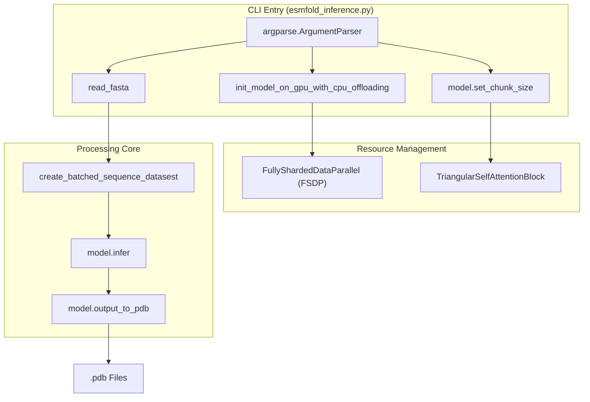
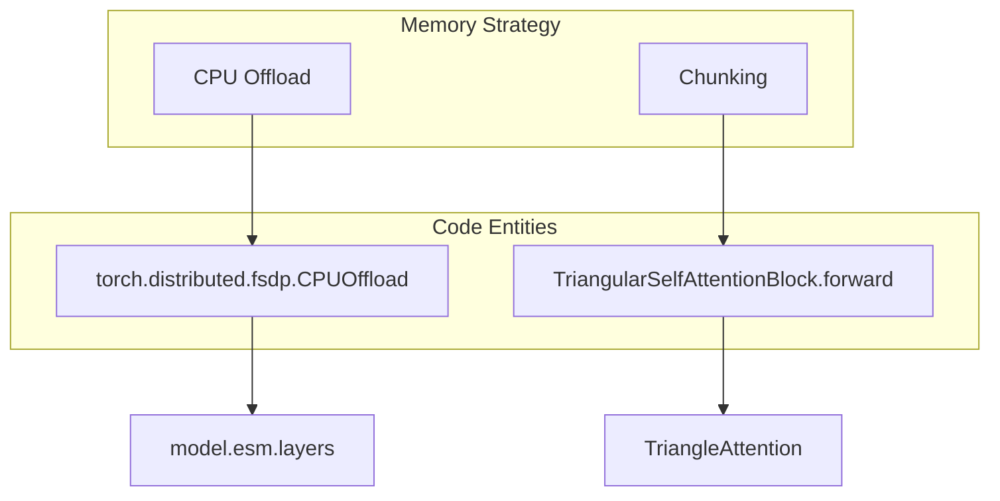

# ESMFold Inference CLI and Weight Management

> **Relevant source files**
> * [esm/esmdynamic/dynamic_module.py](https://github.com/MaybeBio/esmdynamic/blob/b3c7f04f/esm/esmdynamic/dynamic_module.py)
> * [esm/esmfold/v1/pretrained.py](https://github.com/MaybeBio/esmdynamic/blob/b3c7f04f/esm/esmfold/v1/pretrained.py)
> * [esm/esmfold/v1/tri_self_attn_block.py](https://github.com/MaybeBio/esmdynamic/blob/b3c7f04f/esm/esmfold/v1/tri_self_attn_block.py)
> * [scripts/download_weights.sh](https://github.com/MaybeBio/esmdynamic/blob/b3c7f04f/scripts/download_weights.sh)
> * [scripts/esmfold_inference.py](https://github.com/MaybeBio/esmdynamic/blob/b3c7f04f/scripts/esmfold_inference.py)

This page documents the technical implementation and usage of the ESMFold inference pipeline, specifically focusing on the `esmfold_inference.py` script and the supporting weight management utilities. It covers how the system handles large-scale protein structure prediction, memory optimization strategies like CPU offloading and axial attention chunking, and the automated retrieval of model artifacts.

## ESMFold Inference Pipeline

The primary entry point for structure prediction is `scripts/esmfold_inference.py` [scripts/esmfold_inference.py L77-L117](https://github.com/MaybeBio/esmdynamic/blob/b3c7f04f/scripts/esmfold_inference.py#L77-L117)

 This script orchestrates the loading of the ESMFold model, processes FASTA inputs, and manages GPU/CPU resources to output PDB files containing predicted atomic coordinates and confidence metrics (pLDDT and pTM).

### Data Flow and Execution Logic

The inference process follows a batch-oriented workflow designed to maximize throughput while preventing Out-of-Memory (OOM) errors.

1. **Sequence Loading**: Sequences are read from a FASTA file using `read_fasta` and sorted by length to minimize padding overhead in batches [scripts/esmfold_inference.py L124-L127](https://github.com/MaybeBio/esmdynamic/blob/b3c7f04f/scripts/esmfold_inference.py#L124-L127)
2. **Model Initialization**: The model is loaded via `esm.pretrained.esmfold_v1()`, which fetches the 3B-parameter ESM-2 based architecture [scripts/esmfold_inference.py L136](https://github.com/MaybeBio/esmdynamic/blob/b3c7f04f/scripts/esmfold_inference.py#L136-L136)
3. **Batching**: The `create_batched_sequence_datasest` generator groups sequences until a `max_tokens_per_batch` threshold is reached [scripts/esmfold_inference.py L61-L74](https://github.com/MaybeBio/esmdynamic/blob/b3c7f04f/scripts/esmfold_inference.py#L61-L74)
4. **Prediction Loop**: * The model's `infer` method is called with a list of sequences and the specified `num_recycles` [scripts/esmfold_inference.py L157](https://github.com/MaybeBio/esmdynamic/blob/b3c7f04f/scripts/esmfold_inference.py#L157-L157) * If a CUDA OOM occurs, the script logs the failure and attempts to continue with the next batch, suggesting a reduction in batch size [scripts/esmfold_inference.py L158-L171](https://github.com/MaybeBio/esmdynamic/blob/b3c7f04f/scripts/esmfold_inference.py#L158-L171)
5. **Output Generation**: Results are converted to PDB format using `model.output_to_pdb` and saved to the filesystem [scripts/esmfold_inference.py L174-L189](https://github.com/MaybeBio/esmdynamic/blob/b3c7f04f/scripts/esmfold_inference.py#L174-L189)

### Inference System Components

The following diagram maps the CLI arguments and internal logic to the specific code entities responsible for execution.

**Inference Logic to Code Mapping**

Sources: [scripts/esmfold_inference.py L33-L58](https://github.com/MaybeBio/esmdynamic/blob/b3c7f04f/scripts/esmfold_inference.py#L33-L58)

 [scripts/esmfold_inference.py L61-L74](https://github.com/MaybeBio/esmdynamic/blob/b3c7f04f/scripts/esmfold_inference.py#L61-L74)

 [scripts/esmfold_inference.py L157-L174](https://github.com/MaybeBio/esmdynamic/blob/b3c7f04f/scripts/esmfold_inference.py#L157-L174)

---

## Memory Optimization Strategies

ESMFold is a large model (3B parameters) and requires significant VRAM, especially for long sequences. The inference script provides two primary mechanisms to mitigate memory constraints.

### CPU Offloading via FSDP

When the `--cpu-offload` flag is used, the script utilizes `FullyShardedDataParallel` (FSDP) to offload model parameters to CPU RAM, only moving them to the GPU during the forward pass [scripts/esmfold_inference.py L33-L49](https://github.com/MaybeBio/esmdynamic/blob/b3c7f04f/scripts/esmfold_inference.py#L33-L49)

* **Implementation**: The `enable_cpu_offloading` function initializes a single-node distributed process group and wraps each layer of the ESM-2 backbone in an FSDP wrapper with `offload_params=True` [scripts/esmfold_inference.py L37-L47](https://github.com/MaybeBio/esmdynamic/blob/b3c7f04f/scripts/esmfold_inference.py#L37-L47)
* **Initialization**: The ESM-2 component is offloaded while the rest of the Folding Trunk and Structure Module remain on the GPU [scripts/esmfold_inference.py L52-L58](https://github.com/MaybeBio/esmdynamic/blob/b3c7f04f/scripts/esmfold_inference.py#L52-L58)

### Axial Attention Chunking

The `--chunk-size` argument addresses the $O(L^2)$ memory scaling of the Folding Trunk's attention mechanisms.

* **Mechanism**: The `TriangularSelfAttentionBlock` uses this parameter to chunk computations in `TriangleAttentionStartingNode` and `TriangleAttentionEndingNode` [esm/esmfold/v1/tri_self_attn_block.py L157-L164](https://github.com/MaybeBio/esmdynamic/blob/b3c7f04f/esm/esmfold/v1/tri_self_attn_block.py#L157-L164)
* **Effect**: It converts a large matrix operation into a loop over smaller chunks, reducing peak memory usage at the cost of execution speed [scripts/esmfold_inference.py L107-L114](https://github.com/MaybeBio/esmdynamic/blob/b3c7f04f/scripts/esmfold_inference.py#L107-L114)

**Memory Optimization Flow**

Sources: [scripts/esmfold_inference.py L33-L49](https://github.com/MaybeBio/esmdynamic/blob/b3c7f04f/scripts/esmfold_inference.py#L33-L49)

 [esm/esmfold/v1/tri_self_attn_block.py L156-L166](https://github.com/MaybeBio/esmdynamic/blob/b3c7f04f/esm/esmfold/v1/tri_self_attn_block.py#L156-L166)

---

## Weight Management and Model Loading

ESMFold weights are managed through a combination of `torch.hub` and a dedicated shell utility.

### download_weights.sh

The `scripts/download_weights.sh` utility automates the retrieval of model artifacts from the official ESM repository.

* **Functionality**: It parses the `README.md` to find `fair-esm/models` URLs and uses `aria2c` for high-speed, resumable downloads [scripts/download_weights.sh L7-L10](https://github.com/MaybeBio/esmdynamic/blob/b3c7f04f/scripts/download_weights.sh#L7-L10)  [scripts/download_weights.sh L29-L48](https://github.com/MaybeBio/esmdynamic/blob/b3c7f04f/scripts/download_weights.sh#L29-L48)
* **Regression Weights**: The script also attempts to guess and download contact regression weights (e.g., `-contact-regression.pt`) required for certain auxiliary heads [scripts/download_weights.sh L40-L53](https://github.com/MaybeBio/esmdynamic/blob/b3c7f04f/scripts/download_weights.sh#L40-L53)

### Pretrained Model Loader

The `esm.esmfold.v1.pretrained` module handles the instantiation of models from saved state dicts.

| Function | Model Version | Description |
| --- | --- | --- |
| `esmfold_v0()` | `esmfold_3B_v0` | Model used in the original Lin et al. (2022) paper [esm/esmfold/v1/pretrained.py L36-L43](https://github.com/MaybeBio/esmdynamic/blob/b3c7f04f/esm/esmfold/v1/pretrained.py#L36-L43) |
| `esmfold_v1()` | `esmfold_3B_v1` | Updated production version with 3B ESM-2 backbone [esm/esmfold/v1/pretrained.py L46-L54](https://github.com/MaybeBio/esmdynamic/blob/b3c7f04f/esm/esmfold/v1/pretrained.py#L46-L54) |

The `_load_model` function performs a strictness check on keys, ensuring that all essential Folding Trunk weights are present while allowing flexibility for the `esm.` (language model) prefix to accommodate different loading paths [esm/esmfold/v1/pretrained.py L8-L33](https://github.com/MaybeBio/esmdynamic/blob/b3c7f04f/esm/esmfold/v1/pretrained.py#L8-L33)

Sources: [scripts/download_weights.sh L1-L60](https://github.com/MaybeBio/esmdynamic/blob/b3c7f04f/scripts/download_weights.sh#L1-L60)

 [esm/esmfold/v1/pretrained.py L1-L54](https://github.com/MaybeBio/esmdynamic/blob/b3c7f04f/esm/esmfold/v1/pretrained.py#L1-L54)