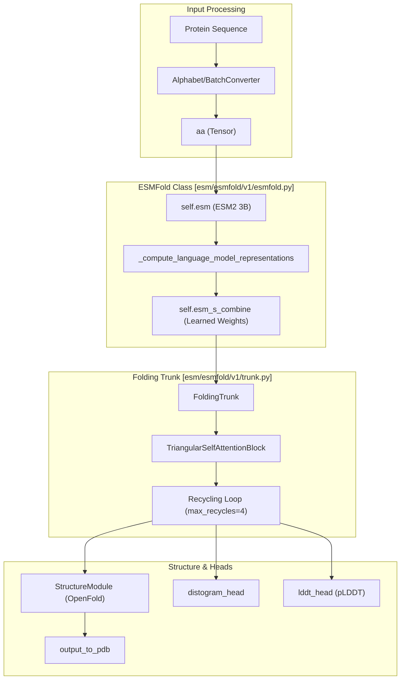

# ESMFold: Protein Structure Prediction

> **Relevant source files**
> * [esm/esmdynamic/dynamic_module.py](https://github.com/MaybeBio/esmdynamic/blob/b3c7f04f/esm/esmdynamic/dynamic_module.py)
> * [esm/esmfold/v1/esmfold.py](https://github.com/MaybeBio/esmdynamic/blob/b3c7f04f/esm/esmfold/v1/esmfold.py)
> * [esm/esmfold/v1/pretrained.py](https://github.com/MaybeBio/esmdynamic/blob/b3c7f04f/esm/esmfold/v1/pretrained.py)
> * [esm/esmfold/v1/tri_self_attn_block.py](https://github.com/MaybeBio/esmdynamic/blob/b3c7f04f/esm/esmfold/v1/tri_self_attn_block.py)
> * [esm/esmfold/v1/trunk.py](https://github.com/MaybeBio/esmdynamic/blob/b3c7f04f/esm/esmfold/v1/trunk.py)

ESMFold is a high-accuracy end-to-end protein structure prediction system that operates directly from a single amino acid sequence. Unlike traditional methods like AlphaFold2, ESMFold does not require Multiple Sequence Alignments (MSAs) or structural templates at inference time. Instead, it leverages the rich evolutionary and structural information captured within the **ESM-2** language model to predict 3D atomic coordinates.

### System Overview

The ESMFold pipeline consists of three primary stages:

1. **Language Model Representation**: The input sequence is processed by a pre-trained ESM-2 model (typically the 3B parameter variant) to extract per-residue embeddings and attention maps [esm/esmfold/v1/esmfold.py L42-L50](https://github.com/MaybeBio/esmdynamic/blob/b3c7f04f/esm/esmfold/v1/esmfold.py#L42-L50)
2. **Folding Trunk**: A series of transformer-like blocks that refine sequence and pairwise representations through a recycling loop [esm/esmfold/v1/trunk.py L110-L143](https://github.com/MaybeBio/esmdynamic/blob/b3c7f04f/esm/esmfold/v1/trunk.py#L110-L143)
3. **Structure Module**: A geometry-aware module that converts refined representations into 3D atomic coordinates (frames and positions) [esm/esmfold/v1/trunk.py L203-L205](https://github.com/MaybeBio/esmdynamic/blob/b3c7f04f/esm/esmfold/v1/trunk.py#L203-L205)

### High-Level Data Flow

The following diagram illustrates how the `ESMFold` class orchestrates the prediction process, mapping high-level concepts to specific code entities.

**ESMFold Component Architecture**

**Sources:** [esm/esmfold/v1/esmfold.py L33-L80](https://github.com/MaybeBio/esmdynamic/blob/b3c7f04f/esm/esmfold/v1/esmfold.py#L33-L80)

 [esm/esmfold/v1/trunk.py L110-L150](https://github.com/MaybeBio/esmdynamic/blob/b3c7f04f/esm/esmfold/v1/trunk.py#L110-L150)

---

### Key Components

#### 1. Folding Trunk and Internal Architecture

The `FoldingTrunk` is the computational core of ESMFold. It processes sequence features ($s$) and pairwise features ($z$) through multiple `TriangularSelfAttentionBlock` layers [esm/esmfold/v1/trunk.py L125-L136](https://github.com/MaybeBio/esmdynamic/blob/b3c7f04f/esm/esmfold/v1/trunk.py#L125-L136)

 This architecture implements axial attention and triangular multiplicative updates to maintain physical constraints in the pairwise representation space [esm/esmfold/v1/tri_self_attn_block.py L55-L77](https://github.com/MaybeBio/esmdynamic/blob/b3c7f04f/esm/esmfold/v1/tri_self_attn_block.py#L55-L77)

* **Recycling**: ESMFold uses a recycling mechanism where the output of the trunk is fed back into the input for a specified number of iterations (defaulting to 4) to iteratively refine the structure [esm/esmfold/v1/trunk.py L193-L201](https://github.com/MaybeBio/esmdynamic/blob/b3c7f04f/esm/esmfold/v1/trunk.py#L193-L201)
* **Relative Position**: Spatial relationships are encoded using `RelativePosition` bins to provide the model with a sense of sequence distance [esm/esmfold/v1/trunk.py L75-L107](https://github.com/MaybeBio/esmdynamic/blob/b3c7f04f/esm/esmfold/v1/trunk.py#L75-L107)

For a deep dive into the transformer blocks, recycling logic, and the Structure Module, see **[ESMFold Architecture: FoldingTrunk and Structure Module](/MaybeBio/esmdynamic/3.1-esmfold-architecture:-foldingtrunk-and-structure-module)**.

#### 2. Inference and Weight Management

Running ESMFold requires specific pre-trained weights for both the ESM-2 backbone and the folding trunk. The repository provides a versioning system for these weights, including `esmfold_v0` (paper version) and `esmfold_v1` [esm/esmfold/v1/pretrained.py L36-L54](https://github.com/MaybeBio/esmdynamic/blob/b3c7f04f/esm/esmfold/v1/pretrained.py#L36-L54)

* **CLI Tools**: The system includes scripts for batch processing FASTA files and managing GPU memory via `--chunk-size` and `--cpu-offload` [esm/esmfold/v1/trunk.py L150-L155](https://github.com/MaybeBio/esmdynamic/blob/b3c7f04f/esm/esmfold/v1/trunk.py#L150-L155)
* **Weight Loading**: The `_load_model` utility handles automatic downloading of weights from Facebook's public servers [esm/esmfold/v1/pretrained.py L8-L14](https://github.com/MaybeBio/esmdynamic/blob/b3c7f04f/esm/esmfold/v1/pretrained.py#L8-L14)

For details on command-line arguments and setting up the environment, see **[ESMFold Inference CLI and Weight Management](/MaybeBio/esmdynamic/3.2-esmfold-inference-cli-and-weight-management)**.

#### 3. The Metagenomic Atlas

The ESM Metagenomic Atlas is a massive dataset of 617 million predicted protein structures, many of which lack homologs in traditional databases. This atlas was generated using ESMFold to provide the first high-resolution view into the "dark matter" of the protein universe.

* **Scale**: Includes structures for nearly all sequences in the MGnify30 database.
* **Access**: Data is indexed via `stats.parquet` files and distributed as Foldseek-compatible databases for rapid structural search.

For information on accessing the atlas and the clustering pipeline used to generate it, see **[ESM Metagenomic Atlas](/MaybeBio/esmdynamic/3.3-esm-metagenomic-atlas)**.

---

### Code Mapping: Data Structures

The following table relates the physical tensors used in the code to their biological and structural meanings.

| Code Entity | File Path | Role |
| --- | --- | --- |
| `s_s` | [esm/esmfold/v1/tri_self_attn_block.py L109](https://github.com/MaybeBio/esmdynamic/blob/b3c7f04f/esm/esmfold/v1/tri_self_attn_block.py#L109-L109) | Sequence state tensor (B x L x C) representing per-residue information. |
| `s_z` | [esm/esmfold/v1/tri_self_attn_block.py L110](https://github.com/MaybeBio/esmdynamic/blob/b3c7f04f/esm/esmfold/v1/tri_self_attn_block.py#L110-L110) | Pairwise state tensor (B x L x L x C) representing residue-residue relationships. |
| `TriangularSelfAttentionBlock` | [esm/esmfold/v1/tri_self_attn_block.py L25](https://github.com/MaybeBio/esmdynamic/blob/b3c7f04f/esm/esmfold/v1/tri_self_attn_block.py#L25-L25) | The fundamental building block of the folding trunk. |
| `distogram_head` | [esm/esmfold/v1/esmfold.py L71](https://github.com/MaybeBio/esmdynamic/blob/b3c7f04f/esm/esmfold/v1/esmfold.py#L71-L71) | Linear layer predicting the distance distribution between residues. |
| `lddt_head` | [esm/esmfold/v1/esmfold.py L75](https://github.com/MaybeBio/esmdynamic/blob/b3c7f04f/esm/esmfold/v1/esmfold.py#L75-L75) | Predicts the per-residue confidence score (pLDDT). |

**Sources:** [esm/esmfold/v1/esmfold.py L33-L80](https://github.com/MaybeBio/esmdynamic/blob/b3c7f04f/esm/esmfold/v1/esmfold.py#L33-L80)

 [esm/esmfold/v1/tri_self_attn_block.py L25-L105](https://github.com/MaybeBio/esmdynamic/blob/b3c7f04f/esm/esmfold/v1/tri_self_attn_block.py#L25-L105)