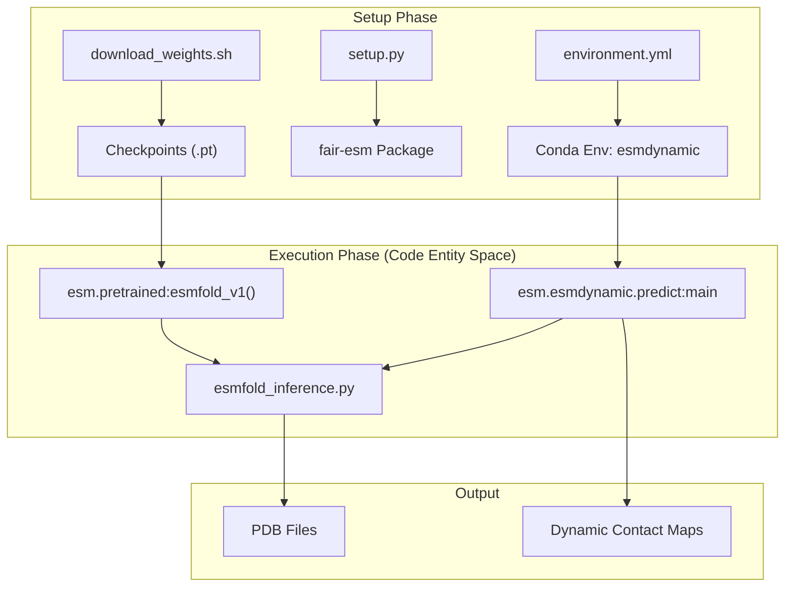
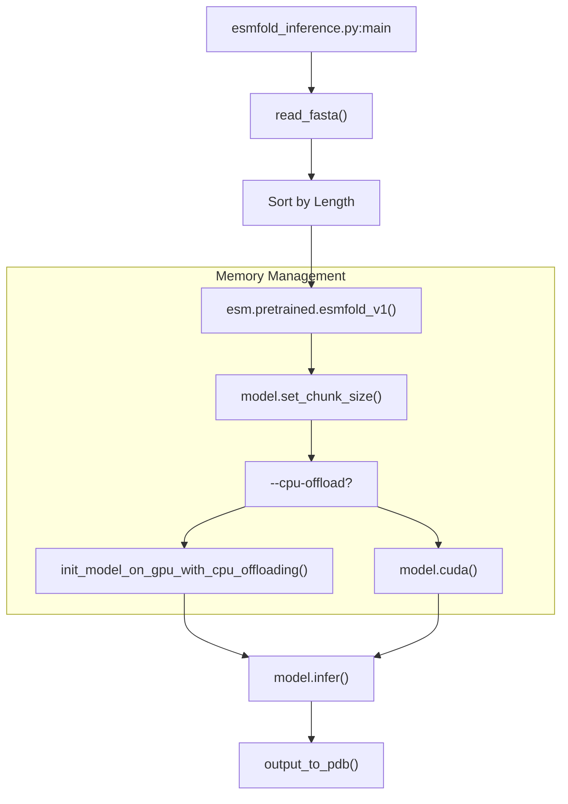

# Getting Started: Installation and Environment Setup

> **Relevant source files**
> * [.flake8](https://github.com/MaybeBio/esmdynamic/blob/b3c7f04f/.flake8)
> * [.gitignore](https://github.com/MaybeBio/esmdynamic/blob/b3c7f04f/.gitignore)
> * [LICENSE](https://github.com/MaybeBio/esmdynamic/blob/b3c7f04f/LICENSE)
> * [environment.yml](https://github.com/MaybeBio/esmdynamic/blob/b3c7f04f/environment.yml)
> * [esm/esmdynamic/__init__.py](https://github.com/MaybeBio/esmdynamic/blob/b3c7f04f/esm/esmdynamic/__init__.py)
> * [esm/esmdynamic/training/__init__.py](https://github.com/MaybeBio/esmdynamic/blob/b3c7f04f/esm/esmdynamic/training/__init__.py)
> * [esm/esmfold/v1/__init__.py](https://github.com/MaybeBio/esmdynamic/blob/b3c7f04f/esm/esmfold/v1/__init__.py)
> * [esm/esmfold/v1/categorical_mixture.py](https://github.com/MaybeBio/esmdynamic/blob/b3c7f04f/esm/esmfold/v1/categorical_mixture.py)
> * [esm/esmfold/v1/misc.py](https://github.com/MaybeBio/esmdynamic/blob/b3c7f04f/esm/esmfold/v1/misc.py)
> * [hubconf.py](https://github.com/MaybeBio/esmdynamic/blob/b3c7f04f/hubconf.py)
> * [pyproject.toml](https://github.com/MaybeBio/esmdynamic/blob/b3c7f04f/pyproject.toml)
> * [scripts/download_weights.sh](https://github.com/MaybeBio/esmdynamic/blob/b3c7f04f/scripts/download_weights.sh)
> * [scripts/esmfold_inference.py](https://github.com/MaybeBio/esmdynamic/blob/b3c7f04f/scripts/esmfold_inference.py)
> * [setup.py](https://github.com/MaybeBio/esmdynamic/blob/b3c7f04f/setup.py)

This page provides a comprehensive guide for setting up the **ESMDynamic** environment, installing necessary dependencies, and managing pretrained weights. The repository is an extension of the Evolutionary Scale Modeling (ESM) ecosystem, specifically designed for predicting protein dynamics, contact occupancy, and kinetics.

## Environment Configuration

ESMDynamic requires a specific set of dependencies, including `torch`, `biopython`, and components from the OpenFold ecosystem. The project provides two primary methods for environment setup: Conda and Pip.

### Conda Environment Setup

The `environment.yml` file defines a complete environment with CUDA 12.6 support and all required Python packages.

1. **Create the environment**: ```sql conda env create -f environment.ymlconda activate esmdynamic ```
2. **Key Dependencies**: * **Base**: `python=3.11`, `torch=2.7.1`, `cuda-toolkit=12.6.3` [environment.yml L55-L115](https://github.com/MaybeBio/esmdynamic/blob/b3c7f04f/environment.yml#L55-L115) * **Structural Modules**: `biopython==1.85`, `openfold==1.0.1`, `dm-tree==0.1.9` [environment.yml L137-L180](https://github.com/MaybeBio/esmdynamic/blob/b3c7f04f/environment.yml#L137-L180) * **Dynamics/Visualization**: `scipy==1.16.0`, `matplotlib==3.10.3`, `py3dmol==2.5.0` [environment.yml L156-L191](https://github.com/MaybeBio/esmdynamic/blob/b3c7f04f/environment.yml#L156-L191)

### Pip Installation and Extras

The `setup.py` script manages the package installation. Because ESMDynamic builds upon ESMFold, it includes an `esmfold` extra to handle requirements that are not automatically installed by pip for certain sub-dependencies.

```markdown
# Standard installationpip install . # Installation with ESMFold support (required for dynamics prediction)pip install ".[esmfold]"
```

The `esmfold` extra includes critical packages for structural inference: `deepspeed`, `pytorch-lightning`, `omegaconf`, `ml-collections`, and `einops` [setup.py L13-L24](https://github.com/MaybeBio/esmdynamic/blob/b3c7f04f/setup.py#L13-L24)

Sources: [environment.yml L1-L205](https://github.com/MaybeBio/esmdynamic/blob/b3c7f04f/environment.yml#L1-L205)

 [setup.py L1-L43](https://github.com/MaybeBio/esmdynamic/blob/b3c7f04f/setup.py#L1-L43)

---

## Pretrained Weights Management

ESMDynamic relies on pretrained weights from the ESM-2 and ESMFold models, as well as specific dynamic head weights.

### The Download Script

The repository includes a utility script `scripts/download_weights.sh` to automate the retrieval of model artifacts. It uses `aria2c` for high-speed, resumable downloads [scripts/download_weights.sh L7-L10](https://github.com/MaybeBio/esmdynamic/blob/b3c7f04f/scripts/download_weights.sh#L7-L10)

**Usage**:

```
bash scripts/download_weights.sh /path/to/desired/weights/directory
```

### Model Weight Structure

The script parses the repository's `README.md` to identify URLs for:

1. **Core Model Weights**: Standard `.pt` files for ESM-2 and ESMFold [scripts/download_weights.sh L29-L48](https://github.com/MaybeBio/esmdynamic/blob/b3c7f04f/scripts/download_weights.sh#L29-L48)
2. **Regression Weights**: Specifically for contact regression, identified by the `-contact-regression.pt` suffix [scripts/download_weights.sh L40-L53](https://github.com/MaybeBio/esmdynamic/blob/b3c7f04f/scripts/download_weights.sh#L40-L53)

### Weight Loading Logic

Weights are typically loaded via the `esm.pretrained` entry points defined in `hubconf.py`, which supports models ranging from ESM-2 8M to 15B parameters, as well as `esmfold_v1` [hubconf.py L8-L32](https://github.com/MaybeBio/esmdynamic/blob/b3c7f04f/hubconf.py#L8-L32)

Sources: [scripts/download_weights.sh L1-L60](https://github.com/MaybeBio/esmdynamic/blob/b3c7f04f/scripts/download_weights.sh#L1-L60)

 [hubconf.py L1-L32](https://github.com/MaybeBio/esmdynamic/blob/b3c7f04f/hubconf.py#L1-L32)

---

## System Architecture: From Setup to Inference

The following diagram illustrates the flow from environment configuration to the execution of the `run_esmdynamic` entry point.

### Environment and Entry Point Mapping

| Component | Implementation | Description |
| --- | --- | --- |
| **CLI Entry Point** | `run_esmdynamic` | Mapped to `esm.esmdynamic.predict:main` [setup.py L40](https://github.com/MaybeBio/esmdynamic/blob/b3c7f04f/setup.py#L40-L40) |
| **Package Layout** | `esm/esmdynamic` | Contains core logic for dynamics prediction [setup.py L34](https://github.com/MaybeBio/esmdynamic/blob/b3c7f04f/setup.py#L34-L34) |
| **Inference Script** | `esmfold_inference.py` | Handles structural prediction and PDB generation [scripts/esmfold_inference.py L77](https://github.com/MaybeBio/esmdynamic/blob/b3c7f04f/scripts/esmfold_inference.py#L77-L77) |

### Data Flow: Installation to First Inference



Sources: [setup.py L34-L42](https://github.com/MaybeBio/esmdynamic/blob/b3c7f04f/setup.py#L34-L42)

 [scripts/download_weights.sh L26-L28](https://github.com/MaybeBio/esmdynamic/blob/b3c7f04f/scripts/download_weights.sh#L26-L28)

 [scripts/esmfold_inference.py L136-L174](https://github.com/MaybeBio/esmdynamic/blob/b3c7f04f/scripts/esmfold_inference.py#L136-L174)

---

## Running Your First Inference

Once the environment is set up and weights are downloaded, you can run structural or dynamic predictions.

### Structural Inference (ESMFold)

The `scripts/esmfold_inference.py` script provides a high-level interface for folding sequences from a FASTA file.

**Key Arguments**:

* `-i / --fasta`: Input sequences [scripts/esmfold_inference.py L81](https://github.com/MaybeBio/esmdynamic/blob/b3c7f04f/scripts/esmfold_inference.py#L81-L81)
* `-o / --pdb`: Output directory for PDB files [scripts/esmfold_inference.py L87](https://github.com/MaybeBio/esmdynamic/blob/b3c7f04f/scripts/esmfold_inference.py#L87-L87)
* `--cpu-offload`: Enables `FullyShardedDataParallel` (FSDP) CPU offloading for large models [scripts/esmfold_inference.py L116](https://github.com/MaybeBio/esmdynamic/blob/b3c7f04f/scripts/esmfold_inference.py#L116-L116)
* `--chunk-size`: Reduces memory usage for axial attention from $O(L^2)$ to $O(L)$ [scripts/esmfold_inference.py L107](https://github.com/MaybeBio/esmdynamic/blob/b3c7f04f/scripts/esmfold_inference.py#L107-L107)

### Memory Optimization Logic

For users with limited GPU memory, the codebase implements several optimization strategies:

1. **CPU Offloading**: Uses `enable_cpu_offloading` to wrap model layers with `FullyShardedDataParallel` and `CPUOffload` [scripts/esmfold_inference.py L33-L49](https://github.com/MaybeBio/esmdynamic/blob/b3c7f04f/scripts/esmfold_inference.py#L33-L49)
2. **Dynamic Batching**: The `create_batched_sequence_datasest` function groups sequences based on `max_tokens_per_batch` to prevent OOM errors [scripts/esmfold_inference.py L61-L74](https://github.com/MaybeBio/esmdynamic/blob/b3c7f04f/scripts/esmfold_inference.py#L61-L74)

### Logic Flow for Inference Initialization



Sources: [scripts/esmfold_inference.py L33-L58](https://github.com/MaybeBio/esmdynamic/blob/b3c7f04f/scripts/esmfold_inference.py#L33-L58)

 [scripts/esmfold_inference.py L126-L157](https://github.com/MaybeBio/esmdynamic/blob/b3c7f04f/scripts/esmfold_inference.py#L126-L157)

 [esm/esmfold/v1/misc.py L93-L116](https://github.com/MaybeBio/esmdynamic/blob/b3c7f04f/esm/esmfold/v1/misc.py#L93-L116)