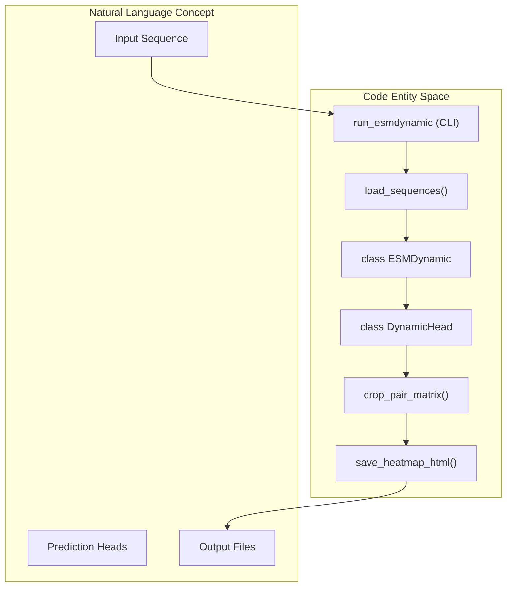
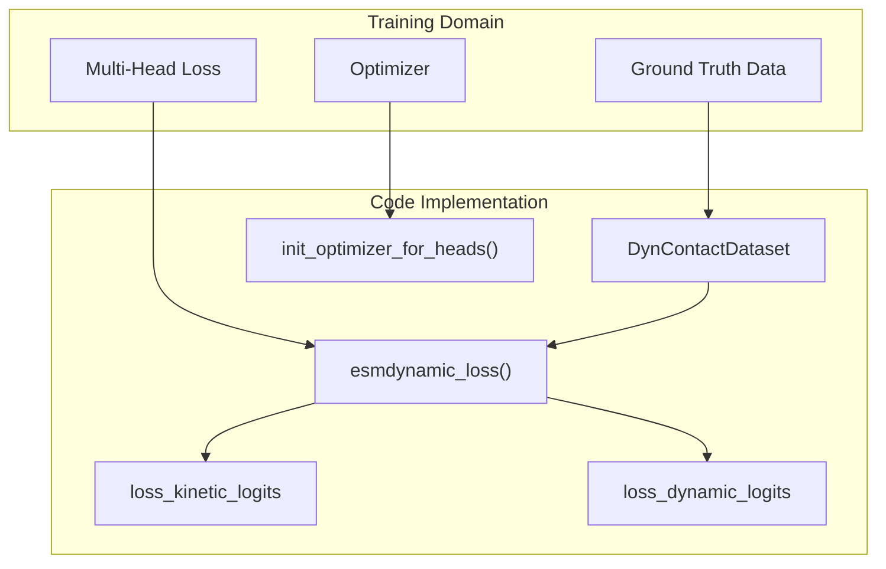

# Glossary

> **Relevant source files**
> * [Dockerfile](https://github.com/MaybeBio/esmdynamic/blob/b3c7f04f/Dockerfile)
> * [README.md](https://github.com/MaybeBio/esmdynamic/blob/b3c7f04f/README.md?plain=1)
> * [esm/data.py](https://github.com/MaybeBio/esmdynamic/blob/b3c7f04f/esm/data.py)
> * [esm/esmdynamic/dynamic_module.py](https://github.com/MaybeBio/esmdynamic/blob/b3c7f04f/esm/esmdynamic/dynamic_module.py)
> * [esm/esmdynamic/esmdynamic.py](https://github.com/MaybeBio/esmdynamic/blob/b3c7f04f/esm/esmdynamic/esmdynamic.py)
> * [esm/esmdynamic/predict.py](https://github.com/MaybeBio/esmdynamic/blob/b3c7f04f/esm/esmdynamic/predict.py)
> * [esm/esmdynamic/pretrained.py](https://github.com/MaybeBio/esmdynamic/blob/b3c7f04f/esm/esmdynamic/pretrained.py)
> * [esm/esmdynamic/training/data_reader.py](https://github.com/MaybeBio/esmdynamic/blob/b3c7f04f/esm/esmdynamic/training/data_reader.py)
> * [esm/esmdynamic/training/loss.py](https://github.com/MaybeBio/esmdynamic/blob/b3c7f04f/esm/esmdynamic/training/loss.py)
> * [esm/esmdynamic/training/train.py](https://github.com/MaybeBio/esmdynamic/blob/b3c7f04f/esm/esmdynamic/training/train.py)
> * [esm/esmfold/v1/esmfold.py](https://github.com/MaybeBio/esmdynamic/blob/b3c7f04f/esm/esmfold/v1/esmfold.py)
> * [esm/esmfold/v1/pretrained.py](https://github.com/MaybeBio/esmdynamic/blob/b3c7f04f/esm/esmfold/v1/pretrained.py)
> * [esm/esmfold/v1/tri_self_attn_block.py](https://github.com/MaybeBio/esmdynamic/blob/b3c7f04f/esm/esmfold/v1/tri_self_attn_block.py)
> * [esm/esmfold/v1/trunk.py](https://github.com/MaybeBio/esmdynamic/blob/b3c7f04f/esm/esmfold/v1/trunk.py)
> * [esm/pretrained.py](https://github.com/MaybeBio/esmdynamic/blob/b3c7f04f/esm/pretrained.py)
> * [examples/inverse_folding/README.md](https://github.com/MaybeBio/esmdynamic/blob/b3c7f04f/examples/inverse_folding/README.md?plain=1)
> * [examples/inverse_folding/sample_sequences.py](https://github.com/MaybeBio/esmdynamic/blob/b3c7f04f/examples/inverse_folding/sample_sequences.py)
> * [output_interpretation.md](https://github.com/MaybeBio/esmdynamic/blob/b3c7f04f/output_interpretation.md?plain=1)
> * [scripts/atlas/README.md](https://github.com/MaybeBio/esmdynamic/blob/b3c7f04f/scripts/atlas/README.md?plain=1)
> * [scripts/extract.py](https://github.com/MaybeBio/esmdynamic/blob/b3c7f04f/scripts/extract.py)
> * [tests/test_alphabet.py](https://github.com/MaybeBio/esmdynamic/blob/b3c7f04f/tests/test_alphabet.py)
> * [tests/test_readme.py](https://github.com/MaybeBio/esmdynamic/blob/b3c7f04f/tests/test_readme.py)

This page provides technical definitions for terms and components specific to the ESMDynamic and ESMFold codebase. It bridges the gap between biological concepts and their specific implementations in the Python source code.

## Core ESMDynamic Components

### DynamicHead

A unified neural network head used for predicting dynamic properties from protein representations. It supports multiple task types including classification (dynamic vs. native contacts), regression (contact frequency), and kinetics.

* **Implementation**: `DynamicHead` in [esm/esmdynamic/esmdynamic.py L32-L118](https://github.com/MaybeBio/esmdynamic/blob/b3c7f04f/esm/esmdynamic/esmdynamic.py#L32-L118)
* **Data Flow**: It accepts sequence and pairwise states from the `FoldingTrunk`, processes them through a `DynamicModule`, and applies task-specific linear layers.
* **Key Attributes**: * `seq_transition`: Bias terms for sequence features [esm/esmdynamic/esmdynamic.py L67-L71](https://github.com/MaybeBio/esmdynamic/blob/b3c7f04f/esm/esmdynamic/esmdynamic.py#L67-L71) * `pair_transition`: Bias terms for pairwise features [esm/esmdynamic/esmdynamic.py L72-L76](https://github.com/MaybeBio/esmdynamic/blob/b3c7f04f/esm/esmdynamic/esmdynamic.py#L72-L76) * `confidence_head`: Predicts per-residue, per-temperature accuracy [esm/esmdynamic/esmdynamic.py L97-L103](https://github.com/MaybeBio/esmdynamic/blob/b3c7f04f/esm/esmdynamic/esmdynamic.py#L97-L103)

### DynamicModule

A specialized module within the `DynamicHead` that performs iterative updates on sequence and pair representations, similar to the `FoldingTrunk` but optimized for dynamic contact prediction.

* **Implementation**: [esm/esmdynamic/esmdynamic.py L79](https://github.com/MaybeBio/esmdynamic/blob/b3c7f04f/esm/esmdynamic/esmdynamic.py#L79-L79)
* **Config**: Defined via `DynamicModuleConfig` [esm/esmdynamic/esmdynamic.py L21](https://github.com/MaybeBio/esmdynamic/blob/b3c7f04f/esm/esmdynamic/esmdynamic.py#L21-L21)

### Kinetics Prediction

The task of predicting the transition rates (on-time and off-time) for protein contacts across multiple temperatures.

* **Classes**: Categorized into 6 bins for both "on" and "off" states (e.g., `1to10ns`, `always_on`) [esm/esmdynamic/predict.py L17-L33](https://github.com/MaybeBio/esmdynamic/blob/b3c7f04f/esm/esmdynamic/predict.py#L17-L33)
* **Symmetry**: The model enforces symmetry in kinetic predictions across residue pairs [esm/esmdynamic/esmdynamic.py L154](https://github.com/MaybeBio/esmdynamic/blob/b3c7f04f/esm/esmdynamic/esmdynamic.py#L154-L154)

## Data and Training Entities

### DynContactDataset

A PyTorch dataset implementation for training ESMDynamic models. It handles loading protein sequences and their corresponding dynamic contact ground truth files.

* **Implementation**: [esm/esmdynamic/training/data_reader.py L10-L132](https://github.com/MaybeBio/esmdynamic/blob/b3c7f04f/esm/esmdynamic/training/data_reader.py#L10-L132)
* **Artifacts**: * `dynamic_contacts.pt`: Shape `[5, L, L]` representing contact probabilities at 5 temperatures [esm/esmdynamic/training/data_reader.py L28-L31](https://github.com/MaybeBio/esmdynamic/blob/b3c7f04f/esm/esmdynamic/training/data_reader.py#L28-L31) * `kinetics.pt`: Shape `[5, 2, L, L]` representing kinetic rate bins [esm/esmdynamic/training/data_reader.py L33-L35](https://github.com/MaybeBio/esmdynamic/blob/b3c7f04f/esm/esmdynamic/training/data_reader.py#L33-L35) * `frequency.pt`: Shape `[5, L, L]` representing contact frequency [esm/esmdynamic/training/data_reader.py L37-L39](https://github.com/MaybeBio/esmdynamic/blob/b3c7f04f/esm/esmdynamic/training/data_reader.py#L37-L39)

### Focal Loss

A specialized loss function used for `dynamic_logits` to address class imbalance between contact and non-contact residues.

* **Implementation**: `loss_dynamic_logits` utilizing `sigmoid_focal_loss` [esm/esmdynamic/training/loss.py L38-L54](https://github.com/MaybeBio/esmdynamic/blob/b3c7f04f/esm/esmdynamic/training/loss.py#L38-L54)

## System Architecture Mapping

### Natural Language to Code Entity Space

The following diagram maps the logical components of the ESMDynamic inference pipeline to their specific code identifiers.

**Diagram: Inference Pipeline Mapping**

*Sources: [esm/esmdynamic/predict.py L36-L110](https://github.com/MaybeBio/esmdynamic/blob/b3c7f04f/esm/esmdynamic/predict.py#L36-L110)

 [esm/esmdynamic/predict.py L113-L127](https://github.com/MaybeBio/esmdynamic/blob/b3c7f04f/esm/esmdynamic/predict.py#L113-L127)

 [esm/esmdynamic/predict.py L167-L169](https://github.com/MaybeBio/esmdynamic/blob/b3c7f04f/esm/esmdynamic/predict.py#L167-L169)

 [esm/esmdynamic/predict.py L231-L255](https://github.com/MaybeBio/esmdynamic/blob/b3c7f04f/esm/esmdynamic/predict.py#L231-L255)*

### Training Logic Mapping

The following diagram maps the training concepts to the specific loss functions and data handling classes.

**Diagram: Training System Mapping**

*Sources: [esm/esmdynamic/training/data_reader.py L10](https://github.com/MaybeBio/esmdynamic/blob/b3c7f04f/esm/esmdynamic/training/data_reader.py#L10-L10)

 [esm/esmdynamic/training/loss.py L155-L184](https://github.com/MaybeBio/esmdynamic/blob/b3c7f04f/esm/esmdynamic/training/loss.py#L155-L184)

 [esm/esmdynamic/training/loss.py L71-L103](https://github.com/MaybeBio/esmdynamic/blob/b3c7f04f/esm/esmdynamic/training/loss.py#L71-L103)

 [esm/esmdynamic/training/train.py L89-L97](https://github.com/MaybeBio/esmdynamic/blob/b3c7f04f/esm/esmdynamic/training/train.py#L89-L97)*

## Domain-Specific Terms

| Term | Definition | Code Reference |
| --- | --- | --- |
| **Alphabet** | The tokenization system mapping amino acids to integer indices. | [esm/data.py L91-L174](https://github.com/MaybeBio/esmdynamic/blob/b3c7f04f/esm/data.py#L91-L174) |
| **BatchConverter** | Utility to transform raw strings into padded tensors for model input. | [esm/data.py L136-L140](https://github.com/MaybeBio/esmdynamic/blob/b3c7f04f/esm/data.py#L136-L140) |
| **Chunk Size** | The sub-matrix size used during attention calculation to reduce VRAM usage. | [esm/esmdynamic/predict.py L50](https://github.com/MaybeBio/esmdynamic/blob/b3c7f04f/esm/esmdynamic/predict.py#L50-L50) |
| **Contact Frequency** | The fraction of time a residue pair is within a specific distance threshold. | [esm/esmdynamic/esmdynamic.py L28](https://github.com/MaybeBio/esmdynamic/blob/b3c7f04f/esm/esmdynamic/esmdynamic.py#L28-L28) |
| **Recycling** | The process of passing model outputs back as inputs for iterative refinement. | [esm/esmdynamic/esmdynamic.py L109-L110](https://github.com/MaybeBio/esmdynamic/blob/b3c7f04f/esm/esmdynamic/esmdynamic.py#L109-L110) |
| **Symmetry Enforcement** | Forcing $Pair(i, j) = Pair(j, i)$ in pairwise probability maps. | [esm/esmdynamic/esmdynamic.py L154](https://github.com/MaybeBio/esmdynamic/blob/b3c7f04f/esm/esmdynamic/esmdynamic.py#L154-L154) |
| **Temperature Axis** | The 5 discrete temperature conditions (320K to 450K) predicted by the model. | [esm/esmdynamic/predict.py L15](https://github.com/MaybeBio/esmdynamic/blob/b3c7f04f/esm/esmdynamic/predict.py#L15-L15) |
| **Triangular Attention** | A specialized attention mechanism for pairwise data that respects the geometry of residue relationships. | [esm/esmfold/v1/tri_self_attn_block.py L25-L171](https://github.com/MaybeBio/esmdynamic/blob/b3c7f04f/esm/esmfold/v1/tri_self_attn_block.py#L25-L171) |

## ESMFold Base Components

ESMDynamic is built upon the **ESMFold** architecture. Key base classes include:

* **FoldingTrunk**: The main transformer-like backbone that processes protein representations [esm/esmfold/v1/trunk.py](https://github.com/MaybeBio/esmdynamic/blob/b3c7f04f/esm/esmfold/v1/trunk.py)
* **TriangularSelfAttentionBlock**: A layer in the trunk that updates pairwise representations using triangular geometric constraints [esm/esmfold/v1/tri_self_attn_block.py L25](https://github.com/MaybeBio/esmdynamic/blob/b3c7f04f/esm/esmfold/v1/tri_self_attn_block.py#L25-L25)
* **ESM2**: The underlying Protein Language Model (PLM) providing initial sequence embeddings [esm/model/esm2.py](https://github.com/MaybeBio/esmdynamic/blob/b3c7f04f/esm/model/esm2.py)

*Sources: [esm/esmdynamic/esmdynamic.py L1-L200](https://github.com/MaybeBio/esmdynamic/blob/b3c7f04f/esm/esmdynamic/esmdynamic.py#L1-L200)

 [esm/esmdynamic/training/loss.py L1-L184](https://github.com/MaybeBio/esmdynamic/blob/b3c7f04f/esm/esmdynamic/training/loss.py#L1-L184)

 [esm/esmdynamic/predict.py L1-L255](https://github.com/MaybeBio/esmdynamic/blob/b3c7f04f/esm/esmdynamic/predict.py#L1-L255)

 [esm/data.py L91-L200](https://github.com/MaybeBio/esmdynamic/blob/b3c7f04f/esm/data.py#L91-L200)

 [esm/esmfold/v1/tri_self_attn_block.py L1-L171](https://github.com/MaybeBio/esmdynamic/blob/b3c7f04f/esm/esmfold/v1/tri_self_attn_block.py#L1-L171)*