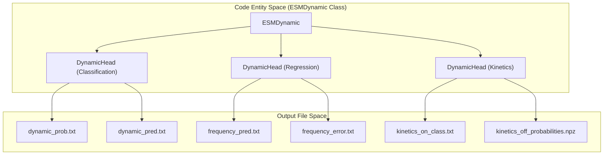
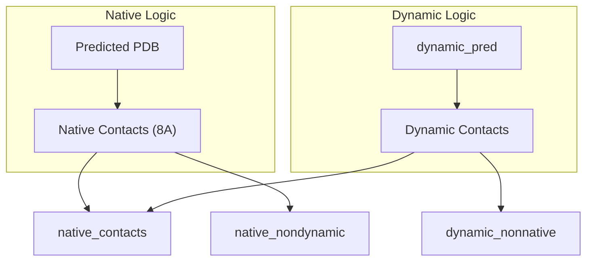

# Interpreting ESMDynamic Outputs

> **Relevant source files**
> * [README.md](https://github.com/MaybeBio/esmdynamic/blob/b3c7f04f/README.md?plain=1)
> * [examples/esmdynamic/OsSWEET2b_esmdynamic_contact_map.npy](https://github.com/MaybeBio/esmdynamic/blob/b3c7f04f/examples/esmdynamic/OsSWEET2b_esmdynamic_contact_map.npy)
> * [examples/esmdynamic/cv_selection_pipeline.ipynb](https://github.com/MaybeBio/esmdynamic/blob/b3c7f04f/examples/esmdynamic/cv_selection_pipeline.ipynb)
> * [examples/esmdynamic/esmdynamic.ipynb](https://github.com/MaybeBio/esmdynamic/blob/b3c7f04f/examples/esmdynamic/esmdynamic.ipynb)
> * [output_interpretation.md](https://github.com/MaybeBio/esmdynamic/blob/b3c7f04f/output_interpretation.md?plain=1)
> * [tests/test_readme.py](https://github.com/MaybeBio/esmdynamic/blob/b3c7f04f/tests/test_readme.py)

This page provides a technical guide for interpreting and utilizing the multi-head outputs generated by the ESMDynamic model. The model extends ESM-2/ESMFold by predicting time-resolved contact characteristics across a range of simulated temperatures.

## Output Structure and Formats

When running inference via the `run_esmdynamic` CLI, the system organizes results into a structured directory per protein identifier.

### Directory Organization

For a sequence with identifier `MY_PROTEIN`, the output directory structure is defined as follows:

* `MY_PROTEIN.pdb`: The 3D structure predicted by the ESMFold trunk [output_interpretation.md L21](https://github.com/MaybeBio/esmdynamic/blob/b3c7f04f/output_interpretation.md?plain=1#L21-L21)
* `MY_PROTEIN_all_outputs.pt`: A raw PyTorch bundle containing all tensor outputs [output_interpretation.md L22](https://github.com/MaybeBio/esmdynamic/blob/b3c7f04f/output_interpretation.md?plain=1#L22-L22)
* `dynamic/`: Binary and probabilistic dynamic contact maps [output_interpretation.md L23](https://github.com/MaybeBio/esmdynamic/blob/b3c7f04f/output_interpretation.md?plain=1#L23-L23)
* `frequency/`: Contact occupancy (fraction of time) maps [output_interpretation.md L24](https://github.com/MaybeBio/esmdynamic/blob/b3c7f04f/output_interpretation.md?plain=1#L24-L24)
* `kinetics/`: Binned on-time and off-time classification results [output_interpretation.md L25](https://github.com/MaybeBio/esmdynamic/blob/b3c7f04f/output_interpretation.md?plain=1#L25-L25)
* `native/`: Static contacts derived from the predicted PDB [output_interpretation.md L26](https://github.com/MaybeBio/esmdynamic/blob/b3c7f04f/output_interpretation.md?plain=1#L26-L26)
* `dynamic_nonnative/` & `native_nondynamic/`: Comparison maps between static and dynamic states [output_interpretation.md L27-L28](https://github.com/MaybeBio/esmdynamic/blob/b3c7f04f/output_interpretation.md?plain=1#L27-L28)

### The Raw PyTorch Bundle (.pt)

For downstream programmatic analysis, the `_all_outputs.pt` file is the recommended source. It contains a dictionary where keys correspond to the different prediction heads and temperature indices [output_interpretation.md L182-L196](https://github.com/MaybeBio/esmdynamic/blob/b3c7f04f/output_interpretation.md?plain=1#L182-L196)

Sources: [output_interpretation.md L16-L29](https://github.com/MaybeBio/esmdynamic/blob/b3c7f04f/output_interpretation.md?plain=1#L16-L29)

 [output_interpretation.md L182-L196](https://github.com/MaybeBio/esmdynamic/blob/b3c7f04f/output_interpretation.md?plain=1#L182-L196)

## Temperature Axis (320K–450K)

ESMDynamic generates predictions for five discrete conditions corresponding to the **mdCATH** training dataset temperatures [output_interpretation.md L35-L41](https://github.com/MaybeBio/esmdynamic/blob/b3c7f04f/output_interpretation.md?plain=1#L35-L41)

:

1. **320 K**: Baseline physiological-like temperature.
2. **348 K**
3. **379 K**
4. **413 K**
5. **450 K**: High-energy state, useful for exploring disorder.

**Technical Note:** These temperatures represent MD-simulated conditions, not direct experimental values. Analysis should typically begin at 320K [output_interpretation.md L43](https://github.com/MaybeBio/esmdynamic/blob/b3c7f04f/output_interpretation.md?plain=1#L43-L43)

Sources: [output_interpretation.md L33-L43](https://github.com/MaybeBio/esmdynamic/blob/b3c7f04f/output_interpretation.md?plain=1#L33-L43)

## Prediction Heads and Data Flow

The `ESMDynamic` class utilizes a `DynamicHead` for three distinct tasks. The data flows from the ESMFold trunk through the `DynamicModule` recycling loop before reaching these heads.

### 1. Classification Head (dynamic/)

Predicts if a residue pair transitions between contact and non-contact states.

* `dynamic_prob`: Continuous values $[0, 1]$ representing the probability of a pair being dynamic [output_interpretation.md L62-L63](https://github.com/MaybeBio/esmdynamic/blob/b3c7f04f/output_interpretation.md?plain=1#L62-L63)
* `dynamic_pred`: A binary map using a default threshold of $0.5$ [output_interpretation.md L65-L66](https://github.com/MaybeBio/esmdynamic/blob/b3c7f04f/output_interpretation.md?plain=1#L65-L66)
* `dynamic_confidence`: Per-residue confidence scores (values $>0.9$ are considered stringent) [output_interpretation.md L68-L69](https://github.com/MaybeBio/esmdynamic/blob/b3c7f04f/output_interpretation.md?plain=1#L68-L69)

### 2. Frequency Head (frequency/)

Predicts **contact occupancy**, defined as the fraction of the ensemble where a contact is formed.

* `frequency_pred`: Values $[0, 1]$ representing occupancy [output_interpretation.md L87-L88](https://github.com/MaybeBio/esmdynamic/blob/b3c7f04f/output_interpretation.md?plain=1#L87-L88)
* `frequency_error`: A predicted error map acting as an uncertainty proxy [output_interpretation.md L90-L91](https://github.com/MaybeBio/esmdynamic/blob/b3c7f04f/output_interpretation.md?plain=1#L90-L91)

### 3. Kinetics Head (kinetics/)

Predicts coarse-grained kinetic bins for **On-time** (contact lifetime) and **Off-time** (formation time).

| Bin | On-time Class | Off-time Class | Timescale |
| --- | --- | --- | --- |
| 0 | always_on | always_off | - |
| 1 | 1–10 ns | 1–10 ns | Fast |
| 2 | 10–100 ns | 10–100 ns | Medium |
| 3 | 100–300 ns | 100–300 ns | Slow |
| 4 | >300 ns | >300 ns | Very Slow |
| 5 | never_on | never_off | - |

Sources: [output_interpretation.md L47-L70](https://github.com/MaybeBio/esmdynamic/blob/b3c7f04f/output_interpretation.md?plain=1#L47-L70)

 [output_interpretation.md L73-L95](https://github.com/MaybeBio/esmdynamic/blob/b3c7f04f/output_interpretation.md?plain=1#L73-L95)

 [output_interpretation.md L97-L140](https://github.com/MaybeBio/esmdynamic/blob/b3c7f04f/output_interpretation.md?plain=1#L97-L140)

## Code Entity to Output Mapping

The following diagrams illustrate how internal model components map to the generated output files and data structures.

### Prediction Head to File Mapping

Sources: [esm/esmdynamic/esmdynamic.py L32-L60](https://github.com/MaybeBio/esmdynamic/blob/b3c7f04f/esm/esmdynamic/esmdynamic.py#L32-L60)

 [output_interpretation.md L54-L58](https://github.com/MaybeBio/esmdynamic/blob/b3c7f04f/output_interpretation.md?plain=1#L54-L58)

 [output_interpretation.md L80-L82](https://github.com/MaybeBio/esmdynamic/blob/b3c7f04f/output_interpretation.md?plain=1#L80-L82)

 [output_interpretation.md L107-L113](https://github.com/MaybeBio/esmdynamic/blob/b3c7f04f/output_interpretation.md?plain=1#L107-L113)

### Native vs. Dynamic Contact Categories

ESMDynamic categorizes contacts by comparing dynamic predictions against the static "native" contacts derived from the ESMFold PDB (using an 8 Å Cα cutoff) [output_interpretation.md L158](https://github.com/MaybeBio/esmdynamic/blob/b3c7f04f/output_interpretation.md?plain=1#L158-L158)

Sources: [output_interpretation.md L143-L166](https://github.com/MaybeBio/esmdynamic/blob/b3c7f04f/output_interpretation.md?plain=1#L143-L166)

## Downstream Analysis: CV Selection

A key application of ESMDynamic outputs is the selection of **Collective Variables (CVs)** for Molecular Dynamics (MD) simulations. The `cv_selection_pipeline.ipynb` notebook demonstrates how to:

1. Load `dynamic_prob` maps using `np.load()` or `np.loadtxt()` [examples/esmdynamic/cv_selection_pipeline.ipynb L10-L30](https://github.com/MaybeBio/esmdynamic/blob/b3c7f04f/examples/esmdynamic/cv_selection_pipeline.ipynb#L10-L30)
2. Perform hierarchical clustering using `scipy.cluster.hierarchy.linkage` to group correlated dynamic contacts [examples/esmdynamic/cv_selection_pipeline.ipynb L12](https://github.com/MaybeBio/esmdynamic/blob/b3c7f04f/examples/esmdynamic/cv_selection_pipeline.ipynb#L12-L12)
3. Identify critical residues involved in structural transitions for biased MD sampling.

Sources: [examples/esmdynamic/cv_selection_pipeline.ipynb L1-L12](https://github.com/MaybeBio/esmdynamic/blob/b3c7f04f/examples/esmdynamic/cv_selection_pipeline.ipynb#L1-L12)

 [output_interpretation.md L232-L245](https://github.com/MaybeBio/esmdynamic/blob/b3c7f04f/output_interpretation.md?plain=1#L232-L245)