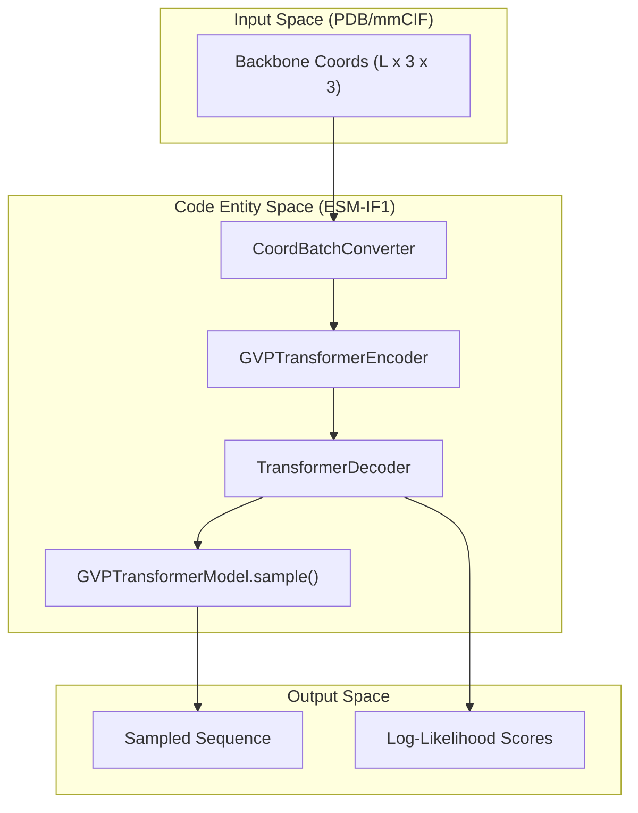
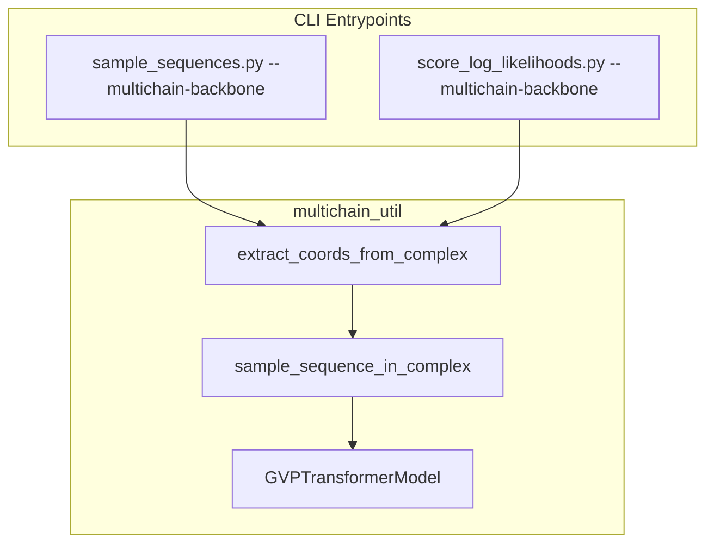

# Inverse Folding (ESM-IF1)

> **Relevant source files**
> * [esm/inverse_folding/gvp_transformer.py](https://github.com/MaybeBio/esmdynamic/blob/b3c7f04f/esm/inverse_folding/gvp_transformer.py)
> * [examples/inverse_folding/README.md](https://github.com/MaybeBio/esmdynamic/blob/b3c7f04f/examples/inverse_folding/README.md?plain=1)
> * [examples/inverse_folding/sample_sequences.py](https://github.com/MaybeBio/esmdynamic/blob/b3c7f04f/examples/inverse_folding/sample_sequences.py)

The ESM-IF1 system is designed for the inverse folding task: predicting a protein sequence that will fold into a target 3D backbone structure. Unlike forward folding models (like ESMFold) that map sequence to structure, ESM-IF1 maps 3D coordinates to amino acid probabilities.

Trained on 12 million AlphaFold2-predicted structures, the model achieves high native sequence recovery (51% overall, 72% for buried residues) by leveraging invariant geometric processing and a sequence-to-sequence Transformer architecture [examples/inverse_folding/README.md L7-L10](https://github.com/MaybeBio/esmdynamic/blob/b3c7f04f/examples/inverse_folding/README.md?plain=1#L7-L10)

 It is capable of designing sequences for single chains or multi-chain complexes, and can handle missing backbone data through span masking [examples/inverse_folding/README.md L11-L12](https://github.com/MaybeBio/esmdynamic/blob/b3c7f04f/examples/inverse_folding/README.md?plain=1#L11-L12)

### Core Architecture

The system utilizes the `GVPTransformerModel` [esm/inverse_folding/gvp_transformer.py L24](https://github.com/MaybeBio/esmdynamic/blob/b3c7f04f/esm/inverse_folding/gvp_transformer.py#L24-L24)

 which bridges geometric deep learning with standard language modeling components.

* **Geometric Encoder**: Uses Geometric Vector Perceptrons (GVP) to process backbone atom coordinates (N, CA, C) in a rotationally and translationally invariant manner [esm/inverse_folding/gvp_transformer.py L28-L30](https://github.com/MaybeBio/esmdynamic/blob/b3c7f04f/esm/inverse_folding/gvp_transformer.py#L28-L30)
* **Transformer Decoder**: An autoregressive decoder that generates the protein sequence token-by-token, conditioned on the structural features extracted by the encoder [esm/inverse_folding/gvp_transformer.py L80-L86](https://github.com/MaybeBio/esmdynamic/blob/b3c7f04f/esm/inverse_folding/gvp_transformer.py#L80-L86)

For detailed information on the internal layers and masking strategies, see **[ESM-IF1 Architecture: GVP Encoder and Transformer Decoder](/MaybeBio/esmdynamic/5.1-esm-if1-architecture:-gvp-encoder-and-transformer-decoder)**.

### System Mapping: Structure to Sequence

The following diagram illustrates how the codebase maps structural inputs to sequence outputs through specific class entities.

**Sources:** [esm/inverse_folding/gvp_transformer.py L24-L88](https://github.com/MaybeBio/esmdynamic/blob/b3c7f04f/esm/inverse_folding/gvp_transformer.py#L24-L88)

 [esm/inverse_folding/util.py L21](https://github.com/MaybeBio/esmdynamic/blob/b3c7f04f/esm/inverse_folding/util.py#L21-L21)

### Key Use Cases

ESM-IF1 is primarily used through two operational modes:

1. **Sequence Sampling**: Generating novel sequences for a fixed backbone structure. The `sample` method uses multinomial sampling (adjustable via a `temperature` parameter) to provide diverse sequence candidates [esm/inverse_folding/gvp_transformer.py L88-L100](https://github.com/MaybeBio/esmdynamic/blob/b3c7f04f/esm/inverse_folding/gvp_transformer.py#L88-L100)
2. **Sequence Scoring**: Evaluating how well a specific sequence fits a given structure by calculating conditional log-likelihoods. This is useful for variant effect prediction or validating designed sequences [examples/inverse_folding/README.md L81-L84](https://github.com/MaybeBio/esmdynamic/blob/b3c7f04f/examples/inverse_folding/README.md?plain=1#L81-L84)

### Multichain Conditioning

The model supports "multichain" mode, where the backbone of an entire protein complex is provided to the encoder, while the decoder targets a specific chain. This allows the model to account for interfacial interactions during the design process [examples/inverse_folding/sample_sequences.py L44-L49](https://github.com/MaybeBio/esmdynamic/blob/b3c7f04f/examples/inverse_folding/sample_sequences.py#L44-L49)

**Sources:** [examples/inverse_folding/sample_sequences.py L44-L71](https://github.com/MaybeBio/esmdynamic/blob/b3c7f04f/examples/inverse_folding/sample_sequences.py#L44-L71)

 [examples/inverse_folding/README.md L54-L63](https://github.com/MaybeBio/esmdynamic/blob/b3c7f04f/examples/inverse_folding/README.md?plain=1#L54-L63)

### Practical Usage

Users typically interact with ESM-IF1 via provided scripts:

* `sample_sequences.py`: For generating FASTA files of new designs [examples/inverse_folding/sample_sequences.py L73-L124](https://github.com/MaybeBio/esmdynamic/blob/b3c7f04f/examples/inverse_folding/sample_sequences.py#L73-L124)
* `score_log_likelihoods.py`: For generating CSV files of sequence-structure compatibility scores [examples/inverse_folding/README.md L89-L95](https://github.com/MaybeBio/esmdynamic/blob/b3c7f04f/examples/inverse_folding/README.md?plain=1#L89-L95)

For a guide on setting up the environment, using the API, and interpreting recovery metrics, see **[Inverse Folding Usage: Sampling and Scoring](/MaybeBio/esmdynamic/5.2-inverse-folding-usage:-sampling-and-scoring)**.

---

**Sources:**

* [examples/inverse_folding/README.md L1-L112](https://github.com/MaybeBio/esmdynamic/blob/b3c7f04f/examples/inverse_folding/README.md?plain=1#L1-L112)
* [esm/inverse_folding/gvp_transformer.py L24-L136](https://github.com/MaybeBio/esmdynamic/blob/b3c7f04f/esm/inverse_folding/gvp_transformer.py#L24-L136)
* [examples/inverse_folding/sample_sequences.py L20-L124](https://github.com/MaybeBio/esmdynamic/blob/b3c7f04f/examples/inverse_folding/sample_sequences.py#L20-L124)