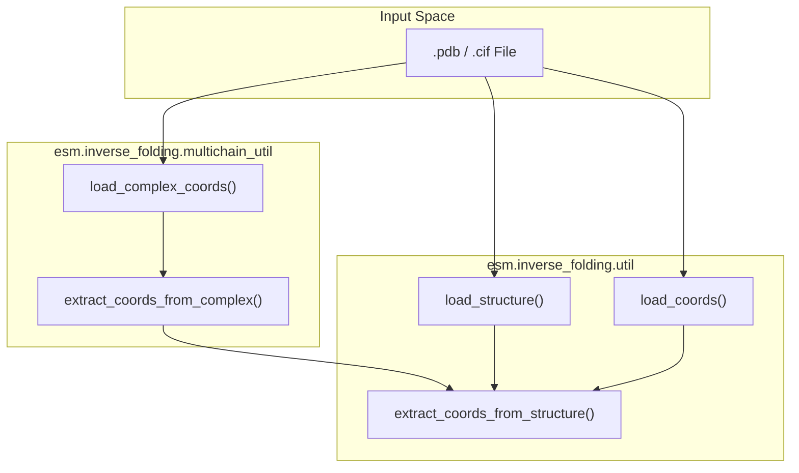
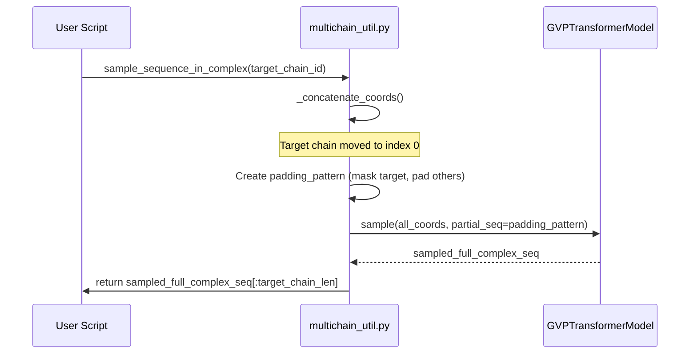

# Inverse Folding Usage: Sampling and Scoring

> **Relevant source files**
> * [esm/inverse_folding/multichain_util.py](https://github.com/MaybeBio/esmdynamic/blob/b3c7f04f/esm/inverse_folding/multichain_util.py)
> * [examples/inverse_folding/README.md](https://github.com/MaybeBio/esmdynamic/blob/b3c7f04f/examples/inverse_folding/README.md?plain=1)
> * [examples/inverse_folding/notebook.ipynb](https://github.com/MaybeBio/esmdynamic/blob/b3c7f04f/examples/inverse_folding/notebook.ipynb)
> * [examples/inverse_folding/notebook_multichain.ipynb](https://github.com/MaybeBio/esmdynamic/blob/b3c7f04f/examples/inverse_folding/notebook_multichain.ipynb)
> * [examples/inverse_folding/sample_sequences.py](https://github.com/MaybeBio/esmdynamic/blob/b3c7f04f/examples/inverse_folding/sample_sequences.py)
> * [examples/inverse_folding/score_log_likelihoods.py](https://github.com/MaybeBio/esmdynamic/blob/b3c7f04f/examples/inverse_folding/score_log_likelihoods.py)

The ESM-IF1 inverse folding system is designed to predict protein sequences that fold into a specific target backbone structure. Trained on 12 million AlphaFold2-predicted structures, the model utilizes a GVP-based geometric encoder and a Transformer decoder to achieve high native sequence recovery [examples/inverse_folding/README.md L3-L12](https://github.com/MaybeBio/esmdynamic/blob/b3c7f04f/examples/inverse_folding/README.md?plain=1#L3-L12)

 This page provides a technical guide for using the CLI tools and Python API for sequence sampling and scoring.

## Sequence Sampling CLI

The `sample_sequences.py` script allows users to generate new sequence designs for a given PDB or mmCIF structure using multinomial sampling [examples/inverse_folding/sample_sequences.py L6-L9](https://github.com/MaybeBio/esmdynamic/blob/b3c7f04f/examples/inverse_folding/sample_sequences.py#L6-L9)

### Key Arguments

| Argument | Description | Default |
| --- | --- | --- |
| `pdbfile` | Path to input `.pdb` or `.cif` file [examples/inverse_folding/sample_sequences.py L78-L80](https://github.com/MaybeBio/esmdynamic/blob/b3c7f04f/examples/inverse_folding/sample_sequences.py#L78-L80) | Required |
| `--chain` | Specific chain ID to redesign [examples/inverse_folding/sample_sequences.py L82-L84](https://github.com/MaybeBio/esmdynamic/blob/b3c7f04f/examples/inverse_folding/sample_sequences.py#L82-L84) | `None` |
| `--temperature` | Controls diversity; higher values increase stochasticity [examples/inverse_folding/sample_sequences.py L86-L89](https://github.com/MaybeBio/esmdynamic/blob/b3c7f04f/examples/inverse_folding/sample_sequences.py#L86-L89) | `1.0` |
| `--num-samples` | Number of sequences to generate [examples/inverse_folding/sample_sequences.py L96-L99](https://github.com/MaybeBio/esmdynamic/blob/b3c7f04f/examples/inverse_folding/sample_sequences.py#L96-L99) | `1` |
| `--multichain-backbone` | Use all chains in the complex as conditioning context [examples/inverse_folding/sample_sequences.py L102-L104](https://github.com/MaybeBio/esmdynamic/blob/b3c7f04f/examples/inverse_folding/sample_sequences.py#L102-L104) | `False` |

### Sampling Workflow

The script identifies whether to use a single-chain or multichain context based on the `--multichain-backbone` flag [examples/inverse_folding/sample_sequences.py L117-L120](https://github.com/MaybeBio/esmdynamic/blob/b3c7f04f/examples/inverse_folding/sample_sequences.py#L117-L120)

 For single chains, it uses `esm.inverse_folding.util.load_coords` [examples/inverse_folding/sample_sequences.py L24](https://github.com/MaybeBio/esmdynamic/blob/b3c7f04f/examples/inverse_folding/sample_sequences.py#L24-L24)

 For multichain complexes, it utilizes `esm.inverse_folding.multichain_util.extract_coords_from_complex` to maintain the structural context of neighboring chains while redesigning the target [examples/inverse_folding/sample_sequences.py L49-L50](https://github.com/MaybeBio/esmdynamic/blob/b3c7f04f/examples/inverse_folding/sample_sequences.py#L49-L50)

**Sources:** [examples/inverse_folding/sample_sequences.py L73-L124](https://github.com/MaybeBio/esmdynamic/blob/b3c7f04f/examples/inverse_folding/sample_sequences.py#L73-L124)

 [examples/inverse_folding/README.md L37-L70](https://github.com/MaybeBio/esmdynamic/blob/b3c7f04f/examples/inverse_folding/README.md?plain=1#L37-L70)

## Sequence Scoring CLI

The `score_log_likelihoods.py` script evaluates the fitness of specific sequences for a given backbone by calculating conditional log-likelihoods [examples/inverse_folding/score_log_likelihoods.py L6-L9](https://github.com/MaybeBio/esmdynamic/blob/b3c7f04f/examples/inverse_folding/score_log_likelihoods.py#L6-L9)

### Performance Metrics

The tool outputs two primary metrics:

1. **Log-likelihood**: The average log-probability of the sequence residues given the backbone [examples/inverse_folding/score_log_likelihoods.py L32-L35](https://github.com/MaybeBio/esmdynamic/blob/b3c7f04f/examples/inverse_folding/score_log_likelihoods.py#L32-L35)
2. **Perplexity**: Calculated as $exp(-LL)$, representing the model's uncertainty [examples/inverse_folding/score_log_likelihoods.py L36](https://github.com/MaybeBio/esmdynamic/blob/b3c7f04f/examples/inverse_folding/score_log_likelihoods.py#L36-L36)

When using the multichain utility, the script can provide log-likelihoods specifically for residues that have valid coordinates in the input structure, filtering out missing loops [esm/inverse_folding/multichain_util.py L133-L135](https://github.com/MaybeBio/esmdynamic/blob/b3c7f04f/esm/inverse_folding/multichain_util.py#L133-L135)

**Sources:** [examples/inverse_folding/score_log_likelihoods.py L23-L50](https://github.com/MaybeBio/esmdynamic/blob/b3c7f04f/examples/inverse_folding/score_log_likelihoods.py#L23-L50)

 [esm/inverse_folding/multichain_util.py L107-L135](https://github.com/MaybeBio/esmdynamic/blob/b3c7f04f/esm/inverse_folding/multichain_util.py#L107-L135)

## Python API and Data Flow

For integration into custom pipelines, ESM-IF1 provides a low-level API for loading structures and interacting with the `GVPTransformerModel`.

### Structure Loading Logic

Coordinates must be formatted as an `L x 3 x 3` tensor representing the N, CA, and C atoms for each of the $L$ residues [examples/inverse_folding/README.md L131-L136](https://github.com/MaybeBio/esmdynamic/blob/b3c7f04f/examples/inverse_folding/README.md?plain=1#L131-L136)

### Code Entity Association: Data Extraction

The following diagram maps the high-level PDB processing to the specific utility functions in the codebase.

**Sources:** [esm/inverse_folding/multichain_util.py L20-L51](https://github.com/MaybeBio/esmdynamic/blob/b3c7f04f/esm/inverse_folding/multichain_util.py#L20-L51)

 [examples/inverse_folding/README.md L139-L153](https://github.com/MaybeBio/esmdynamic/blob/b3c7f04f/examples/inverse_folding/README.md?plain=1#L139-L153)

## Multichain Complex Handling

Designing in a multichain context is handled by the `multichain_util` module. It allows the model to "see" the backbones of partner chains while generating the sequence for a target chain.

### Concatenation Strategy

To process multiple chains, the utility concatenates coordinates with a padding of `NaN` values (default length 10) between chains [esm/inverse_folding/multichain_util.py L54-L77](https://github.com/MaybeBio/esmdynamic/blob/b3c7f04f/esm/inverse_folding/multichain_util.py#L54-L77)

 For optimal performance, the `target_chain_id` is placed first in the sequence concatenation [esm/inverse_folding/multichain_util.py L69-L70](https://github.com/MaybeBio/esmdynamic/blob/b3c7f04f/esm/inverse_folding/multichain_util.py#L69-L70)

### System Architecture: Multichain Sampling

The diagram below illustrates how `sample_sequence_in_complex` orchestrates the model and utility functions.

**Sources:** [esm/inverse_folding/multichain_util.py L80-L104](https://github.com/MaybeBio/esmdynamic/blob/b3c7f04f/esm/inverse_folding/multichain_util.py#L80-L104)

## Key API Functions

| Function | File | Purpose |
| --- | --- | --- |
| `esm_if1_gvp4_t16_142M_UR50()` | `esm/pretrained.py` | Loads the pretrained IF1 model and alphabet [examples/inverse_folding/sample_sequences.py L114](https://github.com/MaybeBio/esmdynamic/blob/b3c7f04f/examples/inverse_folding/sample_sequences.py#L114-L114) |
| `model.sample()` | `esm/model/gvp_transformer.py` | Autoregressive sampling from the Transformer decoder [examples/inverse_folding/sample_sequences.py L34](https://github.com/MaybeBio/esmdynamic/blob/b3c7f04f/examples/inverse_folding/sample_sequences.py#L34-L34) |
| `get_encoder_output()` | `esm/inverse_folding/util.py` | Extracts the geometric embeddings from the GVP encoder [esm/inverse_folding/multichain_util.py L16](https://github.com/MaybeBio/esmdynamic/blob/b3c7f04f/esm/inverse_folding/multichain_util.py#L16-L16) |
| `score_sequence()` | `esm/inverse_folding/util.py` | Calculates per-residue loss for a given sequence/structure pair [examples/inverse_folding/score_log_likelihoods.py L32](https://github.com/MaybeBio/esmdynamic/blob/b3c7f04f/examples/inverse_folding/score_log_likelihoods.py#L32-L32) |

### Sequence Recovery Metrics

Native sequence recovery is a key metric for evaluating ESM-IF1 performance. It is calculated by comparing the `sampled_seq` to the `native_seq` extracted from the PDB file [examples/inverse_folding/sample_sequences.py L40-L41](https://github.com/MaybeBio/esmdynamic/blob/b3c7f04f/examples/inverse_folding/sample_sequences.py#L40-L41)

 ESM-IF1 typically achieves ~51% recovery on held-out backbones [examples/inverse_folding/README.md L9-L10](https://github.com/MaybeBio/esmdynamic/blob/b3c7f04f/examples/inverse_folding/README.md?plain=1#L9-L10)

**Sources:** [examples/inverse_folding/sample_sequences.py L40-L41](https://github.com/MaybeBio/esmdynamic/blob/b3c7f04f/examples/inverse_folding/sample_sequences.py#L40-L41)

 [examples/inverse_folding/README.md L7-L10](https://github.com/MaybeBio/esmdynamic/blob/b3c7f04f/examples/inverse_folding/README.md?plain=1#L7-L10)

 [esm/inverse_folding/multichain_util.py L138-L152](https://github.com/MaybeBio/esmdynamic/blob/b3c7f04f/esm/inverse_folding/multichain_util.py#L138-L152)