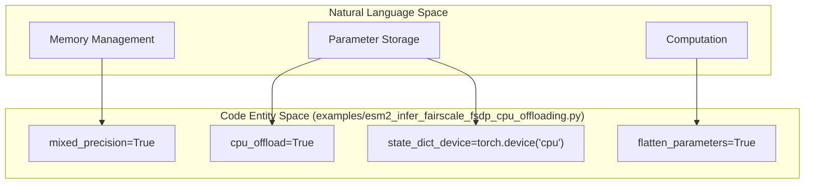
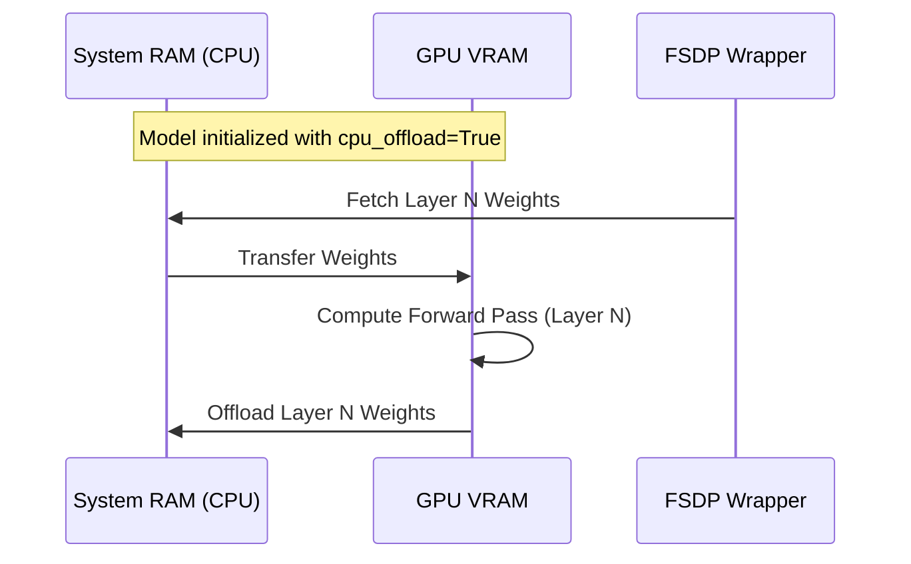

# Large-Scale Inference with FSDP and CPU Offloading

> **Relevant source files**
> * [esm/pretrained.py](https://github.com/MaybeBio/esmdynamic/blob/b3c7f04f/esm/pretrained.py)
> * [esm/version.py](https://github.com/MaybeBio/esmdynamic/blob/b3c7f04f/esm/version.py)
> * [examples/esm2_infer_fairscale_fsdp_cpu_offloading.py](https://github.com/MaybeBio/esmdynamic/blob/b3c7f04f/examples/esm2_infer_fairscale_fsdp_cpu_offloading.py)

This page describes the implementation and usage of Fairscale's Fully Sharded Data Parallel (FSDP) and CPU offloading to perform inference with the largest ESM-2 models (e.g., the 15-billion parameter `esm2_t48_15B_UR50D`). These techniques enable running massive models that exceed the memory capacity of a single GPU by sharding parameters and offloading them to system RAM.

### Distributed Initialization for Single-GPU Setups

Although FSDP is typically used for multi-GPU training, it can be leveraged for single-GPU inference to manage memory constraints. The system initializes a distributed process group even on a single machine using the `nccl` backend [examples/esm2_infer_fairscale_fsdp_cpu_offloading.py L7-L9](https://github.com/MaybeBio/esmdynamic/blob/b3c7f04f/examples/esm2_infer_fairscale_fsdp_cpu_offloading.py#L7-L9)

| Component | Implementation | Purpose |
| --- | --- | --- |
| **Backend** | `nccl` | Standard for GPU-based distributed communication. |
| **World Size** | 1 | Allows FSDP to function in a non-distributed physical environment. |
| **Init Method** | `tcp://localhost:23456` | Local TCP synchronization for the process group. |

**Sources:**

* [examples/esm2_infer_fairscale_fsdp_cpu_offloading.py L7-L9](https://github.com/MaybeBio/esmdynamic/blob/b3c7f04f/examples/esm2_infer_fairscale_fsdp_cpu_offloading.py#L7-L9)

---

### FSDP and CPU Offloading Configuration

The core of the large-scale inference strategy lies in the `fsdp_params` dictionary. By setting `cpu_offload=True`, the model parameters are stored in CPU memory and only moved to the GPU during the forward pass of a specific layer [examples/esm2_infer_fairscale_fsdp_cpu_offloading.py L16-L21](https://github.com/MaybeBio/esmdynamic/blob/b3c7f04f/examples/esm2_infer_fairscale_fsdp_cpu_offloading.py#L16-L21)

**FSDP Parameter Mapping**

**Sources:**

* [examples/esm2_infer_fairscale_fsdp_cpu_offloading.py L16-L21](https://github.com/MaybeBio/esmdynamic/blob/b3c7f04f/examples/esm2_infer_fairscale_fsdp_cpu_offloading.py#L16-L21)

---

### Two-Tier Layer Wrapping Strategy

To maximize memory efficiency, the model is not wrapped as a single block. Instead, a two-tier wrapping strategy is employed using `fairscale.nn.wrap` [examples/esm2_infer_fairscale_fsdp_cpu_offloading.py L2-L3](https://github.com/MaybeBio/esmdynamic/blob/b3c7f04f/examples/esm2_infer_fairscale_fsdp_cpu_offloading.py#L2-L3)

:

1. **Individual Layer Wrapping**: Each Transformer layer within `model.layers` is wrapped independently. This ensures that the memory for only one layer at a time needs to be resident on the GPU [examples/esm2_infer_fairscale_fsdp_cpu_offloading.py L30-L34](https://github.com/MaybeBio/esmdynamic/blob/b3c7f04f/examples/esm2_infer_fairscale_fsdp_cpu_offloading.py#L30-L34)
2. **Top-Level Wrapping**: The entire model is then wrapped to manage the embedding and output heads [examples/esm2_infer_fairscale_fsdp_cpu_offloading.py L35](https://github.com/MaybeBio/esmdynamic/blob/b3c7f04f/examples/esm2_infer_fairscale_fsdp_cpu_offloading.py#L35-L35)

**Data Flow in Wrapped Inference**

**Sources:**

* [examples/esm2_infer_fairscale_fsdp_cpu_offloading.py L29-L35](https://github.com/MaybeBio/esmdynamic/blob/b3c7f04f/examples/esm2_infer_fairscale_fsdp_cpu_offloading.py#L29-L35)

---

### Batch Converter and Inference Interface

The inference pipeline utilizes the standard ESM `BatchConverter` to handle raw sequences, including those with `<mask>` tokens [examples/esm2_infer_fairscale_fsdp_cpu_offloading.py L37-L47](https://github.com/MaybeBio/esmdynamic/blob/b3c7f04f/examples/esm2_infer_fairscale_fsdp_cpu_offloading.py#L37-L47)

 Even when wrapped in FSDP, the model maintains its standard interface for extracting hidden representations and contact maps [examples/esm2_infer_fairscale_fsdp_cpu_offloading.py L49-L51](https://github.com/MaybeBio/esmdynamic/blob/b3c7f04f/examples/esm2_infer_fairscale_fsdp_cpu_offloading.py#L49-L51)

**Key Functions and Calls:**

* **`esm.pretrained.load_model_and_alphabet_core`**: Loads the model architecture and vocabulary within the `enable_wrap` context [examples/esm2_infer_fairscale_fsdp_cpu_offloading.py L22-L25](https://github.com/MaybeBio/esmdynamic/blob/b3c7f04f/examples/esm2_infer_fairscale_fsdp_cpu_offloading.py#L22-L25)
* **`vocab.get_batch_converter()`**: Retrieves the `BatchConverter` instance associated with the model's alphabet [examples/esm2_infer_fairscale_fsdp_cpu_offloading.py L26](https://github.com/MaybeBio/esmdynamic/blob/b3c7f04f/examples/esm2_infer_fairscale_fsdp_cpu_offloading.py#L26-L26)
* **`model.eval()`**: Sets the wrapped FSDP module to evaluation mode [examples/esm2_infer_fairscale_fsdp_cpu_offloading.py L27](https://github.com/MaybeBio/esmdynamic/blob/b3c7f04f/examples/esm2_infer_fairscale_fsdp_cpu_offloading.py#L27-L27)
* **`torch.no_grad()`**: Disables gradient tracking to further reduce memory overhead during inference [examples/esm2_infer_fairscale_fsdp_cpu_offloading.py L49](https://github.com/MaybeBio/esmdynamic/blob/b3c7f04f/examples/esm2_infer_fairscale_fsdp_cpu_offloading.py#L49-L49)

**Sources:**

* [examples/esm2_infer_fairscale_fsdp_cpu_offloading.py L22-L27](https://github.com/MaybeBio/esmdynamic/blob/b3c7f04f/examples/esm2_infer_fairscale_fsdp_cpu_offloading.py#L22-L27)
* [examples/esm2_infer_fairscale_fsdp_cpu_offloading.py L47-L51](https://github.com/MaybeBio/esmdynamic/blob/b3c7f04f/examples/esm2_infer_fairscale_fsdp_cpu_offloading.py#L47-L51)
* [esm/pretrained.py L173-L183](https://github.com/MaybeBio/esmdynamic/blob/b3c7f04f/esm/pretrained.py#L173-L183)