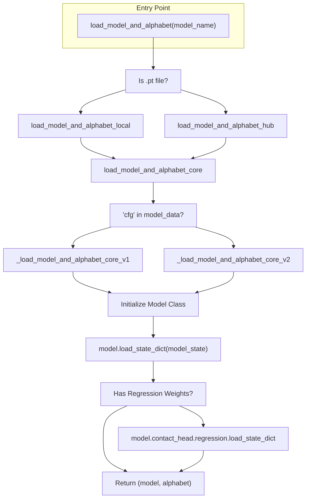
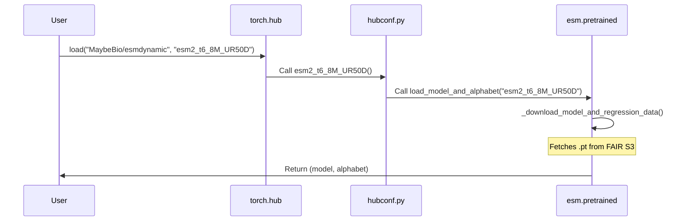

# Pretrained Model Registry and Weight Loading

> **Relevant source files**
> * [esm/pretrained.py](https://github.com/MaybeBio/esmdynamic/blob/b3c7f04f/esm/pretrained.py)
> * [esm/version.py](https://github.com/MaybeBio/esmdynamic/blob/b3c7f04f/esm/version.py)
> * [examples/esm2_infer_fairscale_fsdp_cpu_offloading.py](https://github.com/MaybeBio/esmdynamic/blob/b3c7f04f/examples/esm2_infer_fairscale_fsdp_cpu_offloading.py)
> * [hubconf.py](https://github.com/MaybeBio/esmdynamic/blob/b3c7f04f/hubconf.py)

This page documents the `load_model_and_alphabet` API, the internal loading paths for different model versions, state dictionary transformations, and the integration with `torch.hub`. The ESM ecosystem uses a unified entry point to fetch and initialize models ranging from ESM-1 to the 15B parameter ESM-2.

## The Unified Loading API

The primary entry point for users is `load_model_and_alphabet` [esm/pretrained.py L24-L29](https://github.com/MaybeBio/esmdynamic/blob/b3c7f04f/esm/pretrained.py#L24-L29)

 This function acts as a router that determines whether to load weights from a local file path or from the remote Facebook AI Research (FAIR) repository via `torch.hub`.

### Loading Flow

1. **Input Analysis**: If the `model_name` ends with `.pt`, the system invokes `load_model_and_alphabet_local` [esm/pretrained.py L67-L77](https://github.com/MaybeBio/esmdynamic/blob/b3c7f04f/esm/pretrained.py#L67-L77)  Otherwise, it calls `load_model_and_alphabet_hub` [esm/pretrained.py L62-L64](https://github.com/MaybeBio/esmdynamic/blob/b3c7f04f/esm/pretrained.py#L62-L64)
2. **Regression Weight Handling**: Most ESM models require auxiliary regression weights for contact prediction. The function `_has_regression_weights` [esm/pretrained.py L18-L21](https://github.com/MaybeBio/esmdynamic/blob/b3c7f04f/esm/pretrained.py#L18-L21)  identifies models that do *not* require these (currently `esm1v` and `esm_if`).
3. **Data Retrieval**: * **Hub**: `_download_model_and_regression_data` [esm/pretrained.py L52-L59](https://github.com/MaybeBio/esmdynamic/blob/b3c7f04f/esm/pretrained.py#L52-L59)  fetches the main model `.pt` and the corresponding `-contact-regression.pt` from the FAIR public S3 bucket. * **Local**: The system expects regression weights to be co-located with the main model file, following the naming convention `<model_name>-contact-regression.pt` [esm/pretrained.py L73-L74](https://github.com/MaybeBio/esmdynamic/blob/b3c7f04f/esm/pretrained.py#L73-L74)
4. **Core Initialization**: Both paths converge on `load_model_and_alphabet_core` [esm/pretrained.py L182-L202](https://github.com/MaybeBio/esmdynamic/blob/b3c7f04f/esm/pretrained.py#L182-L202)  which selects between V1 and V2 loading logic based on the presence of a configuration key in the model data.

### Model Loading Logic Diagram

Sources: [esm/pretrained.py L18-L77](https://github.com/MaybeBio/esmdynamic/blob/b3c7f04f/esm/pretrained.py#L18-L77)

 [esm/pretrained.py L182-L202](https://github.com/MaybeBio/esmdynamic/blob/b3c7f04f/esm/pretrained.py#L182-L202)

## Version-Specific Loading Paths

The registry handles two distinct generations of model architectures and checkpoint formats.

### V1 Loading (ESM-1, MSA Transformer, ESM-IF1)

The `_load_model_and_alphabet_core_v1` function [esm/pretrained.py L85-L161](https://github.com/MaybeBio/esmdynamic/blob/b3c7f04f/esm/pretrained.py#L85-L161)

 handles legacy architectures. Because these checkpoints often originate from internal FAIR research code, the function performs significant "upgrading" of the state dict keys:

* **RoBERTa/ESM-1**: Strips `encoder.` and `sentence_encoder.` prefixes and checks for `emb_layer_norm_before` [esm/pretrained.py L90-L102](https://github.com/MaybeBio/esmdynamic/blob/b3c7f04f/esm/pretrained.py#L90-L102)
* **MSA Transformer**: Handles row/column attention parameter renaming and MSA position embedding dimensions [esm/pretrained.py L111-L126](https://github.com/MaybeBio/esmdynamic/blob/b3c7f04f/esm/pretrained.py#L111-L126)
* **ESM-IF1 (GVP)**: Maps internal module names (e.g., `W_v`, `W_e`) to the open-source names like `embed_node` and `embed_edge` [esm/pretrained.py L128-L151](https://github.com/MaybeBio/esmdynamic/blob/b3c7f04f/esm/pretrained.py#L128-L151)

### V2 Loading (ESM-2 and ESMFold)

The `_load_model_and_alphabet_core_v2` function [esm/pretrained.py L164-L180](https://github.com/MaybeBio/esmdynamic/blob/b3c7f04f/esm/pretrained.py#L164-L180)

 is used for the newer ESM-2 family. It uses a `re` pattern to strip prefixes [esm/pretrained.py L165-L170](https://github.com/MaybeBio/esmdynamic/blob/b3c7f04f/esm/pretrained.py#L165-L170)

 and initializes the `ESM2` class using a configuration object found in `model_data["cfg"]["model"]` [esm/pretrained.py L172](https://github.com/MaybeBio/esmdynamic/blob/b3c7f04f/esm/pretrained.py#L172-L172)

### Mapping Natural Language Space to Code Entities

| System Concept | Code Entity (Function/Class) | File Location |
| --- | --- | --- |
| **Model Registry** | `esm.pretrained` (module) | [esm/pretrained.py L1-L202](https://github.com/MaybeBio/esmdynamic/blob/b3c7f04f/esm/pretrained.py#L1-L202) |
| **ESM-2 Constructor** | `ESM2` | [esm/model/esm2.py L1-L147](https://github.com/MaybeBio/esmdynamic/blob/b3c7f04f/esm/model/esm2.py#L1-L147) |
| **Hub Config** | `hubconf.py` | [hubconf.py L1-L32](https://github.com/MaybeBio/esmdynamic/blob/b3c7f04f/hubconf.py#L1-L32) |
| **State Dict Upgrader** | `upgrade_state_dict` | [esm/pretrained.py L165-L170](https://github.com/MaybeBio/esmdynamic/blob/b3c7f04f/esm/pretrained.py#L165-L170) |
| **Regression Loader** | `load_regression_hub` | [esm/pretrained.py L46-L50](https://github.com/MaybeBio/esmdynamic/blob/b3c7f04f/esm/pretrained.py#L46-L50) |

Sources: [esm/pretrained.py L85-L180](https://github.com/MaybeBio/esmdynamic/blob/b3c7f04f/esm/pretrained.py#L85-L180)

 [hubconf.py L1-L32](https://github.com/MaybeBio/esmdynamic/blob/b3c7f04f/hubconf.py#L1-L32)

## Torch Hub Integration

The repository includes a `hubconf.py` file that allows users to load models directly via `torch.hub.load` without manually cloning the repository.

### Named Model Accessors

The registry defines specific accessor functions for every released model. These functions are exported in `hubconf.py` [hubconf.py L8-L32](https://github.com/MaybeBio/esmdynamic/blob/b3c7f04f/hubconf.py#L8-L32)

 Examples include:

* **ESM-2**: `esm2_t33_650M_UR50D`, `esm2_t48_15B_UR50D` [esm/pretrained.py L255-L296](https://github.com/MaybeBio/esmdynamic/blob/b3c7f04f/esm/pretrained.py#L255-L296)
* **ESM-1b**: `esm1b_t33_650M_UR50S` [esm/pretrained.py L221-L223](https://github.com/MaybeBio/esmdynamic/blob/b3c7f04f/esm/pretrained.py#L221-L223)
* **MSA Transformer**: `esm_msa1b_t12_100M_UR50S` [esm/pretrained.py L230-L232](https://github.com/MaybeBio/esmdynamic/blob/b3c7f04f/esm/pretrained.py#L230-L232)
* **ESM-IF1**: `esm_if1_gvp4_t16_142M_UR50` [esm/pretrained.py L246-L248](https://github.com/MaybeBio/esmdynamic/blob/b3c7f04f/esm/pretrained.py#L246-L248)

### Hub Loading Workflow

Sources: [hubconf.py L1-L32](https://github.com/MaybeBio/esmdynamic/blob/b3c7f04f/hubconf.py#L1-L32)

 [esm/pretrained.py L255-L261](https://github.com/MaybeBio/esmdynamic/blob/b3c7f04f/esm/pretrained.py#L255-L261)

## Large Model Handling (FSDP)

For the 15B parameter model (`esm2_t48_15B_UR50D`), standard loading into GPU memory is often impossible on single-node setups. The codebase provides an example of using `fairscale` Fully Sharded Data Parallel (FSDP) with CPU offloading to manage these weights.

In this workflow, `_download_model_and_regression_data` is called directly [examples/esm2_infer_fairscale_fsdp_cpu_offloading.py L13](https://github.com/MaybeBio/esmdynamic/blob/b3c7f04f/examples/esm2_infer_fairscale_fsdp_cpu_offloading.py#L13-L13)

 followed by `load_model_and_alphabet_core` inside an `enable_wrap` context [examples/esm2_infer_fairscale_fsdp_cpu_offloading.py L22-L25](https://github.com/MaybeBio/esmdynamic/blob/b3c7f04f/examples/esm2_infer_fairscale_fsdp_cpu_offloading.py#L22-L25)

 This allows the weights to be loaded to CPU memory and sharded/offloaded as needed during inference.

Sources: [examples/esm2_infer_fairscale_fsdp_cpu_offloading.py L11-L35](https://github.com/MaybeBio/esmdynamic/blob/b3c7f04f/examples/esm2_infer_fairscale_fsdp_cpu_offloading.py#L11-L35)