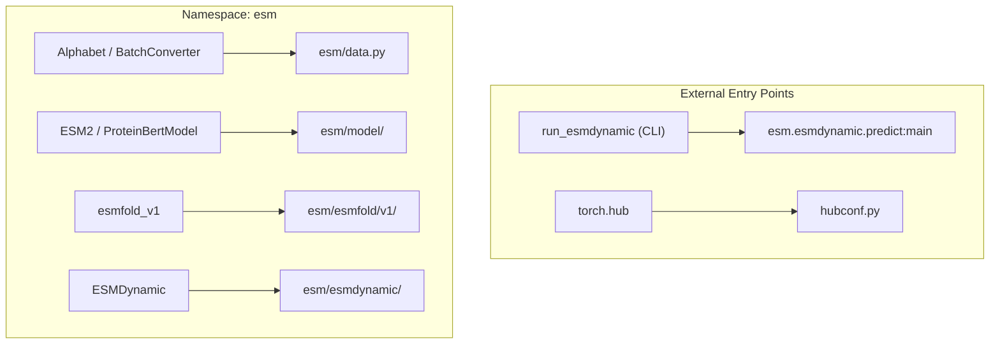
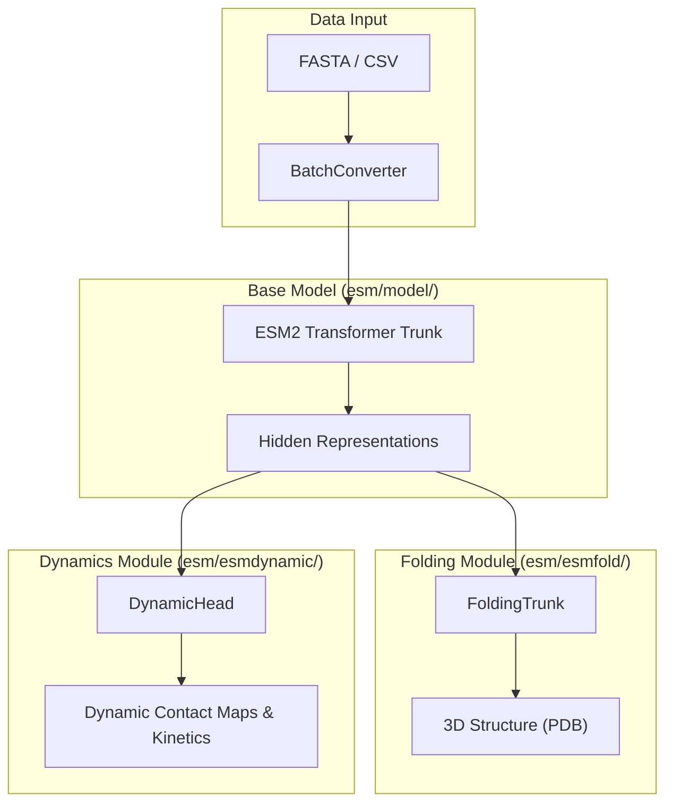

# Repository Structure and Package Layout

> **Relevant source files**
> * [esm/__init__.py](https://github.com/MaybeBio/esmdynamic/blob/b3c7f04f/esm/__init__.py)
> * [esm/esmdynamic/__init__.py](https://github.com/MaybeBio/esmdynamic/blob/b3c7f04f/esm/esmdynamic/__init__.py)
> * [esm/esmdynamic/training/__init__.py](https://github.com/MaybeBio/esmdynamic/blob/b3c7f04f/esm/esmdynamic/training/__init__.py)
> * [esm/version.py](https://github.com/MaybeBio/esmdynamic/blob/b3c7f04f/esm/version.py)
> * [examples/esm2_infer_fairscale_fsdp_cpu_offloading.py](https://github.com/MaybeBio/esmdynamic/blob/b3c7f04f/examples/esm2_infer_fairscale_fsdp_cpu_offloading.py)
> * [hubconf.py](https://github.com/MaybeBio/esmdynamic/blob/b3c7f04f/hubconf.py)
> * [setup.py](https://github.com/MaybeBio/esmdynamic/blob/b3c7f04f/setup.py)

This page provides a technical overview of the ESMDynamic repository organization, its Python package namespace, and the relationship between its core modules. ESMDynamic extends the original Evolutionary Scale Modeling (ESM) codebase to support protein dynamics prediction while maintaining compatibility with ESM-2, ESMFold, and ESM-IF1.

## Top-Level Directory Layout

The repository is organized into four primary functional areas: the core library, usage examples, utility scripts, and the test suite.

| Directory | Purpose |
| --- | --- |
| `esm/` | The primary Python package containing model architectures (ESM-2, ESMFold, ESMDynamic), data pipelines, and pretrained weights logic. |
| `examples/` | Jupyter notebooks and standalone scripts demonstrating specific tasks like variant prediction, contact mapping, and downstream analysis. |
| `scripts/` | Utility scripts for weight management (e.g., `download_weights.sh`) and large-scale extraction (e.g., `extract.py`). |
| `tests/` | Regression and unit tests covering tokenization, model loading, and inverse folding modules. |

**Sources:** [setup.py L34-L42](https://github.com/MaybeBio/esmdynamic/blob/b3c7f04f/setup.py#L34-L42)

 [esm/__init__.py L8-L12](https://github.com/MaybeBio/esmdynamic/blob/b3c7f04f/esm/__init__.py#L8-L12)

## Python Package Namespace

The `esm` package serves as the root namespace. It is structured to separate base language models from specialized downstream task modules like folding and dynamics.

### Sub-Module Organization

* **`esm/` (Root):** Exposes high-level classes like `Alphabet`, `BatchConverter`, and the primary model classes `ESM2` and `ProteinBertModel` [esm/__init__.py L8-L12](https://github.com/MaybeBio/esmdynamic/blob/b3c7f04f/esm/__init__.py#L8-L12)
* **`esm/model/`:** Contains the architectural implementations for ESM-1, ESM-2, and MSA Transformer [esm/__init__.py L9-L11](https://github.com/MaybeBio/esmdynamic/blob/b3c7f04f/esm/__init__.py#L9-L11)
* **`esm/esmfold/v1/`:** Contains the folding trunk and structure modules for 3D prediction [setup.py L34](https://github.com/MaybeBio/esmdynamic/blob/b3c7f04f/setup.py#L34-L34)
* **`esm/inverse_folding/`:** Houses the GVP-Transformer architecture for sequence design [setup.py L34](https://github.com/MaybeBio/esmdynamic/blob/b3c7f04f/setup.py#L34-L34)
* **`esm/esmdynamic/`:** The core extension for dynamics prediction, including the `DynamicHead` and inference logic [setup.py L34-L40](https://github.com/MaybeBio/esmdynamic/blob/b3c7f04f/setup.py#L34-L40)
* **`esm/esmdynamic/training/`:** Contains specialized datasets (`DynContactDataset`) and loss functions for training dynamics models [setup.py L34](https://github.com/MaybeBio/esmdynamic/blob/b3c7f04f/setup.py#L34-L34)

### Code Entity Mapping: Package to Implementation

The following diagram maps the high-level package components to their internal implementation entities.

**Diagram: ESM Package Entity Mapping**

**Sources:** [setup.py L34-L42](https://github.com/MaybeBio/esmdynamic/blob/b3c7f04f/setup.py#L34-L42)

 [esm/__init__.py L8-L12](https://github.com/MaybeBio/esmdynamic/blob/b3c7f04f/esm/__init__.py#L8-L12)

 [hubconf.py L8-L32](https://github.com/MaybeBio/esmdynamic/blob/b3c7f04f/hubconf.py#L8-L32)

## Console Entry Points

The package defines a primary entry point for users to perform dynamics predictions without writing Python code. This is configured in `setup.py` via the `entry_points` metadata.

* **`run_esmdynamic`**: Maps to `esm.esmdynamic.predict:main`. This CLI allows users to input sequences or FASTA files and receive dynamic contact maps and kinetic predictions.

**Sources:** [setup.py L38-L42](https://github.com/MaybeBio/esmdynamic/blob/b3c7f04f/setup.py#L38-L42)

## Pretrained Model Registry

The repository integrates with `torch.hub` via `hubconf.py`. This file acts as a registry, exposing functions to load various versions of ESM-1, ESM-2, ESMFold, and ESM-IF1.

**Key Model Accessors in `hubconf.py`:**

* **ESM-2:** `esm2_t33_650M_UR50D`, `esm2_t48_15B_UR50D`, etc. [hubconf.py L24-L29](https://github.com/MaybeBio/esmdynamic/blob/b3c7f04f/hubconf.py#L24-L29)
* **ESMFold:** `esmfold_v0`, `esmfold_v1` [hubconf.py L30-L31](https://github.com/MaybeBio/esmdynamic/blob/b3c7f04f/hubconf.py#L30-L31)
* **Inverse Folding:** `esm_if1_gvp4_t16_142M_UR50` [hubconf.py L23](https://github.com/MaybeBio/esmdynamic/blob/b3c7f04f/hubconf.py#L23-L23)

**Sources:** [hubconf.py L8-L32](https://github.com/MaybeBio/esmdynamic/blob/b3c7f04f/hubconf.py#L8-L32)

## Data Flow and Module Relationships

The interaction between the base ESM-2 models and the specialized ESMDynamic module follows a feature-extraction pattern. The `ESMDynamic` module utilizes the representations generated by the `ESM2` trunk to predict time-resolved structural properties.

**Diagram: Data Flow Architecture**

**Sources:** [esm/__init__.py L8-L12](https://github.com/MaybeBio/esmdynamic/blob/b3c7f04f/esm/__init__.py#L8-L12)

 [setup.py L34-L42](https://github.com/MaybeBio/esmdynamic/blob/b3c7f04f/setup.py#L34-L42)

 [examples/esm2_infer_fairscale_fsdp_cpu_offloading.py L47-L50](https://github.com/MaybeBio/esmdynamic/blob/b3c7f04f/examples/esm2_infer_fairscale_fsdp_cpu_offloading.py#L47-L50)

## Versioning and Metadata

The package version is centrally managed in `esm/version.py`. This version string is imported by both `setup.py` for packaging and `esm/__init__.py` for runtime access via `esm.__version__`.

* **Current Version:** 2.0.1 [esm/version.py L4](https://github.com/MaybeBio/esmdynamic/blob/b3c7f04f/esm/version.py#L4-L4)
* **License:** MIT [setup.py L33](https://github.com/MaybeBio/esmdynamic/blob/b3c7f04f/setup.py#L33-L33)

**Sources:** [esm/version.py L4](https://github.com/MaybeBio/esmdynamic/blob/b3c7f04f/esm/version.py#L4-L4)

 [setup.py L7-L8](https://github.com/MaybeBio/esmdynamic/blob/b3c7f04f/setup.py#L7-L8)

 [esm/__init__.py L6](https://github.com/MaybeBio/esmdynamic/blob/b3c7f04f/esm/__init__.py#L6-L6)