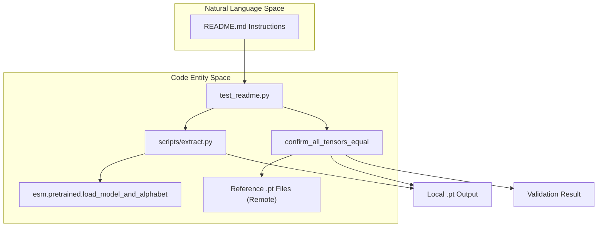
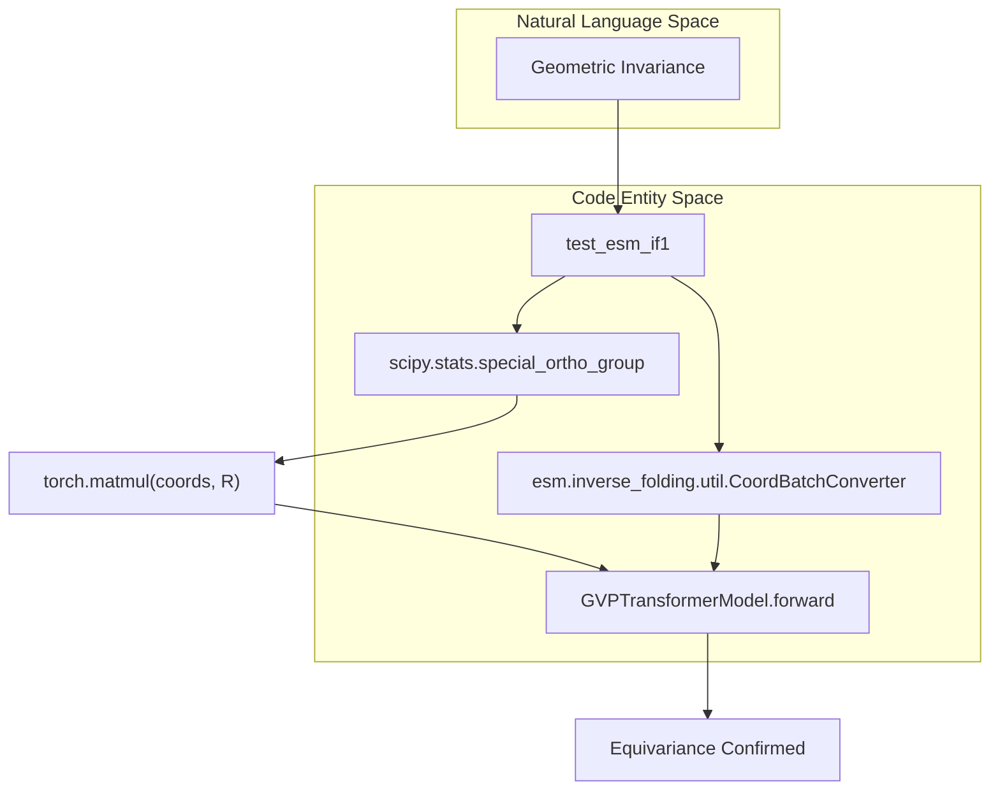

# Testing Infrastructure

> **Relevant source files**
> * [README.md](https://github.com/MaybeBio/esmdynamic/blob/b3c7f04f/README.md?plain=1)
> * [esm/axial_attention.py](https://github.com/MaybeBio/esmdynamic/blob/b3c7f04f/esm/axial_attention.py)
> * [esm/constants.py](https://github.com/MaybeBio/esmdynamic/blob/b3c7f04f/esm/constants.py)
> * [esm/data.py](https://github.com/MaybeBio/esmdynamic/blob/b3c7f04f/esm/data.py)
> * [esm/inverse_folding/features.py](https://github.com/MaybeBio/esmdynamic/blob/b3c7f04f/esm/inverse_folding/features.py)
> * [esm/inverse_folding/gvp_modules.py](https://github.com/MaybeBio/esmdynamic/blob/b3c7f04f/esm/inverse_folding/gvp_modules.py)
> * [esm/multihead_attention.py](https://github.com/MaybeBio/esmdynamic/blob/b3c7f04f/esm/multihead_attention.py)
> * [examples/variant-prediction/README.md](https://github.com/MaybeBio/esmdynamic/blob/b3c7f04f/examples/variant-prediction/README.md?plain=1)
> * [output_interpretation.md](https://github.com/MaybeBio/esmdynamic/blob/b3c7f04f/output_interpretation.md?plain=1)
> * [scripts/extract.py](https://github.com/MaybeBio/esmdynamic/blob/b3c7f04f/scripts/extract.py)
> * [tests/test_alphabet.py](https://github.com/MaybeBio/esmdynamic/blob/b3c7f04f/tests/test_alphabet.py)
> * [tests/test_inverse_folding.py](https://github.com/MaybeBio/esmdynamic/blob/b3c7f04f/tests/test_inverse_folding.py)
> * [tests/test_load_all.py](https://github.com/MaybeBio/esmdynamic/blob/b3c7f04f/tests/test_load_all.py)
> * [tests/test_notebooks.py](https://github.com/MaybeBio/esmdynamic/blob/b3c7f04f/tests/test_notebooks.py)
> * [tests/test_readme.py](https://github.com/MaybeBio/esmdynamic/blob/b3c7f04f/tests/test_readme.py)

The ESMDynamic repository includes a comprehensive test suite designed to ensure the integrity of protein language models, structural prediction pipelines, and the dynamic contact prediction extensions. The infrastructure covers regression testing, tokenization validation, and model loading checks across the ESM, ESMFold, and ESM-IF1 ecosystems.

## Core Test Suite Overview

The test suite is located in the `tests/` directory and utilizes `pytest` as the primary test runner. It validates both the high-level CLI tools and the underlying architectural components.

| Test File | Focus Area | Key Validations |
| --- | --- | --- |
| `test_readme.py` | Regression & API | Validates code snippets from documentation and `extract.py` script outputs. |
| `test_load_all.py` | Model Registry | Ensures all models in `hubconf.py` can be loaded and perform a forward pass. |
| `test_alphabet.py` | Tokenization | Validates `Alphabet` and `BatchConverter` logic for ESM-1b, ESM-1v, and MSA Transformer. |
| `test_inverse_folding.py` | ESM-IF1 | Checks `GVPTransformerModel` equivariance and sequence recovery likelihoods. |
| `test_notebooks.py` | Documentation | Ensures example Jupyter notebooks execute without errors. |

**Sources:**

* [tests/test_readme.py L1-L180](https://github.com/MaybeBio/esmdynamic/blob/b3c7f04f/tests/test_readme.py#L1-L180)
* [tests/test_load_all.py L1-L56](https://github.com/MaybeBio/esmdynamic/blob/b3c7f04f/tests/test_load_all.py#L1-L56)
* [tests/test_alphabet.py L1-L87](https://github.com/MaybeBio/esmdynamic/blob/b3c7f04f/tests/test_alphabet.py#L1-L87)
* [tests/test_inverse_folding.py L1-L71](https://github.com/MaybeBio/esmdynamic/blob/b3c7f04f/tests/test_inverse_folding.py#L1-L71)

## Regression and CLI Testing

The `test_readme.py` file serves as a regression suite to ensure that updates do not break core functionality described in the documentation.

### Implementation Details

* **Model Loading:** Tests verify that `torch.hub.load` and `esm.pretrained` accessors correctly initialize models like `esm2_t33_650M_UR50D` [tests/test_readme.py L16-L27](https://github.com/MaybeBio/esmdynamic/blob/b3c7f04f/tests/test_readme.py#L16-L27)
* **Feature Extraction:** The `test_readme_3` function executes the `scripts/extract.py` utility via `subprocess` to generate per-residue representations [tests/test_readme.py L94-L102](https://github.com/MaybeBio/esmdynamic/blob/b3c7f04f/tests/test_readme.py#L94-L102)
* **Tensor Validation:** The function `confirm_all_tensors_equal` compares locally generated `.pt` embeddings against reference tensors hosted on external servers using `torch.allclose` with an absolute tolerance of `1e-3` [tests/test_readme.py L109-L128](https://github.com/MaybeBio/esmdynamic/blob/b3c7f04f/tests/test_readme.py#L109-L128)
* **ESMFold Validation:** `test_readme_esmfold` performs a structural inference and validates the output PDB's mean B-factors (pLDDT) against a known reference [tests/test_readme.py L69-L92](https://github.com/MaybeBio/esmdynamic/blob/b3c7f04f/tests/test_readme.py#L69-L92)

### Data Flow for CLI Regression



**Sources:**

* [tests/test_readme.py L63-L128](https://github.com/MaybeBio/esmdynamic/blob/b3c7f04f/tests/test_readme.py#L63-L128)
* [scripts/extract.py L63-L137](https://github.com/MaybeBio/esmdynamic/blob/b3c7f04f/scripts/extract.py#L63-L137)

## Tokenization and Alphabet Validation

`test_alphabet.py` ensures that the `Alphabet` class correctly maps amino acid sequences to numerical tensors, handling special tokens like `<mask/>`, `<cls/>`, and `<pad/>`.

### Key Functions

* **`_test_esm1b`**: Validates standard sequence-to-token mapping for ESM-1b/ESM-2 models. It checks if the `BatchConverter` produces the exact expected tensor values for masked and unmasked sequences [tests/test_alphabet.py L6-L25](https://github.com/MaybeBio/esmdynamic/blob/b3c7f04f/tests/test_alphabet.py#L6-L25)
* **`_test_esm1b_truncation`**: Verifies that the `truncation_seq_length` parameter in `get_batch_converter` correctly clips sequences while maintaining special tokens [tests/test_alphabet.py L27-L45](https://github.com/MaybeBio/esmdynamic/blob/b3c7f04f/tests/test_alphabet.py#L27-L45)
* **`test_esm1_msa1b_alphabet`**: Validates the 3D tensor output (Batch x MSA_depth x Seq_len) required for the `MSATransformer` [tests/test_alphabet.py L64-L87](https://github.com/MaybeBio/esmdynamic/blob/b3c7f04f/tests/test_alphabet.py#L64-L87)

**Sources:**

* [tests/test_alphabet.py L1-L87](https://github.com/MaybeBio/esmdynamic/blob/b3c7f04f/tests/test_alphabet.py#L1-L87)
* [esm/data.py L91-L140](https://github.com/MaybeBio/esmdynamic/blob/b3c7f04f/esm/data.py#L91-L140)

## Model Loading and Forward Pass Checks

The `test_load_all.py` script iterates through the entire `model_names` registry to prevent regressions in model initialization logic.

### Implementation

The test uses `@pytest.mark.parametrize` to run two main checks on every model:

1. **`test_load_hub_fwd_model`**: Loads the model via `esm.pretrained`, creates a `dummy_inp` tensor, and performs a forward pass to check if the output `logits` shape matches `(batch, seq, vocab_size)` [tests/test_load_all.py L38-L48](https://github.com/MaybeBio/esmdynamic/blob/b3c7f04f/tests/test_load_all.py#L38-L48)
2. **`test_load_local`**: Validates the `load_model_and_alphabet_local` utility, ensuring models can be loaded from a local filesystem path (typically `~/.cache/torch/hub/checkpoints`) without an internet connection [tests/test_load_all.py L50-L56](https://github.com/MaybeBio/esmdynamic/blob/b3c7f04f/tests/test_load_all.py#L50-L56)

**Sources:**

* [tests/test_load_all.py L12-L56](https://github.com/MaybeBio/esmdynamic/blob/b3c7f04f/tests/test_load_all.py#L12-L56)

## Inverse Folding Tests

`test_inverse_folding.py` focuses on the `GVPTransformerModel` (ESM-IF1).

### Validation Logic

* **Perplexity Check**: Compares the model's calculated cross-entropy loss against a target average loss (converted to perplexity) for a set of reference structures [tests/test_inverse_folding.py L26-L46](https://github.com/MaybeBio/esmdynamic/blob/b3c7f04f/tests/test_inverse_folding.py#L26-L46)
* **Equivariance Testing**: A critical test for geometric models. The script generates a random rotation matrix `R` using `scipy.stats.special_ortho_group`, applies it to the input coordinates, and asserts that the output `logits` remain unchanged (invariant) [tests/test_inverse_folding.py L61-L71](https://github.com/MaybeBio/esmdynamic/blob/b3c7f04f/tests/test_inverse_folding.py#L61-L71)

### Geometric Equivariance Flow



**Sources:**

* [tests/test_inverse_folding.py L6-L71](https://github.com/MaybeBio/esmdynamic/blob/b3c7f04f/tests/test_inverse_folding.py#L6-L71)

## Running Tests

Tests can be executed from the repository root using the following commands:

```markdown
# Run all testspytest tests/ # Run a specific test filepytest tests/test_alphabet.py # Run tests that require a GPU (e.g., ESMFold)pytest tests/test_readme.py -k "esmfold"
```

**Sources:**

* [README.md L56-L57](https://github.com/MaybeBio/esmdynamic/blob/b3c7f04f/README.md?plain=1#L56-L57)
* [tests/test_readme.py L74-L75](https://github.com/MaybeBio/esmdynamic/blob/b3c7f04f/tests/test_readme.py#L74-L75)