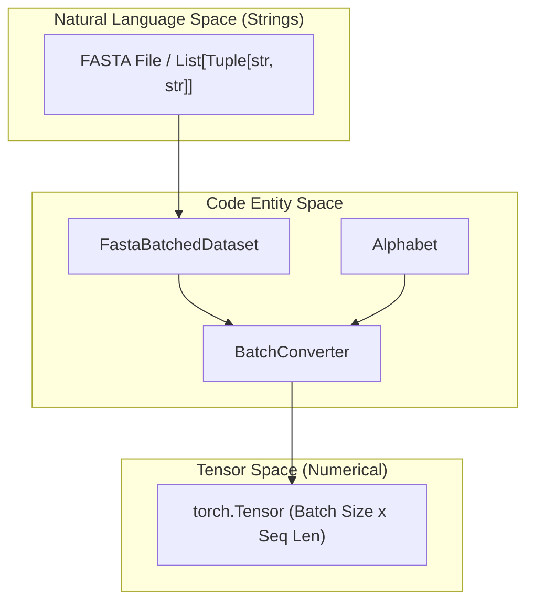
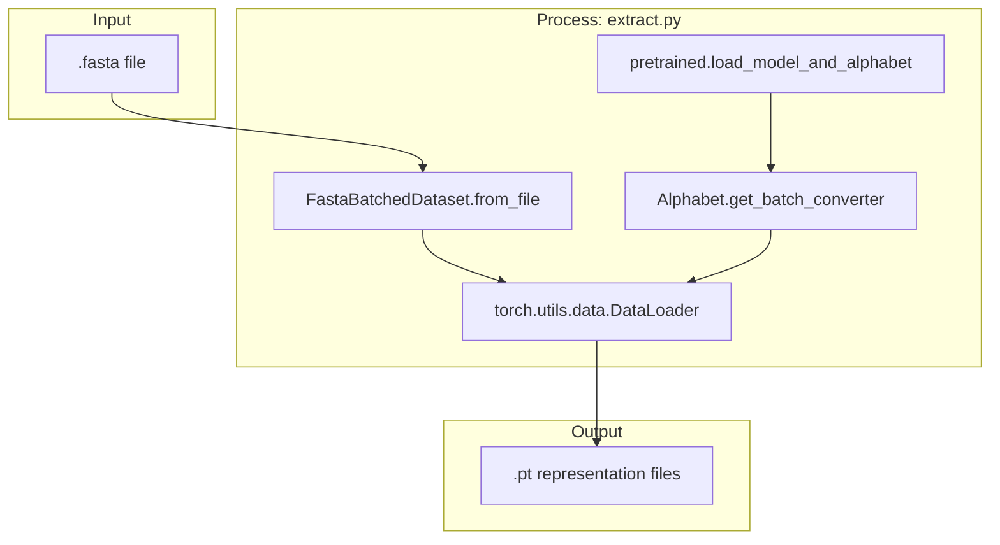

# Tokenization and Data Pipeline

> **Relevant source files**
> * [esm/axial_attention.py](https://github.com/MaybeBio/esmdynamic/blob/b3c7f04f/esm/axial_attention.py)
> * [esm/constants.py](https://github.com/MaybeBio/esmdynamic/blob/b3c7f04f/esm/constants.py)
> * [esm/data.py](https://github.com/MaybeBio/esmdynamic/blob/b3c7f04f/esm/data.py)
> * [scripts/extract.py](https://github.com/MaybeBio/esmdynamic/blob/b3c7f04f/scripts/extract.py)
> * [tests/test_alphabet.py](https://github.com/MaybeBio/esmdynamic/blob/b3c7f04f/tests/test_alphabet.py)
> * [tests/test_notebooks.py](https://github.com/MaybeBio/esmdynamic/blob/b3c7f04f/tests/test_notebooks.py)

This section covers the mechanisms for transforming raw biological sequences and Multiple Sequence Alignments (MSAs) into numerical tensors suitable for ESM models. The pipeline encompasses vocabulary management, batching strategies for variable-length sequences, and utilities for large-scale feature extraction.

## The Alphabet Class

The `Alphabet` class is the central manager for the model's vocabulary. It handles the mapping between amino acid characters and integer indices, including special tokens required for BERT-style training (e.g., masking, classification tokens).

### Implementation Details

The `Alphabet` is initialized with standard amino acid tokens defined in `esm.constants.proteinseq_toks` [esm/data.py L91-L100](https://github.com/MaybeBio/esmdynamic/blob/b3c7f04f/esm/data.py#L91-L100)

 It automatically pads the vocabulary to a multiple of 8 to optimize hardware performance [esm/data.py L110-L111](https://github.com/MaybeBio/esmdynamic/blob/b3c7f04f/esm/data.py#L110-L111)

**Key Special Tokens:**

* `<cls>`: Used for global sequence representations [esm/data.py L118](https://github.com/MaybeBio/esmdynamic/blob/b3c7f04f/esm/data.py#L118-L118)
* `<mask>`: Used for masked language modeling tasks [esm/data.py L119](https://github.com/MaybeBio/esmdynamic/blob/b3c7f04f/esm/data.py#L119-L119)
* `<pad>`: Used to equalize sequence lengths within a batch [esm/data.py L117](https://github.com/MaybeBio/esmdynamic/blob/b3c7f04f/esm/data.py#L117-L117)
* `<eos>`: Indicates the end of a sequence [esm/data.py L120](https://github.com/MaybeBio/esmdynamic/blob/b3c7f04f/esm/data.py#L120-L120)

The class provides a factory method `from_architecture` to instantiate the correct alphabet for specific models like ESM-1b or MSA Transformer, as these models use different token orderings and special tokens [esm/data.py L142-L174](https://github.com/MaybeBio/esmdynamic/blob/b3c7f04f/esm/data.py#L142-L174)

**Sources:** [esm/data.py L91-L174](https://github.com/MaybeBio/esmdynamic/blob/b3c7f04f/esm/data.py#L91-L174)

 [esm/constants.py L7-L9](https://github.com/MaybeBio/esmdynamic/blob/b3c7f04f/esm/constants.py#L7-L9)

## Sequence to Tensor Data Flow

The conversion process moves from raw strings to padded PyTorch tensors. This is managed by `BatchConverter` (for single sequences) and `MSABatchConverter` (for alignments).

### BatchConverter Logic

The `BatchConverter` takes a list of tuples `(label, sequence)` and performs the following:

1. **Truncation**: Limits sequences to a maximum length if `truncation_seq_length` is set [esm/data.py L214-L216](https://github.com/MaybeBio/esmdynamic/blob/b3c7f04f/esm/data.py#L214-L216)
2. **Tokenization**: Maps characters to indices using the `Alphabet` [esm/data.py L221-L224](https://github.com/MaybeBio/esmdynamic/blob/b3c7f04f/esm/data.py#L221-L224)
3. **Padding**: Identifies the longest sequence in the batch and pads all others with the `<pad>` index [esm/data.py L226-L231](https://github.com/MaybeBio/esmdynamic/blob/b3c7f04f/esm/data.py#L226-L231)

### MSA Batching

For the MSA Transformer, the `MSABatchConverter` processes a list of MSAs. It ensures that every sequence within an MSA is padded to the same length, and every MSA within a batch has the same number of sequences and the same sequence length [esm/data.py L255-L296](https://github.com/MaybeBio/esmdynamic/blob/b3c7f04f/esm/data.py#L255-L296)

### Data Entity Mapping

The following diagram illustrates how raw sequence data is transformed into model-ready tensors via the `Alphabet` and `BatchConverter` entities.

**Sequence Transformation Pipeline**

**Sources:** [esm/data.py L19-L88](https://github.com/MaybeBio/esmdynamic/blob/b3c7f04f/esm/data.py#L19-L88)

 [esm/data.py L136-L141](https://github.com/MaybeBio/esmdynamic/blob/b3c7f04f/esm/data.py#L136-L141)

 [esm/data.py L204-L245](https://github.com/MaybeBio/esmdynamic/blob/b3c7f04f/esm/data.py#L204-L245)

## Dynamic Batching and Datasets

To handle the extreme variance in protein sequence lengths (from dozens to thousands of residues), the repository implements dynamic batching.

### FastaBatchedDataset

The `FastaBatchedDataset` reads FASTA files and provides a `get_batch_indices` method [esm/data.py L19-L65](https://github.com/MaybeBio/esmdynamic/blob/b3c7f04f/esm/data.py#L19-L65)

 Instead of fixed batch sizes (e.g., 32 sequences), it groups sequences such that the total number of tokens (sequence length × number of sequences) does not exceed a user-defined threshold (`toks_per_batch`) [esm/data.py L65-L88](https://github.com/MaybeBio/esmdynamic/blob/b3c7f04f/esm/data.py#L65-L88)

### Implementation of get_batch_indices:

1. Sorts all sequences by length [esm/data.py L66-L67](https://github.com/MaybeBio/esmdynamic/blob/b3c7f04f/esm/data.py#L66-L67)
2. Iteratively adds sequences to a buffer [esm/data.py L80-L85](https://github.com/MaybeBio/esmdynamic/blob/b3c7f04f/esm/data.py#L80-L85)
3. Flushes the buffer into a new batch whenever `max_len * (len(buf) + 1)` exceeds `toks_per_batch` [esm/data.py L82-L83](https://github.com/MaybeBio/esmdynamic/blob/b3c7f04f/esm/data.py#L82-L83)

**Sources:** [esm/data.py L19-L90](https://github.com/MaybeBio/esmdynamic/blob/b3c7f04f/esm/data.py#L19-L90)

## Extract CLI (extract.py)

The `scripts/extract.py` utility provides a high-level interface for running inference on FASTA files and saving internal model representations to disk.

### Execution Flow

1. **Initialization**: Loads a pretrained model and its corresponding `Alphabet` via `pretrained.load_model_and_alphabet` [scripts/extract.py L64](https://github.com/MaybeBio/esmdynamic/blob/b3c7f04f/scripts/extract.py#L64-L64)
2. **Data Loading**: Wraps the FASTA file in a `FastaBatchedDataset` and uses `get_batch_indices` for efficient memory utilization [scripts/extract.py L74-L75](https://github.com/MaybeBio/esmdynamic/blob/b3c7f04f/scripts/extract.py#L74-L75)
3. **Inference**: Iterates through the `DataLoader`, passing tokens through the model to extract specific `repr_layers` [scripts/extract.py L88-L95](https://github.com/MaybeBio/esmdynamic/blob/b3c7f04f/scripts/extract.py#L88-L95)
4. **Output**: Saves `.pt` files containing the label, per-token representations, and optionally contact maps or mean-pooled representations [scripts/extract.py L104-L131](https://github.com/MaybeBio/esmdynamic/blob/b3c7f04f/scripts/extract.py#L104-L131)

### Extract CLI Components

**Sources:** [scripts/extract.py L15-L137](https://github.com/MaybeBio/esmdynamic/blob/b3c7f04f/scripts/extract.py#L15-L137)

## Summary of Key Classes

| Class | File | Responsibility |
| --- | --- | --- |
| `Alphabet` | `esm/data.py` | Manages vocabulary and special token indices. |
| `BatchConverter` | `esm/data.py` | Converts list of sequences to padded tensors. |
| `MSABatchConverter` | `esm/data.py` | Converts list of MSAs to 3D tensors (Batch x Rows x Columns). |
| `FastaBatchedDataset` | `esm/data.py` | Efficiently parses FASTA and calculates dynamic batch indices. |

**Sources:** [esm/data.py L19](https://github.com/MaybeBio/esmdynamic/blob/b3c7f04f/esm/data.py#L19-L19)

 [esm/data.py L91](https://github.com/MaybeBio/esmdynamic/blob/b3c7f04f/esm/data.py#L91-L91)

 [esm/data.py L204](https://github.com/MaybeBio/esmdynamic/blob/b3c7f04f/esm/data.py#L204-L204)

 [esm/data.py L248](https://github.com/MaybeBio/esmdynamic/blob/b3c7f04f/esm/data.py#L248-L248)