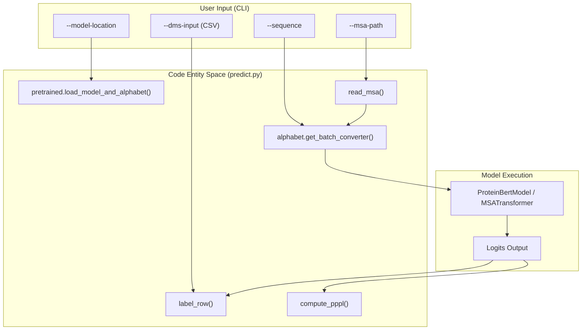
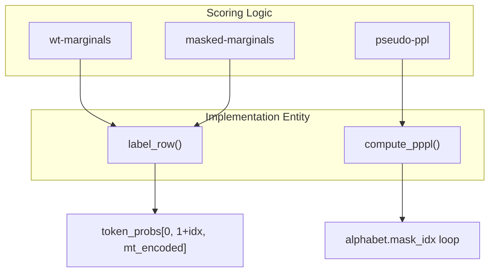

# Zero-Shot Variant Effect Prediction

> **Relevant source files**
> * [esm/inverse_folding/features.py](https://github.com/MaybeBio/esmdynamic/blob/b3c7f04f/esm/inverse_folding/features.py)
> * [esm/inverse_folding/gvp_modules.py](https://github.com/MaybeBio/esmdynamic/blob/b3c7f04f/esm/inverse_folding/gvp_modules.py)
> * [examples/sup_variant_prediction.ipynb](https://github.com/MaybeBio/esmdynamic/blob/b3c7f04f/examples/sup_variant_prediction.ipynb)
> * [examples/variant-prediction/README.md](https://github.com/MaybeBio/esmdynamic/blob/b3c7f04f/examples/variant-prediction/README.md?plain=1)
> * [examples/variant-prediction/predict.py](https://github.com/MaybeBio/esmdynamic/blob/b3c7f04f/examples/variant-prediction/predict.py)
> * [scripts/design_lm/README.md](https://github.com/MaybeBio/esmdynamic/blob/b3c7f04f/scripts/design_lm/README.md?plain=1)
> * [scripts/design_lm/artificial_sequence_purge_ids.txt](https://github.com/MaybeBio/esmdynamic/blob/b3c7f04f/scripts/design_lm/artificial_sequence_purge_ids.txt)
> * [scripts/design_lm/data.csv](https://github.com/MaybeBio/esmdynamic/blob/b3c7f04f/scripts/design_lm/data.csv)
> * [scripts/design_lm/uniref90_jackhmmer_purge_ids.txt](https://github.com/MaybeBio/esmdynamic/blob/b3c7f04f/scripts/design_lm/uniref90_jackhmmer_purge_ids.txt)
> * [tests/test_inverse_folding.py](https://github.com/MaybeBio/esmdynamic/blob/b3c7f04f/tests/test_inverse_folding.py)

Zero-shot variant effect prediction leverages pretrained protein language models to estimate the functional impact of mutations without requiring task-specific supervision. This approach utilizes the internal representations of models like ESM-1v and MSA Transformer to score the likelihood of amino acid substitutions relative to the wild-type sequence.

## Overview and Scoring Strategies

The repository provides a dedicated CLI utility `predict.py` to label Deep Mutational Scan (DMS) datasets. It supports three primary scoring strategies for evaluating the fitness of a mutant sequence compared to a wild-type (WT) sequence [examples/variant-prediction/predict.py L85-L90](https://github.com/MaybeBio/esmdynamic/blob/b3c7f04f/examples/variant-prediction/predict.py#L85-L90)

.

| Strategy | Description | Supported Models |
| --- | --- | --- |
| `wt-marginals` | Scores mutations based on the model's log-odds ratio at the mutated position, conditioned on the full WT sequence. | ESM-1v, ESM-1b, ESM-2 |
| `masked-marginals` | Similar to WT-marginals, but the mutated position is masked during the forward pass to avoid bias from the WT residue. | ESM-1v, MSA Transformer |
| `pseudo-ppl` | Computes the Pseudo-Perplexity (PPPL) by masking every position in the sequence one-by-one and summing the log-probabilities. | Single-sequence ESM models |

Sources: [examples/variant-prediction/predict.py L45-L104](https://github.com/MaybeBio/esmdynamic/blob/b3c7f04f/examples/variant-prediction/predict.py#L45-L104)

, [examples/variant-prediction/README.md L1-L31](https://github.com/MaybeBio/esmdynamic/blob/b3c7f04f/examples/variant-prediction/README.md?plain=1#L1-L31)

## Technical Implementation

### Core Prediction Logic

The script `predict.py` iterates through a CSV containing mutation labels (e.g., "M1A") and calculates a score for each. The primary scoring function `label_row` calculates the difference in log-probabilities between the mutant (mt) and wild-type (wt) tokens at the specific index [examples/variant-prediction/predict.py L107-L116](https://github.com/MaybeBio/esmdynamic/blob/b3c7f04f/examples/variant-prediction/predict.py#L107-L116)

.

For the `wt-marginals` strategy, the model performs a single forward pass on the WT sequence. The resulting logits are converted to log-probabilities, and the score is extracted as:
$Score = \log P(x_{idx} = mt | x_{WT}) - \log P(x_{idx} = wt | x_{WT})$

### MSA Transformer Integration

When using the MSA Transformer (`esm_msa1b_t12_100M_UR50S`), the script requires an MSA in `.a3m` format. It uses the `masked-marginals` strategy by default, masking the position of interest in the first sequence of the MSA (the query sequence) before performing inference [examples/variant-prediction/predict.py L161-L185](https://github.com/MaybeBio/esmdynamic/blob/b3c7f04f/examples/variant-prediction/predict.py#L161-L185)

.

### Data Flow: Natural Language to Code Entities

The following diagram illustrates how user inputs from the command line map to internal code structures and processing functions.

**Prediction Pipeline Data Flow**

Sources: [examples/variant-prediction/predict.py L147-L210](https://github.com/MaybeBio/esmdynamic/blob/b3c7f04f/examples/variant-prediction/predict.py#L147-L210)

## Comparison of Strategies

The `compute_pppl` function implements the Pseudo-Perplexity approach, which is more computationally expensive as it requires $L$ forward passes (where $L$ is sequence length) to score a single variant [examples/variant-prediction/predict.py L118-L144](https://github.com/MaybeBio/esmdynamic/blob/b3c7f04f/examples/variant-prediction/predict.py#L118-L144)

.

**Scoring Implementation Details**

Sources: [examples/variant-prediction/predict.py L107-L144](https://github.com/MaybeBio/esmdynamic/blob/b3c7f04f/examples/variant-prediction/predict.py#L107-L144)

## Benchmarks and Evaluation

The repository includes pre-computed results for 41 Deep Mutational Scanning datasets. Performance is typically evaluated using the **Spearman Rho** ($\rho$) correlation coefficient between model predictions and experimental measurements [examples/variant-prediction/README.md L33-L43](https://github.com/MaybeBio/esmdynamic/blob/b3c7f04f/examples/variant-prediction/README.md?plain=1#L33-L43)

.

Key metrics provided in the `data/` directory include:

* **rho_pp**: Spearman rho calculated per protein.
* **rho_boot**: Mean and standard deviation of rho across 20 bootstrapped samples.
* **aggregated_rho**: Performance averaged across validation and test sets.

Sources: [examples/variant-prediction/README.md L40-L44](https://github.com/MaybeBio/esmdynamic/blob/b3c7f04f/examples/variant-prediction/README.md?plain=1#L40-L44)

## Supervised vs. Zero-Shot

While `predict.py` focuses on zero-shot prediction, the repository also includes `sup_variant_prediction.ipynb`. This notebook demonstrates a **supervised** approach where fixed embeddings (e.g., from `esm1v_t33_650M_UR90S_1`) are extracted and used to train a downstream regressor (like an SVM or Random Forest) using Scikit-Learn [examples/sup_variant_prediction.ipynb L14-L35](https://github.com/MaybeBio/esmdynamic/blob/b3c7f04f/examples/sup_variant_prediction.ipynb#L14-L35)

.

* **Zero-shot**: Uses raw model likelihoods directly (no training data needed).
* **Supervised**: Uses `scripts/extract.py` to get mean representations and trains a "head" on top [examples/sup_variant_prediction.ipynb L40-L42](https://github.com/MaybeBio/esmdynamic/blob/b3c7f04f/examples/sup_variant_prediction.ipynb#L40-L42) .

Sources: [examples/sup_variant_prediction.ipynb L1-L55](https://github.com/MaybeBio/esmdynamic/blob/b3c7f04f/examples/sup_variant_prediction.ipynb#L1-L55)

, [examples/variant-prediction/predict.py L1-L42](https://github.com/MaybeBio/esmdynamic/blob/b3c7f04f/examples/variant-prediction/predict.py#L1-L42)