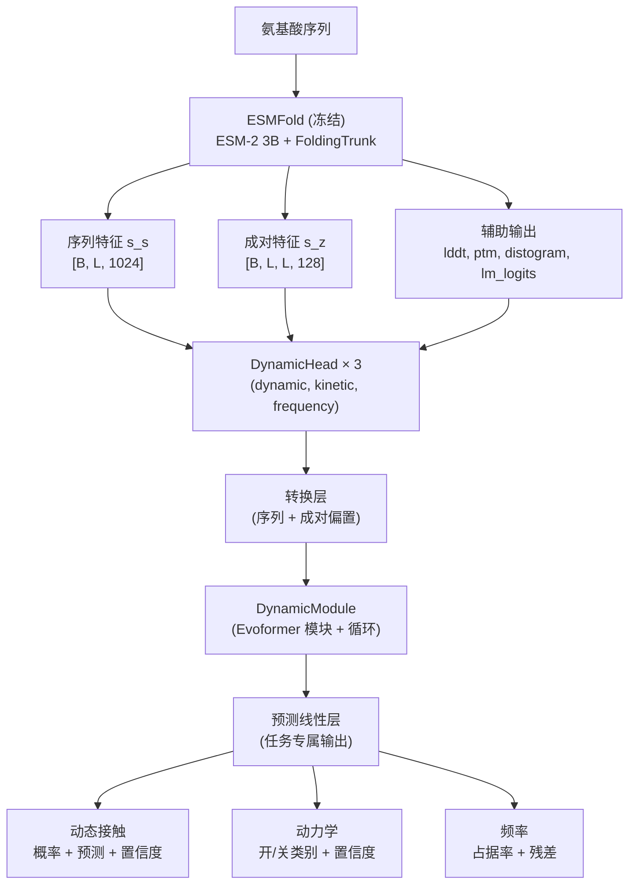

---
slug:1-overview
blog_type:normal
---


**ESMDynamic**是一个深度学习模型，能够**仅从单一氨基酸序列预测蛋白质动态接触图**——无需多序列比对（MSA）。ESMDynamic基于Meta的ESMFold结构预测模型构建，新增了三个专门的预测头，用于表征在整个分子动力学（MD）系综中残基接触随时间的演化方式。该模型由UIUC的Shukla Group作为bioRxiv预印本发表，能够快速、准确地预测哪些接触是动态的、它们形成的频率以及发生转变的时间尺度——所有这些仅需输入一条蛋白质序列即可完成。


来源：[README.md](/README.md#L1-L30), [esmdynamic.py](/esm/esmdynamic/esmdynamic.py#L213-L220)

## ESMDynamic 预测内容

传统的静态结构预测（如ESMFold或AlphaFold）只能给出一个结构——即一个接触图。但蛋白质是动态的：接触的形成和断裂发生在纳秒到微秒的时间尺度上。ESMDynamic弥合了这一差距，能够从单一序列预测**三种互补特性**，每种特性均涵盖五个MD模拟温度（320 K、348 K、379 K、413 K、450 K）：

| 预测头 | 任务类型 | 输出 | 生物学意义 |
|---|---|---|---|
| **动态接触** | 二分类 | 每个残基对、每个温度的概率 ∈ [0,1] | 在整个MD系综中，接触是否在形成和断裂状态之间*转变* |
| **接触频率** | 回归 | 每个残基对、每个温度的占据值 ∈ [0,1] | 在系综中接触处于形成状态的时间占比 |
| **接触动力学** | 多分类（6个类别 × 开/关速率） | 每个残基对、每个温度的动力学类别 | 接触形成（开启时间）和断裂（关闭时间）的粗粒化时间尺度 |

每个预测头还会产生辅助输出——分类头提供每个残基对的置信度分数，频率回归头提供成对残差估计——从而支持具备不确定性感知的下游分析。

来源：[esmdynamic.py](/esm/esmdynamic/esmdynamic.py#L260-L288), [predict.py](/esm/esmdynamic/predict.py#L15-L33), [output_interpretation.md](/output_interpretation.md#L1-L53)

## 架构概览

ESMDynamic采用了**冻结骨干网络 + 可训练预测头**的设计。ESMFold（30亿参数蛋白质语言模型 + 折叠主干）处理输入序列以生成丰富的结构表示。这些表示随后被输入到三个独立的`DynamicHead`模块中，每个模块包含其各自的`DynamicModule`（带有循环机制的改进版Evoformer），在任务专属的预测线性层之前对成对特征进行精炼。



<CgxTip>ESMFold在推理期间运行于`torch.no_grad()`下——其权重被完全冻结。仅训练`DynamicHead`参数，与对完整30亿以上参数模型进行端到端微调相比，这大幅降低了训练成本。</CgxTip>

来源：[esmdynamic.py](/esm/esmdynamic/esmdynamic.py#L236-L240), [esmdynamic.py](/esm/esmdynamic/esmdynamic.py#L119-L135), [dynamic_module.py](/esm/esmdynamic/dynamic_module.py#L35-L122)

## 项目结构

本仓库扩展了Meta AI已归档的[Evolutionary Scale Modeling (ESM)](https://github.com/facebookresearch/esm)框架。ESMDynamic专属代码位于`esm/esmdynamic/`目录内，而继承的ESM基础设施（ESM-2语言模型、ESMFold、反向折叠）则保留在原始的包布局中。

```
esmdynamic/
├── esm/                          # 核心包 (扩展自 facebookresearch/esm)
│   ├── esmdynamic/               # ★ ESMDynamic 专属模块
│   │   ├── esmdynamic.py         #   ESMDynamic 模型 + DynamicHead
│   │   ├── dynamic_module.py     #   基于 Evoformer 的 DynamicModule
│   │   ├── pretrained.py         #   从 Illinois Data Bank 加载权重
│   │   ├── predict.py            #   run_esmdynamic CLI 入口点
│   │   └── training/             #   训练流水线
│   │       ├── train.py          #     训练循环 + 指标
│   │       ├── loss.py           #     Focal + CE + MSE 损失
│   │       └── data_reader.py    #     数据集 + 数据加载
│   ├── esmfold/v1/               # ESMFold 结构预测 (继承)
│   ├── inverse_folding/          # ESM-IF 反向折叠 (继承)
│   ├── model/                    # ESM-1, ESM-2, MSA Transformer (继承)
│   └── pretrained.py             # 模型注册表 (扩展了 esmdynamic)
├── examples/
│   └── esmdynamic/               # 示例 FASTA/CSV + Colab 笔记本
├── scripts/                      # 下载权重、提取、atlas 工具
├── tests/                        # 单元测试
├── Dockerfile                    # 包含所有依赖 + 权重的 Docker 镜像
└── setup.py                      # 包配置 (入口点: run_esmdynamic)
```

来源：[setup.py](/setup.py#L26-L43), [Dockerfile](/Dockerfile#L1-L96)

## 核心功能

| 功能 | 详情 |
|---|---|
| **单序列输入** | 无需MSA或模板搜索——使用ESM-2 3B蛋白质语言模型嵌入 |
| **多链支持** | 接受以`:`链分隔符组成的多聚体序列；链之间插入25个残基的poly-G连接子 |
| **五种温度条件** | 在320K–450K下进行预测，与mdCATH模拟温度相匹配 |
| **三个预测头** | 动态接触（分类）、频率（回归）、动力学（多分类）——可独立选择 |
| **低内存推理** | 通过`--low_memory`标志启用顺序执行预测头及GPU卸载 |
| **批量处理** | 通过`run_esmdynamic`支持FASTA和CSV输入及批量推理 |
| **交互式可视化** | Plotly HTML热力图 + PNG图 + 原始文本/PyTorch输出 |
| **预训练权重** | 从Illinois Data Bank自动下载 (DOI: 10.13012/B2IDB-3773897_V2) |
| **人类蛋白质组预测** | 数据仓库中提供UniProt UP000005640的预计算预测 |

来源：[predict.py](/esm/esmdynamic/predict.py#L36-L110), [esmdynamic.py](/esm/esmdynamic/esmdynamic.py#L458-L546), [README.md](/README.md#L138-L166)

## 安装选项

ESMDynamic提供两种安装路径。推荐使用**Docker**方式，因为它能处理所有依赖版本（CUDA 12.9、PyTorch 2.8、OpenFold），并在构建期间自动下载模型权重。**Conda**方式也可用，但可能会因包弃用而遇到依赖冲突。

| 方式 | 步骤 | 最适用场景 |
|---|---|---|
| **Docker**（推荐） | `docker build -t esmdynamic .` → `docker run --gpus all ...` | 生产使用、可复现性 |
| **Conda** | 创建环境 → 安装CUDA/PyTorch → pip安装依赖 → pip安装仓库 | 开发、自定义配置 |
| **Google Colab** | 打开笔记本 → 输入序列 → 运行 | 快速探索、本地无需GPU |

<CgxTip>Docker构建会预先下载所有三个权重文件（ESMFold 3B、ESM-2 3B、ESMDynamic）到镜像中，因此推理可立即启动而无需网络请求。请参阅Dockerfile末尾附近的`wget`命令。</CgxTip>

来源：[Dockerfile](/Dockerfile#L79-L89), [README.md](/README.md#L43-L78)

## 数据集与训练数据

ESMDynamic在**mdCATH**上训练——这是一个源自CATH域的大规模分子动力学数据集。以下三个数据集公开可用：

| 数据集 | 来源 | 用途 |
|---|---|---|
| **ATLAS**（测试集） | ATLAS MD模拟数据库 | 独立测试评估 |
| **mdCATH** | mdCATH HuggingFace数据集 | 训练（主要） |
| **RCSB Clusters** | RCSB PDB | 额外的结构多样性 |

训练对动态接触分类头使用**焦点损失**（α=0.85, γ=2），对动力学使用**带类别权重的交叉熵**，对频率回归使用**MSE**——所有损失通过模块化损失包装器组合，仅激活被选中的预测头。

来源：[README.md](/README.md#L151-L189), [loss.py](/esm/esmdynamic/training/loss.py#L146-L184)

## 后续步骤

本文档的组织结构将带你从入门操作深入到实现细节的理解：

1. **[快速开始](2-quick-start)** — 使用Docker或Colab运行你的第一次预测
2. **[输出解读](3-output-interpretation)** — 了解每个输出文件的内容及使用方法
3. **[架构概览](4-architecture-overview)** — ESMFold → DynamicModule → 预测头的详细数据流
4. **[ESMDynamic 模型类](5-esmdynamic-model-class)** — `ESMDynamic`与`DynamicHead`的API参考
5. **[DynamicModule 与 Evoformer 循环](6-dynamicmodule-and-evoformer-recycling)** — 带有循环机制的改进版Evoformer的工作原理
6. **[多头预测设计](7-multi-head-prediction-design)** — 分类、回归与动力学预测头的内部机制
7. **[训练流水线与数据加载](8-training-pipeline-and-data-loading)** — 如何在你自己的MD数据上进行训练或微调
8. **[损失函数与评估指标](9-loss-functions-and-metrics)** — 焦点损失、交叉熵、MSE及指标计算
9. **[批量预测脚本](10-bulk-prediction-script)** — `run_esmdynamic` CLI的详细介绍
10. **[Colab 笔记本工作流](11-colab-notebook-workflow)** — 交互式预测演示流程
11. **[预训练模型与权重加载](12-pretrained-model-and-weight-loading)** — 权重下载与状态字典管理
12. **[低内存推理模式](13-low-memory-inference-mode)** — 通过顺序执行预测头优化GPU内存
13. **[反向折叠与 ESM-IF](14-inverse-folding-and-esm-if)** — 继承的反向折叠功能