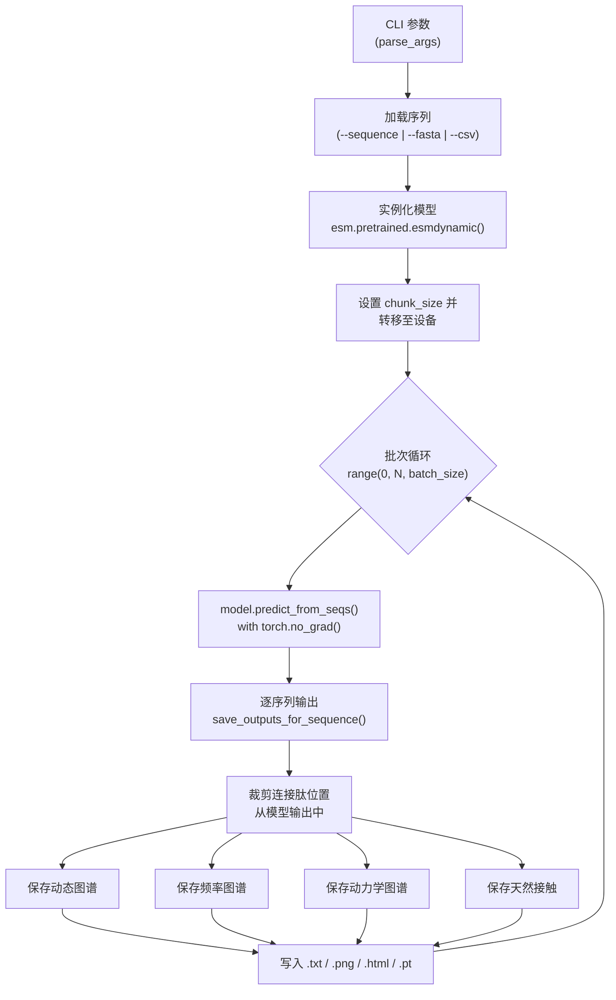

---
slug:10-bulk-prediction-script
blog_type:normal
---


批量预测脚本（`esm/esmdynamic/predict.py`）是大规模运行 ESMDynamic 推理的主要命令行接口。它接受来自三个互斥输入来源的蛋白质序列——内联字符串、FASTA 文件或 CSV 文件——并协调模型加载、批量推理和多格式输出生成，涵盖五个模拟温度下的所有三个预测头（动态接触、接触频率和动力学）。

来源: [predict.py](esm/esmdynamic/predict.py#L1-L658)

## 执行流程

该脚本遵循从输入解析、批量推理到逐序列输出序列化的线性流水线。在给定相同输入和模型权重的情况下，每个阶段都是确定性的。



来源: [predict.py](esm/esmdynamic/predict.py#L616-L658)

## 输入来源与序列加载

该脚本使用**互斥组**来指定输入——必须且只能提供 `--sequence`、`--fasta` 或 `--csv` 中的一个。`load_sequences` 函数将这三种路径统一标准化为 `(id, sequence_string)` 元组列表。

| 标志 | 格式 | ID 派生方式 | 示例 |
|---|---|---|---|
| `--sequence` | 单个内联字符串 | 硬编码为 `"output"` | `--sequence "MVLSPADKTN"` |
| `--fasta` | 多记录 FASTA | 来自 BioPython SeqIO 的 `record.id` | `--fasta proteins.fasta` |
| `--csv` | 双列 CSV (id, seq) | 第一列的值；跳过表头 | `--csv example.csv` |

对于**多链蛋白质**，序列字符串中的各链由冒号分隔（例如 `"CHAIN_A:CHAIN_B"`）。在 notebook 工作流中，正斜杠（`/`）会在推理前被标准化为冒号。示例数据包含 HIV-1 蛋白酶同源二聚体，表示为由 `:` 连接的两个相同的 99 残基链。

<CgxTip>使用 `--csv` 时，文件必须包含表头行（将通过 `next(reader, None)` 无条件跳过）。后续的每一行必须至少包含 2 列——仅前两列会被用作 ID 和序列。</CgxTip>

来源: [predict.py](esm/esmdynamic/predict.py#L36-L127), [example.csv](examples/esmdynamic/example.csv#L1-L5), [example.fasta](examples/esmdynamic/example.fasta#L1-L8)

## CLI 参数参考

| 参数 | 类型 | 默认值 | 描述 |
|---|---|---|---|
| `--sequence` | str | *(必填组)* | 单个序列字符串 |
| `--fasta` | str | *(必填组)* | FASTA 文件路径 |
| `--csv` | str | *(必填组)* | CSV 文件路径（id, seq 列） |
| `--batch_size` | int | `1` | 每个推理批次的序列数量 |
| `--chunk_size` | int | `256` | 用于内存控制的注意力块大小 |
| `--device` | {cpu, cuda} | `cuda` | 计算设备；自动回退至 CPU |
| `--output_dir` | str | `"outputs"` | 所有输出的根目录 |
| `--chain_ids` | str | `None` (A–Z) | 链标签字符（例如 `"ABCDEF"`） |
| `--low_memory` | flag | `False` | 启用低内存推理模式 |
| `--save_html` | flag | `True`* | 保存交互式 Plotly HTML 热图 |
| `--save_png` | flag | `True`* | 保存 Matplotlib PNG 热图 |
| `--save_txt` | flag | `True`* | 保存原始文本/CSV 矩阵 |
| `--save_raw_pt` | flag | `True`* | 保存包含所有输出的 `.pt` 打包文件 |
| `--num_recycles` | int | `None` | 覆盖 Evoformer 循环次数 |

*\*如果未指定任何格式标志，则这四个标志默认均为 `True`。*

来源: [predict.py](esm/esmdynamic/predict.py#L36-L110)

## 模型初始化与批量推理

`main()` 函数通过 `esm.pretrained.esmdynamic()` 加载预训练的 ESMDynamic 模型，该函数内部会调用来自 Illinois Data Bank 仓库的权重加载流水线。模型通过 `model.eval()` 被设置为评估模式，并且所有序列都在 `torch.no_grad()` 上下文中进行处理。

```python
model = esm.pretrained.esmdynamic()
model.set_chunk_size(args.chunk_size)
model = model.to(device)
model.eval()

for start in range(0, len(sequences), args.batch_size):
    batch = sequences[start:start + args.batch_size]
    ids, raw_seqs = zip(*batch)
    with torch.no_grad():
        prediction = model.predict_from_seqs(
            list(raw_seqs),
            low_memory=args.low_memory,
            num_recycles=args.num_recycles,
        )
```

`predict_from_seqs` 方法返回一个包含所有活跃预测头对应键的字典。在 `save_outputs_for_sequence` 中提取逐序列结果时，每个头的输出均通过批次位置（`seq_idx`）进行索引。

来源: [predict.py](esm/esmdynamic/predict.py#L616-L654), [pretrained.py](esm/esmdynamic/pretrained.py#L1-L36)

## 连接肽裁剪与标签生成

ESMDynamic 在内部通过在链之间插入一个 **25 残基的连接肽**（由间隙 token 组成）来表示多链蛋白质。因此，模型的输出矩阵包含这些连接肽位置，在可视化或下游分析之前必须将其裁剪掉。`get_crop_mask_labels_and_boundaries` 函数产生三个产物：

- **掩码 (mask)** — 布尔数组，其中 `True` 表示真实残基，`False` 表示连接肽位置
- **标签 (labels)** — 人类可读的残基标签，如 `"A-M1"`、`"B-K99"`，使用链 ID 和从 1 开始的索引位置
- **边界 (boundaries)** — 链边界所在的整数位置（位于裁剪后的坐标系中），用于在热图上绘制白色分隔线

`crop_pair_matrix` 和 `crop_residue_vector` 函数使用此掩码，从模型的 L×L 成对输出或长度为 L 的逐残基输出中，仅提取真实残基的行和列。

来源: [predict.py](esm/esmdynamic/predict.py#L134-L174)

## 输出目录结构

对于每个输入序列，脚本会在 `output_dir/` 下创建一个以经过净化的序列 ID 命名的专用子目录。在该目录中，输出按预测头和温度进行组织。

```
outputs/
└── <sanitized_id>/
    ├── <id>.pdb                          # ESMFold 结构（若动态头活跃）
    ├── <id>_all_outputs.pt               # 包含所有张量的原始打包文件
    ├── dynamic/
    │   ├── <id>_dynamic_prob_<T>K.{txt,png,html}
    │   ├── <id>_dynamic_pred_<T>K.{txt,png,html}
    │   └── <id>_dynamic_confidence_<T>K.{csv,png}
    ├── frequency/
    │   ├── <id>_frequency_pred_<T>K.{txt,png,html}
    │   └── <id>_frequency_error_<T>K.{txt,png,html}
    ├── kinetics/
    │   ├── <id>_kinetics_on_class_<T>K.{txt,png,html}
    │   ├── <id>_kinetics_off_class_<T>K.{txt,png,html}
    │   ├── <id>_kinetics_on_probabilities_<T>K.npz
    │   ├── <id>_kinetics_off_probabilities_<T>K.npz
    │   ├── <id>_kinetics_on_classes_<T>K.txt
    │   ├── <id>_kinetics_off_classes_<T>K.txt
    │   └── <id>_kinetics_confidence_<T>K.{csv,png}
    ├── native/
    │   └── <id>_native_contacts.{txt,png,html}
    ├── dynamic_nonnative/
    │   └── <id>_dynamic_nonnative_<T>K.{txt,png,html}
    └── native_nondynamic/
        └── <id>_native_nondynamic_<T>K.{txt,png,html}
```

温度值 `<T>` 取自常量 `TEMPERATURES = [320, 348, 379, 413, 450]`（单位为开尔文），每个预测头每个序列生成五组输出。

来源: [predict.py](esm/esmdynamic/predict.py#L15-L16), [predict.py](esm/esmdynamic/predict.py#L323-L613)

## 各头输出详情

### 动态接触头

动态头在每个温度下产生三种输出类型：**概率图**（连续的 [0, 1] 值）、**二值预测**（以 0.5 为阈值）和**逐残基置信度分数**。概率图和预测图是对称的 L×L 矩阵，保存为热图；置信度是长度为 L 的向量，保存为折线图。概率图使用范围为 [0, 1] 的 Viridis 色图，而预测图使用整数格式。

| 预测字典中的键 | 形状 | 内容 |
|---|---|---|
| `dynamic_prob` | [B, T, L, L] | 每个温度的 Sigmoid 概率 |
| `dynamic_pred` | [B, T, L, L] | 二值预测（概率 > 0.5） |
| `dynamic_confidence` | [B, T, L] | 每个温度的逐残基置信度 |

来源: [predict.py](esm/esmdynamic/predict.py#L343-L399)

### 频率头

频率头预测**接触占有率**（在 MD 系综中接触出现的频率）以及**残差/误差**图。两者均为连续值的 L×L 矩阵，占有率的范围为 [0, 1]，残差则无约束。

| 预测字典中的键 | 形状 | 内容 |
|---|---|---|
| `frequency_pred` | [B, T, L, L] | 预测的接触频率 / 占有率 |
| `frequency_residual_pred` | [B, T, L, L] | 残差误差预测 |

来源: [predict.py](esm/esmdynamic/predict.py#L401-L443)

### 动力学头

动力学头预测开启时间和关闭时间的**离散速率类别**。每个速率方向（开/关）有 6 个具有不同命名约定的类别。输出包括预测的类别索引图、完整的逐类别概率堆栈（保存为 `.npz`）以及将类别索引映射到人类可读名称的图例文件。

| 速率 | 类别 |
|---|---|
| **开启时间** | `always_on`, `1to10ns`, `10to100ns`, `100to300ns`, `gt300ns`, `never_on` |
| **关闭时间** | `always_off`, `1to10ns`, `10to100ns`, `100to300ns`, `gt300ns`, `never_off` |

| 预测字典中的键 | 形状 | 内容 |
|---|---|---|
| `kinetic_prob` | [B, T, 2, L, L, C] | Softmax 概率（C=6 个类别） |
| `kinetic_pred_class` | [B, T, 2, L, L] | Argmax 预测类别索引 |
| `kinetic_confidence` | [B, T, L] | 对开/关取平均的逐残基置信度 |

`.npz` 文件将每个类别存储为一个命名数组（例如 `always_on`、`1to10ns` 等），无需索引映射即可直接访问。

来源: [predict.py](esm/esmdynamic/predict.py#L15-L33), [predict.py](esm/esmdynamic/predict.py#L445-L531)

### 天然与比较接触图

当动态头活跃时，脚本还会根据预测结构计算 **ESMFold 天然接触**，并派生出两组比较集合：**动态但非天然**（被预测为动态但在静态结构中不存在的接触）和**天然但非动态**（在任何温度下均未被预测为动态的静态接触）。它们被保存为二值（0/1）热图，从而直观展示哪些接触是专属于动态的，哪些是专属于静态的。

来源: [predict.py](esm/esmdynamic/predict.py#L533-L602)

## 输出格式

每个保存函数都由其对应的 CLI 标志控制。这四种输出格式各具用途：

| 格式 | 扩展名 | 优势 | 最适用于 |
|---|---|---|---|
| **HTML** | `.html` | 交互式缩放、悬停值、平移 | 在浏览器中进行探索性分析 |
| **PNG** | `.png` | 静态，200 DPI 下可直接用于发表 | 图像、演示文稿 |
| **TXT/CSV** | `.txt` / `.csv` | 机器可读，无需渲染 | 下游流水线、自定义绘图 |
| **PT 打包** | `.pt` | 单文件包含所有张量，保留形状 | 在 PyTorch 中进行程序化后处理 |

HTML 热图使用 Plotly 和 Viridis 色阶，并为多链蛋白质包含白色链边界线。PNG 热图使用 Matplotlib 和相同的色图。原始的 `.pt` 打包文件包含已裁剪至真实残基位置的 NumPy 数组（而非张量），以头名称和输出类型作为键。

<CgxTip>`.pt` 打包文件存储的是 NumPy 数组而非 PyTorch 张量，因此可以使用 `torch.load()` 加载，并立即在 NumPy 工作流中使用，而无需 `.numpy()` 转换。像 `bundle["dynamic_prob"][0]` 这样的访问模式即可给出第一个温度下裁剪后的概率图。</CgxTip>

来源: [predict.py](esm/esmdynamic/predict.py#L193-L313), [predict.py](esm/esmdynamic/predict.py#L611-L613)

## 使用示例

**单序列内联：**
```bash
python -m esm.esmdynamic.predict \
    --sequence "MVLSPADKTNVKAAWGKVGAHAGEYGAEALERMFLSFPTTKTYFPHFDLSH" \
    --output_dir results/
```

**基于 FASTA 的批量预测：**
```bash
python -m esm.esmdynamic.predict \
    --fasta examples/esmdynamic/example.fasta \
    --batch_size 2 \
    --output_dir bulk_results/
```

**基于 CSV 的选择性输出批量预测：**
```bash
python -m esm.esmdynamic.predict \
    --csv examples/esmdynamic/example.csv \
    --device cpu \
    --low_memory \
    --save_txt \
    --save_png \
    --output_dir csv_results/
```

**带自定义循环次数的多链蛋白质（同源二聚体）：**
```bash
python -m esm.esmdynamic.predict \
    --sequence "PQITLWQRPLVTIKIGGQLKEALLDTGADDTVLEEMSLPGRWKPKMIGGIGGFIKVRQYDQILIEICGHKAIGTVLVGPTPVNIIGRNLLTQIGCTLNF:PQITLWQRPLVTIKIGGQLKEALLDTGADDTVLEEMSLPGRWKPKMIGGIGGFIKVRQYDQILIEICGHKAIGTVLVGPTPVNIIGRNLLTQIGCTLNF" \
    --num_recycles 3 \
    --output_dir dimer_results/
```

来源: [predict.py](esm/esmdynamic/predict.py#L36-L110), [example.csv](examples/esmdynamic/example.csv#L1-L5), [example.fasta](examples/esmdynamic/example.fasta#L1-L8)

## 编程式使用（Python API）

为了集成到自定义流水线中，只需几行代码即可直接使用 ESMDynamic 模型复现该脚本的核心逻辑：

```python
import esm

model = esm.pretrained.esmdynamic()
model.eval()

sequences = [("protein_A", "MVLSPADKTNVKAAWGKVGA")]
with torch.no_grad():
    prediction = model.predict_from_seqs([seq for _, seq in sequences])

# 直接从预测字典中访问输出
dynamic_prob = prediction["dynamic_prob"][0]     # [T, L, L]
kinetic_prob = prediction["kinetic_prob"][0]      # [T, 2, L, L, C]
frequency_pred = prediction["frequency_pred"][0]  # [T, L, L]
```

此方法可完全控制输出处理，而无需承担 CLI 脚本的文件系统开销。有关带有 3D 结构可视化的交互式 notebook 工作流，请参见 [Colab Notebook 工作流](11-colab-notebook-workflow)。

来源: [esmdynamic.py](esm/esmdynamic/esmdynamic.py#L213-L219), [pretrained.py](esm/esmdynamic/pretrained.py#L32-L36)

## 与其他组件的关系

批量预测脚本位于 ESMDynamic 架构的**推理边界**——它消费来自[预训练模型与权重加载](12-pretrained-model-and-weight-loading)的训练模型，调用 `predict_from_seqs`（该函数内部通过 [ESMDynamic 模型类](5-esmdynamic-model-class)运行 [DynamicModule 与 Evoformer 循环](6-dynamicmodule-and-evoformer-recycling)），并产生[输出解释](3-output-interpretation)中记录的多头输出。`--low_memory` 标志委托给[低内存推理模式](13-low-memory-inference-mode)中描述的机制。如需进行带有 3D 分子可视化的交互式单序列分析，请改用 [Colab Notebook 工作流](11-colab-notebook-workflow)。