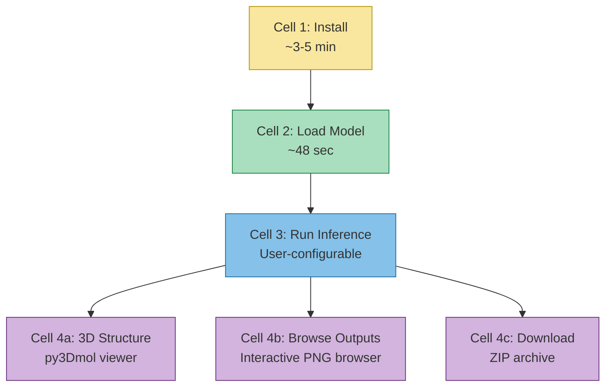

---
slug:11-colab-notebook-workflow
blog_type:normal
---


ESMDynamic Colab 笔记本提供了一个零安装、基于浏览器的界面，用于运行动态接触预测、频率估计和动力学分类——所有这些都由提供 GPU 支持的 Google Colab 运行时驱动。它将完整的推理流程封装为四个顺序执行的单元格：**安装 → 加载 → 预测 → 可视化/下载**，无需配置本地环境即可使用该模型。

来源：[esmdynamic.ipynb](/examples/esmdynamic/esmdynamic.ipynb#L1-L1316)

## 笔记本架构

该笔记本遵循线性的四单元格工作流，每个单元格的执行均依赖于前一个单元格的成功完成。此设计将安装和模型加载产生的一次性高开销，与轻量级的推理和可视化步骤隔离开来。



来源：[esmdynamic.ipynb](/examples/esmdynamic/esmdynamic.ipynb#L1-L1316)

## 单元格 1 — 安装

第一个单元格在单次执行中处理所有的依赖项解析和权重下载。它使用 `aria2c`（一种高速多协议下载器）并行获取 ESMFold 基础权重和 ESMDynamic 微调权重，同时 `pip` 按顺序安装所需的库。

**安装内容：**

| 依赖项 | 用途 |
|---|---|
| `mdtraj` | PDB 结构 I/O 与分析 |
| `omegaconf` | 配置管理 |
| `pytorch_lightning` | 训练框架依赖 |
| `biopython` | FASTA/序列解析 |
| `ml_collections` | 配置容器 |
| `einops` | 张量重塑工具 |
| `py3Dmol` | 交互式 3D 分子可视化 |
| `modelcif` | ModelCIF 格式支持 |
| `openfold` | OpenFold 注意力内核 |
| `esmdynamic` | ESMDynamic 核心包 |

**下载内容：**

| 文件 | 来源 URL | 描述 |
|---|---|---|
| `esmfold.model` | `colabfold.steineggerlab.workers.dev` | ESMFold 基础模型权重 |
| `esmdynamic.pt` | `databank.illinois.edu` | ESMDynamic 微调权重 |

该单元格使用标记文件（`finished_install`）来在重新执行时跳过冗余的 pip 安装，并轮询 `aria2` 的完成状态，以确保权重在继续执行前已完全下载。实际耗时通常为 **3–5 分钟**。

<CgxTip>在重新运行时，标记文件会阻止重新安装——仅运行权重下载检查，使得后续执行几乎瞬间完成。</CgxTip>

来源：[esmdynamic.ipynb](/examples/esmdynamic/esmdynamic.ipynb#L34-L74)

## 单元格 2 — 模型加载

第二个单元格将两个模型加载到 GPU 内存中。它执行**两阶段加载**：首先通过 `torch.load` 加载 ESMFold 基础模型，然后通过 `load_state_dict(..., strict=False)` 加载应用了微调状态字典的 ESMDynamic 包装器。

```python
# 阶段 1：ESMFold 基础模型
model = torch.load(model_name, weights_only=False)
model.cuda().eval().requires_grad_(False)

# 阶段 2：ESMDynamic 包装器 + 微调权重
esmdynamic_model = esmdynamic.ESMDynamic(load_esmfold=False)
esmdynamic_model.esmfold = model
esmdynamic_model.load_esmfold = True
state_dict_esmd = torch.load("esmdynamic.pt")
esmdynamic_model.load_state_dict(state_dict_esmd, strict=False)
esmdynamic_model.cuda().eval().requires_grad_(False)
```

此加载模式中的关键设计决策：`load_esmfold=False` 推迟了 ESMFold 自身的初始化，因为权重已被单独加载；`strict=False` 允许状态字典仅包含 ESMDynamic 特有的键（`DynamicHead` 参数），而无需匹配每一个 ESMFold 参数。该单元格还处理**内存清理**——如果已存在先前的模型，它将删除旧引用，运行 `gc.collect()`，并在加载新模型前清空 CUDA 缓存。实际耗时通常为 **约 48 秒**。

来源：[esmdynamic.ipynb](/examples/esmdynamic/esmdynamic.ipynb#L76-L101)

## 单元格 3 — 运行推理

这是主要的交互单元格，以带有可配置参数的 Colab 表单形式呈现。它支持三种互斥的输入模式，并生成完整的 ESMDynamic 输出集合。

### 输入参数

| 参数 | 类型 | 默认值 | 描述 |
|---|---|---|---|
| `sequence` | string | HIV1P dimer | 直接输入氨基酸字符串；使用 `/` 表示链断裂 |
| `sequence_id` | string | `"HIV1P"` | 序列标识符 |
| `fasta_path` | string | `""` | FASTA 文件路径（`sequence` 的替代方案） |
| `csv_path` | string | `""` | 包含 `id,seq` 列的 CSV 文件路径（替代方案） |
| `batch_size` | integer | 1 | 每个推理批次的序列数量 |
| `chunk_size` | integer | 256 | 用于内存管理的注意力块大小 |
| `output_dir` | string | `"outputs"` | 保存输出的根目录 |
| `chain_ids` | string | `""` | 自定义链 ID 标签（例如 `"ABC"`） |
| `low_memory` | boolean | `False` | 启用[低内存推理模式](13-low-memory-inference-mode) |
| `num_recycles` | integer | 3 | Evoformer 循环迭代次数（-1 表示默认值） |
| `save_html` | boolean | `True` | 保存交互式 Plotly HTML 热图 |
| `save_png` | boolean | `True` | 保存静态 PNG 热图/图表 |
| `save_txt` | boolean | `True` | 保存纯文本矩阵/CSV 文件 |
| `save_raw_pt` | boolean | `True` | 将所有输出保存为 `.pt` 打包文件 |

### 序列输入模式

笔记本会验证提供的输入源（`sequence`、`fasta_path` 或 `csv_path`）**有且仅有一个**。链断裂会被标准化：原始输入中的 `/` 会在内部转换为 `:`，并且序列会转换为大写，同时剔除非氨基酸字符。对于多链输入，在 ESMFold 推理期间会在链之间插入一个 25 残基的甘氨酸连接符（`X` × 25），然后从所有输出矩阵中裁剪掉该连接符。

代码库中提供的示例数据文件展示了 FASTA 和 CSV 两种输入方式：

- **FASTA** ([example.fasta](/examples/esmdynamic/example.fasta))：包含 ASCT2、SWEET2b、De_novo 和 HIV1P 的序列（最后一个使用 `:` 链断裂表示同源二聚体）
- **CSV** ([example.csv](/examples/esmdynamic/example.csv))：相同序列，采用 `id,seq` 列格式

来源：[esmdynamic.ipynb](/examples/esmdynamic/esmdynamic.ipynb#L103-L300), [example.fasta](/examples/esmdynamic/example.fasta#L1-L8), [example.csv](/examples/esmdynamic/example.csv#L1-L5)

### 推理执行与输出目录结构

核心推理调用如下：

```python
prediction = esmdynamic_model.predict_from_seqs(
    list(raw_seqs),
    low_memory=low_memory,
    num_recycles=num_recycles,
)
```

此调用返回一个以预测头名称为键的字典（参见[多头预测设计](7-multi-head-prediction-design)）。然后，笔记本会遍历批次中的每个序列，从所有矩阵中裁剪掉连接符位置，并将各预测头的输出保存到结构化的目录树中：

```
outputs/
└── {sequence_id}/
    ├── dynamic/
    │   ├── {id}_dynamic_prob_{T}K.{txt,png,html}
    │   ├── {id}_dynamic_pred_{T}K.{txt,png,html}
    │   └── {id}_dynamic_confidence_{T}K.{txt,png}
    ├── frequency/
    │   ├── {id}_frequency_pred_{T}K.{txt,png,html}
    │   └── {id}_frequency_error_{T}K.{txt,png,html}
    ├── kinetics/
    │   ├── {id}_kinetics_on_class_{T}K.{txt,png,html}
    │   ├── {id}_kinetics_off_class_{T}K.{txt,png,html}
    │   ├── {id}_kinetics_on_probabilities_{T}K.npz
    │   ├── {id}_kinetics_off_probabilities_{T}K.npz
    │   ├── {id}_kinetics_on_classes_{T}K.txt
    │   ├── {id}_kinetics_off_classes_{T}K.txt
    │   └── {id}_kinetics_confidence_{T}K.{txt,png}
    ├── native/
    │   └── {id}_native_contacts.{txt,png,html}
    ├── dynamic_nonnative/
    │   └── {id}_dynamic_nonnative_{T}K.{txt,png,html}
    ├── native_nondynamic/
    │   └── {id}_native_nondynamic_{T}K.{txt,png,html}
    └── {id}_all_outputs.pt
```

每个温度变体 `{T}` 的取值来自五个模拟温度：**320、348、379、413、450 K**。这些对应于笔记本和[批量预测脚本](10-bulk-prediction-script)中定义的 `TEMPERATURES` 常量。

来源：[esmdynamic.ipynb](/examples/esmdynamic/esmdynamic.ipynb#L200-L700), [predict.py](/esm/esmdynamic/predict.py#L30-L38)

### 输出头与文件类型

| 预测头 | 输出键 | 形状 | 文件变体 |
|---|---|---|---|
| **Dynamic** | `dynamic_prob` | `[T, L, L]` | 概率、预测 (prob, pred, 二值)、置信度 (confidence, 逐残基) |
| **Frequency** | `frequency_pred` | `[T, L, L]` | 占据率/频率、残差/误差 |
| **Kinetics** | `kinetic_prob` | `[T, 2, L, L, C]` | 开启类别 (on-class)、关闭类别 (off-class)、概率 (.npz)、置信度 |
| **Native contacts** | `native_contacts` | `[L, L]` | 单一矩阵 (无温度维度) |
| **Dynamic non-native** | `dynamic_nonnative_contacts` | `[T, L, L]` | 属于动态接触但不在静态结构中的接触 |
| **Native non-dynamic** | `native_nondynamic_contacts` | `[T, L, L]` | 属于静态结构但未动态形成的接触 |

动力学预测头对开启时间和关闭时间均产生**六类分类**。类别名称如下：

| 索引 | 开启时间类别 | 关闭时间类别 |
|---|---|---|
| 0 | `always_on` | `always_off` |
| 1 | `1to10ns` | `1to10ns` |
| 2 | `10to100ns` | `10to100ns` |
| 3 | `100to300ns` | `100to300ns` |
| 4 | `gt300ns` | `gt300ns` |
| 5 | `never_on` | `never_off` |

来源：[esmdynamic.ipynb](/examples/esmdynamic/esmdynamic.ipynb#L200-L700), [predict.py](/esm/esmdynamic/predict.py#L40-L57)

## 单元格 4a — 3D 结构可视化

此单元格使用 **py3Dmol** 直接在笔记本中渲染预测的蛋白质结构。它运行一次全新的 ESMFold 推理（通过 `esmdynamic_model.esmfold.infer()`）以获取原子坐标，将其转换为 PDB 字符串，并渲染交互式 3D 查看器。

**可视化选项：**

| 参数 | 选项 | 描述 |
|---|---|---|
| `color` | `confidence`, `rainbow`, `chain` | 配色方案——`confidence` 将 pLDDT 分数映射到蓝→红渐变色 |
| `show_sidechains` | boolean | 将侧链原子渲染为棍状 |
| `show_mainchains` | boolean | 将主链原子渲染为棍状 |

块大小会根据序列总长度自动调整：对于超过 700 个残基的序列设为 **64**，否则设为 **128**。多链结构会显示链边界并支持动画。

来源：[esmdynamic.ipynb](/examples/esmdynamic/esmdynamic.ipynb#L860-L1000)

## 单元格 4b — 浏览已保存的输出

此单元格为已保存的 PNG 热图提供了一个笔记本内交互式浏览器。它暴露了三个下拉列表形式的参数：

| 参数 | 选项 | 描述 |
|---|---|---|
| `sample_id` | string (例如 `"HIV1P"`) | 要展示哪个序列的输出 |
| `output_type` | dropdown | 11 种输出类型之一 (dynamic_prob, frequency_pred, kinetics_on_class 等) |
| `temperature` | `320`, `348`, `379`, `413`, `450` | 以开尔文为单位的温度变体 |

如果请求的文件不存在，则回退为列出该样本所有可用的 PNG 文件。此单元格专为**迭代探索**而设计——更改任何参数并重新运行即可检查不同的输出，而无需重新运行推理。

来源：[esmdynamic.ipynb](/examples/esmdynamic/esmdynamic.ipynb#L1000-L1200)

## 单元格 4c — 下载预测结果

最后一个单元格将整个输出目录打包为 ZIP 存档，并通过 `google.colab.files.download()` 触发浏览器下载。存档名称派生自 `sequence_id`（例如 `HIV1P.zip`），并递归包含所有子文件夹——保留 `dynamic/`、`frequency/`、`kinetics/`、`native/`、`dynamic_nonnative/` 和 `native_nondynamic/` 目录结构。

来源：[esmdynamic.ipynb](/examples/esmdynamic/esmdynamic.ipynb#L1200-L1260)

## Colab 限制与 GPU 约束

| 约束 | 详情 |
|---|---|
| **最大序列长度** | 在 Tesla T4 (免费 Colab GPU) 上约 900 个残基 |
| **GPU 类型** | 通常为 T4 (16 GB VRAM)；Colab Pro 可能分配 V100 或 A100 |
| **块大小自动调整** | 笔记本根据蛋白质长度调整块大小以适应 VRAM |
| **安装时间** | 首次运行约 3–5 分钟；重新运行几乎瞬间完成 |
| **会话超时** | 免费 Colab 会话在闲置约 12 小时后超时 |

对于超出 T4 内存限制的序列，请考虑在本地 GPU 上使用[低内存推理模式](13-low-memory-inference-mode)或[批量预测脚本](10-bulk-prediction-script)。

来源：[esmdynamic.ipynb](/examples/esmdynamic/esmdynamic.ipynb#L22-L29)

## CV 选择流程（配套笔记本）

第二个笔记本 `cv_selection_pipeline.ipynb` 演示了一个**后处理工作流**，用于从 ESMDynamic 接触图中选择分子动力学模拟的集体变量（CVs）。这是一个三步流程：


**步骤 1 — 过滤：**提取满足 `|i - j| > 40` 且接触概率超过 0.5 的接触对 `(i, j)`。距离阈值消除了对于 CV 选择无意义的局部/序列接触。

**步骤 2 — 聚类：**在过滤后的接触坐标上，应用带有 cityblock（曼哈顿）距离度量的单链接层次聚类。用户需指定 `n_clusters`（例如 9，与文献基线匹配）。

**步骤 3 — 选择：**从每个聚类中挑选在 ESMDynamic 图中具有**最高预测概率**的接触对。这些选出的接触对将作为增强采样模拟的集体变量。

该笔记本作用于预先保存的 `.npy` 接触图文件（例如 `OsSWEET2b_esmdynamic_contact_map.npy`），这是先前 ESMDynamic 预测运行的输出。

来源：[cv_selection_pipeline.ipynb](/examples/esmdynamic/cv_selection_pipeline.ipynb#L1-L248)

## 快速入门清单

从零开始运行 ESMDynamic Colab 笔记本：

1. 通过 [esmdynamic.ipynb](/examples/esmdynamic/esmdynamic.ipynb) 顶部的 "Open in Colab" 徽章**打开**笔记本
2. 将运行时**设置**为 GPU：`运行时 → 更改运行时类型 → T4 GPU`
3. **运行单元格 1**（安装）——等待约 3–5 分钟完成
4. **运行单元格 2**（加载模型）——等待约 48 秒
5. **配置单元格 3**——设置你的序列、输出格式标志和参数
6. **运行单元格 3**（推理）——输出将保存到 `outputs/` 目录
7. **运行单元格 4a** 以查看 3D 结构，**单元格 4b** 以浏览热图，或**单元格 4c** 以下载 ZIP 包

若要深入了解这些输出背后的模型内部机制，请参阅 [ESMDynamic 模型类](5-esmdynamic-model-class) 和[多头预测设计](7-multi-head-prediction-design)。若要在本地不使用 Colab 运行相同流程，请参阅[批量预测脚本](10-bulk-prediction-script)。