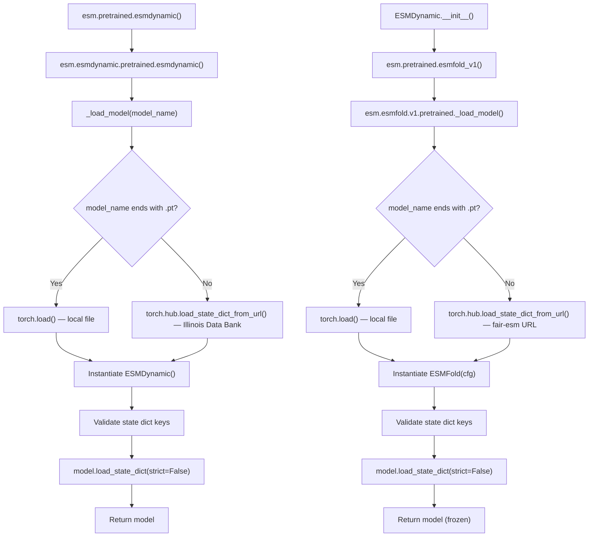
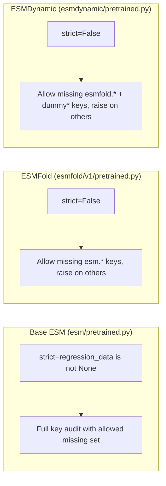

---
slug:12-pretrained-model-and-weight-loading
blog_type:normal
---


ESMDynamic项目实现了一个**双层预训练权重加载系统**——基础层继承自Meta的ESM框架，负责处理ESM-1/2/MSA/IF/Fold模型；ESMDynamic专用层则负责协调从Illinois Data Bank加载经过微调的动态接触预测模型。理解这一层级结构对于正确初始化模型、排查权重不匹配问题以及使用自定义检查点扩展框架至关重要。

## 加载架构概述

本仓库的权重加载遵循**委派链**模式：`esm.pretrained`中的顶层入口点将任务分派给特定模型的加载器，每个加载器负责解析权重来源（远程URL或本地文件）、实例化模型架构、验证状态字典，并以受控的严格度加载参数。



当你调用`esm.pretrained.esmdynamic()`时，会顺序执行两次独立的权重下载：首先是从Illinois Data Bank下载ESMDynamic检查点，然后（在`ESMDynamic.__init__`期间）从Facebook的CDN下载ESMFold v1检查点。这意味着**首次加载时需要网络连接**，不过PyTorch Hub会在`torch.hub.get_dir()/checkpoints/`目录下本地缓存文件，以供后续使用。

来源：[pretrained.py](esm/pretrained.py#L423-L428), [pretrained.py](esm/esmdynamic/pretrained.py#L1-L36), [pretrained.py](esm/esmfold/v1/pretrained.py#L1-L55)

## ESMDynamic预训练加载器

位于`esm/esmdynamic/pretrained.py`的ESMDynamic专用加载器设计得极其精简——它仅执行四项操作：来源解析、模型实例化、键验证和状态字典加载。

**来源解析**会检查`model_name`字符串是否以`.pt`结尾。如果是，则将该字符串视为本地文件路径并直接调用`torch.load()`；否则，使用`torch.hub.load_state_dict_from_url()`（设置`progress=True`且`map_location="cpu"`）从固定URL `https://databank.illinois.edu/datafiles/7odsk/download` 所在的Illinois Data Bank仓库中获取。下载的文件以`{model_name}.pt`名称缓存，从而避免重复运行时重新下载。

来源：[pretrained.py](esm/esmdynamic/pretrained.py#L6-L29)

### 键验证逻辑

ESMDynamic加载器在调用`load_state_dict`之前会执行**选择性键验证**。它会将新实例化模型所需的键与检查点中找到的键进行比对，但会**容忍缺失的**以`"esmfold."`或`"dummy"`为前缀的键。这一设计反映了ESMDynamic包含一个冻结的ESMFold子模块（其权重单独加载，见下文）以及一个注册的dummy缓冲区的架构事实：

```python
missing_essential_keys = []
for missing_key in expected_keys - found_keys:
    if not (missing_key.startswith("esmfold.") or missing_key.startswith("dummy")):
        missing_essential_keys.append(missing_key)

if missing_essential_keys:
    raise RuntimeError(f"Keys '{', '.join(missing_essential_keys)}' are missing.")

model.load_state_dict(model_data, strict=False)
```

任何**未**以`"esmfold."`或`"dummy"`为前缀的缺失键都将被视为致命错误——这能在早期捕获损坏或不兼容的检查点。随后的`strict=False`加载会静默跳过已验证过的缺失键，并允许检查点中存在额外的键（向前兼容）。

<CgxTip>ESMDynamic检查点**不**包含ESMFold权重。ESMFold子模块在`ESMDynamic.__init__()`内部独立初始化和加载。这种分离使得ESMDynamic检查点更加紧凑，但也意味着首次使用时会发生两次网络获取。</CgxTip>

来源：[pretrained.py](esm/esmdynamic/pretrained.py#L16-L28)

### `esmdynamic()`公共API

该模块暴露了一个单一的公共函数：

```python
from esm.esmdynamic.pretrained import esmdynamic
model = esmdynamic()  # 返回加载了预训练权重的ESMDynamic
```

该函数委派给`_load_model("esmdynamic")`，后者负责获取名为`"esmdynamic.pt"`的检查点。同一函数通过顶层`esm.pretrained`模块重新导出，以实现统一访问：

```python
import esm
model = esm.pretrained.esmdynamic()  # 等效入口点
```

来源：[pretrained.py](esm/esmdynamic/pretrained.py#L32-L36), [pretrained.py](esm/pretrained.py#L423-L428)

## ESMDynamic中的ESMFold权重加载

当构造`ESMDynamic`实例时设置`load_esmfold=True`（默认值），其内部会调用`esm.pretrained.esmfold_v1()`以获取一个完全加载的ESMFold模型，随后立即将其冻结：

```python
if self.load_esmfold:
    self.esmfold = esm.pretrained.esmfold_v1()
    self.esmfold.requires_grad_(False)
```

ESMFold加载器遵循与ESMDynamic加载器相同的模式——在本地解析`.pt`路径，或远程从`https://dl.fbaipublicfiles.com/fair-esm/models/{model_name}.pt`获取。其键验证容忍以`"esm."`为前缀的缺失键（即内部ESM-2语言模型，其权重以不同的命名嵌入在ESMFold检查点中）：

| 方面 | ESMDynamic加载器 | ESMFold加载器 |
|---|---|---|
| **远程URL** | `https://databank.illinois.edu/datafiles/7odsk/download` | `https://dl.fbaipublicfiles.com/fair-esm/models/{name}.pt` |
| **默认模型名称** | `"esmdynamic"` | `"esmfold_3B_v1"` |
| **容忍的缺失键前缀** | `"esmfold."`, `"dummy"` | `"esm."` |
| **进度条** | `True` | `False` |
| **返回值** | `ESMDynamic`模型 | `ESMFold`模型 |

来源：[esmdynamic.py](esm/esmdynamic/esmdynamic.py#L236-L239), [pretrained.py](esm/esmfold/v1/pretrained.py#L8-L33)

## 基础ESM预训练加载 (ESM-1, ESM-2, MSA, IF)

基础`esm/pretrained.py`模块提供了传统的ESM模型加载基础设施。其核心调度函数`load_model_and_alphabet()`会根据名称是否以`.pt`结尾，路由至`load_model_and6_alphabet_local()`或`load_model_and_alphabet_hub()`。

### Hub与本地加载

**Hub加载**从`https://dl.fbaipublicfiles.com/fair-esm/models/{model_name}.pt`下载模型权重，并可选择从`https://dl.fbaipublicfiles.com/fair-esm/regression/{model_name}-contact-regression.pt`下载回归接触权重。`load_hub_workaround()`函数处理两种失败模式：由PyTorch版本不兼容引起的`RuntimeError`（回退到直接从Hub缓存执行`torch.load`），以及由模型名称错误引起的`HTTPError`。

**本地加载**通过`torch.load()`直接读取`.pt`文件，并通过在同一路径主干后附加`-contact-regression.pt`来并置回归权重。

来源：[pretrained.py](esm/pretrained.py#L24-L77)

### 特定架构的状态字典升级

`load_model_and_alphabet_core()`函数根据模型名称前缀分派给两个版本化加载器之一：

| 前缀 | 加载器 | 模型 |
|---|---|3|
| `"esm2"` | `_load_model_and_alphabet_core_v2` | ESM-2系列（8M至15B） |
| 所有其他 | `_load_model_and_alphabet_core_v1` | ESM-1B, ESM-1v, MSA Transformer, ESM-IF |

**v1加载器**通过剥离检查点前缀命名空间（`encoder_`、`encoder.`、`sentence_encoder.`、`decoder_`、`decoder.`）并应用特定架构的名称重映射，来处理四种架构类型。对于逆折叠模型（`invariant_gvp`），`update_name()`函数将内部代码名映射到开源名（例如，`W_v` → `embed_graph.embed_node`）。

**v2加载器**使用基于正则表达式的`upgrade_state_dict()`，该函数移除`encoder.sentence_encoder.`和`encoder.`前缀，然后直接从检查点的`cfg["model"]`超参数构造一个`ESM2`实例。

构造完成后，两个加载器都会执行**严格键审计**：比对期望键与找到的键，当回归数据缺失时，仅允许`contact_head.regression.weight`和`contact_head.regression.bias`作为预期的缺失键，对于任何其他差异则抛出`RuntimeError`。

来源：[pretrained.py](esm/pretrained.py#L85-L221)

## 可用预训练模型

下表列出了通过`esm.pretrained`暴露并在`hubconf.py`中注册以兼容PyTorch Hub的所有预训练模型访问器：

| 访问器 | 系列 | 参数量 | 训练数据 | 返回值 |
|---|---|---|---|---|
| `esm1_t6_43M_UR50S` | ESM-1 | 43M | UniRef50 Sparse | `(Model, Alphabet)` |
| `esm1_t12_85M_UR50S` | ESM-1 | 85M | UniRef50 Sparse | `(Model, Alphabet)` |
| `esm1_t34_670M_UR50S` | ESM-1 | 670M | UniRef50 Sparse | `(Model, Alphabet)` |
| `esm1_t34_670M_UR50D` | ESM-1 | 670M | UniRef50 Dense | `(Model, Alphabet)` |
| `esm1_t34_670M_UR100` | ESM-1 | 670M | UniRef100 | `(Model, Alphabet)` |
| `esm1b_t33_650M_UR50S` | ESM-1b | 650M | UniRef50 Sparse | `(Model, Alphabet)` |
| `esm1v_t33_650M_UR90S_{1–5}` | ESM-1v | 650M | UniRef90 (集成) | `(Model, Alphabet)` |
| `esm_msa1b_t12_100M_UR50S` | ESM-MSA | 100M | UniRef50 Sparse | `(Model, Alphabet)` |
| `esm2_t6_8M_UR50D` | ESM-2 | 8M | UniRef50 Dense | `(Model, Alphabet)` |
| `esm2_t12_35M_UR50D` | ESM-2 | 35M | UniRef50 Dense | `(Model, Alphabet)` |
| `esm2_t30_150M_UR50D` | ESM-2 | 150M | UniRef50 Dense | `(Model, Alphabet)` |
| `esm2_t33_650M_UR50D` | ESM-2 | 650M | UniRef50 Dense | `(Model, Alphabet)` |
| `esm2_t36_3B_UR50D` | ESM-2 | 3B | UniRef50 Dense | `(Model, Alphabet)` |
| `esm2_t48_15B_UR50D` | ESM-2 | 15B | UniRef50 Dense | `(Model, Alphabet)` |
| `esmfold_v0` | ESMFold | 3B | PDB (≤2020-05) | `ESMFold` |
| `esmfold_v1` | ESMFold | 3B | PDB (扩展) | `ESMFold` |
| `esm_if1_gvp4_t16_142M_UR50` | ESM-IF | 142M | CATH + AF2 | `(Model, Alphabet)` |
| **`esmdynamic`** | **ESMDynamic** | **3B+heads** | **MD轨迹** | **`ESMDynamic`** |

注意返回类型的差异：ESM-1/2/MSA/IF模型返回一个`(model, alphabet)`元组，而ESMFold和ESMDynamic直接返回模型对象（字母表内嵌在模型中）。

来源：[pretrained.py](esm/pretrained.py#L224-L428), [hubconf.py](hubconf.py#L8-L32)

## PyTorch Hub集成

`hubconf.py`文件为PyTorch Hub注册了所有模型加载器，从而支持通过以下方式加载：

```python
model, alphabet = torch.hub.load("ShuklaGroup/esmdynamic", "esm2_t33_650M_UR50D")
```

`dependencies = ["torch"]`声明确保了PyTorch在导入前可用。所有ESM-1/2/MSA/IF/Fold函数均从`esm.pretrained`导入，而`esmdynamic`函数可通过同一模块访问。请注意，ESMDynamic函数**未**列在`hubconf.py`的显式导入中——在模块加载后，仍可通过`esm.pretrained.esmdynamic`访问它。

来源：[hubconf.py](hubconf.py#L1-L33)

## 从本地检查点加载

ESMDynamic和ESMFold加载器均支持通过传入文件路径而非模型名称，从本地`.pt`文件加载：

```python
# 从本地检查点加载ESMDynamic
from esm.esmdynamic.pretrained import _load_model
model = _load_model("/path/to/my_esmdynamic.pt")

# 从本地检查点加载ESMFold（由ESMDynamic内部使用）
from esm.esmfold.v1.pretrained import _load_model
fold_model = _load_model("/path/to/esmfold_3B_v1.pt")

# 从本地检查点加载基础ESM模型
import esm
model, alphabet = esm.pretrained.load_model_and_alphabet("/path/to/esm2_t33_650M_UR50D.pt")
```

对于基础ESM模型，本地加载还会在同一目录中搜索并置的回归权重文件（`{stem}-contact-regression.pt`）。如果回归文件缺失，将发出警告，提示接触预测将无法产生正确结果。

来源：[pretrained.py](esm/esmdynamic/pretrained.py#L7-L9), [pretrained.py](esm/esmfold/v1/pretrained.py#L9-L11), [pretrained.py](esm/pretrained.py#L67-L77)

## 批量权重下载脚本

`scripts/download_weights.sh` shell脚本提供了一种**离线优先**的工作流，用于预下载所有基础ESM模型权重。它需要`aria2c`以支持并行下载，并会解析README.md表格以提取模型URL，然后使用每个文件10个并行连接下载模型和回归权重。重新运行该脚本可恢复未完成的下载（通过`.aria2`控制文件检测）。

```bash
# 将所有权重下载到默认目录（当前工作目录）
bash scripts/download_weights.sh

# 下载到指定目录
bash scripts/download_weights.sh /path/to/weights/
```

<CgxTip>此脚本仅从`dl.fbaipublicfiles.com`下载基础ESM模型权重。来自Illinois Data Bank的ESMDynamic权重**未**包含在内，必须通过Python API或手动下载`https://databank.illinois.edu/datafiles/7odsk/download`单独获取。</CgxTip>

来源：[download_weights.sh](scripts/download_weights.sh#L1-L60)

## 状态字典加载严格度比较

这三个加载子系统在检查点与模型架构之间强制键匹配的严格程度上有所不同：



| 加载器 | `strict`标志 | 显式验证 | 允许的缺失前缀 | 遇到未知额外键时抛出异常？ |
|---|---|---|---|---|
| 基础ESM | 若有回归数据为`True`，否则为`False` | 使用`expected_missing`集合进行完整审计 | `contact_head.regression.{weight,bias}` | 是（当存在回归数据时） |
| ESMFold | `False` | 前缀过滤检查 | `esm.*` | 否 |
| ESMDynamic | `False` | 前缀过滤检查 | `esmfold.*`, `dummy*` | 否 |

基础ESM加载器最为严格——它执行详尽的键审计，并在存在回归权重时遇到任何意外键时抛出异常。ESMFold和ESMDynamic加载器则采用更宽松的方法：它们验证所有必需的键是否存在（排除已知的可选前缀），然后使用`strict=False`加载，以允许带有额外键的向前兼容检查点。

来源：[pretrained.py](esm/pretrained.py#L186-L221), [pretrained.py](esm/esmfold/v1/pretrained.py#L20-L31), [pretrained.py](esm/esmdynamic/pretrained.py#L16-L28)

## 加载头与选择性权重加载

在构造`ESMDynamic`模型时，`heads_to_load`参数控制实例化哪些预测头——进而决定检查点中必须存在哪些头的权重。三个默认头为`"dynamic"`、`"kinetic"`和`"frequency"`：

```python
# 仅加载动态接触头（内存占用更小）
model = esm.pretrained.esmdynamic(heads_to_load=["dynamic"])

# 加载动态和动力学头
model = esm.pretrained.esmdynamic(heads_to_load=["dynamic", "kinetic"])

# 加载所有头（默认）
model = esm.pretrained.esmdynamic()
```

当指定`heads_to_load`时，仅使用`default_head_definitions`中匹配的子集来构建`self.heads`（一个`nn.ModuleDict`）。这意味着从检查点加载的状态字典将包含所有头的键，但`strict=False`加载会静默忽略未实例化头的额外键。这提供了一种无需修改检查点即可减少GPU内存占用的便捷方法。

来源：[esmdynamic.py](esm/esmdynamic/esmdynamic.py#L252-L325)

## 权重加载故障排除

| 症状 | 可能原因 | 解决方案 |
|---|---|---|
| 模型下载时出现`HTTPError` | 模型名称错误或网络问题 | 对照上表验证模型名称；检查网络连接 |
| `RuntimeError: Keys '...' are missing` | 检查点架构不匹配 | 确保检查点与模型版本匹配；检查`esmfold.`/`dummy`/`esm.`前缀过滤 |
| 来自`load_hub_workaround`的`RuntimeError` | PyTorch版本不兼容 | 升级PyTorch，或`load_hub_workaround`中的回退路径应自动处理此问题 |
| 回归权重警告 | 缺少`-contact-regression.pt`文件 | 对于本地加载，将回归文件与模型`.pt`文件并置；Hub加载会自动获取 |
| `esm2_t48_15B_UR50D`上出现`OOM` | 15B模型超出GPU内存 | 使用带ZeRO CPU卸载的FSDP（参见README），或使用[低内存推理模式](13-low-memory-inference-mode) |
| 首次加载缓慢 | 两次顺序网络下载 | 预下载权重；ESMDynamic检查点大小与ESMFold 3B相当 |

来源：[pretrained.py](esm/pretrained.py#L31-L43), [pretrained.py](esm/pretrained.py#L214-L217)

## 下一步

现在你已经了解了预训练权重是如何解析、验证和加载的，接下来可以探索如何高效运行推理：

- **[低内存推理模式](13-low-memory-inference-mode)** —— 了解`forward_from_seq_low_memory()`如何在ESMFold和头计算之间卸载模块，以适配显存受限的GPU。
- **[批量预测脚本](10-bulk-prediction-script)** —— 查看封装了加载和预测流水线并支持批处理与多格式输出的生产就绪型CLI。
- **[ESMDynamic模型类](5-esmdynamic-model-class)** —— 深入了解接收这些预训练权重的模型架构。