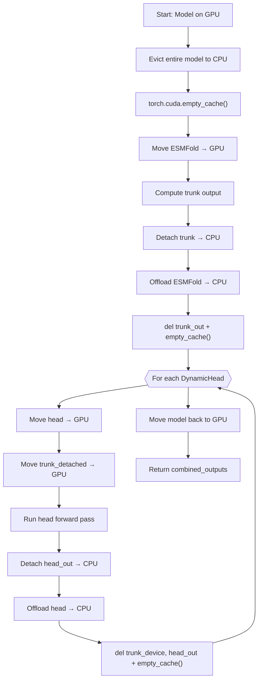

---
slug:13-low-memory-inference-mode
blog_type:normal
---


ESMDynamic 的低内存推理模式是一种**即时模块卸载**策略，该策略通过避免将完整模型同时保留在设备上来降低 GPU 峰值内存。低内存路径不再将 ESMFold 和所有 DynamicHeads 同时加载到 GPU 上，而是仅在需要某个子模块时才将其移至设备，随后立即将其卸载回 CPU——从而为下一阶段释放显存（VRAM）。这使得在原本会因内存不足而失败的 GPU 上进行推理成为可能，其代价是每个序列增加了额外的 CPU↔GPU 传输开销。

来源: [esmdynamic.py](esm/esmdynamic/esmdynamic.py#L458-L546), [predict.py](esm/esmdynamic/predict.py#L70-L73)

## 工作原理：逐模块卸载

核心实现位于 `ESMDynamic.forward_from_seq_low_memory()` 中。当检测到 CUDA 设备时，该方法将执行以下序列：(1) **将整个模型逐出至 CPU**，并调用 `torch.cuda.empty_cache()` 回收显存；(2) **仅将 ESMFold 移至 GPU**，运行结构前向传播，然后将主干网络输出分离并移至 CPU；(3) **将 ESMFold 卸载回 CPU**，删除 GPU 端的主干网络输出，并再次清空缓存；(4) **遍历每个 DynamicHead**，每次将一个头部连同缓存在 CPU 的主干网络输出一起移至 GPU，运行该头部的前向传播，将结果分离并移至 CPU，然后卸载该头部并清空缓存；(5) 最后，将整个模型移回 GPU 以备下次调用。这确保了 ESMFold 与任何 DynamicHead 在任何时刻都不会同时占用 GPU 内存。



上图追踪了在一次 `forward_from_seq_low_memory` 调用过程中每个子模块的精确生命周期。关键的约束条件是，GPU 绝不会同时持有 ESMFold 权重与任何 DynamicHead 权重——其峰值内存受限于 `max(sizeof(ESMFold), sizeof(largest_head)) + sizeof(input_tensors)`，而非 `sizeof(full_model)`。

来源: [esmdynamic.py](esm/esmdynamic/esmdynamic.py#L458-L546)

## API 接口：`low_memory` 参数

低内存路径通过公共的 `predict_from_seqs()` 方法暴露，该方法作为规范的推理入口。当 `low_memory=True` 时，它会委托给 `forward_from_seq_low_memory()`；否则，它将调用标准的 `forward_from_seq()`，后者会将整个模型常驻于 GPU。

| 参数 | 类型 | 默认值 | 描述 |
|-----------|------|---------|-------------|
| `low_memory` | `bool` | `None` | 启用即时模块卸载。以 CPU↔GPU 传输延迟为代价换取 GPU 内存节省。 |
| `sequences` | `Union[str, List[str]]` | 必需 | 待预测的一个或多个氨基酸序列。 |
| `num_recycles` | `Optional[int]` | `None` | 覆盖循环迭代次数（默认：训练时的最大循环次数）。 |
| `residue_index_offset` | `int` | `512` | 多聚体预测中链之间的残基索引间隔。 |
| `chain_linker` | `str` | `"G" * 25` | 多聚体输入中链之间的连接序列。 |

**编程式用法：**

```python
from esm.pretrained import esmdynamic

model = esmdynamic()
model = model.to("cuda")
model.eval()

# 标准推理 — 完整模型位于 GPU
result = model.predict_from_seqs(["MKTVRQERLKSI"], low_memory=False)

# 低内存推理 — 逐模块卸载
result = model.predict_from_seqs(["MKTVRQERLKSI"], low_memory=True)
```

来源: [esmdynamic.py](esm/esmdynamic/esmdynamic.py#L548-L595)

## CLI 激活

批量预测脚本 `esm.esmdynamic.predict` 将 `--low_memory` 标志作为与其他推理选项兼容的参数暴露。设置该标志后，它会在每个批次中向 `model.predict_from_seqs()` 传入 `low_memory=True`。

```bash
# 标准推理
python -m esm.esmdynamic.predict --fasta proteins.fasta --output_dir results/

# 低内存推理
python -m esm.esmdynamic.predict --fasta proteins.fasta --output_dir results/ --low_memory
```

| CLI 标志 | 类型 | 默认值 | 作用 |
|----------|------|---------|--------|
| `--low_memory` | `store_true` | `False` | 通过 `forward_from_seq_low_memory` 激活即时模块卸载。 |
| `--chunk_size` | `int` | `256` | 控制注意力分块粒度（无论是否启用 `--low_memory` 均有效）。 |
| `--device` | `cpu\|cuda` | `cuda` | 目标设备；低内存模式仅在 `cuda` 时有效。 |
| `--batch_size` | `int` | `1` | 每批序列数；低内存模式在 `batch_size=1` 时效果最佳。 |

来源: [predict.py](esm/esmdynamic/predict.py#L49-L73), [predict.py](esm/esmdynamic/predict.py#L616-L658)

## 互补策略：分块大小控制

除了模块卸载之外，ESMDynamic 还通过 `set_chunk_size()` 支持**注意力分块**，该策略通过将大型注意力操作拆分为更小的块，降低了每个子模块前向传播内的峰值内存。这与低内存模式是正交的——这两种策略可组合且能同时使用。

分块大小通过两个层级传播：(1) `ESMDynamic.set_chunk_size()` 为 ESMFold 主干网络委托给 `self.esmfold.set_chunk_size()`；(2) 遍历每个 `DynamicHead.dynamic_module`，为其内部的 Evoformer 风格块调用其 `set_chunk_size()`。在内部，`DynamicModule` 在前向传播期间将 `chunk_size` 传递给每个 `TriangularSelfAttentionBlock`，后者将三角形乘法更新拆分为按分块大小的切片。

```python
model = esmdynamic()
model.set_chunk_size(64)   # 更小的分块 → 每次注意力操作的峰值显存更低
model = model.to("cuda")

# 将分块与低内存卸载结合以实现最大程度的内存节省
result = model.predict_from_seqs(["MKTVRQERLKSI"], low_memory=True)
```

来源: [esmdynamic.py](esm/esmdynamic/esmdynamic.py#L327-L332), [dynamic_module.py](esm/esmdynamic/dynamic_module.py#L74-L75), [dynamic_module.py](esm/esmdynamic/dynamic_module.py#L98-L103)

## 内存预算对比

下表总结了在典型推理工作负载下，每种策略的大致 GPU 内存预算。精确数值取决于序列长度、加载的头部数量以及硬件。

| 策略 | GPU 峰值内存 | 推理速度 | 适用场景 |
|----------|----------------|-----------------|----------|
| **标准** | `sizeof(ESMFold) + sizeof(all heads) + activations` | 最快（无传输） | 显存 ≥16 GB 的 GPU，短至中等长度序列 |
| **低内存卸载** | `max(sizeof(ESMFold), sizeof(head)) + activations` | 较慢（每阶段均有 CPU↔GPU 传输） | 显存 8–12 GB 的 GPU，任意序列长度 |
| **缩减分块大小** | `sizeof(model) + reduced_activations` | 适中变慢（分块注意力） | 在注意力计算期间导致 OOM 的长序列 |
| **卸载 + 分块** | `max(sizeof(ESMFold), sizeof(head)) + reduced_activations` | 最慢（两种开销并存） | 极小显存 GPU，长序列 |

<CgxTip>最常见的失败模式是在 ESMFold 的语言模型前向传播（fp16 下的 ESM-2 3B 参数）期间发生 OOM。如果单独使用 `--low_memory` 仍不够，请将其与 `--chunk_size 64` 及 `--batch_size 1` 结合使用。对于 15B 参数的 ESM-2 变体，请改用 `examples/esm2_infer_fairscale_fsdp_cpu_offloading.py` 中文档化的 FSDP CPU 卸载方案。</CgxTip>

来源: [esmdynamic.py](esm/esmdynamic/esmdynamic.py#L503-L517), [esm2_infer_fairscale_fsdp_cpu_offloading.py](examples/esm2_infer_fairscale_fsdp_cpu_offloading.py#L16-L21)

## 面向 ESM-2 15B 的 FSDP CPU 卸载

对于 ESM-2 15B 参数模型（ESMFold 在内部将其嵌入为语言模型主干），本仓库提供了一个基于 FairScale FSDP 的示例，该示例跨设备分片模型参数并将其卸载至 CPU。这是一种与 ESMDynamic 内置低内存模式**独立且互补的技术**——它运作在参数分片层级而非模块层级。

示例中使用的 FSDP 配置：

| FSDP 参数 | 值 | 目的 |
|----------------|-------|---------|
| `mixed_precision` | `True` | 以 fp16 运行计算以节省内存 |
| `cpu_offload` | `True` | 在不使用时将参数卸载至 CPU |
| `state_dict_device` | `cpu` | 将状态字典保留在 CPU 上以减少 GPU 内存 |
| `flatten_parameters` | `True` | 展平参数分片以提升效率 |

此方法将每个 ESM-2 层单独封装在 FSDP 中，从而实现细粒度的参数卸载。这主要在使用原始 ESM-2 模型提取嵌入，或者 ESMFold 内部的 ESM-2 主干超出可用显存时适用。

来源: [esm2_infer_fairscale_fsdp_cpu_offloading.py](examples/esm2_infer_fairscale_fsdp_cpu_offloading.py#L1-L52)

## 实现细节：输出分离与清理

低内存路径中一个微妙但重要的方面是其激进的**张量分离与删除**策略。在每个子模块前向传播之后，所有输出张量都会被 `.detach().cpu()`——这会断开计算图（阻止梯度累积）并确保不会残留任何 GPU 端引用。中间的 GPU 张量（`trunk_out`、`trunk_device`、`head_out`）会在调用 `torch.cuda.empty_cache()` 之前被显式 `del`，这迫使 PyTorch 将内存释放回 CUDA 分配器，而不是将其保留在缓存分配器的池中。这一序列——分离 → 移至 CPU → 删除 → empty_cache——在每个阶段边界处重复，对于实现预期的内存缩减至关重要。

<CgxTip>请勿在同样封装了 `torch.cuda.empty_cache()` 的 `torch.no_grad()` 上下文内部调用 `forward_from_seq_low_memory()`。清空缓存的调用必须在任何梯度追踪作用域之外急切执行才能生效。该方法被设计为通过 `predict_from_seqs()` 调用，后者已在外层应用了 `@torch.no_grad()`。</CgxTip>

来源: [esmdynamic.py](esm/esmdynamic/esmdynamic.py#L511-L542)

## 约束与权衡

低内存模式带有几个将其与标准推理路径区分开来的刻意约束：

- **无梯度计算** — `forward_from_seq_low_memory()` 明确指出其“无法在训练期间使用”。所有输出均被分离，断开了任何自动求导图。如需训练，请参阅[训练流程与数据加载](8-training-pipeline-and-data-loading)。
- **CPU↔GPU 传输开销** — 每个序列都会产生与 `sizeof(ESMFold weights) + Σ(sizeof(head_i weights))` 成正比的传输延迟。对于在许多短序列上进行的批量推理，此开销可能十分显著；请考虑使用缩减批大小的标准模式是否会更快。
- **串行头部执行** — 各头部被逐一处理。在标准模式下，所有头部共享相同的设备端主干网络输出，拷贝开销为零；而在低内存模式下，主干网络输出需为每个头部重新传输至 GPU。
- **原生接触计算** — 在所有头部完成后，模型会被恢复至 GPU，以执行 PDB 生成与原生接触计算步骤。这意味着 ESMFold 的 `output_to_pdb` 调用仍然需要充足的 GPU 内存来存放结构张量。

来源: [esmdynamic.py](esm/esmdynamic/esmdynamic.py#L458-L470), [esmdynamic.py](esm/esmdynamic/esmdynamic.py#L360-L411)

## 相关页面

- [ESMDynamic 模型类](5-esmdynamic-model-class) — `ESMDynamic` 类的完整 API 参考，包括标准推理。
- [DynamicModule 与 Evoformer 循环](6-dynamicmodule-and-evoformer-recycling) — `chunk_size` 如何控制 DynamicModule 内部的注意力切片。
- [批量预测脚本](10-bulk-prediction-script) — `predict.py` 的完整 CLI 参考，包含所有输出格式选项。
- [预训练模型与权重加载](12-pretrained-model-and-weight-loading) — 模型初始化与权重下载机制。