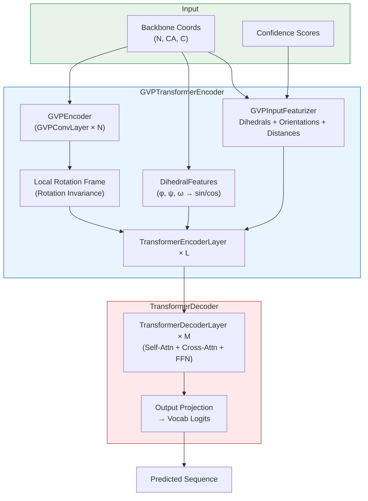
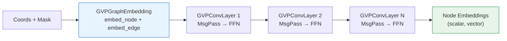
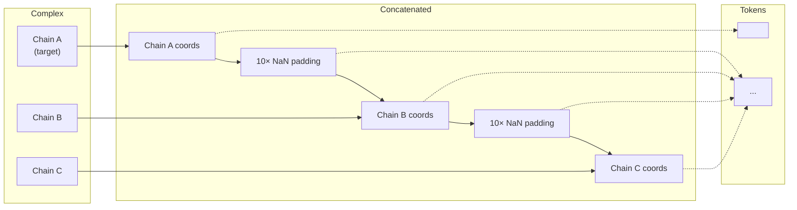

---
slug:14-inverse-folding-and-esm-if
blog_type:normal
---


**ESM-IF1 逆折叠模型**解决了蛋白质逆折叠问题：从 3D 骨架原子坐标预测氨基酸序列。ESM-IF1 在由 AlphaFold2 预测的 1200 万个蛋白质结构上进行训练，在结构留出的骨架上实现了 **51% 的天然序列恢复率**，对于埋藏残基的恢复率更是提升至 **72%**。该模型结合了通过几何向量感知器（GVP）进行的不变几何输入处理与序列到序列的 Transformer，并采用跨度掩码进行训练，以容忍部分掩码的骨架坐标。本页涵盖了单链和多链蛋白质复合物的完整架构、模块交互以及编程 API。

来源: [README.md](examples/inverse_folding/README.md#L1-L15), [gvp_transformer.py](esm/inverse_folding/gvp_transformer.py#L19-L29)

## 架构概述

ESM-IF1 遵循**两阶段编码器-解码器**范式。编码器首先通过 GVP-GNN 将原始骨架坐标转换为旋转不变的结构表示，随后经过 Transformer 编码器层。解码器接着自回归地逐个生成序列词元，并在每一步关注编码器的输出。根据构造，整个流水线是**旋转等变的**——来自 GVP 的向量特征被旋转到由 N-CA-C 原子定义的局部坐标系中，确保预测结果对输入结构的全局方向保持不变。



来源: [gvp_transformer.py](esm/inverse_folding/gvp_transformer.py#L31-L55), [gvp_transformer_encoder.py](esm/inverse_folding/gvp_transformer_encoder.py#L27-L90)

## 核心模型：GVPTransformerModel

顶层模型类 `GVPTransformerModel` 协调整个编码器-解码器流水线。其 `forward()` 方法在骨架坐标上运行编码器，并在移位的输出词元上运行解码器（教师强制），而其 `sample()` 方法则执行自回归多项式解码，并通过增量状态缓存提高效率。

| 方法 | 用途 | 关键参数 |
|--------|---------|----------------|
| `forward()` | 用于训练/评分的教师强制前向传播 | `coords`, `padding_mask`, `confidence`, `prev_output_tokens` |
| `sample()` | 自回归序列采样 | `coords`, `partial_seq`, `temperature`, `confidence` |
| `build_encoder()` | 构建 `GVPTransformerEncoder` | `args`, `alphabet`, `embed_tokens` |
| `build_decoder()` | 构建 `TransformerDecoder` | `args`, `alphabet`, `embed_tokens` |
| `build_embedding()` | 共享词元嵌入构造器 | `args`, `dictionary`, `embed_dim` |

`sample()` 方法每次解码一个词元，在多项式采样前对 logits 应用温度缩放。它通过 `partial_seq` 参数支持**部分序列**——被设置为 `<mask>` 的位置会被采样，而已知位置则被固定。这对于多链条件生成至关重要，因为非目标链会被填充。

来源: [gvp_transformer.py](esm/inverse_folding/gvp_transformer.py#L31-L137)

## 编码器：GVPTransformerEncoder

编码器是架构最丰富的组件，在将**五个不同的特征流**传递给 Transformer 编码器层之前，先将它们融合。每个特征流捕获了 3D 结构的不同方面：

| 特征组件 | 来源 | 描述 |
|-------------------|--------|-------------|
| **掩码词元嵌入** | `embed_tokens` | 掩码词元的缩放嵌入（结构输入无序列） |
| **二面角特征** | `DihedralFeatures` | 骨架二面角 (φ, ψ, ω) 的 sin/cos → 嵌入至 `embed_dim` |
| **GVP 输出** | `GVPEncoder` → `embed_gvp_output` | 旋转至局部坐标系的 GVP-GNN 节点特征 → 线性投影 |
| **GVP 输入特征** | `GVPInputFeaturizer` → `embed_gvp_input_features` | 局部坐标系中的原始节点标量/向量特征 (15维 → `embed_dim`) |
| **置信度** | `embed_confidence` | RBF 编码的置信度分数 (16个分箱) → 线性投影 |

所有五个组件被**求和**（而非拼接），然后在 dropout 之前添加正弦位置嵌入。所得表示经过带有 LayerNorm 的 `args.encoder_layers` 层 Transformer 编码器层，生成形状为 `(seq_len, batch, embed_dim)` 的最终编码器输出。

<CgxTip>嵌入组件的求和（而非拼接）意味着每个特征流必须投影到相同的 `embed_dim`。这一设计选择降低了参数量，并允许每个特征流直接作用于同一表示空间，而无需更大的融合层。</CgxTip>

### 旋转不变机制

来自 GVP 编码器的向量输出被旋转到由 N-CA-C 骨架原子定义的**局部旋转坐标系**中。该坐标系由 `e1 = normalize(C - CA)` 构建，然后通过 `N - CA` 进行 Gram-Schmidt 正交化得到 `e2`，最后 `e3 = e1 × e2`。GVP 标量特征直接通过不变（已经是旋转不变的），而向量特征则在展平与投影前旋转 `R^T`。这保证了编码器输出对输入坐标的任何全局 SO(3) 旋转保持不变。

来源: [gvp_transformer_encoder.py](esm/inverse_folding/gvp_transformer_encoder.py#L27-L185), [util.py](esm/inverse_folding/util.py#L157-L182)

## GVP 编码器与几何特征

### GVPInputFeaturizer

特征化器将原始 N-CA-C 坐标转换为适合 GVP-GNN 的图结构节点与边特征：

**节点特征** (标量: 7维, 向量: 3维):
- **标量**: 二面角 (φ, ψ, ω) 提升为 sin/cos (6个值) + 坐标掩码 (1个值)
- **向量**: 前向/后向 CA 方向 (2 × 3D) + 侧链方向 (1 × 3D)

**边特征** (标量: 34维, 向量: 1维):
- **标量**: RBF 编码的距离 (16个分箱) + 位置嵌入 (16维) + 源/目标坐标掩码 (2个值)
- **向量**: CA 原子间的归一化方向向量

`_dist()` 方法通过欧氏距离识别 top-k 最近邻以构建图，并对缺失坐标和填充有特殊处理。

来源: [features.py](esm/inverse_folding/features.py#L47-L165)

### GVPEncoder

`GVPEncoder` 封装了 `GVPGraphEmbedding`（生成初始节点/边嵌入）及其后的一堆 `GVPConvLayer` 模块。每个 `GVPConvLayer` 通过 `GVPConv`（扩展了 PyTorch Geometric 的 `MessagePassing`）执行消息传递，然后应用残差更新和逐点前馈 GVP 网络。层数由 `args.num_encoder_layers` 控制。



来源: [gvp_encoder.py](esm/inverse_folding/gvp_encoder.py#L1-L57), [gvp_modules.py](esm/inverse_folding/gvp_modules.py#L227-L399)

### 几何向量感知器 (GVP)

`GVP` 模块是几何流水线的基础构建块。它对元组输入 `(s, V)` 进行操作，其中 `s` 是标量张量，`V` 是向量张量。前向传播计算如下：

1. `vh = W_h(V^T)` — 向量通道的线性投影
2. `vn = ||vh||` — 投影向量的范数（标量不变量）
3. `s_out = σ(W_s([s; vn]))` — 由拼接的标量 + 范数特征得出的标量输出
4. `v_out = g(W_v(vh))` — 带有门控的向量输出（通过 `W_g(s_out)` 的向量门控或范数门控）

此设计确保**标量输出是旋转不变的**（仅依赖于向量范数），而**向量输出是旋转等变的**（在旋转下可预测地变换）。

来源: [gvp_modules.py](esm/inverse_folding/gvp_modules.py#L120-L198)

## 解码器：TransformerDecoder

解码器遵循标准的自回归 Transformer 设计，包含 `args.decoder_layers` 个 `TransformerDecoderLayer` 模块。每层包含：

1. 对已生成词元的**掩码自注意力**（带因果掩码）
2. 对编码器输出的**交叉注意力**（结构表示）
3. **前馈网络**（带 ReLU 的 2 层 MLP）

`extract_features()` 方法支持**增量解码**——在步骤之间缓存注意力键/值状态，以避免在每个词元位置对完整前缀重新计算。最终的输出投影将 `embed_dim` 映射为 `vocab_size` 维的 logits。

来源: [transformer_decoder.py](esm/inverse_folding/transformer_decoder.py#L27-L229), [transformer_layer.py](esm/inverse_folding/transformer_layer.py#L140-L305)

## 模块依赖图

下表总结了 `esm/inverse_folding/` 中的所有模块及其职责：

| 模块 | 关键类 | 角色 |
|--------|--------------|------|
| `gvp_transformer.py` | `GVPTransformerModel` | 顶层模型：编码器 + 解码器协调，采样 |
| `gvp_transformer_encoder.py` | `GVPTransformerEncoder` | 编码器：融合 GVP + 二面角 + 置信度特征，运行 Transformer 层 |
| `gvp_encoder.py` | `GVPEncoder` | GVP-GNN：图嵌入 → GVPConvLayer 堆叠 |
| `gvp_modules.py` | `GVP`, `GVPConv`, `GVPConvLayer`, `LayerNorm`, `Dropout` | 核心 GVP 原语与消息传递层 |
| `gvp_utils.py` | `flatten_graph`, `unflatten_graph` | 为兼容 PyTorch Geometric 的批次展平 |
| `features.py` | `GVPInputFeaturizer`, `GVPGraphEmbedding`, `DihedralFeatures` | 坐标 → 图特征提取 |
| `transformer_decoder.py` | `TransformerDecoder` | 带增量状态的自回归解码器 |
| `transformer_layer.py` | `TransformerEncoderLayer`, `TransformerDecoderLayer` | 标准 Transformer 注意力 + FFN 层 |
| `util.py` | `CoordBatchConverter`, `load_structure`, `score_sequence`, 等 | I/O 工具，评分，坐标处理 |
| `multichain_util.py` | `extract_coords_from_complex`, `sample_sequence_in_complex`, 等 | 多链复合物处理 |

来源: [__init__.py](esm/inverse_folding/__init__.py#L1-L9)

## 编程 API

### 加载模型

预训练的 ESM-IF1 模型通过 `esm.pretrained` 加载。模型标识符 `esm_if1_gvp4_t16_142M_UR50` 的编码含义为：4 层 **GVP**，16 层 **Transformer** 编码器，**1.42 亿参数**，在 UniRef50 上训练。务必调用 `.eval()` 以禁用训练模式的 dropout，从而实现可复现的推理。

```python
import esm
model, alphabet = esm.pretrained.esm_if1_gvp4_t16_142M_UR50()
model = model.eval()
```

在内部，加载路径会检测 `invariant_gvp` 架构标签并实例化 `GVPTransformerModel`，重新映射检查点键以匹配开源模块命名约定。

来源: [pretrained.py](esm/pretrained.py#L97-L143)

### 输入格式

模型接受骨架坐标作为 **L × 3 × 3** 数组，其中 L 为序列长度。`coords[i][0]` 是 N 原子位置，`coords[i][1]` 是 CA 原子位置，`coords[i][2]` 是 C 原子位置。坐标使用 biotite 从 PDB 或 mmCIF 文件加载：

```python
import esm.inverse_folding.util as util

# 单链
structure = util.load_structure("path/to/file.pdb", chain_id="A")
coords, seq = util.extract_coords_from_structure(structure)

# 多链复合物
structure = util.load_structure("path/to/file.pdb", chain_ids=["A", "B", "C"])
coords, native_seqs = esm.inverse_folding.multichain_util.extract_coords_from_complex(structure)
```

来源: [util.py](esm/inverse_folding/util.py#L21-L82), [multichain_util.py](esm/inverse_folding/multichain_util.py#L17-L40)

### 采样序列

**单链**采样是对模型的直接调用：

```python
sampled_seq = model.sample(coords, temperature=1.0)
```

**多链**采样在仅设计目标链的同时，以整个复合物骨架为条件。其实现拼接了所有链（目标链在前），链间带有 10 个残基的 NaN 填充，然后为非目标位置提供 `<pad>` 词元，为目标位置提供 `<mask>` 词元：

```python
import esm.inverse_folding.multichain_util as mc_util

sampled_seq = mc_util.sample_sequence_in_complex(
    model, coords, target_chain_id="C", temperature=1.0
)
```

| 温度 | 效果 | 用例 |
|-------------|--------|----------|
| `1e-6` | 近确定性，最大化天然序列恢复率 | 优化序列恢复 |
| `1.0` | 默认，中等多样性 | 平衡设计 |
| `>1.0` | 高多样性，低恢复率 | 探索序列空间 |

<CgxTip>注意在较高温度下采样序列中可能出现的**氨基酸重复**（例如 `EEEEEEEE`）。这是一种已知的失效模式——在下游使用前，应过滤掉具有长同聚物片段的序列。</CgxTip>

来源: [gvp_transformer.py](esm/inverse_folding/gvp_transformer.py#L84-L137), [multichain_util.py](esm/inverse_folding/multichain_util.py#L56-L89)

### 评分序列

评分计算给定结构下序列的**条件对数似然**——对变异效应预测和序列优化非常有用。返回两个平均值：`ll_fullseq`（所有残基）和 `ll_withcoord`（排除缺失坐标的残基）：

```python
# 单链
ll_fullseq, ll_withcoord = esm.inverse_folding.util.score_sequence(
    model, alphabet, coords, seq
)

# 多链复合物
ll_fullseq, ll_withcoord = esm.inverse_folding.multichain_util.score_sequence_in_complex(
    model, alphabet, coords, target_chain_id="C", target_seq=seq
)
```

来源: [util.py](esm/inverse_folding/util.py#L95-L113), [multichain_util.py](esm/inverse_folding/multichain_util.py#L92-L125)

### 提取结构表示

编码器输出可作为形状为 L × 512 的**结构嵌入**，对结构比较或属性预测等下游任务很有用：

```python
# 单链
rep = esm.inverse_folding.util.get_encoder_output(model, alphabet, coords)

# 多链复合物
rep = esm.inverse_folding.multichain_util.get_encoder_output_for_complex(
    model, alphabet, coords, target_chain_id="C"
)
```

来源: [util.py](esm/inverse_folding/util.py#L116-L123), [multichain_util.py](esm/inverse_folding/multichain_util.py#L127-L153)

### 部分掩码骨架坐标

要掩码骨架的某些部分（例如用于设计部分结构），请将坐标值设置为 `np.inf`：

```python
coords[:10, :] = float('inf')  # 掩码前 10 个残基
```

模型的跨度掩码训练使其对此类部分输入具有鲁棒性——它仍能为掩码区域预测出合理的序列。

来源: [examples/inverse_folding/README.md](examples/inverse_folding/README.md#L225-L230)

## 多链设计策略

多链逆折叠通过**带填充的链拼接**实现。`_concatenate_coords()` 函数将目标链置于首位，然后依次拼接每条额外链，链间以 10 个残基的 NaN 填充块分隔。在采样期间，非目标链位置提供 `<pad>` 词元（以便解码器跳过），目标链位置提供 `<mask>` 词元（以便解码器采样）。



此设计允许 GVP 编码器查看完整的结构上下文（链间接触，界面几何），而解码器仅为目标链生成残基。经验表明，多链条件生成**通常会降低困惑度并提高序列恢复率**，尽管单链模式在某些蛋白质上可能表现更好——两种方法均应尝试。

来源: [multichain_util.py](esm/inverse_folding/multichain_util.py#L43-L89)

## 命令行界面

### 采样序列

```bash
python sample_sequences.py data/5YH2.pdb \
    --chain C --temperature 1 --num-samples 3 \
    --outpath output/sampled_sequences.fasta

# 多链条件生成
python sample_sequences.py data/5YH2.pdb \
    --chain C --temperature 1 --num-samples 3 \
    --outpath output/sampled_sequences.fasta \
    --multichain-backbone
```

### 评分序列

```bash
python score_log_likelihoods.py data/5YH2.pdb \
    data/5YH2_mutated_seqs.fasta --chain C \
    --outpath output/scores.csv

# 多链条件生成
python score_log_likelihoods.py data/5YH2.pdb \
    data/5YH2_mutated_seqs.fasta --chain C \
    --outpath output/scores.csv \
    --multichain-backbone
```

| CLI 参数 | 描述 | 默认值 |
|-------------|-------------|---------|
| `pdbfile` | 输入 PDB 或 mmCIF 文件路径 | (必需) |
| `--chain` | 目标链 ID | `None` |
| `--temperature` | 采样温度 | `1.0` |
| `--num-samples` | 采样序列数 | `1` |
| `--outpath` | 输出文件路径 | `output/sampled_seqs.fasta` |
| `--multichain-backbone` | 以所有链为条件 | `False` (单链) |
| `--nogpu` | 即使可用也禁用 GPU | `False` |

来源: [sample_sequences.py](examples/inverse_folding/sample_sequences.py#L53-L125), [score_log_likelihoods.py](examples/inverse_folding/score_log_likelihoods.py#L73-L132)

## 旋转等变性验证

测试套件通过比较原始坐标的 logits 与随机旋转坐标的 logits 来验证 **SO(3) 等变性**。该测试对输入坐标应用随机旋转矩阵 `R ∈ SO(3)`，并断言输出 logits 在容差范围内匹配（`atol=1e-2`），确认模型的预测对全局旋转保持不变：

```python
R = special_ortho_group.rvs(3)
R = torch.tensor(R, dtype=torch.float32)
coords_rotated = torch.matmul(coords, R)
logits_rotated, _ = model.forward(coords_rotated, ...)
np.testing.assert_allclose(logits.numpy(), logits_rotated.numpy(), atol=1e-2)
```

来源: [test_inverse_folding.py](tests/test_inverse_folding.py#L1-L72)

## 与 ESMDynamic 的关系

虽然 ESMDynamic（本仓库的主要焦点）从序列预测动态结构属性，但 ESM-IF1 解决的是**逆问题**——从结构预测序列。两者共享 ESM 生态系统的基础设施（字母表处理、预训练权重加载、批次转换），但在不同的输入/输出模态上运行。ESM-IF1 的编码器输出（512 维结构表示）可作为桥接结构到动态推理的下游模型的输入，补充了 [ESMDynamic 模型类](5-esmdynamic-model-class) 的序列到动态流水线。

来源: [gvp_transformer_encoder.py](esm/inverse_folding/gvp_transformer_encoder.py#L27-L185), [pretrained.py](esm/pretrained.py#L97-L143)

## 延伸阅读

- **单链 notebook**: `examples/inverse_folding/notebook.ipynb` — 采样、评分与编码器提取
- **多链 notebook**: `examples/inverse_folding/notebook_multichain.ipynb` — 复合物条件生成工作流
- **预印本**: Hsu et al., "Learning inverse folding from protein structures with Geometric Vector Perceptrons" ([bioRxiv](https://doi.org/10.1101/2022.04.10.487779))
- **GVP 来源**: Jing et al., "Learning from Protein Structure with Geometric Vector Perceptrons" (ICLR 2021)

关于本仓库中正向折叠的对应部分，请参阅 [架构概述](4-architecture-overview)。有关模型权重加载的详细信息，请参阅 [预训练模型与权重加载](12-pretrained-model-and-weight-loading)。