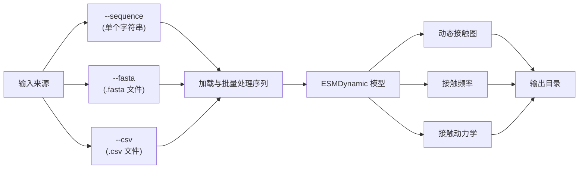

---
slug:2-quick-start
blog_type:normal
---


几分钟内即可运行 ESMDynamic —— 仅从蛋白质序列预测**动态接触图**、**接触频率**和**接触动力学**，无需多序列比对。本页将引导你完成安装、首次预测以及理解输出结构。


来源: [README.md](/README.md#L1-L30)

## 选择你的路径

ESMDynamic 根据你的使用场景提供三种入口：

| 方式 | 最适用场景 | 是否需要 GPU？ | 配置时间 |
|--------|----------|---------------|------------|
| **Google Colab Notebook** | 快速探索，< 5 条序列 | 否（提供免费 GPU） | ~2 分钟 |
| **Docker**（推荐） | 批量预测，可复现环境 | 是（推荐） | ~10 分钟构建 |
| **Conda + pip** | 自定义环境，开发 | 是（推荐） | ~15 分钟 |

来源: [README.md](/README.md#L33-L42)

## 安装

### 选项 A：Docker（推荐）

Docker 是**最简单且最可靠**的安装路径。`Dockerfile` 构建了一个固定所有依赖项的镜像 —— 包括 CUDA 12.9、PyTorch 2.8.0 和 OpenFold —— 并在构建期间**自动下载所有模型权重**。

**前提条件**：[Docker](https://docs.docker.com/engine/install/) 和 [NVIDIA Container Toolkit](https://docs.nvidia.com/datacenter/cloud-native/container-toolkit/latest/install-guide.html)（用于 GPU 访问）。

```bash
# 1. 克隆仓库
git clone https://github.com/ShuklaGroup/esmdynamic.git
cd esmdynamic

# 2. 构建 Docker 镜像（包含权重下载 ~5 GB）
docker build -t esmdynamic .

# 3. 运行带有 GPU 访问权限的容器，挂载当前目录
docker run --rm -it --gpus all -v "$PWD":/workspace esmdynamic

# 4. 验证安装
run_esmdynamic -h
```

<CgxTip>Docker 构建会将四个权重文件（总计约 5 GB）下载到 `/root/.cache/torch/hub/checkpoints/` 中：ESMFold-3B、ESM2-3B、ESM2 接触回归和 ESMDynamic。此过程在 `docker build` 期间自动完成 —— 无需手动下载。</CgxTip>

来源: [Dockerfile](/Dockerfile#L1-L96), [README.md](/README.md#L43-L57)

### 选项 B：Conda + pip

对于无法使用 Docker 的系统，手动配置 Conda 环境也可行。**注意**：由于部分包已被弃用（尤其是 OpenFold），此路径可能需要进行故障排查。

```bash
# 1. 创建并激活环境
conda create -n esmdynamic python=3.11.13
conda activate esmdynamic

# 2. 安装 CUDA 工具包
conda install -c nvidia cuda-nvcc=12.9.86 cuda-toolkit=12.9.1

# 3. 安装支持 CUDA 12.9 的 PyTorch
pip install torch==2.8.0 torchvision==0.23.0 torchaudio==2.8.0 \
    --index-url https://download.pytorch.org/whl/cu129

# 4. 安装科学计算/机器学习依赖项
pip3 install mdtraj scipy omegaconf pytorch_lightning biopython \
    ml_collections einops py3Dmol modelcif matplotlib \
    'plotly[express]' dm-tree tensorboard

# 5. 安装 NVIDIA dllogger 和 OpenFold（必须使用 ColabFold fork！）
pip3 install git+https://github.com/NVIDIA/dllogger.git
pip3 install --no-build-isolation 'git+https://github.com/sokrypton/openfold.git'

# 6. 安装 ESMDynamic
pip install git+https://github.com/ShuklaGroup/esmdynamic.git

# 7. 验证（首次使用时下载权重）
run_esmdynamic -h
```

来源: [README.md](/README.md#L59-L78), [environment.yml](/environment.yml#L1-L130)

### 选项 C：Google Colab

若想获得最快速的零安装体验，可直接在浏览器中打开 [Colab Notebook](https://colab.research.google.com/github/ShuklaGroup/esmdynamic/blob/main/examples/esmdynamic/esmdynamic.ipynb)。它提供免费的 GPU 和手动序列输入功能 —— 非常适合探索少数几个蛋白质。

来源: [README.md](/README.md#L35-L36)

## 你的首次预测

### 使用命令行 (`run_esmdynamic`)

`run_esmdynamic` CLI 是主要的推理接口。它通过三种互斥的输入模式接受序列：



**单条序列** —— 预测单个蛋白质的最快方式：

```bash
run_esmdynamic --sequence "MVLSPADKTNVKAAWGKVGAHAGEYGAEALERMFLSFPTTKTYFPHFDDL" \
    --output_dir my_first_prediction
```

**FASTA 文件** —— 使用标头作为蛋白质 ID：

```bash
run_esmdynamic --fasta examples/esmdynamic/example.fasta --output_dir fasta_outputs
```

**CSV 文件** —— 第一列为 ID，第二列为序列：

```bash
run_esmdynamic --csv examples/esmdynamic/example.csv --output_dir csv_outputs
```

仓库中附带的示例文件包含四种蛋白质 —— **ASCT2**（单链转运蛋白）、**SWEET2b**（单链）、**De_novo**（设计肽段）和 **HIV1P**（由 `:` 分隔的多链同源二聚体）：

```csv
id,seq
ASCT2,DQVRRCLRANLLVLLTVVAVVAGVALGLGVSGAGGALALGPERLSAFVFPGELLLRLLRMIILPLVVCSLIGGAASLDPGALGRLGAWALLFFLVTTLLASALGVGLALALQPGAASAAINASVGAAGSAENAPSKEVLDSFLDLARNIFPSNLVSAAFRSYSTTYEERNITGTRVKVPVGQEVEGMNILGLVVFAIVFGVALRKLGPEGELLIRFFNSFNEATMVLVSWIMWYAPVGIMFLVAGKIVEMEDVGLLFARLGKYILCCLLGHAIHGLLVLPLIYFLFTRKNPYRF
SWEET2b,DSLYDISCFAAGLAGNIFALALFLSPVTTFKRILKAKSTERFDGLPYLFSLLNCLICLWYGLPWVADGRLLVATVNGIGAVFQLAYICLFIFYADSRKTRMKIIGLLVLVVCGFALVSHASVFFFDQPLRQQFVGAVSMASLISMFASPLAVMGVVIRSESVEFMPFYLSLSTFLMSASFALYGLLLRDFFIYFPNGLGLILGAMQLALYAY
De_novo,ASMEDLQAEARAFLSEEMIAEFKAAFDMFDADGGGDISYKAVGTVFRMLGINPSKEVLDYLKEKIDVDGSGTIDFEEFLVLMVYIMKQDA
HIV1P,PQITLWQRPLVTIKIGGQLKEALLDTGADDTVLEEMSLPGRWKPKMIGGIGGFIKVRQYDQILIEICGHKAIGTVLVGPTPVNIIGRNLLTQIGCTLNF:PQITLWQRPLVTIKIGGQLKEALLDTGADDTVLEEMSLPGRWKPKMIGGIGGFIKVRQYDQILIEICGHKAIGTVLVGPTPVNIIGRNLLTQIGCTLNF
```

来源: [predict.py](/esm/esmdynamic/predict.py#L36-L110), [example.csv](/examples/esmdynamic/example.csv#L1-L5), [example.fasta](/examples/esmdynamic/example.fasta#L1-L8), [README.md](/README.md#L80-L121)

### 使用 Python API

对于编程式访问，可直接在 Python 中加载模型：

```python
import esm

# 加载预训练模型（首次调用时自动下载权重）
model = esm.pretrained.esmdynamic()
model = model.to("cuda")
model.eval()

# 从单条序列进行预测
with torch.no_grad():
    result = model.predict_from_seqs(["MVLSPADKTNVKAAWGKVGAHAGEYGAEALERMFLSFPTTKTYFPHFDDL"])

# 访问输出
dynamic_prob = result["dynamic_prob"]       # [B, T, L, L] - 动态接触概率
dynamic_pred = result["dynamic_pred"]       # [B, T, L, L] - 二值预测（阈值为 0.5）
kinetic_prob  = result["kinetic_prob"]      # [B, T, 2, L, L, C] - 动力学类别概率
frequency_pred = result["frequency_pred"]   # [B, T, L, L] - 接触频率/占有率
```

**选择性加载预测头** —— 仅加载所需的预测头以节省内存：

```python
# 仅加载 dynamic + kinetic 预测头（跳过 frequency）
model = esm.pretrained.esmdynamic(heads_to_load=["dynamic", "kinetic"])
```

<CgxTip>`predict_from_seqs()` 方法通过 `@torch.no_grad()` 装饰器封装了 `forward_from_seq()` 以用于推理。若用于训练，请直接使用 `forward_from_seq()`，该方法会计算梯度。`low_memory=True` 标志会使各个预测头顺序执行而非并行 —— 速度大幅变慢，但能显著降低显存占用。</CgxTip>

来源: [esmdynamic.py](/esm/esmdynamic/esmdynamic.py#L213-L220), [esmdynamic.py](/esm/esmdynamic/esmdynamic.py#L548-L595), [pretrained.py](/esm/esmdynamic/pretrained.py#L32-L36)

## CLI 参考

完整的 `run_esmdynamic` 参数参考：

| 参数 | 类型 | 默认值 | 描述 |
|----------|------|---------|-------------|
| `--sequence` | str | *(必选组)* | 单个氨基酸序列字符串 |
| `--fasta` | str | *(必选组)* | FASTA 文件路径 |
| `--csv` | str | *(必选组)* | CSV 文件路径（第 1 列 = ID，第 2 列 = 序列） |
| `--batch_size` | int | `1` | 每批的序列数量 |
| `--chunk_size` | int | `256` | 模型分块大小（控制显存与速度的权衡） |
| `--device` | {cpu,cuda} | `cuda` | 计算设备 |
| `--output_dir` | str | `outputs` | 输出文件目录 |
| `--chain_ids` | str | `A-Z` | 多链的链 ID 标签（例如 `ABCDEF`） |
| `--low_memory` | flag | `False` | 顺序运行预测头（更慢，显存占用更少） |
| `--save_html` | flag | `True*` | 保存交互式 Plotly HTML 热图 |
| `--save_png` | flag | `True*` | 保存 PNG 热图/图表 |
| `--save_txt` | flag | `True*` | 保存纯文本/CSV 矩阵 |
| `--save_raw_pt` | flag | `True*` | 保存包含所有原始输出的 `.pt` 打包文件 |
| `--num_recycles` | int | `None` | 覆盖 Evoformer 循环次数 |

*\*若未指定任何 `--save_*` 标志，则默认启用全部四个。*

来源: [predict.py](/esm/esmdynamic/predict.py#L36-L110), [README.md](/README.md#L84-L111)

## 多链蛋白质

对于多聚体，在 CLI 和文件输入中均使用冒号 (`:`) 分隔各链序列：

```bash
# 同源二聚体：两条相同的链
run_esmdynamic --sequence "CHAIN_A_SEQ:CHAIN_B_SEQ" --output_dir multimer_out
```

在 CSV 文件中，序列列内使用 `:` 作为分隔符。在 **Colab Notebook** 中，请改用 `/`。模型会在链之间插入一段 25 残基的聚甘氨酸 linker，并使用 512 的残基索引偏移量来分隔各链的坐标空间。

来源: [README.md](/README.md#L115-L116), [esmdynamic.py](/esm/esmdynamic/esmdynamic.py#L413-L456)

## 输出结构

每个预测的蛋白质都会生成一个目录树，包含五种模拟温度下的各温度输出：**320 K, 348 K, 379 K, 413 K, 450 K**。

```
outputs/
└── PROTEIN_ID/
    ├── PROTEIN_ID.pdb                          # ESMFold 预测结构
    ├── PROTEIN_ID_all_outputs.pt               # 原始张量打包文件
    ├── dynamic/
    │   ├── *_dynamic_prob_320K.{html,png,txt}  # 接触概率热图
    │   ├── *_dynamic_pred_320K.{html,png,txt}  # 二值接触预测
    │   ├── *_dynamic_confidence_320K.{csv,png} # 逐残基置信度分数
    │   └── ... (348K, 379K, 413K, 450K 同理)
    ├── frequency/
    │   ├── *_frequency_pred_320K.{html,png,txt}     # 占有率/频率图
    │   ├── *_frequency_error_320K.{html,png,txt}    # 残差预测
    │   └── ...
    ├── kinetics/
    │   ├── *_kinetics_on_class_320K.{html,png,txt}  # 结合速率类别预测
    │   ├── *_kinetics_off_class_320K.{html,png,txt} # 解离速率类别预测
    │   ├── *_kinetics_on_probabilities_320K.npz     # 完整类别概率
    │   ├── *_kinetics_on_classes_320K.txt           # 类别索引图例
    │   ├── *_kinetics_confidence_320K.{csv,png}     # 逐残基置信度
    │   └── ...
    ├── native/
    │   └── *_native_contacts.{html,png,txt}    # ESMFold 静态接触
    ├── dynamic_nonnative/
    │   └── *_dynamic_nonnative_320K.{html,png,txt}  # 动态但非原生接触
    └── native_nondynamic/
        └── *_native_nondynamic_320K.{html,png,txt}  # 原生但非动态接触
```

在浏览器中打开任意 `.html` 文件，即可查看带有缩放、平移和悬停检查功能的**交互式 Plotly 热图**：


来源: [predict.py](/esm/esmdynamic/predict.py#L323-L613), [README.md](/README.md#L131-L135)

## 内存与性能调优

| 场景 | 建议 |
|----------|---------------|
| 显存 ≤ 16 GB 的 GPU | 减小 `--chunk_size`（尝试 128 或 64），或使用 `--low_memory` |
| 显存 ≥ 24 GB 的 GPU | 默认 `--chunk_size 256` 效果良好；提高 `--batch_size` 以增加吞吐量 |
| 仅 CPU | 设置 `--device cpu` —— 推理速度会显著变慢 |
| 大蛋白质（> 500 个残基） | 使用 `--low_memory` 标志以顺序运行预测头 |

`--low_memory` 标志会触发 `forward_from_seq_low_memory()`，该方法将 ESMFold 和每个 DynamicHead 逐一加载到 GPU，并在步骤间卸载至 CPU。这会大幅削减峰值显存占用，代价是推理速度降低约 3 倍。

来源: [README.md](/README.md#L125-L126), [esmdynamic.py](/esm/esmdynamic/esmdynamic.py#L458-L546)

## 故障排查

| 问题 | 解决方案 |
|---------|----------|
| `CUDA requested but not available` | 脚本会自动回退到 CPU。请使用 `nvidia-smi` 验证 NVIDIA 驱动 |
| OpenFold 构建失败 | 确保使用了 **ColabFold fork**：`git+https://github.com/sokrypton/openfold.git` 并附加 `--no-build-isolation` |
| 权重下载失败 | 检查网络连接。权重缓存在 `torch.hub.get_dir()/checkpoints/` 中。若需离线使用，可从 [Illinois Data Bank](https://doi.org/10.13012/B2IDB-3773897_V2) 提前下载 |
| `No sequences were loaded` | 验证 FASTA/CSV 格式。CSV 需要标题行；FASTA 需要以 `>` 前缀的标题 |
| GPU 显存溢出 (OOM) | 减小 `--chunk_size`，添加 `--low_memory`，或减小 `--batch_size` |

来源: [predict.py](/esm/esmdynamic/predict.py#L616-L658), [Dockerfile](/Dockerfile#L68-L72)

## 下一步

现在你已经能够运行预测了，接下来可以去往此处：

1. **理解你的输出** → [输出解读](3-output-interpretation) —— 深入解析动态接触图、动力学类别和频率值
2. **探索架构** → [架构概览](4-architecture-overview) —— ESMFold 表征如何输入至 DynamicModule 预测头
3. **扩展推理规模** → [批量预测脚本](10-bulk-prediction-script) —— 用于大规模预测的高级 CLI 模式
4. **尝试 Colab 工作流** → [Colab Notebook 工作流](11-colab-notebook-workflow) —— 交互式可视化与探索
5. **在受限硬件上节省内存** → [低内存推理模式](13-low-memory-inference-mode) —— 深入了解预测头的顺序评估