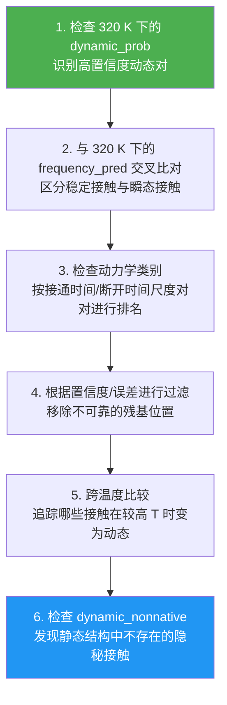

---
slug:3-output-interpretation
blog_type:normal
---


ESMDynamic 通过三个互补的输出头 —— **动态接触分类**、**接触频率回归** 和 **接触动力学分类** —— 生成一组丰富且多维的预测结果，每个头都在五个分子动力学（MD）模拟温度下进行评估。本页将引导你了解每一个输出文件、其含义、形状以及使用方法。阅读到最后，你将能够自信地浏览输出目录，正确解读每个矩阵和向量，并通过编程方式加载数据以进行下游分析。

来源: [output_interpretation.md](/output_interpretation.md#L1-L262), [predict.py](/esm/esmdynamic/predict.py#L1-L658), [esmdynamic.py](/esm/esmdynamic/esmdynamic.py#L1-L636)

## 输出目录结构

当你在标识符为 `MY_PROTEIN` 的蛋白质上运行 `run_esmdynamic` 时，脚本会创建一个结构化的目录。每条序列都会获得自己的子目录，其中包含一个 PDB 文件、一个原始 PyTorch 打包文件，以及用于每个预测头和派生的天然接触分析的独立文件夹：

```
outputs/
└── MY_PROTEIN/
    ├── MY_PROTEIN.pdb                     # ESMFold 预测的 3D 结构
    ├── MY_PROTEIN_all_outputs.pt          # 原始 PyTorch 打包文件（所有预测结果）
    ├── dynamic/                           # 分类头输出
    ├── frequency/                         # 回归头输出
    ├── kinetics/                          # 动力学头输出
    ├── native/                            # 静态结构接触
    ├── dynamic_nonnative/                 # 静态结构中不存在的动态接触
    └── native_nondynamic/                 # 未被预测为动态的静态接触
```

根据你传递给 `run_esmdynamic` 的标志，每个文件夹都包含多种温度下的文件，且格式多样（`.txt`、`.png`、`.html`）。默认情况下，当未显式指定格式标志时，所有四个格式标志（`--save_html`、`--save_png`、`--save_txt`、`--save_raw_pt`）均处于启用状态。

来源: [predict.py](/esm/esmdynamic/predict.py#L323-L613), [output_interpretation.md](/output_interpretation.md#L16-L29)

## 温度轴

所有三个预测头均在 **五个离散温度条件** 下产生输出：**320 K、348 K、379 K、413 K 和 450 K**。这些温度对应于 mdCATH 分子动力学训练数据集中使用的温度。它们**不是**实验或生理温度 —— 它们是逐步增加构象采样的 MD 模拟条件。

| 温度 | 解释 | 推荐用途 |
|-------------|---------------|-----------------|
| **320 K** | 最低柔性区间 | **从这里开始。** 最保守的预测；最接近折叠良好、有序的状态。 |
| **348 K** | 轻微增加的柔性 | 与 320 K 比较，查看哪些接触开始波动。 |
| **379 K** | 中等柔性 | 揭示勉强稳定的接触。 |
| **413 K** | 高柔性 | 许多接触变为动态；适合用于识别最持久的相互作用。 |
| **450 K** | 近解折叠区间 | 只有最具弹性的接触存活；有助于识别折叠核心。 |

<CgxTip>始终从 320 K 开始分析，然后向更高温度移动以探索渐进的无序状态。320 K 的输出是解释动态接触最可靠的切入点。</CgxTip>

来源: [predict.py](/esm/esmdynamic/predict.py#L15-L16), [output_interpretation.md](/output_interpretation.md#L35-L43)

## 输出头 1：动态接触分类 (`dynamic/`)

该头回答了一个基本问题：**“该残基对是否在构象系综中的接触与非接触状态之间切换？”** 这是一个二分类任务，通过 sigmoid 激活函数实现，并在对矩阵中进行了对称化处理。

### 输出文件

对于每个温度 `T`，你将找到：

| 文件模式 | 类型 | 形状 | 描述 |
|-------------|------|-------|-------------|
| `*_dynamic_prob_{T}K.txt` | 对矩阵 | L × L | 成为动态接触的连续概率 ∈ [0, 1] |
| `*_dynamic_prob_{T}K.png` | 热力图 | — | Viridis 配色的概率图 |
| `*_dynamic_prob_{T}K.html` | 交互式 | — | Plotly 热力图（悬停查看数值） |
| `*_dynamic_pred_{T}K.txt` | 对矩阵 | L × L | 二值预测（阈值 = 0.5） |
| `*_dynamic_pred_{T}K.png` | 热力图 | — | 黑白二值图 |
| `*_dynamic_pred_{T}K.html` | 交互式 | — | Plotly 二值图 |
| `*_dynamic_confidence_{T}K.csv` | 逐残基 | L | 每个残基的置信度分数 |
| `*_dynamic_confidence_{T}K.png` | 折线图 | — | 置信度随残基索引的变化 |

### 如何解读

- **`dynamic_prob`**：接近 **1.0** 的值表明该对为动态（发生切换）的确定性很高。接近 **0.0** 的值表明该对始终处于接触状态或从不接触。接近 **0.5** 的值是模糊的 —— 这些是需要谨慎对待的残基对。

- **`dynamic_pred`**：`dynamic_prob` 在 0.5 处的硬阈值版本。值 `1` = 动态，`0` = 非动态。适用于快速的二值查询。

- **`dynamic_confidence`**：逐残基分数，指示该位置的分类可靠性。**大于 0.9 的值被视为高置信度。** 低置信度残基通常出现在链末端或模型信号较弱的无序区域。

在内部，分类头对原始 logit 应用 `sigmoid`，然后通过 `(prob + prob.T) / 2` **对称化** 矩阵，以确保 `prob[i,j] == prob[j,i]`。预测结果随后为 `(prob > 0.5).long()`。

来源: [esmdynamic.py](/esm/esmdynamic/esmdynamic.py#L173-L185), [predict.py](/esm/esmdynamic/predict.py#L343-L399), [output_interpretation.md](/output_interpretation.md#L47-L71)

## 输出头 2：接触频率回归 (`frequency/`)

该头回答：**“该残基对在构象系综中有多大比例的时间处于接触状态？”** 这是一个回归任务，其目标是接触占用率 —— 一个介于 0（从不接触）和 1（始终接触）之间的值。

### 输出文件

| 文件模式 | 类型 | 形状 | 描述 |
|-------------|------|-------|-------------|
| `*_frequency_pred_{T}K.txt` | 对矩阵 | L × L | 预测的接触占用率 ∈ [0, 1] |
| `*_frequency_pred_{T}K.png` | 热力图 | — | Viridis 配色的占用率图 |
| `*_frequency_pred_{T}K.html` | 交互式 | — | Plotly 占用率热力图 |
| `*_frequency_error_{T}K.txt` | 对矩阵 | L × L | 预测的残差/误差（不确定性的代理） |
| `*_frequency_error_{T}K.png` | 热力图 | — | 误差幅度图 |
| `*_frequency_error_{T}K.html` | 交互式 | — | Plotly 误差热力图 |

### 如何解读

- **`frequency_pred`**：值为 **0.9** 意味着该对有 90% 的时间处于接触状态（非常稳定）。值为 **0.1** 意味着该对几乎不形成接触（瞬态或不存在）。值为 **0.5** 意味着该对处于接触和脱离接触的时间大致相等 —— 这是*动态*接触的标志。

- **`frequency_error`**：模型对频率值预测的残差。值越高表示不确定性越大。使用此值来**过滤不可靠的预测** —— 例如，丢弃 `frequency_error > threshold` 的残基对。

**关键细节**：一个残基对可能具有**高动态概率**（分类头认为它发生切换），同时具有**低频率**（只有 10% 的时间处于接触）。这并不矛盾 —— 它们描述了不同的方面：接触*是否*切换 vs. 接触*多频繁*形成。

回归头在内部对对称化的原始预测应用 `sigmoid`，将输出裁剪至 [0, 1]。它还包含一个**逐对残差头**，用于预测逐对修正，从而产生 `frequency_residual_pred` 输出。

来源: [esmdynamic.py](/esm/esmdynamic/esmdynamic.py#L186-L189), [predict.py](/esm/esmdynamic/predict.py#L401-L443), [output_interpretation.md](/output_interpretation.md#L73-L95)

## 输出头 3：接触动力学分类 (`kinetics/`)

该头回答：**“该接触形成和断裂的时间尺度是多少？”** 它将每个残基对分类到粗粒化的动力学区间中，包括**接通时间**（一旦形成，接触持续多久）和**断开时间**（断裂后，接触需多久重新形成）。这是一个包含 6 个类别和 2 种速率类型（接通/断开）的多分类任务，产生的 logit 形状为 `[B, n_conditions, n_rates, L, L, n_classes]`。

### 输出文件

| 文件模式 | 类型 | 形状 | 描述 |
|-------------|------|-------|-------------|
| `*_kinetics_on_class_{T}K.txt` | 对矩阵 | L × L | 预测的接通时间类别索引 (0–5) |
| `*_kinetics_on_class_{T}K.png` | 热力图 | — | 接通时间类别图（离散色彩映射） |
| `*_kinetics_on_class_{T}K.html` | 交互式 | — | Plotly 接通时间类别热力图 |
| `*_kinetics_on_probabilities_{T}K.npz` | 压缩格式 | L × L × 6 | 每个类别的完整 softmax 概率 |
| `*_kinetics_on_classes_{T}K.txt` | 图例 | 6 行 | 类别索引 → 名称映射 |
| `*_kinetics_off_class_{T}K.*` | 同接通 | — | 所有接通时间文件的断开时间类似物 |
| `*_kinetics_off_probabilities_{T}K.npz` | 压缩格式 | L × L × 6 | 每个类别的完整 softmax 概率 |
| `*_kinetics_off_classes_{T}K.txt` | 图例 | 6 行 | 类别索引 → 名称映射 |
| `*_kinetics_confidence_{T}K.csv` | 逐残基 | L | 逐残基动力学置信度 |
| `*_kinetics_confidence_{T}K.png` | 折线图 | — | 置信度随残基索引的变化 |

### 动力学类别定义

**接通时间（接触寿命）** —— 一旦形成，接触持续多久：

| 类别索引 | 名称 | 时间尺度 |
|-------------|------|-----------|
| 0 | `always_on` | 接触始终存在（稳定） |
| 1 | `1to10ns` | 极短寿命：1–10 纳秒 |
| 2 | `10to100ns` | 短寿命：10–100 纳秒 |
| 3 | `100to300ns` | 中等寿命：100–300 纳秒 |
| 4 | `gt300ns` | 长寿命：> 300 纳秒 |
| 5 | `never_on` | 接触从不形成 |

**断开时间（形成时间）** —— 断裂的接触需多久重新形成：

| 类别索引 | 名称 | 时间尺度 |
|-------------|------|-----------|
| 0 | `always_off` | 接触从未形成 |
| 1 | `1to10ns` | 极快重新形成：1–10 纳秒 |
| 2 | `10to100ns` | 快速重新形成：10–100 纳秒 |
| 3 | `100to300ns` | 缓慢重新形成：100–300 纳秒 |
| 4 | `gt300ns` | 极慢重新形成：> 300 纳秒 |
| 5 | `never_off` | 接触从不断裂（永久） |

### 如何解读

- **比较性地使用动力学**，而不是作为绝对的时间尺度测量。将接触排名为“快形成 vs. 慢形成”或“短寿命 vs. 长寿命”，而不是将类别边界解释为精确值。

- **`.npz` 概率文件**包含每个残基对在所有 6 个类别上的完整 softmax 分布。访问单个类别概率图的方式如：`probs = np.load("kinetics_on_probabilities_320K.npz"); probs["1to10ns"]` 给出 1–10 纳秒接通时间类别的 L × L 概率矩阵。

- **`*_classes_*.txt` 图例文件**提供从整数类别索引到人类可读名称的映射，这在读取整数值的类别预测图时必不可少。

- **置信度**是跨接通/断开速率平均的逐残基分数，指示该位置的动力学预测可靠性。

<CgxTip>动力学预测是粗粒度的，并且在纳秒尺度的 MD 模拟 (mdCATH) 上训练。不要将类别边界解释为精确的实验时间尺度。使用它们来相对地对接触进行排名 —— 例如，“这些接触比那些接触断裂得更快。”</CgxTip>

来源: [predict.py](/esm/esmdynamic/predict.py#L17-L33), [predict.py](/esm/esmdynamic/predict.py#L448-L531), [esmdynamic.py](/esm/esmdynamic/esmdynamic.py#L144-L158), [output_interpretation.md](/output_interpretation.md#L97-L139)

## 天然接触分析 (`native/`, `dynamic_nonnative/`, `native_nondynamic/`)

这些是通过将动态分类预测与 ESMFold 预测的静态结构进行比较而计算出的**派生输出**。天然接触图是通过 MDTraj 使用 **8 Å Cα–Cα 距离阈值** 从 ESMFold PDB 计算得出的。

### 文件夹内容

| 文件夹 | 文件模式 | 含义 |
|--------|-------------|---------|
| `native/` | `*_native_contacts.*` | ESMFold 静态结构中处于接触状态的残基对 |
| `dynamic_nonnative/` | `*_dynamic_nonnative_{T}K.*` | 被预测为动态但**不在**静态结构中的残基对 —— 这些是*隐秘*或*条件形成*的接触 |
| `native_nondynamic/` | `*_native_nondynamic_{T}K.*` | 在静态结构中但**未被**预测为动态的残基对 —— 这些是*稳定*的接触 |

### 如何解读

- **`dynamic_nonnative`** 尤为有趣：这些是动态模型预测在构象波动期间会形成的接触，即使它们在单一静态结构中不存在。这是**隐秘动力学**的标志 —— 仅凭静态结构预测无法观察到的功能相关运动。

- **`native_nondynamic`** 往往**稀疏**，特别是在较高温度下，因为折叠良好的蛋白质中的大多数接触在低温 T 下被分类为非动态，但在高温 T 下变为动态。在 450 K 时，此类别可能会产生**空白或接近空白的图**。

计算过程是一个简单的集合操作：`dynamic_nonnative = dynamic_pred AND NOT native_contacts` 和 `native_nondynamic = native_contacts AND NOT dynamic_pred`，并在温度维度上进行广播。

来源: [esmdynamic.py](/esm/esmdynamic/esmdynamic.py#L360-L409), [esmdynamic.py](/esm/esmdynamic/esmdynamic.py#L602-L636), [predict.py](/esm/esmdynamic/predict.py#L536-L602)

## PDB 文件与原始 PyTorch 打包文件

### PDB 文件 (`MY_PROTEIN.pdb`)

标准 PDB 格式的 ESMFold 预测 3D 结构。它可用于：

- 在 PyMOL、ChimeraX 或 Py3Dmol 中可视化结构
- 将预测的接触映射到 3D 坐标上
- 计算额外的结构特征（例如，溶剂可及性）

### 原始打包文件 (`MY_PROTEIN_all_outputs.pt`)

一个包含**所有裁剪后输出**的单个 PyTorch 字典，便于编程访问：

```python
import torch

out = torch.load("MY_PROTEIN_all_outputs.pt")
print(out.keys())
# dict_keys(['sequence', 'labels', 'boundaries',
#            'dynamic_prob', 'dynamic_pred', 'dynamic_confidence',
#            'frequency_pred', 'frequency_residual_pred',
#            'kinetic_prob', 'kinetic_pred_class', 'kinetic_confidence',
#            'native_contacts', 'dynamic_nonnative_contacts',
#            'native_nondynamic_contacts', 'pdb_path'])
```

例如，`dynamic_prob` 键包含 5 个 numpy 数组的列表（每个温度对应一个），每个数组的形状为 L × L。`labels` 键提供残基标识符（如 `A-K15`）用于标注坐标轴。`boundaries` 键存储多聚体输入的链边界位置。

来源: [predict.py](/esm/esmdynamic/predict.py#L334-L338), [predict.py](/esm/esmdynamic/predict.py#L604-L613), [output_interpretation.md](/output_interpretation.md#L169-L197)

## 多聚体输入

对于多链蛋白质，在序列字符串中用冒号 (`:`) 分隔各链。模型在内部插入一个 25 残基的甘氨酸连接段，该连接段会从所有输出矩阵和可视化中**自动裁剪掉**：

```
CHAIN_A_SEQUENCE:CHAIN_B_SEQUENCE
```

- **连接段残基已从**所有输出对矩阵和逐残基向量中**移除**
- **链边界**在 PNG 和 HTML 热力图中显示为**白线**
- **残基标签**遵循 `{ChainID}-{AA}{Position}` 格式，例如 `A-K15`、`B-F42`

来源: [predict.py](/esm/esmdynamic/predict.py#L134-L164), [output_interpretation.md](/output_interpretation.md#L200-L216)

## 输出格式与保存标志

`run_esmdynamic` 脚本提供四个独立的格式标志。当**未指定任何标志**时，所有标志默认为 `True`：

| 标志 | 保存内容 | 何时使用 |
|------|-------|-------------|
| `--save_html` | 交互式 Plotly `.html` 热力图 | 探索性分析；悬停查看精确值；与协作者共享 |
| `--save_png` | 静态 `.png` 热力图和折线图 | 发表出版；快速视觉检查 |
| `--save_txt` | 原始 `.txt`/`.csv` 文本文件 | 编程加载；下游流水线 |
| `--save_raw_pt` | 单个 `.pt` 打包文件 | Python 原生访问；最便于脚本编写 |

来源: [predict.py](/esm/esmdynamic/predict.py#L76-L108)

## 在 Python 中加载输出

### 文本文件（纯 numpy）

```python
import numpy as np

# 加载对矩阵
dyn_prob = np.loadtxt("dynamic/MY_PROTEIN_dynamic_prob_320K.txt")
freq_pred = np.loadtxt("frequency/MY_PROTEIN_frequency_pred_320K.txt")

# 加载逐残基 CSV
import csv
with open("dynamic/MY_PROTEIN_dynamic_confidence_320K.csv") as f:
    reader = csv.DictReader(f)
    confidences = {row["residue"]: float(row["value"]) for row in reader}
```

### 动力学概率（压缩 numpy）

```python
probs = np.load("kinetics/MY_PROTEIN_kinetics_on_probabilities_320K.npz")
print(probs.files)  # ['always_on', '1to10ns', '10to100ns', '100to300ns', 'gt300ns', 'never_on']

# 访问特定类别的概率图
fast_contacts = probs["1to10ns"]  # 形状: L × L
```

### 原始打包文件

```python
import torch

out = torch.load("MY_PROTEIN_all_outputs.pt")

# 320 K (索引 0) 的动态概率
dyn_320 = out["dynamic_prob"][0]  # numpy 数组, L × L

# 379 K (索引 2) 的频率预测
freq_379 = out["frequency_pred"][2]  # numpy 数组, L × L

# 动力学：320 K 的接通时间预测类别
kin_on_320 = out["kinetic_pred_class"][0]["on"]  # numpy 数组, L × L
```

来源: [predict.py](/esm/esmdynamic/predict.py#L315-L320), [output_interpretation.md](/output_interpretation.md#L228-L244)

## 推荐分析工作流

以下流程图展示了解释 ESMDynamic 输出的建议步骤，从最可靠的信号开始，逐步叠加更多细节：



**逐步总结：**

1. **从 320 K 的 `dynamic_prob` 开始** —— 这是哪些残基对具有构象动态性的主要映射图。
2. **与 320 K 的 `frequency_pred` 比较** —— 具有高动态概率且频率接近 0.5 的对是“经典”的切换接触；具有高动态概率且低频率的对是瞬态、极少形成的接触。
3. **检查关键对的动力学类别** —— 快速接通/断开时间表示快速互变；缓慢接通/断开时间表示罕见的大尺度波动。
4. **使用置信度和误差图进行过滤** —— 丢弃低置信度或高误差残基位置处的预测。
5. **探索更高温度** 以查看随着柔性增加哪些接触变为动态。
6. **检查 `dynamic_nonnative`** 寻找隐秘接触 —— 这些是生物学上最有趣的输出，揭示了仅在动态期间形成的接触。

来源: [output_interpretation.md](/output_interpretation.md#L219-L226)

## 总结：三个输出头一览

| 输出头 | 任务 | 输出类型 | 范围 | 最适合回答的问题 |
|------|------|-------------|-------|------------------------|
| **动态** | 二分类 | 概率 + 二值图 + 置信度 | [0, 1] | “这个接触是否切换？” |
| **频率** | 回归 | 占用率 + 误差 | [0, 1] | “这个接触形成的频率有多高？” |
| **动力学** | 多分类（6 类 × 2 种速率） | 类别索引 + 完整概率分布 + 置信度 | {0,…,5} | “这个接触形成/断裂有多快？” |

| 派生输出 | 计算 | 生物学含义 |
|---------------|-------------|-------------------|
| **native_contacts** | ESMFold PDB 中 Cα 距离 < 8 Å | 静态结构接触 |
| **dynamic_nonnative** | dynamic_pred AND NOT native | 隐秘/条件性接触 |
| **native_nondynamic** | native AND NOT dynamic_pred | 稳定的、持久的接触 |

## 重要注意事项

- **仅限接触级动力学**：预测描述的是成对接触行为。仅从这些输出可能难以推断全局几何位移（例如，无接触变化的结构域重定向）。
- **纳秒区间**：动力学类别在 mdCATH 模拟上训练，该模拟采样纳秒到数百纳秒的时间尺度。无法捕获微秒或毫秒级现象。
- **温度为 MD 模拟**：五个温度输出对应于 MD 模拟条件，而非实验测量。450 K 的输出并不对应于 450 K 的湿实验实验 —— 它代表在以该温度执行的 MD 模拟中观察到的动力学。
- **`native_nondynamic` 稀疏性**：在高温下，极少接触能同时保持天然和非动态。在 413 K 和 450 K 时预期会产生稀疏或空白的图。

来源: [output_interpretation.md](/output_interpretation.md#L248-L253), [esmdynamic.py](/esm/esmdynamic/esmdynamic.py#L260-L288)

## 后续步骤

现在你已经理解了每个输出的含义，可以深入了解产生这些输出的架构，或者开始自己运行预测：

- **准备运行你的第一次预测？** → [快速入门](2-quick-start)
- **想了解这三个输出头是如何实现的？** → [多头预测设计](7-multi-head-prediction-design)
- **对处理这些特征的基于 Evoformer 的 DynamicModule 感到好奇？** → [DynamicModule 与 Evoformer 循环](6-dynamicmodule-and-evoformer-recycling)
- **需要运行大规模预测？** → [批量预测脚本](10-bulk-prediction-script)
- **GPU 显存有限？** → [低显存推理模式](13-low-memory-inference-mode)