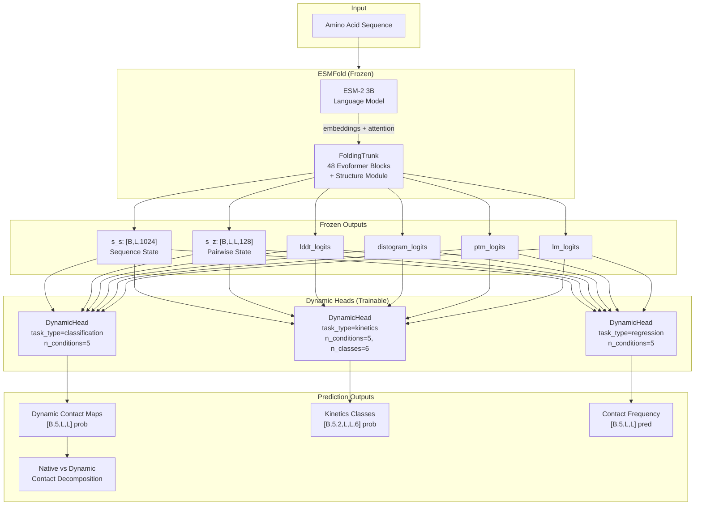
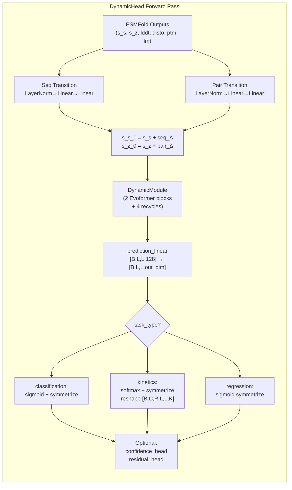

---
slug:4-architecture-overview
blog_type:normal
---


ESMDynamic 是一个**蛋白质动态接触图预测器**，构建为 Meta 的 ESMFold 的微调扩展。ESMDynamic 并非预测单一静态结构，而是在 ESMFold 冻结的主干网络上附加专门的预测头，从而仅从单条氨基酸序列推断**随温度变化的动态接触**、**接触动力学时间尺度**以及**接触频率**。本页提供了整个系统的结构图、各模块间的数据流，以及每个组件背后的设计原理。


来源: [esmdynamic.py](/esm/esmdynamic/esmdynamic.py#L1-L636), [README.md](/README.md#L1-L226)

## 系统架构图

下面的 Mermaid 图展示了顶层架构和前向传播的数据流。ESMFold 作为一个**冻结的特征提取器**：其内部的 Evoformer 主干网络产生序列级 (`s_s`) 和成对 (`s_z`) 表示，以及辅助输出（lddt logits、distogram logits、pTM logits、语言模型 logits）。每个 `DynamicHead` 消费这些冻结的输出，应用学习的偏置转移，运行其自身的 `DynamicModule`（一个带有循环的轻量级 Evoformer），并将生成的成对特征映射到特定任务的预测。



来源: [esmdynamic.py](/esm/esmdynamic/esmdynamic.py#L218-L300), [esmfold.py](/esm/esmfold/v1/esmfold.py#L1-L80)

## 核心模块清单

代码库被组织为不同的层：**冻结的 ESMFold 主干网络**、**可训练的动态扩展**、**训练框架**以及**推理/可视化流水线**。下表将每个模块映射到其角色和关键类。

| 模块路径 | 角色 | 关键类 / 函数 | 可训练 |
|---|---|---|---|
| `esm/esmfold/v1/esmfold.py` | 冻结的蛋白质结构主干网络 | `ESMFold` | ❌ 冻结 |
| `esm/esmfold/v1/trunk.py` | ESMFold 的 48 块 Evoformer + 结构模块 | `FoldingTrunk` | ❌ 冻结 |
| `esm/esmfold/v1/tri_self_attn_block.py` | 三角注意力块 (OpenFold) | `TriangularSelfAttentionBlock` | ❌ 冻结 |
| `esm/esmdynamic/esmdynamic.py` | 顶层模型 + 统一预测头 | `ESMDynamic`, `DynamicHead` | ✅ 可训练 |
| `esm/esmdynamic/dynamic_module.py` | 用于动态接触的轻量级 Evoformer | `DynamicModule` | ✅ 可训练 |
| `esm/esmdynamic/pretrained.py` | 从 Illinois Data Bank 加载权重 | `esmdynamic()` | — |
| `esm/esmdynamic/predict.py` | CLI 推理 + 可视化输出 | `run_esmdynamic` | — |
| `esm/esmdynamic/training/train.py` | 带有特定头优化器的训练循环 | `train()` | — |
| `esm/esmdynamic/training/loss.py` | Focal loss + 交叉熵 + MSE 损失 | `esmdynamic_loss()` | — |
| `esm/esmdynamic/training/data_reader.py` | mdCATH 数据集加载 + 加权采样 | `DynContactDataset` | — |

来源: [esmdynamic.py](/esm/esmdynamic/esmdynamic.py#L1-L50), [dynamic_module.py](/esm/esmdynamic/dynamic_module.py#L1-L123), [loss.py](/esm/esmdynamic/training/loss.py#L1-L185), [predict.py](/esm/esmdynamic/predict.py#L1-L658)

## ESMDynamic 类 — 顶层协调器

`ESMDynamic` 类是系统的入口点。在初始化时，它使用 `requires_grad_(False)` 加载冻结的 ESMFold 模型 (`esm.pretrained.esmfold_v1()`)，然后为每个选定的预测任务实例化一个 `DynamicHead`。三个默认头为：

| 头名称 | 任务类型 | `n_conditions` | `n_classes` | 输出形状 | 描述 |
|---|---|---|---|---|---|
| `dynamic` | 分类 | 5 | — | `[B, 5, L, L]` | 5 个温度下的二元动态接触概率 |
| `kinetic` | 动力学 | 5 | 6 | `[B, 5, 2, L, L, 6]` | 每个温度的开启/关闭时间尺度类别（6 个类别） |
| `frequency` | 回归 | 5 | — | `[B, 5, L, L]` | 5 个温度下的接触占用率/频率 |

5 个默认温度对应于 `[320, 348, 379, 413, 450]` K，从而在单次前向传播中实现多温度预测。可以通过 `heads_to_load=["dynamic", "kinetic"]` 选择性加载头，或者通过 `head_definitions` 完全自定义头。

来源: [esmdynamic.py](/esm/esmdynamic/esmdynamic.py#L218-L300), [predict.py](/esm/esmdynamic/predict.py#L12-L13)

## DynamicHead — 统一的多任务预测头

无论任务类型如何，每个 `DynamicHead` 都遵循相同的架构模板，仅在输出维度和后处理逻辑上有所不同。前向传播分三个阶段进行：

**阶段 1 — 偏置转移**：预测头对 ESMFold 的序列状态和成对状态计算学习的加性校正。序列转移将 `lddt_logits` 和 `lm_logits` 拼接（生成维度为 `23 + 37×50 = 1873` 的向量），通过 `LayerNorm → Linear → Linear`，并将结果加到 `s_s` 上。成对转移将 `ptm_logits` 和 `distogram_logits` 拼接（维度为 `64 + 64 = 128`），应用相同的 `LayerNorm → Linear → Linear` 模式，并加到 `s_z` 上。这些转移允许每个头针对其特定任务特化共享的冻结表示。

**阶段 2 — DynamicModule**：经过偏置校正的 `s_s_0` 和 `s_z_0` 被馈入头自身的 `DynamicModule` 实例，该实例运行一个带有循环的轻量级 Evoformer（默认 2 个块，而 ESMFold 为 48 个），并带有循环（默认 4 次循环）。这将生成精炼的成对特征 `[B, L, L, 128]`。

**阶段 3 — 预测线性层 + 可选头**：成对特征通过单个 `nn.Linear(pair_state_dim, out_dim)` 投影。然后根据任务类型对输出进行重塑和后处理——分类使用 sigmoid + 对称化，动力学/多分类使用 softmax + 对称化，回归使用 sigmoid 对称化。可选地，应用**置信度头**（每个残基、每个温度的精度预测）和**残差头**（回归的成对误差预测）。



来源: [esmdynamic.py](/esm/esmdynamic/esmdynamic.py#L57-L199)

## DynamicModule — 带有循环的轻量级 Evoformer

`DynamicModule` 在架构上与 ESMFold 的 `FoldingTrunk` 相同，但**省略了结构模块**，并且仅使用 2 个 `TriangularSelfAttentionBlock` 实例而非 48 个。每个块实现了完整的 AlphaFold2 风格的 Evoformer 更新：**三角乘法更新**（传入 + 传出）、**三角自注意力**（起始 + 终止节点）、**序列到成对**和**成对到序列**通信，以及序列和成对轨道上的**残基 MLP**。

循环机制与 ESMFold 的镜像相同：在每次循环迭代中，上一次迭代的 `s_s` 和 `s_z` 被分离、层归一化，并作为偏置加到初始输入中。一个**循环 distogram 嵌入**（15 个 bin）也被加到 `s_z` 中，提供来自上一次迭代的几何反馈。除最后一次迭代外，所有循环迭代均禁用梯度，实现了“仅通过最后一次循环计算梯度”策略。

| 参数 | DynamicModule (默认) | FoldingTrunk (ESMFold) |
|---|---|---|
| `num_blocks` | 2 | 48 |
| `sequence_state_dim` | 1024 | 1024 |
| `pairwise_state_dim` | 128 | 128 |
| `sequence_head_width` | 32 | 32 |
| `pairwise_head_width` | 32 | 32 |
| `max_recycles` | 4 | 4 |
| `position_bins` | 32 | 32 |
| 结构模块 | ❌ 未包含 | ✅ 包含 |

<CgxTip>`DynamicModule` 复用了 ESMFold 中完全相同的 `TriangularSelfAttentionBlock` 类——只有块数不同。这意味着所有三角注意力操作（来自 OpenFold）都是共享代码，确保了冻结主干网络和可训练扩展之间的架构一致性。</CgxTip>

来源: [dynamic_module.py](/esm/esmdynamic/dynamic_module.py#L1-L123), [trunk.py](/esm/esmfold/v1/trunk.py#L80-L244), [tri_self_attn_block.py](/esm/esmfold/v1/tri_self_attn_block.py#L1-L100)

## 天然接触分解

当加载 `dynamic` 头时，`ESMDynamic.forward()` 会执行一个额外的后处理步骤：它将 ESMFold 预测的 PDB 转换为**天然接触图**（Cα 距离 < 8 Å，通过 MDTraj），然后计算两个衍生矩阵——**动态但非天然**接触和**天然但非动态**接触。这种分解直接识别了仅在升高温度下出现的接触（动态、非天然）与在静态结构中存在但非动态的接触（天然、非动态），这是该模型的核心科学输出。

来源: [esmdynamic.py](/esm/esmdynamic/esmdynamic.py#L330-L398), [esmdynamic.py](/esm/esmdynamic/esmdynamic.py#L598-L636)

## 推理模式

ESMDynamic 通过 `predict_from_seqs()` 支持两种推理路径：

| 模式 | 方法 | 内存策略 | 适用场景 |
|---|---|---|---|
| **标准** | `forward_from_seq()` | 完整模型在 GPU 上 | 默认；最快 |
| **低内存** | `forward_from_seq_low_memory()` | 顺序执行头；头之间进行 CPU 卸载 | GPU VRAM < 16 GB |

低内存模式在计算完冻结输出后将 ESMFold 移至 CPU，然后一次将一个 `DynamicHead` 加载到 GPU，在每个头完成后分离并卸载结果，并显式调用 `torch.cuda.empty_cache()`。这以约 3 倍的执行速度为代价，换取了大幅降低的峰值显存占用。

来源: [esmdynamic.py](/esm/esmdynamic/esmdynamic.py#L440-L530), [esmdynamic.py](/esm/esmdynamic/esmdynamic.py#L530-L598)

## 权重加载架构

预训练权重通过 `esm/esmdynamic/pretrained.py` 加载，该文件从 **Illinois Data Bank** (`https://databank.illinois.edu/datafiles/7odsk/download`) 下载 ESMDynamic 检查点。加载过程使用 `strict=False` 以允许部分匹配——这是必不可少的，因为冻结的 ESMFold 权重在构建时已嵌入模型中，检查点只需提供可训练的头参数。加载器在应用状态字典之前，会验证没有缺失任何关键（非 ESMFold、非 dummy）键。

来源: [pretrained.py](/esm/esmdynamic/pretrained.py#L1-L36)

## 项目目录结构

```
esm/
├── esmdynamic/                    ← 核心 ESMDynamic 扩展
│   ├── esmdynamic.py              ← ESMDynamic + DynamicHead 类
│   ├── dynamic_module.py          ← 轻量级 Evoformer (DynamicModule)
│   ├── pretrained.py              ← 从 Illinois Data Bank 加载权重
│   ├── predict.py                 ← CLI 推理脚本 (run_esmdynamic)
│   └── training/                  ← 训练框架
│       ├── train.py               ← 训练循环 + 特定头优化器
│       ├── loss.py                ← Focal loss, CE, MSE + 模块化封装
│       └── data_reader.py         ← DynContactDataset + 加权采样器
├── esmfold/v1/                    ← 冻结的 ESMFold 主干网络
│   ├── esmfold.py                 ← ESMFold 模型类
│   ├── trunk.py                   ← FoldingTrunk (48 块 Evoformer)
│   └── tri_self_attn_block.py     ← TriangularSelfAttentionBlock
├── model/                         ← ESM-1, ESM-2, MSA Transformer
└── inverse_folding/               ← ESM-IF (逆折叠工具)

examples/esmdynamic/               ← 示例 FASTA/CSV + Colab notebook
scripts/                           ← 权重下载 + 解压工具
tests/                             ← 单元测试
```

来源: [esmdynamic.py](/esm/esmdynamic/esmdynamic.py#L1-L50), [dynamic_module.py](/esm/esmdynamic/dynamic_module.py#L1-L123)

## 设计原理总结

ESMDynamic 的架构体现了一种深思熟虑的**冻结并扩展**策略。通过保持 ESMFold 完全冻结，该模型保留了 ESMFold 在数百万蛋白质上训练期间学习到的强大的序列-结构表示，而轻量级的 `DynamicModule`（2 个块对 48 个块）仅增加了预测动态特性所需的容量。每个头都有自己具有独立配置的 `DynamicModule` 实例，允许特定任务的深度和循环次数。**多温度输出** (`n_conditions=5`) 被嵌入到线性投影中，而不需要单独的前向传播，使得设计兼具参数高效性和推理高效性。可选的**置信度**和**残差**头无需外部后处理即可提供校准的不确定性估计。

<CgxTip>冻结并扩展的设计意味着训练仅更新约 2% 的总参数（DynamicHead 权重）。这防止了对 ESMFold 结构知识的灾难性遗忘，并允许在相对较小的动态接触数据集（mdCATH，约 4K 个蛋白质）上进行训练，而不会对主干网络过拟合。</CgxTip>

来源: [esmdynamic.py](/esm/esmdynamic/esmdynamic.py#L218-L300), [train.py](/esm/esmdynamic/training/train.py#L1-L200)

## 下一步

既然你已经了解了架构全貌，可以深入研究各组件的专属页面：

1. **[ESMDynamic 模型类](5-esmdynamic-model-class)** — `ESMDynamic` 和 `DynamicHead` 的详细 API 参考，包括构造函数参数、前向传播签名和输出字典键。
2. **[DynamicModule 和 Evoformer 循环](6-dynamicmodule-and-evoformer-recycling)** — 轻量级 Evoformer、循环循环和 `TriangularSelfAttentionBlock` 组合的内部机制。
3. **[多头预测设计](7-multi-head-prediction-design)** — 分类、动力学和回归头在输出整形、对称化和可选子头方面的差异。
4. **[预训练模型与权重加载](12-pretrained-model-and-weight-loading)** — 逐步的权重解析、部分加载和 Illinois Data Bank 集成。
5. **[低内存推理模式](13-low-memory-inference-mode)** — 针对内存受限环境的 GPU/CPU 编排策略。