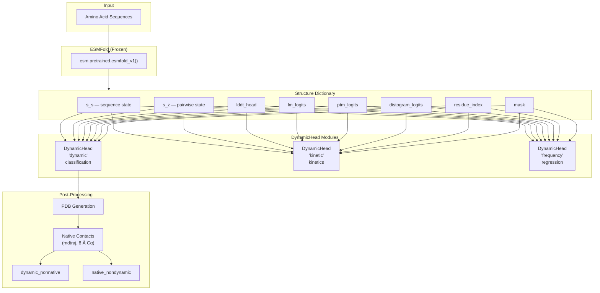
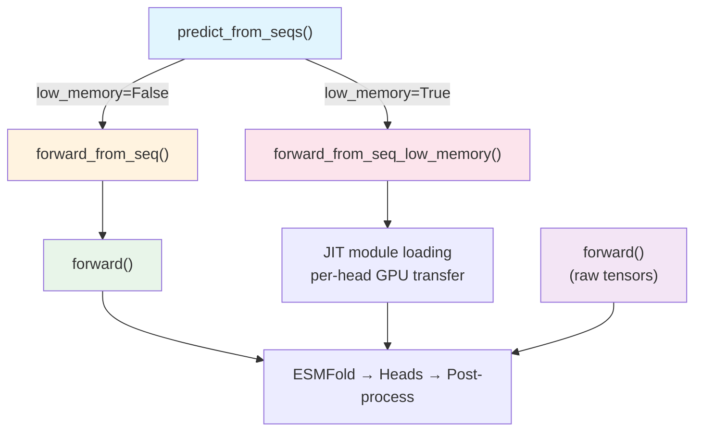

---
slug:5-esmdynamic-model-class
blog_type:normal
---


**`ESMDynamic`** 类是核心神经网络模块，负责编排整个预测流程——从 ESMFold 结构推断到多头动态接触预测。它由一个冻结的 ESMFold 骨干网络和任意数量的 **`DynamicHead`** 模块组合而成，每个模块能够在多种温度条件下执行分类、回归、多分类或动力学任务。理解此类对于推断自定义和训练集成至关重要，因为每条预测路径都流经其前向方法。

来源: [esmdynamic.py](esm/esmdynamic/esmdynamic.py#L213-L220)

## 架构概述

`ESMDynamic` 模型遵循**两阶段架构**：冻结的 ESMFold 编码器生成结构级表示，随后由特定任务的 `DynamicHead` 模块消耗，每个模块封装了自己的 `DynamicModule`（轻量级 Evoformer）。输出字典累积了每个头的预测结果，当存在 `"dynamic"` 分类头时，后处理步骤会从 ESMFold PDB 中推导出天然接触图，并计算集合差异 *dynamic − native* 和 *native − dynamic*。



来源: [esmdynamic.py](esm/esmdynamic/esmdynamic.py#L213-L411)

## ESMDynamicConfig

`ESMDynamicConfig` 数据类管理三个默认的 `DynamicModule` 配置——每个头一个。每个字段都是一个 `DynamicModuleConfig` 实例，控制类 Evoformer 块的数量、状态维度、头宽度、循环和 dropout。

| 字段 | 默认实例 | 用途 |
|---|---|---|
| `dynamic_module` | `DynamicModuleConfig()` | **动态接触分类**头的配置 |
| `kinetic_module` | `DynamicModuleConfig()` | **动力学**头的配置 |
| `frequency_module` | `DynamicModuleConfig()` | **接触频率回归**头的配置 |

`DynamicModuleConfig` 的默认值（定义在 `DynamicModule` 伴生类中）为：

| 参数 | 默认值 | 描述 |
|---|---|---|
| `num_blocks` | 2 | `TriangularSelfAttentionBlock` 层的数量 |
| `sequence_state_dim` | 1024 | 序列表示维度 (C_s) |
| `pairwise_state_dim` | 128 | 成对表示维度 (C_z) |
| `sequence_head_width` | 32 | 序列注意力的头宽度 |
| `pairwise_head_width` | 32 | 成对注意力的头宽度 |
| `position_bins` | 32 | 相对位置编码的分箱数 |
| `max_recycles` | 4 | 最大 Evoformer 循环迭代次数 |
| `dropout` | 0.0 | Dropout 概率 |
| `layer_drop` | 0.0 | 层 Dropout 概率 |

<CgxTip>`ESMDynamicConfig` 中的三个 `DynamicModuleConfig` 字段是*独立*的——你可以针对每个头调整 `num_blocks`、`max_recycles` 或任何其他参数，而不会影响其余头。这对于平衡准确率与速度至关重要：分类头可能受益于更多循环，而回归头则未必。</CgxTip>

来源: [esmdynamic.py](esm/esmdynamic/esmdynamic.py#L24-L29), [dynamic_module.py](esm/esmdynamic/dynamic_module.py#L17-L33)

## DynamicHead — 统一预测头

`DynamicHead` 是一个自包含的 `nn.Module`，执行单任务的完整预测工作流：它接收 ESMFold 结构字典，构建经偏差校正的序列和成对输入，将它们通过 `DynamicModule` 运行，然后应用特定任务的预测、置信度和残差头。

### 构造器签名

```python
DynamicHead(
    name: str,                  # 头标识符 (例如, "dynamic", "kinetic", "frequency")
    task_type: str,             # "classification" | "regression" | "multiclass" | "kinetics"
    seq_input_dim: int,         # 拼接的 lddt + lm_logits 维度
    seq_state_dim: int,         # 目标序列状态维度 (1024)
    pair_input_dim: int,        # 拼接的 ptm + distogram 维度
    pair_state_dim: int,        # 目标成对状态维度 (128)
    dynamic_cfg,                # 内部 DynamicModule 的 DynamicModuleConfig
    n_conditions: int = 5,      # 温度条件数
    n_classes: Optional[int] = None,  # 类别数 (multiclass/kinetics 必需)
    use_confidence_head: bool = False,
    use_residual_head: bool = False,
)
```

### 内部架构

该头包含五个子模块，组织成清晰的数据流管道：

| 子模块 | 维度 | 用途 |
|---|---|---|
| `seq_transition` | `LayerNorm → Linear → Linear` | 偏差校正：将 lddt + lm_logits 合并到序列状态空间 |
| `pair_transition` | `LayerNorm → Linear → Linear` | 偏差校正：将 ptm + distogram 合并到成对状态空间 |
| `dynamic_module` | `DynamicModule` | 带循环的 Evoformer 风格处理 |
| `prediction_linear` | `Linear(pair_state_dim, out_dim)` | 将成对特征映射到特定任务输出 |
| `confidence_head` | `LayerNorm → Linear → ReLU → Linear` | 每残基每温度置信度 (可选) |
| `residual_head` | `LayerNorm → Linear → ReLU → Linear` | 回归任务的成对残差 (可选) |

### 特定任务的输出维度

`prediction_linear` 的 `out_dim` 随 `task_type` 变化：

| `task_type` | `out_dim` 公式 | 示例 (默认值) |
|---|---|---|
| `"classification"` | `n_conditions` | 5 |
| `"regression"` | `n_conditions` | 5 |
| `"multiclass"` | `n_conditions × n_classes` | 5 × 6 = 30 |
| `"kinetics"` | `n_conditions × n_classes × 2` | 5 × 6 × 2 = 60 |

### 前向方法 — 数据流

`DynamicHead.forward` 方法执行以下步骤：

1. **偏差构建**：拼接 `lddt_head` 与 `lm_logits`（序列），以及 `ptm_logits` 与 `distogram_logits`（成对），然后应用各自的过渡网络作为加性偏差施加于 `s_s` 和 `s_z`。
2. **DynamicModule 传递**：将经偏差校正的状态通过带有循环的 `self.dynamic_module` 进行传递。
3. **预测线性变换 + 重塑**：将 `prediction_linear` 应用于成对输出，然后重塑并置换为规范轴顺序。
4. **特定任务激活**：应用 sigmoid（分类/回归）或 softmax（多分类/动力学），随后进行**对称化**——`(M + Mᵀ) / 2`——以强制接触图对称性。
5. **置信度头**（如果启用）：生成每残基、每温度的置信度分数。
6. **残差头**（如果启用）：生成成对残差，同样进行对称化。

<CgxTip>对称化统一应用于所有任务类型，因为接触图本质上是对称的：如果残基 *i* 接触残基 *j*，则 *j* 接触 *i*。`DynamicHead` 通过在激活函数后对预测值与其转置取平均来强制执行此对称性，这比预对称化 logits 更为合理。</CgxTip>

来源: [esmdynamic.py](esm/esmdynamic/esmdynamic.py#L32-L209)

## ESMDynamic — 主模型类

### 构造器

```python
ESMDynamic(
    load_esmfold=True,           # 加载冻结的 ESMFold 骨干网络
    esmdynamic_config=None,      # OmegaConf 结构化的 ESMDynamicConfig
    esmfold_config=None,         # (保留，尚未接入)
    head_definitions=None,       # 自定义头规格列表 (与 heads_to_load 互斥)
    heads_to_load=None,          # 按名称选择默认头，例如 ["dynamic", "kinetic"]
    **kwargs,                    # 转发至 ESMDynamicConfig
)
```

### ESMFold 骨干网络集成

当 `load_esmfold=True`（默认值）时，构造器实例化 `esm.pretrained.esmfold_v1()` 并立即使用 `requires_grad_(False)` 冻结它。ESMFold 模型提供 `DynamicHead` 模块消耗的结构表示（`s_s`、`s_z`、`lddt_head`、`lm_logits`、`ptm_logits`、`distogram_logits`、`residue_index`）。从 ESMFold 配置中提取五个维度常量，用于计算过渡输入维度：

| 常量 | 值 | 用于 |
|---|---|---|
| `esmfold_n_tokens_embed` | 23 | 序列 token 嵌入维度 |
| `esmfold_lddt_bins` | 50 | lDDT 直方图分箱数 |
| `esmfold_cfg_trunk_sequence_state_dim` | 1024 | 序列状态维度 (C_s) |
| `esmfold_distogram_bins` | 64 | Distogram 分箱数 |
| `esmfold_cfg_trunk_pairwise_state_dim` | 128 | 成对状态维度 (C_z) |

由此得出 `seq_input_dim = 23 + 37 × 50 = 1873` 和 `pair_input_dim = 2 × 64 = 128`。

来源: [esmdynamic.py](esm/esmdynamic/esmdynamic.py#L221-L326)

### 头选择与默认定义

构造器定义了三个**默认头规格**，除非被覆盖，否则将实例化它们：

| 头名称 | `task_type` | `n_conditions` | `n_classes` | 置信度头 | 残差头 |
|---|---|---|---|---|---|
| `"dynamic"` | `"classification"` | 5 | None | ✅ | ❌ |
| `"kinetic"` | `"kinetics"` | 5 | 6 | ✅ | ❌ |
| `"frequency"` | `"regression"` | 5 | None | ❌ | ✅ |

**动力学头**使用 `n_classes=6`，对应时间类别：*始终观测到*、*1–10 ns*、*10–100 ns*、*100–300 ns*、*300+ ns*、*从未观测到*。当 `task_type="kinetics"` 时，`n_rates=2` 维度（开启时间 / 关闭时间）在 `DynamicHead` 中被硬编码。

头选择遵循**互斥**逻辑：你可以提供 `head_definitions`（自定义头字典列表）或 `heads_to_load`（默认头名称子集），但不能同时提供两者。如果两者均未提供，则实例化**所有三个默认头**。头以 `nn.ModuleDict` 形式存储在 `self.heads` 中。

来源: [esmdynamic.py](esm/esmdynamic/esmdynamic.py#L252-L325)

## 前向方法 — 四条预测路径

`ESMDynamic` 类公开了四种运行预测的方法，每种适用于不同用例：



### `forward()` — 张量级入口点

核心 `forward` 方法接受预分词的张量（`aa`、`mask`、`residx`）或 `precomputed` ESMFold 输出字典。它在 `torch.no_grad()` 下运行 ESMFold，然后遍历所有头，最后如果存在 `"dynamic"` 头，则执行天然接触后处理。

```python
structure = self.forward(
    aa=torch.Tensor,              # 分词后的氨基酸 [B, L]
    mask=torch.Tensor,            # 有效残基掩码 [B, L]
    residx=torch.Tensor,          # 残基索引 [B, L]
    masking_pattern=torch.Tensor,  # 可选输入掩码
    num_recycles=int,             # 覆盖循环次数
    precomputed=dict,             # 预计算的 ESMFold 输出 (训练捷径)
)
```

**关键行为：**
- ESMFold 始终在 `torch.no_grad()` 下执行——梯度仅流经头。
- 如果 `load_esmfold=False`，则**必须**提供 `precomputed` 字典（在训练期间使用，以避免冗余的 ESMFold 调用）。
- 如果未提供 `mask` 且未给出预计算输出，则 `mask` 默认为 `torch.ones_like(aa)`。

来源: [esmdynamic.py](esm/esmdynamic/esmdynamic.py#L334-L411)

### `forward_from_seq()` — 序列级入口 (带梯度)

接受原始氨基酸字符串，通过 `batch_encode_sequences` 对其进行编码，并委托给 `forward()`。**启用梯度**——在训练期间或需要通过整个流程进行反向传播时使用此方法。

```python
structure = model.forward_from_seq(
    sequences=["MKTAYIAKQRQ", "GAHVAVDAI"],  # str 或 List[str]
    residx=None,                # 可选残基索引
    num_recycles=None,          # 默认：训练最大循环次数
    residue_index_offset=512,   # 链间残基间隔
    chain_linker="G" * 25,      # 多甘氨酸链接子
)
```

多聚体序列通过用 `":"` 连接链序列来指定（例如，`"CHAIN1:CHAIN2"`）。`batch_encode_sequences` 实用程序处理分词、带链间偏移的残基索引以及链接子插入。

来源: [esmdynamic.py](esm/esmdynamic/esmdynamic.py#L413-L456)

### `forward_from_seq_low_memory()` — GPU 内存高效推断

实现**即时模块加载**以降低峰值 GPU 内存。策略为：

1. 将整个模型移至 CPU，释放 GPU 缓存。
2. **仅**将 ESMFold 移至 GPU，计算结构，将 ESMFold 移回 CPU。
3. **对于每个头**：将头移至 GPU，将主干移至 GPU，计算，将结果移至 CPU，释放 GPU 缓存。
4. 将完整模型恢复到原始设备。

这种逐头的顺序执行以吞吐量换取内存，从而能够在更长序列或更小 GPU 上进行预测。

来源: [esmdynamic.py](esm/esmdynamic/esmdynamic.py#L458-L546)

### `predict_from_seqs()` — 推荐的推断 API

**主要的面向用户方法**。使用 `@torch.no_grad()` 装饰，它禁用梯度计算，并根据 `low_memory` 标志分派至 `forward_from_seq` 或 `forward_from_seq_low_memory`。

```python
prediction = model.predict_from_seqs(
    sequences=["MKTAYIAKQRQ"],
    low_memory=False,           # 对内存受限的 GPU 设为 True
    num_recycles=None,
    residue_index_offset=512,
    chain_linker="G" * 25,
)
```

来源: [esmdynamic.py](esm/esmdynamic/esmdynamic.py#L548-L595)

## 输出字典结构

所有前向方法均返回一个**结构字典**，累积 ESMFold 输出、逐头预测和派生量。键遵循命名约定，其中 `{name}` 为头标识符（例如，`"dynamic"`、`"kinetic"`、`"frequency"`）。

### 常见 ESMFold 键

| 键 | 形状 | 描述 |
|---|---|---|
| `s_s` | `[B, L, 1024]` | 最终序列状态 |
| `s_z` | `[B, L, L, 128]` | 最终成对状态 |
| `lddt_head` | `[B, L, 50, 37]` | lDDT 预测 logits |
| `lm_logits` | `[B, L, 23]` | 语言模型 logits |
| `ptm_logits` | `[B, L, L, 64]` | 预测 TM-score logits |
| `distogram_logits` | `[B, L, L, 64]` | Distogram logits |
| `residue_index` | `[B, L]` | 残基索引 |
| `mask` | `[B, L]` | 有效残基掩码 |

### 按任务类型的逐头输出键

**分类** (`task_type="classification"`, 例如 `"dynamic"`)：

| 键 | 形状 | 描述 |
|---|---|---|
| `{name}_logits` | `[B, N, L, L]` | 原始 logits (N = n_conditions) |
| `{name}_prob` | `[B, N, L, L]` | Sigmoid 概率 (对称化) |
| `{name}_pred` | `[B, N, L, L]` | 二值预测 (阈值 0.5) |
| `{name}_confidence` | `[B, N, L]` | 每残基每温度置信度 |
| `{name}_output` | `dict` | 原始 DynamicModule 输出 |

**动力学** (`task_type="kinetics"`, 例如 `"kinetic"`)：

| 键 | 形状 | 描述 |
|---|---|---|
| `{name}_logits` | `[B, N, 2, L, L, C]` | Logits (N=温度, 2=开/关, C=n_classes) |
| `{name}_prob` | `[B, N, 2, L, L, C]` | Softmax 概率 (对称化) |
| `{name}_pred_class` | `[B, N, 2, L, L]` | Argmax 类别索引 |
| `{name}_confidence` | `[B, N, L]` | 每残基每温度置信度 |

**回归** (`task_type="regression"`, 例如 `"frequency"`)：

| 键 | 形状 | 描述 |
|---|---|---|
| `{name}_value` | `[B, N, L, L]` | 原始回归输出 |
| `{name}_pred` | `[B, N, L, L]` | Sigmoid 裁剪的对称化预测 |
| `{name}_residual_pred` | `[B, N, L, L]` | 成对残差预测 |
| `{name}_output` | `dict` | 原始 DynamicModule 输出 |

### 派生接触键 (当存在 `"dynamic"` 头时)

| 键 | 形状 | 描述 |
|---|---|---|
| `pdbs` | `List[str]` | ESMFold 生成的 PDB 字符串 |
| `native_contacts` | `[B, L, L]` | 静态接触图 (8 Å Cα 阈值) |
| `dynamic_nonnative_contacts` | `[B, N, L, L]` | 静态结构中不存在的动态接触 |
| `native_nondynamic_contacts` | `[B, N, L, L]` | 未被预测为动态的静态接触 |

来源: [esmdynamic.py](esm/esmdynamic/esmdynamic.py#L119-L209), [esmdynamic.py](esm/esmdynamic/esmdynamic.py#L360-L410)

## 天然接触计算

当加载 `"dynamic"` 头时，`forward` 方法执行后处理步骤，将动态预测与 ESMFold 预测的静态结构进行比较。`compute_native_contacts` 方法：

1. 通过 `self.esmfold.output_to_pdb()` 将 ESMFold 输出转换为 PDB 字符串。
2. 使用 **mdtraj** 加载每个 PDB 并计算所有成对的 Cα 距离。
3. 应用 **8.0 Å 阈值**生成二值天然接触图。
4. 将对角线置零（排除残基自接触）。

该方法返回每批次接触图列表，为 `torch.int64` 张量。随后将它们填充以匹配动态预测维度，并用于计算两个差集图：`dynamic_nonnative_contacts`（预测为动态但不在静态结构中的接触——可能是**隐式或条件依赖的接触**）和 `native_nondynamic_contacts`（在静态结构中但未被预测为动态的接触——**稳定的、始终形成的接触**）。

来源: [esmdynamic.py](esm/esmdynamic/esmdynamic.py#L360-L436)

## 设备管理与分块大小设定

`ESMDynamic` 类通过注册的 `dummy_buffer`（一个随模型调用 `.to(device)` 时移动的零值张量）来跟踪其设备。`device` 属性读取此缓冲区的设备，提供了一种无需检查参数即可确定模型位置的可靠方法。

```python
@property
def device(self):
    return self.dummy_buffer.device
```

`set_chunk_size` 方法将分块大小传播到 ESMFold（用于内存高效注意力）和每个头的 `DynamicModule`（支持分块三角自注意力）。这对于减少长序列上的峰值内存很有用。

来源: [esmdynamic.py](esm/esmdynamic/esmdynamic.py#L327-L332), [esmdynamic.py](esm/esmdynamic/esmdynamic.py#L597-L599)

## 自定义头配置

高级用户可以通过 `head_definitions` 参数定义完全自定义的头。每个元素是具有以下模式的字典：

```python
custom_heads = [
    dict(
        name="my_custom_head",
        task_type="multiclass",       # "classification" | "regression" | "multiclass" | "kinetics"
        n_conditions=3,               # 例如，3 个温度条件
        n_classes=4,                  # multiclass/kinetics 必需
        dynamic_cfg=DynamicModuleConfig(num_blocks=1, max_recycles=2),  # 自定义 Evoformer 配置
        use_confidence_head=True,
        use_residual_head=False,
    ),
]
model = ESMDynamic(head_definitions=custom_heads)
```

`dynamic_cfg` 字段接受任何兼容 `DynamicModuleConfig` 的关键字参数，从而实现逐头控制 Evoformer 深度、循环和注意力配置。使用 `head_definitions` 时，`heads_to_load` 参数必须为 `None`——两者互斥。

来源: [esmdynamic.py](esm/esmdynamic/esmdynamic.py#L252-L325)

---

**下一步**：深入了解 [DynamicModule 与 Evoformer 循环](6-dynamicmodule-and-evoformer-recycling) 中的 Evoformer 循环内部机制，或探索多头设计如何在 [多头预测设计](7-multi-head-prediction-design) 中生成特定任务输出。有关推断工作流，请参阅 [批量预测脚本](10-bulk-prediction-script) 或 [Colab 笔记本工作流](11-colab-notebook-workflow)。