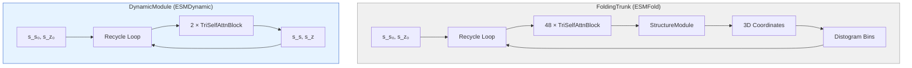
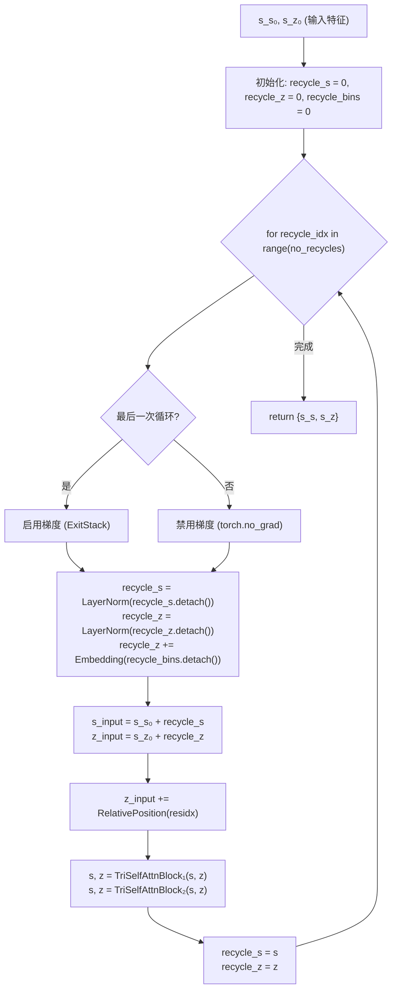
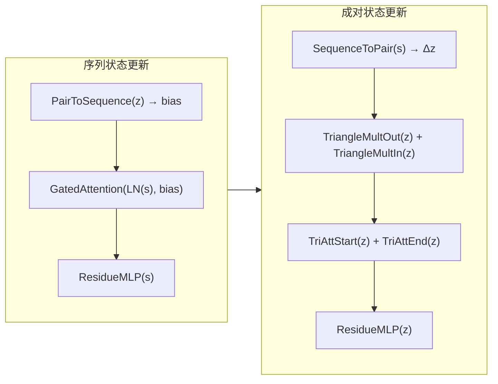

---
slug:6-dynamicmodule-and-evoformer-recycling
blog_type:normal
---


**DynamicModule** 是 ESMFold 的 `FoldingTrunk` 的专用变体，它剥离了结构预测机制，转向对序列和成对表征进行迭代精炼，以用于**动态接触预测**。其架构继承了 AlphaFold2/ESMFold 的 Evoformer 风格三角自注意力块和循环机制，但用更简单的、基于嵌入的循环信号替换了 `StructureModule` 和基于距离直方图的回收桶——在减少计算开销的同时，保留了使 Evoformer 循环机制有效的迭代精炼能力。

来源: [dynamic_module.py](esm/esmdynamic/dynamic_module.py#L1-L123), [trunk.py](esm/esmfold/v1/trunk.py#L1-L244)

## 与 FoldingTrunk 的架构关系

`DynamicModule` 刻意镜像了 `FoldingTrunk` 的 Evoformer 核心——相同的 `TriangularSelfAttentionBlock` 组合、相同的 `RelativePosition` 嵌入、相同的基于 `LayerNorm` 的循环门控——但在终端阶段产生了分歧。`FoldingTrunk` 将循环表征通过 `StructureModule` 生成 3D 坐标（然后根据 Cβ–Cβ 距离为下一次循环计算距离直方图），而 `DynamicModule` **完全省略了结构模块**。这种省略是决定性的架构决策：动态接触预测直接在已学习的成对表征空间上进行操作，无需中间的几何实例化。



下表捕捉了两个模块之间精确的结构分歧：

| 方面 | `FoldingTrunk` | `DynamicModule` |
|---|---|---|
| **Evoformer 块** | 48 | 2 |
| **序列状态维度** (c_s) | 1024 | 1024 |
| **成对状态维度** (c_z) | 128 | 128 |
| **StructureModule** | 存在 (IPA + ResNet) | **已省略** |
| **循环距离直方图来源** | 来自 3D 坐标的 Cβ–Cβ 距离 | 可学习的 `nn.Embedding` (无坐标) |
| **循环桶数量** | 15 | 15 |
| **Trunk→SM 投影** | `trunk2sm_s`, `trunk2sm_z` | **不需要** |
| **输出** | 结构字典 (坐标, pLDDT 等) | 仅 `{s_s, s_z}` 表征 |
| **默认最大循环次数** | 4 | 4 |

来源: [dynamic_module.py](esm/esmdynamic/dynamic_module.py#L35-L72), [trunk.py](esm/esmfold/v1/trunk.py#L36-L51), [trunk.py](esm/esmfold/v1/trunk.py#L110-L148)

## DynamicModuleConfig

配置数据类控制所有超参数。它有意作为 `FoldingTrunkConfig` 的子集——缺少 `StructureModuleConfig` 字段，且 `num_blocks` 默认为 **2** 而不是 48，这反映了动态接触预测较轻的精炼负担（繁重的工作已由冻结的 ESMFold 骨干网络完成）。

```python
@dataclass
class DynamicModuleConfig:
    _name: str = "DynamicModuleConfig"
    num_blocks: int = 2              # 每次循环的 Evoformer 块数
    sequence_state_dim: int = 1024   # c_s — 必须能被 sequence_head_width 整除
    pairwise_state_dim: int = 128    # c_z — 必须能被 pairwise_head_width 整除
    sequence_head_width: int = 32    # 每个注意力头的宽度 (序列)
    pairwise_head_width: int = 32    # 每个注意力头的宽度 (成对)
    position_bins: int = 32          # 相对位置嵌入的桶数
    dropout: float = 0               # Dropout 率
    layer_drop: float = 0            # 层 Dropout 率
    cpu_grad_checkpoint: bool = False # 在 CPU 上进行梯度检查点
    max_recycles: int = 4            # 循环迭代次数
    chunk_size: T.Optional[int] = None # 轴向注意力分块大小 (内存与速度的权衡)
```

可整除约束 `c_s % sequence_head_width == 0` 和 `c_z % pairwise_head_width == 0` 在构造时进行断言，并分别将注意力头数确定为 `c_s // sequence_head_width` 和 `c_z // pairwise_head_width`。

来源: [dynamic_module.py](esm/esmdynamic/dynamic_module.py#L16-L33), [dynamic_module.py](esm/esmdynamic/dynamic_module.py#L40-L51)

## 模块构造

`__init__` 方法组装了三类别子模块：

**1. 位置嵌入** — 一个 `RelativePosition` 模块（与 `FoldingTrunk` 共享实现），将残基索引差映射到成对表征空间。它使用 `2 * position_bins + 2` 个嵌入条目（额外的偏移量将索引 0 保留给被掩码的残基对）。

**2. Evoformer 块** — 一个包含 `num_blocks` 个 `TriangularSelfAttentionBlock` 实例的 `nn.ModuleList`，每个实例对 `(s, z)` 元组进行操作，其中 `s ∈ ℝ^{B×L×c_s}` 且 `z ∈ ℝ^{B×L×L×c_z}`。

**3. 循环基础设施** — 三个对循环信号进行门控和丰富的组件：
- `recycle_s_norm`: `LayerNorm(c_s)` — 对循环序列状态进行归一化
- `recycle_z_norm`: `LayerNorm(c_z)` — 对循环成对状态进行归一化
- `recycle_disto`: `Embedding(15, c_z)` — 提供已学习的成对循环信号（索引 0 初始化为零）

<CgxTip>`recycle_disto` 嵌入替换了 `FoldingTrunk` 中依赖几何的距离直方图桶。在 `FoldingTrunk` 中，来自 `StructureModule` 输出的实际 Cβ–Cβ 距离被分桶并反馈；而在这里，桶在所有循环中始终保持为零，因此 `recycle_disto` 嵌入充当了一个在循环迭代中不会改变的已学习偏置。这是一个深思熟虑的设计权衡：它消除了对 3D 坐标生成的依赖，同时仍为成对表征提供了一个可训练的通道，以整合位置循环信息。</CgxTip>

来源: [dynamic_module.py](esm/esmdynamic/dynamic_module.py#L40-L72), [trunk.py](esm/esmfold/v1/trunk.py#L75-L107)

## 循环机制

`forward` 方法实现了 Evoformer 范式中核心的迭代精炼过程。该循环运行 `no_recycles` 次（默认为 `max_recycles + 1`，因为第一次“循环”是使用零值循环信号的标准前向传播）。



### 逐步机制

对于每次循环迭代 `recycle_idx`：

1. **梯度控制**：除**最后一次**外的所有迭代都在 `torch.no_grad()` 下执行。只有最后一次循环计算梯度，这是一种优化策略，可避免在早期循环中为反向传播存储中间激活，同时仍能为实际流向损失的输出正确计算梯度。

2. **循环信号归一化**：来自上一次迭代的循环表征与计算图分离并进行归一化：`recycle_s = LayerNorm(recycle_s.detach())` 和 `recycle_z = LayerNorm(recycle_z.detach())`。`.detach()` 调用至关重要——它确保循环信号被视为固定偏置而非可微路径，从而防止梯度流经之前的循环迭代。

3. **距离直方图嵌入丰富**：成对循环信号通过 `recycle_disto(recycle_bins)` 得到增强。由于 `recycle_bins` 被初始化为零并始终保持全零（没有 `StructureModule` 来更新它），这实际上在每次迭代中为 `recycle_z` 添加了一个**恒定的已学习偏置**。

4. **加性注入**：归一化后的循环信号被**相加**到原始输入中：`s_s_0 + recycle_s` 和 `s_z_0 + recycle_z`。这种类残差的注入意味着第一次迭代（循环信号为零时）处理原始特征，而后续迭代则在此基础上进行精炼。

5. **Evoformer 块传递**：组合后的表征经过 `pairwise_positional_embedding` 的相加，然后依次通过所有 `TriangularSelfAttentionBlock` 实例。

6. **循环状态更新**：输出 `s_s` 和 `s_z` 成为下一次迭代的循环信号。

来源: [dynamic_module.py](esm/esmdynamic/dynamic_module.py#L77-L122), [trunk.py](esm/esmfold/v1/trunk.py#L157-L217)

## TriangularSelfAttentionBlock：Evoformer 核心

每个 `TriangularSelfAttentionBlock` 实现了来自 AlphaFold2 的完整 Evoformer 更新模式，在序列状态 `s` 和成对状态 `z` 上联合操作：



该块按顺序执行以下操作：

| 步骤 | 操作 | 效果 |
|---|---|---|
| 1 | `bias = PairToSequence(z)` | 投影成对状态 → 序列注意力偏置 |
| 2 | `s = s + Dropout(GatedAttention(LN(s), bias))` | 序列上的偏置自注意力 |
| 3 | `s = ResidueMLP(s)` | 序列状态上的前馈网络 |
| 4 | `z = z + SequenceToPair(s)` | 将更新后的序列信息注入成对状态 |
| 5 | `z = z + TriMulOut(z)` | 出站三角乘法更新 |
| 6 | `z = z + TriMulIn(z)` | 入站三角乘法更新 |
| 7 | `z = z + TriAttStart(z)` | 起始节点三角注意力 (按行) |
| 8 | `z = z + TriAttEnd(z)` | 终止节点三角注意力 (按列) |
| 9 | `z = ResidueMLP(z)` | 成对状态上的前馈网络 |

所有新的子层输出（注意力、乘法更新、三角注意力、MLP）均**初始化为零**，这意味着该块最初充当恒等映射，并逐渐学习作出贡献。这是 GPT-2 风格残差流设计中的标准技术，可稳定早期训练。

<CgxTip>`DynamicModule` 仅使用 **2 个块**，而 `FoldingTrunk` 使用 **48 个**——减少了 24 倍。这是可行的，因为 `DynamicModule` 接收了来自冻结 ESMFold 骨干网络（通过 `DynamicHead` 的转换层）已经高度精炼的 `s_s` 和 `s_z`。此处的 Evoformer 块充当**轻量适配器**，将通用结构表征特化用于动态接触预测，而不是从头开始执行全新的表征学习。</CgxTip>

来源: [tri_self_attn_block.py](esm/esmfold/v1/tri_self_attn_block.py#L25-L171), [dynamic_module.py](esm/esmdynamic/dynamic_module.py#L51-L63)

## 循环机制：DynamicModule 对比 FoldingTrunk

两种循环机制共享相同的循环结构，但在一个关键方式上存在分歧，这揭示了设计理念：

### 共享模式
两个模块都：
- 接受 `no_recycles` 参数（带有 `+1` 偏移量用于初始前向传播）
- 使用 `LayerNorm` + `.detach()` 归一化循环状态
- 将循环信号加性注入到原始输入中
- 使用 `ExitStack` / `torch.no_grad()` 梯度控制（仅最后一次循环可微）
- 维护 15 个用于成对嵌入的循环桶

### 关键分歧：距离直方图桶来源

在 `FoldingTrunk` 中，每次 Evoformer 块传递后，`StructureModule` 会生成 3D 坐标。根据这些坐标，通过将 Cβ–Cβ 距离分桶来计算距离直方图（使用从 N, Cα, C 原子推断出的 Cβ 位置）。这些分桶距离成为**下一次**迭代的 `recycle_bins`，提供依赖几何的反馈。

在 `DynamicModule` 中，`recycle_bins` **初始化为零且从不更新**。因此，`recycle_disto` 嵌入始终索引到相同的已学习向量（索引 0，该向量初始化为零）。这意味着 `DynamicModule` 中的循环信号**仅**通过 `recycle_s_norm` 和 `recycle_z_norm` 路径流动——来自上一次迭代的 Evoformer 块输出，经归一化后作为偏置加回。该循环纯粹处于表征层面，没有几何反馈。

```python
# FoldingTrunk：依赖几何的循环
recycle_bins = FoldingTrunk.distogram(
    structure["positions"][-1][:, :, :3],  # 来自 StructureModule 的 3D 坐标
    3.375, 21.375, self.recycle_bins,       # 桶边界
)

# DynamicModule：无几何信息，桶保持为零
recycle_bins = torch.zeros(*s_z.shape[:-1], device=device, dtype=torch.int64)
# (在循环中从不更新)
```

来源: [trunk.py](esm/esmfold/v1/trunk.py#L192-L217), [dynamic_module.py](esm/esmdynamic/dynamic_module.py#L107-L122), [trunk.py](esm/esmfold/v1/trunk.py#L225-L243)

## 与 DynamicHead 的集成

`DynamicModule` 在每个 `DynamicHead` 内部实例化，后者充当冻结 ESMFold 输出和动态预测头之间的逐任务适配器。`DynamicHead.forward()` 方法：

1. **构建偏置输入**，通过拼接 ESMFold 派生的信号（序列的 pLDDT logits + 语言模型 logits；成对的 pTM logits + 距离直方图 logits）并通过转换层投影它们
2. 使用这些偏置输入**调用 `DynamicModule.forward()`**，接收 `{s_s, s_z}`
3. **将 `prediction_linear`** 应用于 `s_z` 以产生任务特定输出（分类、回归、多类或动力学）

每个 `DynamicHead` 拥有自己的 `DynamicModule` 实例及其自己的 `DynamicModuleConfig`，从而启用逐头循环配置。默认的 `ESMDynamicConfig` 创建三个独立配置：

```python
@dataclass
class ESMDynamicConfig:
    dynamic_module: T.Any = field(default_factory=DynamicModuleConfig)   # 接触分类
    kinetic_module: T.Any = field(default_factory=DynamicModuleConfig)   # 动力学预测
    frequency_module: T.Any = field(default_factory=DynamicModuleConfig) # 频率回归
```

这意味着每个预测任务（动态、动力学、频率）都运行其**独立的循环机制**，拥有自己的 Evoformer 块，既独立于 ESMFold 的循环，也彼此独立。

来源: [esmdynamic.py](esm/esmdynamic/esmdynamic.py#L24-L28), [esmdynamic.py](esm/esmdynamic/esmdynamic.py#L78-L79), [esmdynamic.py](esm/esmdynamic/esmdynamic.py#L119-L135)

## 计算考量

循环机制的计算特征由 `TriangularSelfAttentionBlock` 操作主导。对于长度为 L 的序列和 B 个批次元素：

| 操作 | 复杂度 | 备注 |
|---|---|---|
| 序列注意力 | O(B · L² · c_s) | 标准多头自注意力 |
| 三角乘法 | O(B · L² · c_z) | 成对状态更新 |
| 三角注意力 | O(B · L³ · c_z / h) | 轴向注意力，h = 成对头数 |
| 成对 MLP | O(B · L² · c_z) | 逐残基 MLP |

使用 **2 个块**和 **4 次循环**（5 次有效传递），总成本大约是单块成本的 **10 倍**。`chunk_size` 参数通过分块处理来缓解 O(L³) 的三角注意力，将内存从 O(L²) 降低到 O(L · chunk_size)，代价是额外的顺序计算。

梯度控制策略（除最后一次循环外禁用梯度）意味着 5 次传递中**只有 1 次**为反向传播贡献激活存储——与朴素地通过所有迭代进行微分相比，训练期间大约节省 5 倍内存。

来源: [dynamic_module.py](esm/esmdynamic/dynamic_module.py#L112-L114), [trunk.py](esm/esmfold/v1/trunk.py#L150-L155)

## 推理时控制循环

`no_recycles` 参数可以在调用栈的每个层级被覆盖：

- **`DynamicModule.forward(no_recycles=...)`**：模块层级的直接控制
- **`DynamicHead.forward(num_recycles=...)`**：传递给 `DynamicModule`
- **`ESMDynamic.forward(num_recycles=...)`**：广播到所有头
- **`ESMDynamic.predict_from_seqs(num_recycles=...)`**：顶层推理 API

设置 `no_recycles=0` 将运行带有零值循环信号的单次前向传播（等同于不循环）。增加循环次数会以额外的计算为代价提高预测质量，遵循 AlphaFold2 超过 3-4 次循环后收益递减的模式。

来源: [dynamic_module.py](esm/esmdynamic/dynamic_module.py#L77-L96), [esmdynamic.py](esm/esmdynamic/esmdynamic.py#L334-L358), [esmdynamic.py](esm/esmdynamic/esmdynamic.py#L548-L595)

## 下一步

`DynamicModule` 的输出表征由多头预测设计消费，后者塑造了最终的任务特定输出。继续阅读 [多头预测设计](7-multi-head-prediction-design) 以了解 `{s_s, s_z}` 如何转换为分类、回归和动力学预测。有关完整的预测流水线上下文，请参见 [ESMDynamic 模型类](5-esmdynamic-model-class)。