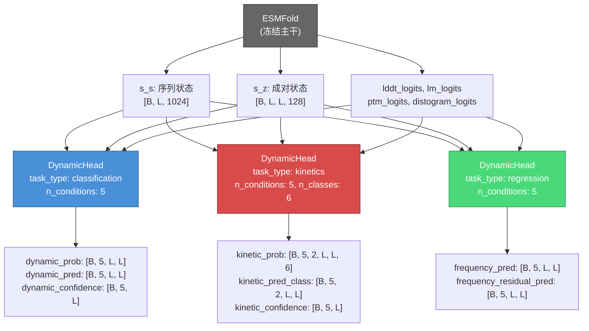
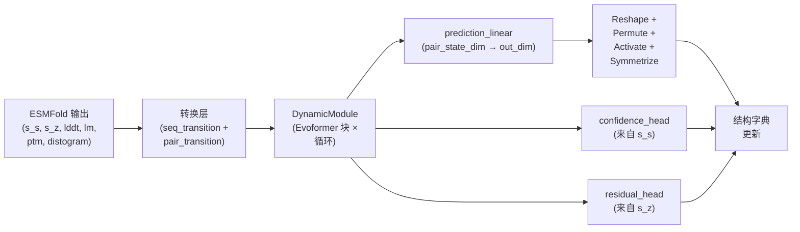

---
slug:7-multi-head-prediction-design
blog_type:normal
---


ESMDynamic的架构以其**多头预测框架**而独树一帜——这是一个由专职任务的`DynamicHead`模块构成的并行集成体，它们共享一个冻结的ESMFold主干网络，但维护独立的Evoformer风格处理路径。每个头解决一个独特的生物物理问题（二元接触存在性、动力学时间尺度分类、接触频率回归），同时以相同的结构表示为条件。这种设计在模块级别解耦了预测任务，实现了选择性加载、独立循环配置以及每个头的辅助输出，而不会产生学习表示的交叉污染。

## DynamicHead 抽象

`DynamicHead`类是多头预测的基本单元。它封装了从ESMFold中间表示经过其自身的`DynamicModule`（Evoformer循环）直至任务特定输出头的完整推理路径。关键是，每个`DynamicHead`实例都拥有自己的**转换层**、**DynamicModule**、**prediction linear**以及可选的**confidence/residual heads**——确保参数永远不会在头之间共享。

构造函数签名揭示了设计空间：

| 参数 | 类型 | 用途 |
|---|---|---|
| `name` | `str` | 头标识符；作为所有输出字典键的前缀 |
| `task_type` | `str` | 取值为`"classification"`、`"regression"`、`"multiclass"`或`"kinetics"`之一 |
| `seq_input_dim` | `int` | 序列转换的输入维度（源自ESMFold） |
| `seq_state_dim` | `int` | 内部序列表示维度 (1024) |
| `pair_input_dim` | `int` | 成对转换的输入维度（源自ESMFold） |
| `pair_state_dim` | `int` | 内部成对表示维度 (128) |
| `dynamic_cfg` | `DynamicModuleConfig` | 每个头的Evoformer循环配置 |
| `n_conditions` | `int` | 温度条件数 (默认为 5) |
| `n_classes` | `Optional[int]` | 离散类别数 (用于 multiclass/kinetics) |
| `use_confidence_head` | `bool` | 启用逐残基、逐温度的置信度预测 |
| `use_residual_head` | `bool` | 启用成对残差预测 (仅用于回归) |

来源: [esmdynamic.py](esm/esmdynamic/esmdynamic.py#L32-L64)

### 转换层：来自ESMFold的偏置注入

每个`DynamicHead`首先构建**偏置项**，通过任务特定的学习偏移量来增强冻结的ESMFold表示。这是每个头将共享的结构先验适应到其自身预测领域的机制：

```python
# 序列转换: [lddt_logits || lm_logits] → s_s 的偏置
seq_transition_input = torch.cat((lddt_logits, lm_logits), dim=2)
s_s_0 = structure["s_s"] + self.seq_transition(seq_transition_input)

# 成对转换: [ptm_logits || distogram_logits] → s_z 的偏置
pair_transition_input = torch.cat((ptm_logits, distogram_logits), dim=3)
s_z_0 = structure["s_z"] + self.pair_transition(pair_transition_input)
```

`seq_transition`是一个`LayerNorm → Linear → Linear`堆栈，将`seq_input_dim`（23个词元嵌入 + 37 × 50个lDDT分箱 = 1873）映射到`seq_state_dim`（1024）。`pair_transition`遵循相同的模式，将`pair_input_dim`（2 × 64个距离图分箱 = 128）映射到`pair_state_dim`（128）。这些偏置向量被**相加**到ESMFold表示中——它们并不替换原有表示，从而在允许任务特定偏移的同时保留了结构先验。

来源: [esmdynamic.py](esm/esmdynamic/esmdynamic.py#L66-L76), [esmdynamic.py](esm/esmdynamic/esmdynamic.py#L119-L130)

## 任务特定输出架构

`prediction_linear`的输出维度完全由`task_type`及其相关超参数决定：

```
┌─────────────────┬───────────────────────────────────┬──────────────────────────────┐
│ task_type       │ out_dim 公式                       │ 规范输出形状                 │
├─────────────────┼───────────────────────────────────┼──────────────────────────────┤
│ classification  │ n_conditions                       │ [B, n_conditions, L, L]      │
│ regression      │ n_conditions                       │ [B, n_conditions, L, L]      │
│ multiclass      │ n_conditions × n_classes           │ [B, n_conditions, L, L, K]   │
│ kinetics        │ n_conditions × n_classes × 2       │ [B, n_conditions, 2, L, L, K]│
└─────────────────┴───────────────────────────────────┴──────────────────────────────┘
```

`prediction_linear`是一个单一的`nn.Linear(pair_state_dim, out_dim)`，直接从成对状态维度（128）映射到完整的多条件输出。然后，原始输出被**重塑和置换**为规范轴顺序，其中条件维度位于空间维度之前，从而实现下游处理期间对温度条件的干净迭代。

<CgxTip>`prediction_linear`将128维的成对特征扩展为可能数百个输出通道（例如，kinetics: 5 × 6 × 2 = 60）。这是一种有意的设计——DynamicModule的Evoformer循环充分丰富了成对表示，使得单个线性投影无需中间MLP即可解耦多条件、多类结构。</CgxTip>

来源: [esmdynamic.py](esm/esmdynamic/esmdynamic.py#L81-L94), [esmdynamic.py](esm/esmdynamic/esmdynamic.py#L141-L189)

### 对称化：强制成对一致性

所有任务类型在激活函数之后都会跨残基对轴应用**对称化**。对于分类和多分类，其形式为`probs = (probs + probs.transpose(L, L)) / 2`——将softmax概率与其转置对应物取平均。对于回归，对称化应用于sigmoid之前的logit空间平均：`pred_clipped = sigmoid((pred + pred.transpose(L, L)) / 2)`。这保证了对(i, j)的预测始终等于对(j, i)的预测，这是接触图和动力学时间尺度的物理要求。

来源: [esmdynamic.py](esm/esmdynamic/esmdynamic.py#L149-L189)

## 三个默认头

`ESMDynamic`实例化了三个默认的`DynamicHead`模块，每个模块具有不同的任务配置：



| 头 | `task_type` | `n_conditions` | `n_classes` | `use_confidence_head` | `use_residual_head` | `dynamic_cfg` 键 |
|---|---|---|---|---|---|---|
| **dynamic** | `classification` | 5 | — | ✓ | ✗ | `dynamic_module` |
| **kinetic** | `kinetics` | 5 | 6 | ✓ | ✗ | `kinetic_module` |
| **frequency** | `regression` | 5 | — | ✗ | ✓ | `frequency_module` |

来源: [esmdynamic.py](esm/esmdynamic/esmdynamic.py#L260-L288)

### 动态头：二元接触存在性

**dynamic**头回答了这个问题：*“残基对(i, j)在温度T下是否形成动态（非静态）接触？”*——这是一个跨5个温度条件（320K、348K、379K、413K、450K）的二元分类。输出流程为：

1. `prediction_linear`产生`[B, L, L, 5]`原始logits
2. 置换为`[B, 5, L, L]`规范形式
3. Sigmoid激活 → 概率
4. 对称化：`prob = (prob + prob.T) / 2`
5. 硬决策：`pred = (prob > 0.5).long()`
6. 置信度头：序列特征`[B, L, 1024]` → `LayerNorm → Linear → ReLU → Linear` → `[B, 5, L]`

置信度头预测逐残基、逐温度的准确度——一个标量，指示模型认为其在每个残基位置和每个温度条件下的预测有多可靠。

来源: [esmdynamic.py](esm/esmdynamic/esmdynamic.py#L179-L185), [esmdynamic.py](esm/esmdynamic/esmdynamic.py#L192-L197)

### 动力学头：带有开/关速率的时间尺度分类

**kinetic**头在架构上最为复杂，产生了对**时间尺度分箱**和**速率方向**（开启速率与关闭速率）的联合分类。开启速率的6个动力学类别为：

| 类别索引 | 开启速率名称 | 解释 |
|---|---|---|
| 0 | `always_on` | 接触始终存在（实际上是静态的） |
| 1 | `1to10ns` | 开启速率时间尺度：1–10 ns |
| 2 | `10to100ns` | 开启速率时间尺度：10–100 ns |
| 3 | `100to300ns` | 开启速率时间尺度：100–300 ns |
| 4 | `gt300ns` | 开启速率时间尺度：>300 ns |
| 5 | `never_on` | 接触从未形成 |

关闭速率类别遵循相同的分箱结构，但带有`always_off`/`never_off`的终端标签。`n_rates = 2`因子使输出维度加倍，产生`out_dim = 5 × 6 × 2 = 60`。在经过线性投影并重塑为`[B, L, L, 5, 6, 2]`后，规范置换将其重新排序为`[B, 5, 2, L, L, 6]`——温度、速率方向、空间、类别——匹配下游损失计算和可视化的预期索引模式。

来源: [esmdynamic.py](esm/esmdynamic/esmdynamic.py#L83-L86), [esmdynamic.py](esm/esmdynamic/esmdynamic.py#L144-L158), [predict.py](esm/esmdynamic/predict.py#L17-L33)

### 频率头：带有残差校正的回归

**frequency**头预测`[0, 1]`中的连续接触占有率——即残基对处于接触状态的时间比例。与分类和动力学头不同，它使用：

- **Sigmoid有界回归**：`pred_clipped = sigmoid((pred + pred.T) / 2)`——对称化的logits通过sigmoid以强制`[0, 1]`范围，而不是先应用sigmoid然后再对称化。这是一个刻意的区别：在logit空间中进行对称化保留了sigmoid的概率校准。
- **残差头**：一个辅助的成对预测`residual_head: [B, L, L, 128] → [B, 5, L, L]`，预测逐对、逐温度的误差校正。这使得训练损失可以分别惩罚主频率预测及其残差，允许模型以因式分解的方式学习粗略的占用模式和细粒度的校正。

来源: [esmdynamic.py](esm/esmdynamic/esmdynamic.py#L186-L189), [esmdynamic.py](esm/esmdynamic/esmdynamic.py#L107-L117), [esmdynamic.py](esm/esmdynamic/esmdynamic.py#L200-L205)

## 辅助头：置信度与残差

### 置信度头架构

当`use_confidence_head=True`时，一个逐残基、逐温度的置信度预测器被附加到**序列特征**（而非成对特征）上：

```
s_s [B, L, 1024] → LayerNorm → Linear(1024, 512) → ReLU → Linear(512, 5) → permute → [B, 5, L]
```

这种架构选择意义重大：置信度是根据**单一序列表示**而非成对特征预测的，这反映了这样一种直觉：预测可靠性是局部残基环境（例如，无序倾向、二级结构）的属性，而不是特定对相互作用的属性。置信度头被`dynamic`和`kinetic`头共同使用。

来源: [esmdynamic.py](esm/esmdynamic/esmdynamic.py#L97-L105), [esmdynamic.py](esm/esmdynamic/esmdynamic.py#L192-L197)

### 残差头架构

当`use_residual_head=True`时（目前仅限`frequency`头），一个成对残差预测器被附加到**成对特征**上：

```
pair_feats [B, L, L, 128] → LayerNorm → Linear(128, 64) → ReLU → Linear(64, 5) → symmetrize → permute → [B, 5, L, L]
```

残差独立于主预测进行对称化，确保主频率估计及其校正项在物理上都是一致的。

来源: [esmdynamic.py](esm/esmdynamic/esmdynamic.py#L108-L116), [esmdynamic.py](esm/esmdynamic/esmdynamic.py#L200-L205)

## 头选择与自定义配置

`ESMDynamic`构造函数支持两种互斥的头选择模式：

**通过`heads_to_load`进行预设选择**——选择三个默认头的一个子集：
```python
model = esmdynamic(heads_to_load=["dynamic", "kinetic"])  # 省略 frequency
```

**通过`head_definitions`进行完全自定义**——使用任意有效的`DynamicHead`配置定义任意头：
```python
custom_heads = [
    dict(name="dynamic", task_type="classification", n_conditions=3,
         dynamic_cfg=my_config, use_confidence_head=True, use_residual_head=False),
    dict(name="custom_multiclass", task_type="multiclass", n_conditions=3, n_classes=4,
         dynamic_cfg=my_config, use_confidence_head=False, use_residual_head=False),
]
model = ESMDynamic(head_definitions=custom_heads)
```

使用`head_definitions`时，调用者对任务类型、条件数、类别数以及启用哪些辅助头拥有完全控制权。唯一的约束是每个头的`dynamic_cfg`必须是有效的`DynamicModuleConfig`。实例化的头存储在`self.heads: nn.ModuleDict`中，以头名称作为键。

<CgxTip>每个头通过`dynamic_cfg`字段接收其自身的`DynamicModuleConfig`。三个默认头使用来自`ESMDynamicConfig`的不同配置键（`dynamic_module`、`kinetic_module`、`frequency_module`），这意味着它们可以有不同的`num_blocks`、`max_recycles`、`dropout`和`chunk_size`值。这使得，例如，频率头可以使用比动态分类头更轻量的循环配置成为可能。</CgxTip>

来源: [esmdynamic.py](esm/esmdynamic/esmdynamic.py#L252-L325), [esmdynamic.py](esm/esmdynamic/esmdynamic.py#L24-L28)

## 每个头的 DynamicModule：独立的 Evoformer 循环

多头设计的一个关键架构属性是**每个头拥有其自身的`DynamicModule`**，具有独立的Evoformer块和循环状态。每个头的前向传播遵循相同的结构模式：



每个头内的`DynamicModule`接收偏置增强的表示`s_s_0`和`s_z_0`，并通过`num_blocks`个TriangularSelfAttention块处理它们，在带有学习循环嵌入的`max_recycles`次循环中迭代。因为每个头都有自己的模块，循环状态（序列范数、成对范数、距离图分箱）独立演化——动力学头的循环不会影响动态头的表示，反之亦然。

来源: [esmdynamic.py](esm/esmdynamic/esmdynamic.py#L78-L79), [esmdynamic.py](esm/esmdynamic/esmdynamic.py#L132-L135), [dynamic_module.py](esm/esmdynamic/dynamic_module.py#L77-L122)

## 输出字典：键命名约定

每个头使用**名称前缀键约定**将其输出注入到共享的`structure`字典中。对于一个名为`"dynamic"`且`task_type="classification"`的头：

| 键 | 形状 | 内容 |
|---|---|---|
| `dynamic_logits` | `[B, 5, L, L]` | 原始 sigmoid logits |
| `dynamic_prob` | `[B, 5, L, L]` | 对称化的 sigmoid 概率 |
| `dynamic_pred` | `[B, 5, L, L]` | 硬二元预测 (prob > 0.5) |
| `dynamic_confidence` | `[B, 5, L]` | 逐残基逐温度的置信度 |
| `dynamic_output` | `dict` | 原始 DynamicModule 输出 (s_s, s_z) |

对于一个名为`"kinetic"`且`task_type="kinetics"`的头：

| 键 | 形状 | 内容 |
|---|---|---|
| `kinetic_logits` | `[B, 5, 2, L, L, 6]` | 原始 softmax logits |
| `kinetic_prob` | `[B, 5, 2, L, L, 6]` | 对称化的类别概率 |
| `kinetic_pred_class` | `[B, 5, 2, L, L]` | argmax 类别预测 |
| `kinetic_confidence` | `[B, 5, L]` | 逐残基逐温度的置信度 |

对于一个名为`"frequency"`且`task_type="regression"`的头：

| 键 | 形状 | 内容 |
|---|---|---|
| `frequency_value` | `[B, 5, L, L]` | 原始（未对称化）预测 |
| `frequency_pred` | `[B, 5, L, L]` | 对称化的 sigmoid 有界预测 |
| `frequency_residual_pred` | `[B, 5, L, L]` | 成对残差校正 |

来源: [esmdynamic.py](esm/esmdynamic/esmdynamic.py#L149-L208), [predict.py](esm/esmdynamic/predict.py#L343-L451)

## 天然接触比较

当`dynamic`头处于活动状态时，`ESMDynamic.forward()`执行一个额外的后处理步骤：将ESMFold预测的结构重建为PDB，通过MDTraj计算**天然接触**（Cα距离 < 8Å），并导出两个比较图：

- **`dynamic_nonnative_contacts`** `[B, 5, L, L]`——被预测为动态但在天然结构中不存在的接触（仅动态接触）
- **`native_nondynamic_contacts`** `[B, 5, L, L]`——存在于天然结构中但未被预测为动态的接触（仅静态接触）

这种集合论分解`dynamic = (dynamic ∩ native) ∪ (dynamic \ native)`能够直接对模型的动态预测与平衡结构的关系进行视觉和定量评估。

来源: [esmdynamic.py](esm/esmdynamic/esmdynamic.py#L361-L409), [esmdynamic.py](esm/esmdynamic/esmdynamic.py#L602-L636)

## 损失函数映射到头

`training/loss.py`中的模块化损失注册表直接映射到头输出键，在每个头的架构与其训练信号之间建立了清晰的对应关系：

| 损失函数 | 头输出键 | 头 | 损失类型 |
|---|---|---|---|
| `loss_dynamic_logits` | `dynamic_logits` | dynamic | Sigmoid 焦点损失 (α=0.25, γ=2) |
| `loss_dynamic_conf` | `dynamic_confidence` | dynamic | MSE |
| `loss_kinetic_logits` | `kinetic_logits` | kinetic | 带类别权重的交叉熵 |
| `loss_kinetic_conf` | `kinetic_confidence` | kinetic | MSE |
| `loss_frequency` | `frequency_pred` | frequency | MSE |
| `loss_frequency_residual` | `frequency_residual_pred` | frequency | MSE |

`esmdynamic_loss`包装器遍历`active_heads`并分派到相应的损失函数，对活动项的数量取平均。这种设计意味着添加新头只需要：(1) 一个`DynamicHead`配置，(2) `LOSS_FUNCS`中的一个损失函数条目，以及(3) 训练数据中相应的目标键。

来源: [loss.py](esm/esmdynamic/training/loss.py#L146-L184), [loss.py](esm/esmdynamic/training/loss.py#L38-L53), [loss.py](esm/esmdynamic/training/loss.py#L71-L103), [loss.py](esm/esmdynamic/training/loss.py#L122-L139)

---

理解多头预测设计为检查这些头如何被训练奠定了基础。有关训练编排，请参见[训练流水线与数据加载](8-training-pipeline-and-data-loading)；有关详细的损失公式，请参见[损失函数与指标](9-loss-functions-and-metrics)。有关所有头共享的Evoformer循环内部机制，请参见[DynamicModule与Evoformer循环](6-dynamicmodule-and-evoformer-recycling)。