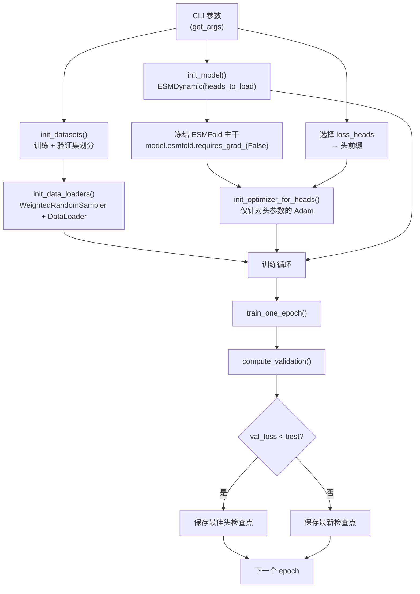
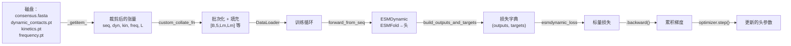

---
slug:8-training-pipeline-and-data-loading
blog_type:normal
---


ESMDynamic 训练流水线是一个仅训练头部的微调系统，它冻结 ESMFold 主干网络，并在预特征化的分子动力学数据上训练轻量级预测头。此设计使得模型能够针对动态接触预测、动力学分类和接触频率回归进行快速特化，而无需修改昂贵的蛋白质语言模型主干。该流水线涵盖了从逐蛋白质 torch 张量构建数据集、为序列长度平衡进行的加权采样、结合 bfloat16 自动类型转换的梯度累积，以及基于最佳验证损失的逐头检查点保存。

## 数据架构：DynContactDataset

`DynContactDataset` 类实现了 PyTorch 的 `Dataset`，它加载包含四种产物的逐标识符子目录：FASTA 序列、动态接触图、动力学标签和频率图。每个蛋白质标识符映射到 `data_dir` 下的一个目录，该目录具有固定的文件布局：

| 文件 | 形状 | 描述 |
|------|-------|-------------|
| `consensus.fasta` | 2 行 FASTA | 头部 + 氨基酸序列 |
| `dynamic_contacts.pt` | `(5, L, L)` | 5 个温度条件下的二值动态接触标签 |
| `kinetics.pt` | `(5, 2, L, L)` | 动力学类别标签（5 个条件 × 2 个开启/关闭速率） |
| `frequency.pt` | `(5, L, L)` | 5 个条件下的接触频率值 |

**5 个条件**对应于多温度模拟副本。**2 个动力学速率**代表结合速率和解离速率分类。序列长度 `L` 因蛋白质而异，所有张量均是对称的接触图，具有残基对表示典型的对角线结构。

### 裁剪策略

变长蛋白质通过 `crop_length` 参数（默认为 256）进行处理。当 `L > crop_length` 时，会随机选择一个连续窗口 `[start, start + crop_length)`，并统一应用于序列和全部三个接触张量：

```
seq_crop   = seq[start:end]
dyn_crop   = dyn[:,  start:end, start:end]    # [5, Lc, Lc]
kin_crop   = kin[:, :, start:end, start:end]  # [5, 2, Lc, Lc]
freq_crop  = freq[:, start:end, start:end]    # [5, Lc, Lc]
```

这种随机裁剪作为一种数据增强策略，使模型能够接触到长蛋白质内不同的结构上下文，同时保持 GPU 显存占用受限。短于 `crop_length` 的蛋白质将在 `__getitem__` 层级被完整使用，不进行填充。

来源：[data_reader.py](esm/esmdynamic/training/data_reader.py#L8-L134)

### 整合与填充

`custom_collate_fn` 通过将批次中的所有张量填充至 `Lmax = max(len(s) for s in sequences)` 来处理变长批处理。每个接触张量均进行对称零填充：

- **Dynamic**：`[B, 5, Lmax, Lmax]`
- **Kinetics**：`[B, 5, 2, Lmax, Lmax]`
- **Frequency**：`[B, 5, Lmax, Lmax]`

实际长度作为单独的张量返回，用于损失计算中的下游掩码操作。这确保了填充位置贡献零梯度，并将其排除在指标计算之外。

来源：[data_reader.py](esm/esmdynamic/training/data_reader.py#L44-L80)

## 为序列长度平衡的加权采样

不同长度的蛋白质生成的接触图，其有效条目数量（O(L²)）差异巨大。若不进行校正，短蛋白质在每个 epoch 中将被过度代表。`weighted_random_sampler` 方法通过计算与序列长度成正比的采样权重来解决此问题：

```python
weights[i] = len(sequence_i) / sum(len(sequence_j) for j)
```

这些权重也可以通过 `weights` 属性从外部覆盖，从而实现基于聚类的加权（例如，在 20% 截断值下进行序列同一性聚类时生成的 `train_weights.pt`）。采样器以 `replacement=True` 方式运行，独立抽取 `num_samples_per_epoch` 个样本——这解耦了 epoch 定义与数据集大小，并允许对训练预算进行细粒度控制。

来源：[data_reader.py](esm/esmdynamic/training/data_reader.py#L83-L98), [train.py](esm/esmdynamic/training/train.py#L37-L55)

## 数据预处理：CSV 到 Torch 的转换

原始分子动力学数据以从 `rcsb.tar.gz` 或 `mdcath.tar.gz` 归档文件中提取的 CSV 文件形式存在。`convert_csv_to_torch` 脚本执行一次性预处理步骤：它递归发现根目录下的所有 `dynamic_contacts.csv` 文件，通过 `numpy.loadtxt` 将每个文件加载为一维整数数组，并使用 `torch.save` 将结果保存为 `.pt` 文件。此转换在训练前是必需的，因为数据集的 `_load_dynamic` 方法会对 `.pt` 文件调用 `torch.load`。

来源：[convert_csv_to_torch.py](esm/esmdynamic/training/convert_csv_to_torch.py#L1-L52)

## 训练流水线架构

训练流水线遵循模块化初始化模式，其中每个组件——数据集、加载器、模型、优化器——均由专门的辅助函数构建。整体流程如下：



来源：[train.py](esm/esmdynamic/training/train.py#L58-L762)

### 模型初始化与头选择

`init_model` 函数创建一个 `ESMDynamic` 实例，其中 `load_esmfold=True`，并带有一个从请求的损失头派生出的受限 `heads_to_load` 列表。从损失头名称到模型头前缀的映射由 `select_prefixes_from_loss_heads` 处理：

| 损失头名称 | 提取的前缀 | 模型头 |
|---------------|-----------------|------------|
| `dynamic_logits` | `dynamic` | `DynamicHead(task_type="classification")` |
| `dynamic_confidence` | `dynamic` | *(相同的头，置信度子模块)* |
| `kinetic_logits` | `kinetic` | `DynamicHead(task_type="kinetics")` |
| `kinetic_confidence` | `kinetic` | *(相同的头，置信度子模块)* |
| `frequency_pred` | `frequency` | `DynamicHead(task_type="regression")` |
| `frequency_residual_pred` | `frequency` | *(相同的头，残差子模块)* |

此前缀提取确保了从同一模型头请求多个损失项（例如 `dynamic_logits` + `dynamic_confidence`）时，该头仅加载一次。如果提供了 `--pretrained` 检查点路径，其状态字典将通过 `strict=False` 加载，允许部分恢复先前训练过的头。

来源：[train.py](esm/esmdynamic/training/train.py#L77-L95)

### 优化器与主干冻结

一个关键的架构决策：**仅头参数接收梯度**。模型构建完成后，ESMFold 主干通过 `model.esmfold.requires_grad_(False)` 被显式冻结，优化器则仅由头参数构建：

```python
for h in head_prefixes:
    params += list(model.heads[h].parameters())
optimizer = torch.optim.Adam(params, lr=1e-4)
```

这确保了预训练的蛋白质语言模型和折叠主干保持静态，而轻量级的 DynamicModule + 预测头则适应动力学预测任务。

<CgxTip>主干冻结 + 仅头优化器模式意味着训练期间的 VRAM 占用主要由 ESMFold 的前向传播（在 `torch.no_grad()` 下运行）主导，而非梯度存储。如果 ESMFold 的 VRAM 成为瓶颈，请离线预计算 ESMFold 输出，并将其作为 `precomputed` 字典传递给 `ESMDynamic.forward()`。</CgxTip>

来源：[train.py](esm/esmdynamic/training/train.py#L96-L108), [esmdynamic.py](esm/esmdynamic/esmdynamic.py#L330-L340)

## 前向传播与目标构建

### 训练前向路径

训练循环使用 `model.forward_from_seq(sequences)`，它通过 `batch_encode_sequences` 将原始氨基酸字符串编码为 token 张量，然后委托给 `ESMDynamic.forward()`。与 `predict_from_seqs()`（封装在 `torch.no_grad()` 中）不同，`forward_from_seq` 保留计算图以进行反向传播。在 `forward()` 内部，ESMFold 主干在 `torch.no_grad()` 下运行，而头的计算启用梯度，从而实现上述选择性训练。

来源：[esmdynamic.py](esm/esmdynamic/esmdynamic/esmdynamic.py#L415-L450)

### 目标构建：`build_outputs_and_targets_for_loss`

此函数是原始模型输出（`structure` 字典）与损失函数预期输入之间的桥梁。它执行三个关键转换：

1. **直接映射**用于主要预测：`dynamic_logits` → 结构 logits，`kinetic_logits` → 结构 logits，`frequency_pred` → 结构值
2. **派生置信度目标**：动态置信度目标通过测量逐残基的配对级预测与真实值的准确率来计算；动力学置信度目标则对 on/off 维度的逐速率准确率求平均
3. **派生残差目标**：频率残差目标是绝对差值 `|freq_true - freq_pred|`，用于训练残差头预测主频率预测的误差

<CgxTip>置信度和残差目标由**分离的**模型预测（`.detach()`）计算得出，从而阻止了梯度流经目标构建路径。这一点至关重要——若不分离，"目标"将依赖于模型参数，产生不稳定的训练信号，导致头在试图匹配随自身权重变化而改变的目标的同时进行学习。</CgxTip>

来源：[train.py](esm/esmdynamic/training/train.py#L365-L497)

## 训练循环机制

### 梯度累积

`batch_accum` 参数（默认为 8）实现了梯度累积：每个微批次调用一次 `loss.backward()`，但仅在每 `batch_accum` 步或 epoch 结束时触发 `optimizer.step()`。损失预先除以 `batch_accum`，因此累积梯度等效于单次大批量更新。这使得有效批量大小达到 `batch_size × batch_accum`（例如 4 × 8 = 32），而无需按比例增加 VRAM。

来源：[train.py](esm/esmdynamic/training/train.py#L499-L585)

### 混合精度

当 `device == "cuda"` 时，训练和验证均将前向传播封装在 `torch.autocast(device_type="cuda", dtype=torch.bfloat16)` 中。这会将 ESMFold 主干和头的计算转换为 bfloat16，从而减少 VRAM 并加速 Ampere+ GPU 上的矩阵运算。对于 CPU 训练，自动类型转换上下文被禁用以避免开销。

来源：[train.py](esm/esmdynamic/training/train.py#L508-L510), [train.py](esm/esmdynamic/training/train.py#L595-L597)

### 检查点策略

每个 epoch 通过 `save_head_state_dicts` 保存两种检查点类型：

| 检查点 | 条件 | 命名模式 |
|-----------|-----------|----------------|
| **最佳验证** | `val_loss < best_vloss` | `{head}_head_best_vloss_{timestamp}.pt` |
| **最新 epoch** | 始终 | `{head}_head_chkpt_{timestamp}.pt` |

仅保存头状态字典，而非完整模型。每个检查点文件存储以 `heads.{head_name}.*` 为前缀的键，以便启用 `strict=False` 方式加载至全新的 `ESMDynamic` 实例中。此设计使检查点文件保持较小（头是轻量级的），并允许选择性恢复头。

来源：[train.py](esm/esmdynamic/training/train.py#L109-L117), [train.py](esm/esmdynamic/training/train.py#L738-L745)

## CLI 配置参考

训练脚本通过 `python -m esm.esmdynamic.training.train` 调用，包含以下参数：

| 参数 | 类型 | 默认值 | 描述 |
|----------|------|---------|-------------|
| `--train_identifiers_file` | str | *必填* | 包含训练蛋白质标识符的文本文件（每行一个） |
| `--val_identifiers_file` | str | *必填* | 包含验证蛋白质标识符的文本文件 |
| `--data_dir` | str | *必填* | 包含逐蛋白质子目录的根目录 |
| `--outpath` | str | *必填* | 用于检查点和 TensorBoard 日志的输出目录 |
| `--loss_heads` | list | *必填* | 要激活的损失头（例如 `dynamic_logits kinetic_logits frequency_pred`） |
| `--batch_size` | int | 4 | 每 GPU 的微批量大小 |
| `--batch_accum` | int | 8 | 梯度累积步数 |
| `--epochs` | int | 1 | 训练 epoch 数 |
| `--train_samples_per_epoch` | int | 10000 | 每个训练 epoch 抽取的样本数 |
| `--val_samples_per_epoch` | int | 1000 | 每个验证 epoch 抽取的样本数 |
| `--lr` | float | 1e-4 | 头参数的 Adam 学习率 |
| `--pretrained` | str | None | 用于头热启动的预训练检查点路径 |
| `--kin_class_weights` | str | None | 动力学类别权重张量 `[2, K]` 的路径 |
| `--chunk_size` | int | 256 | 节省显存的注意力机制的块大小 |
| `--alpha` | float | 0.25 | Focal 损失 alpha（动态接触） |
| `--gamma` | float | 2.0 | Focal 损失 gamma（动态接触） |
| `--device` | str | "cuda" | 计算设备 |

来源：[train.py](esm/esmdynamic/training/train.py#L656-L690)

## 监控与指标

训练进度通过在 `{outpath}/runs/trainer_{timestamp}/` 下初始化的 `SummaryWriter` 记录至 **TensorBoard**。记录以下标量：

| 标量 | 范围 | 头 |
|--------|-------|-------|
| `dynamic/accuracy/train` | 逐批次 | `dynamic_logits` |
| `dynamic/precision/train`, `dynamic/recall/train`, `dynamic/f1/train` | 逐批次 | `dynamic_logits` |
| `kinetic/accuracy/train`, `kinetic/macro_f1/train` | 逐批次 | `kinetic_logits` |
| `frequency/rmse/train` | 逐批次 | `frequency_pred` |
| `{head}/{metric}/val` | 逐 epoch | 所有活跃头 |
| `Training vs. Validation Loss` | 逐 epoch | 组合 |

此外，运行元数据（时间戳、脚本路径、所有 CLI 参数）被持久化到 `run_metadata_{timestamp}.txt` 以保证可复现性。

来源：[train.py](esm/esmdynamic/training/train.py#L530-L575), [train.py](esm/esmdynamic/training/train.py#L617-L650)

## 数据流总结

从磁盘到梯度更新的完整数据路径遵循以下序列：



来源：[train.py](esm/esmdynamic/training/train.py#L1-L762), [data_reader.py](esm/esmdynamic/training/data_reader.py#L1-L134)

---

**下一步**：有关损失函数如何为每种头类型计算梯度的详细信息，请参见[损失函数与指标](9-loss-functions-and-metrics)。要了解生成训练期间所使用的结构字典的模型架构，请参见[ESMDynamic 模型类](5-esmdynamic-model-class)。