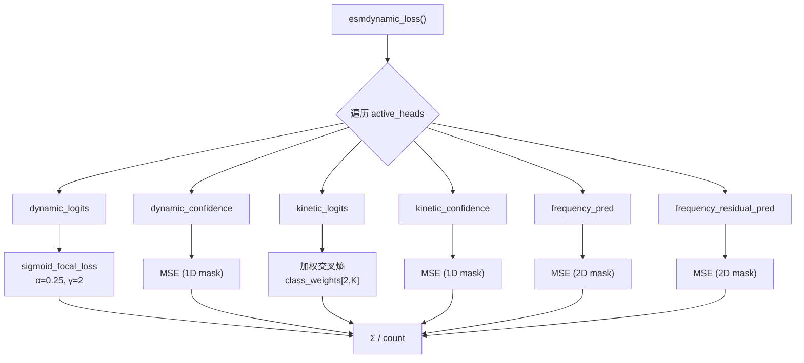

---
slug:9-loss-functions-and-metrics
blog_type:normal
---

ESMDynamic的训练框架实现了一个**多头损失架构**，其中每个预测头——动态接触、动力学和频率——都带有其专属的损失函数和评估指标体系。`loss.py`和`train.py`中的模块化设计确保了只有在训练时指定的预测头才会对组合损失产生影响，从而支持从单头特化到全联合优化的灵活微调机制。

## 损失函数架构

损失系统围绕中央调度器`esmdynamic_loss`组织，该调度器遍历**活跃头**，并委托给在`LOSS_FUNCS`查找表中注册的头特定损失函数。每个头可能会产生多个损失项（例如，主预测损失加上置信度或残差损失），但调度器通过简单的均匀平均来聚合它们——将损失总和除以活跃项的数量。

`LOSS_FUNCS`注册表将六个规范头名称映射到其实现，在模型的输出字典键与损失计算之间建立了严格的契约：

| 注册表键 | 函数 | 损失族 | 掩码维度 |
|---|---|---|---|
| `dynamic_logits` | `loss_dynamic_logits` | Sigmoid Focal Loss | 2D `(B, L, L)` |
| `dynamic_confidence` | `loss_dynamic_conf` | MSE | 1D `(B, L)` |
| `kinetic_logits` | `loss_kinetic_logits` | 加权交叉熵 | 2D `(B, L, L)` |
| `kinetic_confidence` | `loss_kinetic_conf` | MSE | 1D `(B, L)` |
| `frequency_pred` | `loss_frequency` | MSE | 2D `(B, L, L)` |
| `frequency_residual_pred` | `loss_frequency_residual` | MSE | 2D `(B, L, L)` |

来源: [loss.py](esm/esmdynamic/training/loss.py#L146-L153), [loss.py](esm/esmdynamic/training/loss.py#L155-L184)

## 变长掩码

所有损失函数都针对蛋白质长度不同的批处理输入进行操作。两个掩码工具确保**填充位置贡献零梯度**。`length_mask_2d`生成一个`(B, L, L)`布尔掩码，对于长度为`Li`的蛋白质`i`，`m[i, :Li, :Li] = True`，将所有涉及填充残基的成对条目置零。`length_mask_1d`为逐残基量（如置信度预测）生成一个`(B, L)`掩码。这些掩码在逐元素计算损失*之后*、求和*之前*通过逐元素乘法应用，确保损失景观（loss landscape）对于用于批处理的最大裁剪长度保持不变。

来源: [loss.py](esm/esmdynamic/training/loss.py#L14-L31)

## 动态接触损失

**动态接触预测**头使用来自`torchvision.ops`的**sigmoid focal loss**（Sigmoid焦点损失），这是一种专为类别不平衡场景设计的二元交叉熵变体。对于每个条件（温度），模型输出形状为`[B, C, L, L]`的logits，其中`C = n_conditions = 5`。焦点损失通过因子`(1 − p_t)^γ`来调制标准BCE梯度，其中`p_t`是正确类别的预测概率。在默认`γ = 2`的情况下，简单（分类良好）的样本会被大幅降低梯度权重，迫使优化器将注意力集中在困难、模糊的残基对上。

**平衡参数α = 0.25**将正类（存在动态接触）的权重设为0.25，负类（无接触）的权重设为0.75，这反映了接触图的稀疏性，其中大多数残基对是非接触的。2D长度掩码通过`mask[:, None]`在条件维度上广播，以将填充位置排除在损失求和之外。

**动态置信度损失**是预测的逐残基置信度分数`[B, C, L]`与其目标之间的简单MSE，并使用1D掩码进行掩码处理。置信度目标*不是*静态标签——它们是在训练时根据模型自身的预测构建的（参见[置信度目标构建](#confidence-target-construction)）。

来源: [loss.py](esm/esmdynamic/training/loss.py#L38-L64)

## 动力学损失

**动力学头**针对开速率和关速率，在`K = 6`个速率类别`{always observed, 1–10 ns, 10–100 ns, 100–300 ns, 300+ ns, never observed}`中执行多类分类，产生形状为`[B, C, 2, L, L, K]`的logits，其中`2`维度索引`{off, on}`速率。

该损失分解为两个独立的**加权交叉熵**项——一个用于关速率，一个用于开速率——每一项都使用来自形状为`[2, K]`的`class_weights`张量的逐类权重向量。2D长度掩码被扩展为`[B, C, 2, L, L]`，并作为布尔索引应用，以在调用`F.cross_entropy`之前仅提取有效的`(logits, labels)`对。这种掩码索引方法（而非事后乘法）是必要的，因为`cross_entropy`要求匹配的logit-label维度，并且本身不支持逐元素掩码。

**动力学置信度损失**遵循与动态置信度相同的MSE模式，其目标是在开/关速率维度上平均的逐残基准确率。

来源: [loss.py](esm/esmdynamic/training/loss.py#L71-L115)

## 频率回归损失

**频率头**是一个回归任务，预测各条件下每个残基对的接触频率值（在`[0, 1]`范围内）。两个互补的损失在此头上运行：

1. **`loss_frequency`** ——预测频率图与真实频率图之间的直接MSE，两者形状均为`[B, C, L, L]`，并使用2D长度掩码进行掩码处理。这驱动主频率预测向真实标签靠拢。

2. **`loss_frequency_residual`** ——残差头的预测与**绝对差值**`|freq_true − freq_pred|`之间的MSE。残差头学习预测主频率预测的误差幅度，提供了一种自监督的不确定性估计。其目标是在训练时从（分离的）主预测中动态构建的。

来源: [loss.py](esm/esmdynamic/training/loss.py#L122-L139)

## 置信度目标构建

置信度目标**不存储在数据集中**——它们是根据当前模型对真实标签的预测即时合成的。这创建了一个自参照的训练信号：置信度头学习预测*主头在每个残基位置上当前的准确度*。

对于**动态置信度**，`build_confidence_targets_dynamic`通过`sigmoid`加上0.5的阈值将logits转换为二元预测，然后计算逐残基准确率作为正确预测的伴侣残基的比例：在有效长度`Lb`上`conf_target[b, c, i] = mean(pred[b, c, i, :] == true[b, c, i, :])`。这产生了一个在`[0, 1]`范围内的`[B, C, L]`目标。

对于**动力学置信度**，`build_confidence_targets_kinetic`在`K`个类别上取logits的argmax，然后类似地计算逐速率逐残基准确率，产生`[B, C, R, L]`。在作为`[B, C, L]`置信度目标传递之前，它在速率维度（`R = 2`）上进行平均。

对于**频率残差目标**，`build_frequency_residual_target`计算`|freq_true − freq_pred|`，提供残差头应学习重现的绝对误差图。在目标构建中使用的所有预测张量都经过`.detach()`处理，以防止梯度流经目标合成路径。

来源: [train.py](esm/esmdynamic/training/train.py#L131-L190)

## 评估指标

每个预测头都有一个专属的指标函数，用于计算每个批次有效（掩码）位置的评估统计数据。这些指标在训练期间逐批次记录，并在epoch边界处聚合（批次平均值），用于TensorBoard和控制台输出。

### 动态接触指标

`metrics_dynamic_batch`从批次中所有有效残基对聚合的混淆矩阵计算五个分类统计数据：

| 指标 | 公式 | 解释 |
|---|---|---|
| **准确率** | (TP + TN) / N | 总体正确率 |
| **精确率** | TP / (TP + FP) | 预测为接触中真实接触的比例 |
| **召回率** | TP / (TP + FN) | 真实接触中被检测到的比例 |
| **F1** | 2·P·R / (P + R) | 精确率和召回率的调和平均值 |
| **平衡准确率** | (TPR + TNR) / 2 | 灵敏度和特异度的平均值 |

所有计数在计算比例之前都在批次和条件维度上累积，为每个指标提供单个标量，而不是逐蛋白质或逐条件的值。

来源: [train.py](esm/esmdynamic/training/train.py#L198-L250)

### 动力学指标

`metrics_kinetic_batch`处理具有`K`个速率类别的多类设置。它累积所有有效位置的逐类真阳性、预测阳性和真阳性计数，然后计算：

- **总体准确率** ——正确分类的(残基, 条件, 速率)三元组的比例
- **宏精确率** ——逐类精确率的未加权平均值
- **宏召回率** ——逐类召回率的未加权平均值（等同于**平衡准确率**）
- **宏F1** ——逐类F1分数的未加权平均值

宏平均平等对待所有`K = 6`个类别，无论其频率如何，这对于动力学领域至关重要，因为在动力学领域中，“always observed”和“never observed”等类别可能占主导地位，而具有科学意义的中间时间尺度却很罕见。

来源: [train.py](esm/esmdynamic/training/train.py#L253-L316)

### 频率指标

`metrics_frequency_batch`计算批次中所有有效条目的单一**RMSE**（均方根误差）。这是回归任务的自然指标，并且在尺度上与`[0, 1]`的频率范围相匹配。该实现累积蛋白质的平方误差和及计数，然后计算`sqrt(SSE / count)`，以避免存储完整的差异张量。

来源: [train.py](esm/esmdynamic/training/train.py#L319-L337)

## 损失调度与训练集成

`esmdynamic_loss`包装器接受模型的输出字典、目标字典、残基长度和活跃头名称集合。它遍历`active_heads`，在`LOSS_FUNCS`中查找每一项，并使用适当的额外参数进行调度：为动力学logits头提供`kin_class_weights`，为动态logits头提供`(alpha, gamma)`。总损失是所有活跃项的**均匀平均**：`total / count`。如果未找到有效头，则抛出`RuntimeError`——这可以防止在头名称指定错误时发生静默的零损失训练。

<CgxTip>`esmdynamic_loss`中的`active_heads`列表必须与`LOSS_FUNCS`注册表中的键完全匹配（例如，`"dynamic_logits"`，而不是`"dynamic"`）。`train.py`中的`--loss_heads` CLI参数直接接受这些注册表键，而`select_prefixes_from_loss_heads`通过在第一个下划线处分割来推导模型头前缀（例如，`"dynamic"`）。</CgxTip>

在训练期间，`build_outputs_and_targets_for_loss`在模型的原始输出字典（以头名称模式如`dynamic_logits`、`dynamic_confidence`、`frequency_pred`、`frequency_residual_pred`为键）和损失函数的预期输入之间执行关键桥接。当这些头处于活跃状态时，此函数还会调用置信度和残差目标构造器，确保自参照目标始终与当前模型状态同步。

来源: [loss.py](esm/esmdynamic/training/loss.py#L155-L184), [train.py](esm/esmdynamic/training/train.py#L341-L441)

## 焦点损失超参数

Sigmoid焦点损失通过CLI参数`--alpha`和`--gamma`暴露了两个可调参数：

| 参数 | 默认值 | 作用 | 增加的效果 |
|---|---|---|---|
| **α** (alpha) | 0.25 | 正类的类别平衡权重 | 将焦点转移到正（接触）样本上 |
| **γ** (gamma) | 2.0 | 聚焦参数 | 更积极地降低简单样本的权重 |

`α = 0.25, γ = 2`的组合遵循了原始焦点损失论文对类别不平衡检测任务的推荐。在动态接触设置中，这尤其合适，因为接触图本质上是稀疏的——通常在任何给定条件下，少于5%的残基对会形成接触。

<CgxTip>在类别极度不平衡（动态接触非常少）的数据集上进行训练时，考虑将`γ`增加到3–5，而不是调整`α`，因为与线性类别加权相比，聚焦效应在不同不平衡比率下更稳定。</CgxTip>

来源: [loss.py](esm/esmdynamic/training/loss.py#L38-L53), [train.py](esm/esmdynamic/training/train.py#L669-L670)

## TensorBoard日志记录

指标以两种粒度记录到TensorBoard。在训练期间，逐批次指标在每个优化器步骤中写入，带有如`dynamic/accuracy/train`、`kinetic/macro_f1/train`和`frequency/rmse/train`的前缀。在验证期间，epoch聚合的指标以`val`后缀写入。一个组合的`Training vs. Validation Loss`标量在同一图表上跟踪两种损失，以便进行早停诊断。批次损失也按头记录（例如，`dynamic/loss_train_batch`），但请注意，这是为每个头重复的*组合*损失值，而不是特定头的组件。

来源: [train.py](esm/esmdynamic/training/train.py#L498-L533), [train.py](esm/esmdynamic/training/train.py#L612-L629)

---

**下一步**：了解这些损失函数如何集成到完整的训练循环中，请参见[训练流水线与数据加载](8-training-pipeline-and-data-loading)，或者探索生成输入这些损失的logits的多头预测架构，请参见[多头预测设计](7-multi-head-prediction-design)。