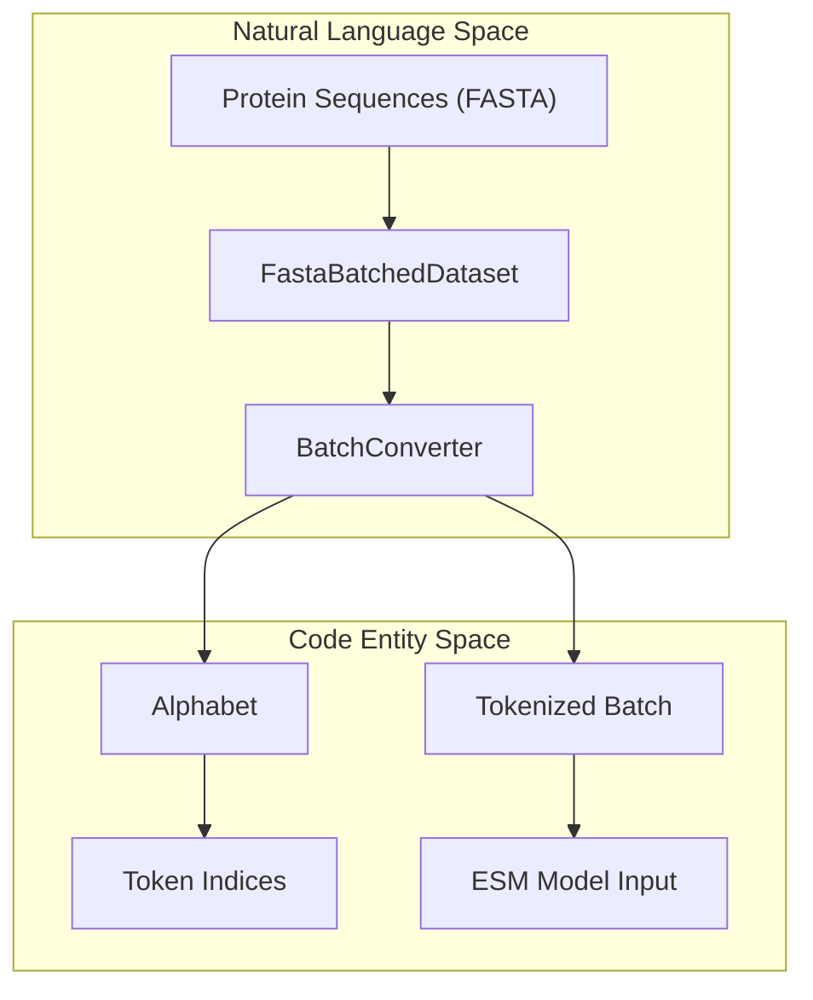
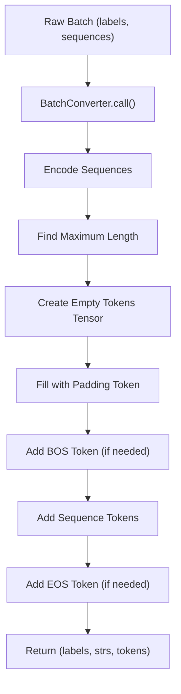
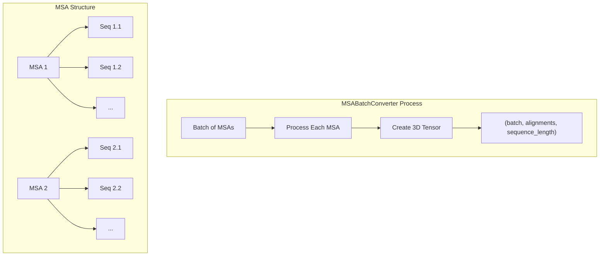
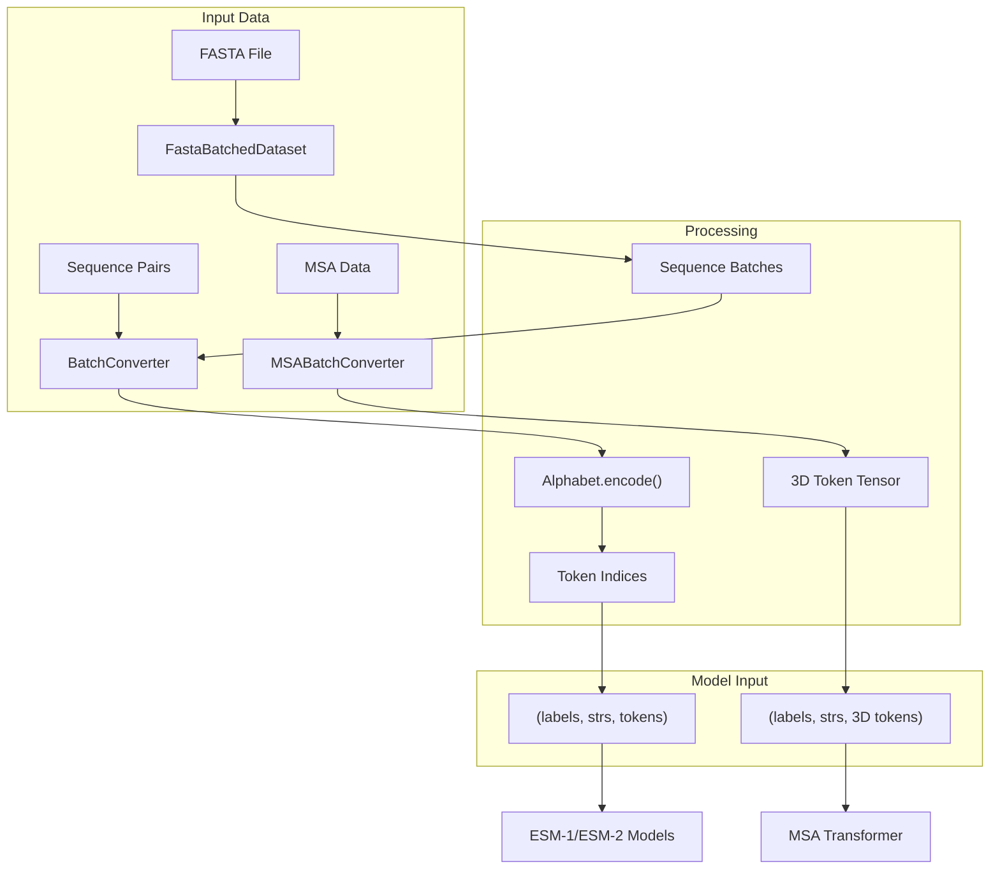

# Alphabet and BatchConverter

> **Relevant source files**
> * [esm/data.py](https://github.com/facebookresearch/esm/blob/2b369911/esm/data.py)
> * [tests/test_alphabet.py](https://github.com/facebookresearch/esm/blob/2b369911/tests/test_alphabet.py)

This document explains the core data handling components in the ESM (Evolutionary Scale Modeling) system: the `Alphabet` and `BatchConverter` classes. These components handle the critical tasks of tokenizing protein sequences and preparing batched inputs for ESM models. For information about the models themselves, see [Models](/facebookresearch/esm/2-models).

## Overview

In natural language processing terms, the `Alphabet` is essentially a tokenizer for protein sequences, while the `BatchConverter` transforms raw protein sequences into batched tensor inputs that ESM models can process.



Sources: [esm/data.py L91-L141](https://github.com/facebookresearch/esm/blob/2b369911/esm/data.py#L91-L141)

 [esm/data.py L253-L298](https://github.com/facebookresearch/esm/blob/2b369911/esm/data.py#L253-L298)

## Alphabet Class

The `Alphabet` class defined in [esm/data.py L91-L141](https://github.com/facebookresearch/esm/blob/2b369911/esm/data.py#L91-L141)

 is responsible for converting protein sequences (strings of amino acid letters) into token indices that the model can understand.

### Purpose

The `Alphabet` serves several key functions:

* Defines the vocabulary of tokens (amino acids and special tokens)
* Maps between tokens and their numerical indices
* Handles special tokens like padding, mask, begin/end-of-sequence markers
* Provides methods for tokenization and encoding

### Initialization and Structure

Sources: [esm/data.py L91-L135](https://github.com/facebookresearch/esm/blob/2b369911/esm/data.py#L91-L135)

### Different Alphabets for Different Models

The ESM repository uses different alphabets for different model architectures, which can be created using the `from_architecture` class method [esm/data.py L142-L174](https://github.com/facebookresearch/esm/blob/2b369911/esm/data.py#L142-L174)

| Architecture | Prepend Tokens | Append Tokens | BOS | EOS | Use MSA |
| --- | --- | --- | --- | --- | --- |
| ESM-1 | `<null_0>`, `<pad>`, `<eos>`, `<unk>` | `<cls>`, `<mask>`, `<sep>` | Yes | No | No |
| ESM-1b | `<cls>`, `<pad>`, `<eos>`, `<unk>` | `<mask>` | Yes | Yes | No |
| MSA Transformer | `<cls>`, `<pad>`, `<eos>`, `<unk>` | `<mask>` | Yes | No | Yes |
| Invariant GVP | `<null_0>`, `<pad>`, `<eos>`, `<unk>` | `<mask>`, `<cath>`, `<af2>` | Yes | No | No |

Sources: [esm/data.py L142-L174](https://github.com/facebookresearch/esm/blob/2b369911/esm/data.py#L142-L174)

### Tokenization and Encoding

The Alphabet provides methods to:

1. `tokenize`: Split a protein sequence into tokens [esm/data.py L176-L247](https://github.com/facebookresearch/esm/blob/2b369911/esm/data.py#L176-L247)
2. `encode`: Convert tokens to their numerical indices [esm/data.py L249-L250](https://github.com/facebookresearch/esm/blob/2b369911/esm/data.py#L249-L250)

## BatchConverter Class

The `BatchConverter` class in [esm/data.py L253-L298](https://github.com/facebookresearch/esm/blob/2b369911/esm/data.py#L253-L298)

 is used to convert batches of raw protein sequences into tensor inputs for the model.

### Purpose

BatchConverter transforms a batch of sequences into:

* A list of sequence labels
* A list of original sequence strings
* A tensor of token indices padded to the maximum sequence length in the batch

### Initialization and Operation



Sources: [esm/data.py L253-L298](https://github.com/facebookresearch/esm/blob/2b369911/esm/data.py#L253-L298)

### Key Implementation Details

The `BatchConverter` performs several important steps:

1. Takes a batch of (label, sequence) pairs
2. Encodes each sequence using the Alphabet
3. Optionally truncates sequences if `truncation_seq_length` is specified
4. Finds the maximum sequence length in the batch
5. Creates a tensor padded to this maximum length (plus any special tokens)
6. Fills the tensor with the padding index
7. Adds the sequence tokens and any special tokens (BOS/EOS) to the tensor
8. Returns the labels, original strings, and token tensor

Sources: [esm/data.py L262-L297](https://github.com/facebookresearch/esm/blob/2b369911/esm/data.py#L262-L297)

### Example Usage

```markdown
# Creating a batch converteralphabet = Alphabet.from_architecture("ESM-1b")batch_converter = alphabet.get_batch_converter() # Preparing datadata = [    ("protein1", "MKTVRQG"),    ("protein2", "KALTRAI"),] # Converting data for model inputlabels, strs, tokens = batch_converter(data)
```

Sources: [tests/test_alphabet.py L6-L24](https://github.com/facebookresearch/esm/blob/2b369911/tests/test_alphabet.py#L6-L24)

## MSABatchConverter

The `MSABatchConverter` class [esm/data.py L300-L336](https://github.com/facebookresearch/esm/blob/2b369911/esm/data.py#L300-L336)

 extends `BatchConverter` to handle Multiple Sequence Alignments (MSAs).

### Purpose

MSABatchConverter processes batches of multiple sequence alignments, where each input is itself a list of aligned sequences.

### Key Differences from BatchConverter

* Takes input in the form of batches of MSAs
* Creates a 3D tensor with dimensions (batch_size, max_alignments, max_sequence_length)
* Verifies that all sequences in an MSA have the same length (aligned)



Sources: [esm/data.py L300-L336](https://github.com/facebookresearch/esm/blob/2b369911/esm/data.py#L300-L336)

## Data Flow: From Sequences to Model Inputs

The following diagram illustrates the complete data flow from raw protein sequences to model inputs:



Sources: [esm/data.py L19-L88](https://github.com/facebookresearch/esm/blob/2b369911/esm/data.py#L19-L88)

 [esm/data.py L91-L250](https://github.com/facebookresearch/esm/blob/2b369911/esm/data.py#L91-L250)

 [esm/data.py L253-L336](https://github.com/facebookresearch/esm/blob/2b369911/esm/data.py#L253-L336)

## Truncation and Sequence Length

The `BatchConverter` supports sequence truncation through its `truncation_seq_length` parameter [esm/data.py L258-L260](https://github.com/facebookresearch/esm/blob/2b369911/esm/data.py#L258-L260)

 When specified, sequences longer than this limit will be truncated before being encoded into tokens.

This is particularly useful when:

* Working with large protein sequences that exceed model capacity
* Ensuring consistent sequence lengths for specific applications
* Managing memory usage for large batches

Sources: [esm/data.py L267-L268](https://github.com/facebookresearch/esm/blob/2b369911/esm/data.py#L267-L268)

 [tests/test_alphabet.py L27-L45](https://github.com/facebookresearch/esm/blob/2b369911/tests/test_alphabet.py#L27-L45)

## Integration with FastaBatchedDataset

The `FastaBatchedDataset` class [esm/data.py L19-L88](https://github.com/facebookresearch/esm/blob/2b369911/esm/data.py#L19-L88)

 provides utilities for loading and batching sequences from FASTA files. It works together with the `BatchConverter` to efficiently process protein sequence data:

1. `FastaBatchedDataset.from_file()` loads sequences from a FASTA file
2. `get_batch_indices()` creates batch indices optimized for memory usage
3. These batches can then be processed by the `BatchConverter`

```python
# Loading a dataset from FASTA filedataset = FastaBatchedDataset.from_file("sequences.fasta") # Creating efficient batches (limiting tokens per batch)batches = dataset.get_batch_indices(toks_per_batch=1024) # Processing each batchfor batch_idx in batches:    batch = [dataset[i] for i in batch_idx]    labels, strs, tokens = batch_converter(batch)    # Pass tokens to model
```

Sources: [esm/data.py L19-L88](https://github.com/facebookresearch/esm/blob/2b369911/esm/data.py#L19-L88)

## Best Practices

* Choose the appropriate Alphabet for your model using `Alphabet.from_architecture()`
* Use the `FastaBatchedDataset` for efficient batch processing of FASTA files
* Consider sequence truncation for long proteins when memory is limited
* For multiple sequence alignments, ensure all sequences in an MSA have the same length
* Remember that different models expect different special tokens (BOS/EOS)

Sources: [esm/data.py L91-L174](https://github.com/facebookresearch/esm/blob/2b369911/esm/data.py#L91-L174)

 [esm/data.py L253-L298](https://github.com/facebookresearch/esm/blob/2b369911/esm/data.py#L253-L298)