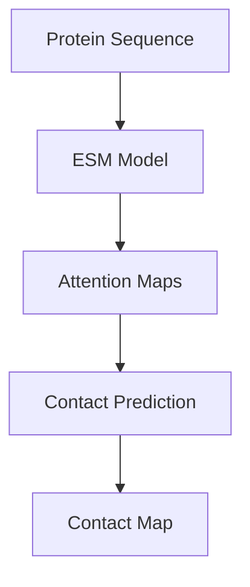
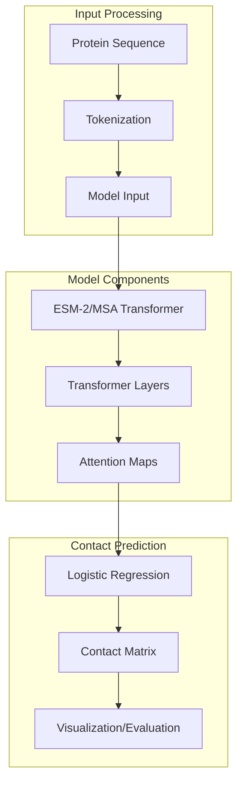

# Contact Prediction

> **Relevant source files**
> * [README.md](https://github.com/facebookresearch/esm/blob/2b369911/README.md?plain=1)
> * [examples/README.md](https://github.com/facebookresearch/esm/blob/2b369911/examples/README.md?plain=1)
> * [examples/contact_prediction.ipynb](https://github.com/facebookresearch/esm/blob/2b369911/examples/contact_prediction.ipynb)
> * [examples/esm_structural_dataset.ipynb](https://github.com/facebookresearch/esm/blob/2b369911/examples/esm_structural_dataset.ipynb)
> * [examples/sup_variant_prediction.ipynb](https://github.com/facebookresearch/esm/blob/2b369911/examples/sup_variant_prediction.ipynb)
> * [tests/test_readme.py](https://github.com/facebookresearch/esm/blob/2b369911/tests/test_readme.py)

## Purpose and Scope

This document describes how to use ESM (Evolutionary Scale Modeling) models for protein contact prediction. Contact prediction refers to the computational prediction of which amino acid residues in a protein are in close physical proximity (typically within 8Å) when the protein is folded into its three-dimensional structure. This capability is available in both the ESM-2 and MSA Transformer models, using an unsupervised approach based on attention maps.

For information about structure prediction using ESMFold, see [ESMFold](/facebookresearch/esm/2.3-esmfold).

## Overview of Contact Prediction in ESM

Contact prediction in ESM is based on a logistic regression over the model's attention maps. This method is described in the ICLR 2021 paper, "Transformer protein language models are unsupervised structure learners." The key insight is that transformer attention patterns can be used to extract structural information without any supervised training.



To predict contacts, you can use either:

* `model.predict_contacts(tokens)`
* `model(tokens, return_contacts=True)`

Both ESM-2 and MSA Transformer models support contact prediction. The MSA Transformer takes a multiple sequence alignment (MSA) as input and uses the tied row self-attention maps in a similar way.

Sources: [examples/contact_prediction.ipynb L451-L457](https://github.com/facebookresearch/esm/blob/2b369911/examples/contact_prediction.ipynb#L451-L457)

 [README.md L451-L457](https://github.com/facebookresearch/esm/blob/2b369911/README.md?plain=1#L451-L457)

## Model Workflow



Sources: [examples/contact_prediction.ipynb L253-L298](https://github.com/facebookresearch/esm/blob/2b369911/examples/contact_prediction.ipynb#L253-L298)

 [examples/contact_prediction.ipynb L433-L457](https://github.com/facebookresearch/esm/blob/2b369911/examples/contact_prediction.ipynb#L433-L457)

## Using Contact Prediction

### Basic Usage

Here's a simple example of how to use contact prediction with ESM-2:

```javascript
import torchimport esm # Load ESM-2 modelmodel, alphabet = esm.pretrained.esm2_t33_650M_UR50D()model = model.eval().cuda()batch_converter = alphabet.get_batch_converter() # Prepare datadata = [("protein1", "MKTVRQERLKSIVRILERSKEPVSGAQLAEELSVSRQVIVQDIAYLRSLGYNIVATPRGYVLAGG")]batch_labels, batch_strs, batch_tokens = batch_converter(data)batch_tokens = batch_tokens.cuda() # Predict contactswith torch.no_grad():    results = model(batch_tokens, return_contacts=True)contact_map = results["contacts"]
```

The output is a contact map tensor of shape `[batch_size, seqlen, seqlen]` where higher values indicate higher probability of contact.

Sources: [examples/contact_prediction.ipynb L254-L298](https://github.com/facebookresearch/esm/blob/2b369911/examples/contact_prediction.ipynb#L254-L298)

 [README.md L454-L457](https://github.com/facebookresearch/esm/blob/2b369911/README.md?plain=1#L454-L457)

### With MSA Transformer

For MSA Transformer, you need to provide a multiple sequence alignment:

```markdown
# Load MSA Transformermodel, alphabet = esm.pretrained.esm_msa1b_t12_100M_UR50S()model = model.eval().cuda()batch_converter = alphabet.get_batch_converter() # Prepare MSA data (multiple sequences aligned)msa_data = [    ("protein1", [        "MKTVRQERLKSIVRILERSKEPVSGAQLAEELSVSRQVIVQDIAYLRSLGYNIVATPRGYVLAGG",        "MKTVRQSRLKSIVRILEMSKEPVSGAQLAEELSVSRQVIVQDIAYLRSLGYNIVATPRGYVLAGG",        "MKTVRQSRLKSIVRILEMSKEPVSGAQL---LSVSRQVIVQDIAYLRSLGYNIVAT----VLAGG",    ])]batch_labels, batch_strs, batch_tokens = batch_converter(msa_data)batch_tokens = batch_tokens.cuda() # Predict contactswith torch.no_grad():    results = model(batch_tokens, return_contacts=True)contact_map = results["contacts"]
```

Sources: [examples/contact_prediction.ipynb L254-L298](https://github.com/facebookresearch/esm/blob/2b369911/examples/contact_prediction.ipynb#L254-L298)

 [tests/test_readme.py L130-L149](https://github.com/facebookresearch/esm/blob/2b369911/tests/test_readme.py#L130-L149)

## Converting Structures to Contacts

To evaluate predictions, you need ground truth contact maps. ESM provides functionality to convert 3D structures to contact maps. A common definition of a contact is when the carbon beta atoms of two residues are within 8 angstroms.

```python
def contacts_from_pdb(structure, distance_threshold=8.0, chain=None):    """    Generate a contact map from a protein structure.        Args:        structure: AtomArray from biotite        distance_threshold: Two residues are in contact if their Cbeta atoms are within this distance        chain: If specified, only consider this chain            Returns:        Contact map as a binary matrix    """    # Implementation details in the source file    pass
```

Sources: [examples/contact_prediction.ipynb L365-L400](https://github.com/facebookresearch/esm/blob/2b369911/examples/contact_prediction.ipynb#L365-L400)

## Visualizing Contact Predictions

ESM provides functions to visualize predicted contacts compared to true contacts:

```python
def plot_contacts_and_predictions(predictions, contacts, ax=None, cmap="Blues", ms=1, title=True, animated=False):    """    Plot predicted contacts vs. true contacts.        Args:        predictions: Predicted contact map        contacts: True contact map        ax: Matplotlib axis        cmap: Colormap for the predictions        ms: Marker size        title: Title for the plot        animated: Whether to make the plot animated    """    # Implementation details in the source file    pass
```

The visualization shows:

* The predicted contact map as a background heatmap
* True contacts in blue
* False positive predictions in red
* Other true contacts not predicted in grey

Sources: [examples/contact_prediction.ipynb L584-L639](https://github.com/facebookresearch/esm/blob/2b369911/examples/contact_prediction.ipynb#L584-L639)

## Computing Precision Metrics

To evaluate contact predictions quantitatively, ESM includes functions to compute precision metrics:

```python
def compute_precisions(predictions, targets, src_lengths=None, minsep=6, maxsep=None, override_length=None):    """    Compute precision metrics for contact prediction.        Returns:        Dictionary with precision metrics like "AUC", "P@L", "P@L2", "P@L5"    """    # Implementation details in the source file    pass
```

Different contact types are evaluated separately:

* Local contacts (sequence separation 3-6)
* Short-range contacts (sequence separation 6-12)
* Medium-range contacts (sequence separation 12-24)
* Long-range contacts (sequence separation >24)

Sources: [examples/contact_prediction.ipynb L461-L565](https://github.com/facebookresearch/esm/blob/2b369911/examples/contact_prediction.ipynb#L461-L565)

## ESM Structural Split Dataset

ESM provides a structural dataset for training and benchmarking contact prediction models. This dataset implements structural holdouts at the family, superfamily, and fold levels.

```javascript
from esm.data import ESMStructuralSplitDataset # Load a splitdataset = ESMStructuralSplitDataset(    split_level='superfamily',  # 'family', 'superfamily', or 'fold'    cv_partition='0',  # '0' to '4'    split='train',  # 'train' or 'valid'    root_path='~/.cache/torch/data/esm',    download=True) # Each element is a dict with keys: seq, ssp, dist, coordssample = dataset[0]sequence = sample['seq']distance_map = sample['dist']  # Ground truth distance map
```

Sources: [examples/esm_structural_dataset.ipynb L96-L157](https://github.com/facebookresearch/esm/blob/2b369911/examples/esm_structural_dataset.ipynb#L96-L157)

## Performance Comparison

ESM models achieve strong performance in contact prediction compared to other methods. Here's how they compare on various test sets:

| Model | Large valid | CASP14 | CAMEO (Apr-Jun 2022) |
| --- | --- | --- | --- |
| ESM-1 | 33.7 | - | - |
| ESM-1b | 41.1 | 24.4 | 39.0 |
| ESM-MSA-1b | 57.4 | 44.2 | 53.8 |
| ESM-2 (15B) | 58.4 | 48.0 | 58.7 |
| ESM-2 (150M) | 49.5 | 31.0 | 45.0 |

Sources: [README.md L551-L609](https://github.com/facebookresearch/esm/blob/2b369911/README.md?plain=1#L551-L609)

## Using ESM-2 for Contact Prediction in a Notebook

The complete workflow for contact prediction with ESM-2 is available in the `contact_prediction.ipynb` notebook:

1. Install dependencies (biopython, biotite, esm)
2. Download data (MSAs for example proteins)
3. Load a pretrained ESM-2 model
4. Prepare protein sequences
5. Predict contacts
6. Compute precision metrics
7. Visualize results

The notebook also shows how to use MSA Transformer for contact prediction, which generally provides better performance by leveraging evolutionary information from multiple sequence alignments.

Sources: [examples/contact_prediction.ipynb L1-L881](https://github.com/facebookresearch/esm/blob/2b369911/examples/contact_prediction.ipynb#L1-L881)

## Related Resources

* [ESM Structural Split Dataset Notebook](/facebookresearch/esm/4.2-esm-fold): For details on using the structural dataset for contact prediction
* [Zero-shot Variant Prediction](/facebookresearch/esm/7.2-variant-effect-prediction): For predicting the effects of mutations on protein function
* [ESMFold](/facebookresearch/esm/2.3-esmfold): For full protein structure prediction rather than just contacts