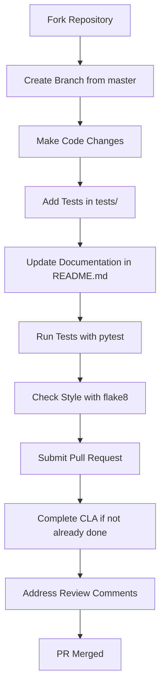
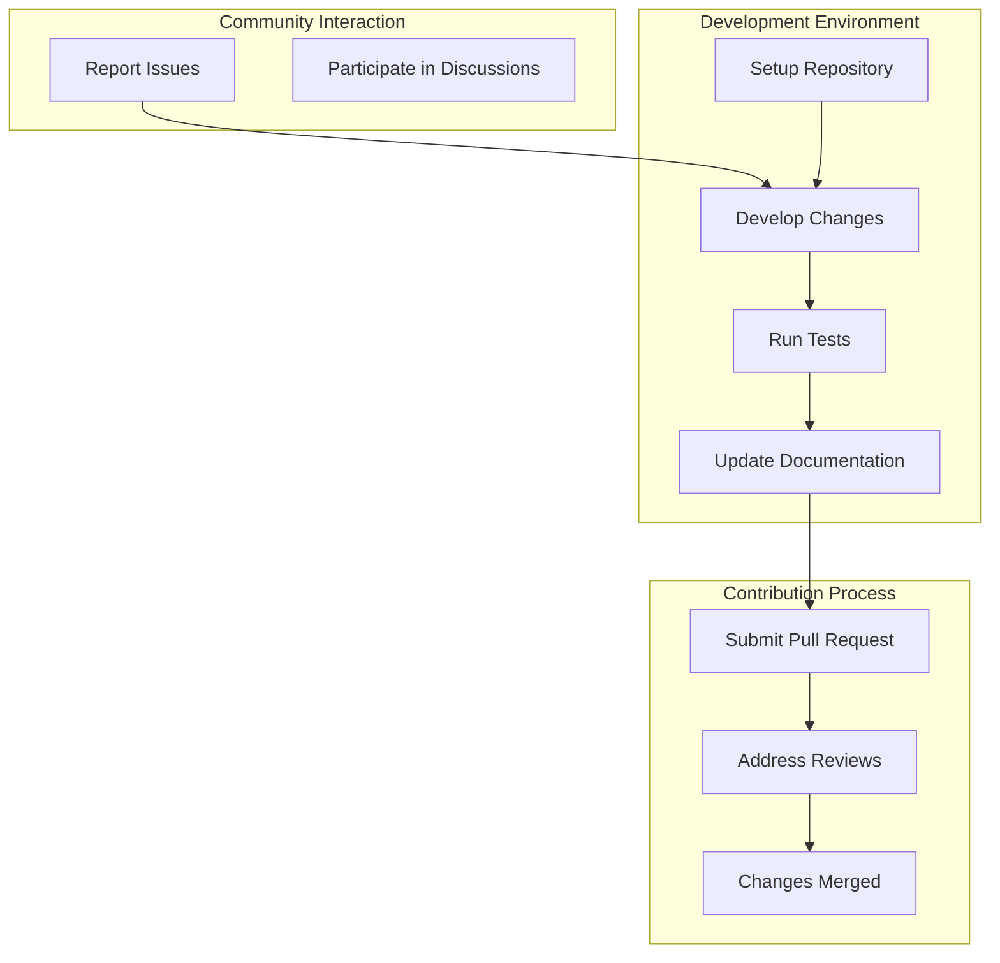

# Contributing Guidelines

> **Relevant source files**
> * [.flake8](https://github.com/facebookresearch/esm/blob/2b369911/.flake8)
> * [CODE_OF_CONDUCT.rst](https://github.com/facebookresearch/esm/blob/2b369911/CODE_OF_CONDUCT.rst)
> * [CONTRIBUTING.md](https://github.com/facebookresearch/esm/blob/2b369911/CONTRIBUTING.md?plain=1)
> * [README.md](https://github.com/facebookresearch/esm/blob/2b369911/README.md?plain=1)
> * [tests/test_readme.py](https://github.com/facebookresearch/esm/blob/2b369911/tests/test_readme.py)

## Purpose

This document outlines the guidelines and processes for contributing to the ESM (Evolutionary Scale Modeling) repository. It provides information on pull request processes, coding standards, testing requirements, and other important aspects for potential contributors. For installation instructions, see [Installation and Setup](/facebookresearch/esm/9.1-installation-and-setup).

## Code of Conduct

All contributors to the ESM project are expected to adhere to Facebook's Code of Conduct to ensure a welcoming and inclusive community. Please read the full text of the Code of Conduct to understand which actions are and are not tolerated.

Sources: [CODE_OF_CONDUCT.rst L1-L6](https://github.com/facebookresearch/esm/blob/2b369911/CODE_OF_CONDUCT.rst#L1-L6)

## Contribution Process

### Pull Request Workflow



Sources: [CONTRIBUTING.md L5-L14](https://github.com/facebookresearch/esm/blob/2b369911/CONTRIBUTING.md?plain=1#L5-L14)

The ESM team actively welcomes contributions from the community. To contribute:

1. Fork the repo and create your branch from `master`
2. Add tests for any new code you've written
3. Update documentation if you've changed APIs
4. Ensure the test suite passes
5. Make sure your code passes linting
6. Complete the Contributor License Agreement (CLA) if you haven't already

### Contributor License Agreement

Before your pull request can be accepted, you must submit a Contributor License Agreement (CLA). This only needs to be done once to contribute to any of Facebook's open source projects.

Complete your CLA at: [https://code.facebook.com/cla](https://code.facebook.com/cla)

Sources: [CONTRIBUTING.md L15-L19](https://github.com/facebookresearch/esm/blob/2b369911/CONTRIBUTING.md?plain=1#L15-L19)

## Repository Structure

Understanding the repository structure will help you make effective contributions:

```mermaid
flowchart TD

A["ESM Repository"]
B["esm/ Package"]
C["examples/ Directory"]
D["scripts/ Directory"]
E["tests/ Directory"]
B1["pretrained.py - Model Loading"]
B2["data.py - Alphabet & BatchConverter"]
B3["modules.py - Neural Network Modules"]
B4["model_*.py - Model Architecture Definitions"]
C1["variant-prediction/ - Mutation Effects"]
C2["inverse_folding/ - Design Sequences from Structures"]
C3["protein-programming-language/ - Protein Design"]
C4["lm-design/ - Language Model Design"]
D1["extract.py - Extract Embeddings Tool"]
D2["esmfold.py - Structure Prediction Tool"]
D3["atlas/ - ESM Metagenomic Atlas Tools"]
E1["test_readme.py - Validate README Examples"]

A --> B
A --> C
A --> D
A --> E
B --> B1
B --> B2
B --> B3
B --> B4
C --> C1
C --> C2
C --> C3
C --> C4
D --> D1
D --> D2
D --> D3
E --> E1
```



Sources: [README.md L1-L20](https://github.com/facebookresearch/esm/blob/2b369911/README.md?plain=1#L1-L20)

 [README.md L56-L77](https://github.com/facebookresearch/esm/blob/2b369911/README.md?plain=1#L56-L77)

 [tests/test_readme.py L1-L10](https://github.com/facebookresearch/esm/blob/2b369911/tests/test_readme.py#L1-L10)

## Coding Standards

### Style Guidelines

The ESM codebase uses flake8 for linting with the following configurations:

* Maximum line length of 99 characters
* Ignores E203 (whitespace before ':') and W503 (line break before binary operator)
* Certain directories are excluded from linting

To check your code for style issues:

```
flake8 .
```

Sources: [.flake8 L1-L11](https://github.com/facebookresearch/esm/blob/2b369911/.flake8#L1-L11)

### Testing Requirements

All contributions should include appropriate tests. The repository uses pytest for testing. The `tests/` directory contains the test files. Before submitting a pull request, make sure all tests pass by running:

```
pytest
```

The `test_readme.py` file contains tests that verify the examples in the README work correctly, which is a good example of how tests should be structured.

Sources: [tests/test_readme.py L1-L185](https://github.com/facebookresearch/esm/blob/2b369911/tests/test_readme.py#L1-L185)

## Reporting Issues

GitHub issues are used to track public bugs. Please ensure your description is clear and has sufficient instructions to reproduce the issue when filing a bug report.

For security bugs, do not file a public issue. Instead, follow the process outlined in Facebook's bounty program for the safe disclosure of security bugs.

Sources: [CONTRIBUTING.md L21-L27](https://github.com/facebookresearch/esm/blob/2b369911/CONTRIBUTING.md?plain=1#L21-L27)

## Documentation Guidelines

When contributing code that changes or extends the API, please update the documentation accordingly:

1. Update the README.md if necessary
2. Add docstrings to new functions, classes, and methods
3. Include examples of usage where appropriate

Good documentation is crucial for maintaining the usability of the codebase.

## License Information

By contributing to the ESM repository, you agree that your contributions will be licensed under the LICENSE file in the root directory of the source tree.

Sources: [CONTRIBUTING.md L29-L31](https://github.com/facebookresearch/esm/blob/2b369911/CONTRIBUTING.md?plain=1#L29-L31)

## Development and Contribution Flow



Sources: [CONTRIBUTING.md L1-L31](https://github.com/facebookresearch/esm/blob/2b369911/CONTRIBUTING.md?plain=1#L1-L31)

## Getting Help

If you need help with your contribution, you can:

1. Check existing GitHub issues for similar questions
2. Open a new issue with a question about your contribution
3. Ask questions in pull request comments

The ESM team is committed to helping contributors make successful additions to the codebase.