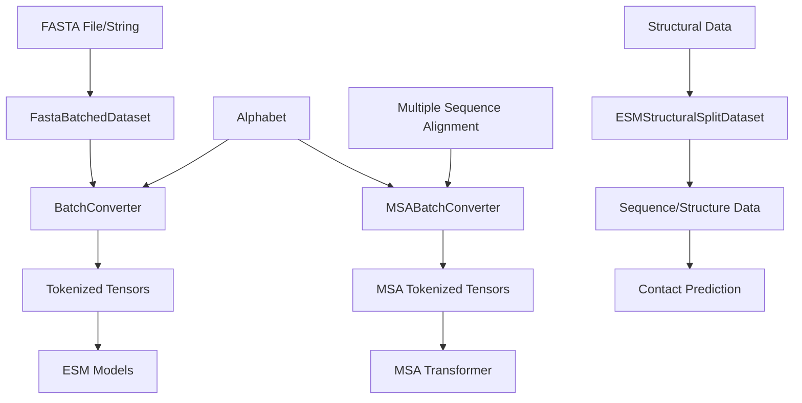
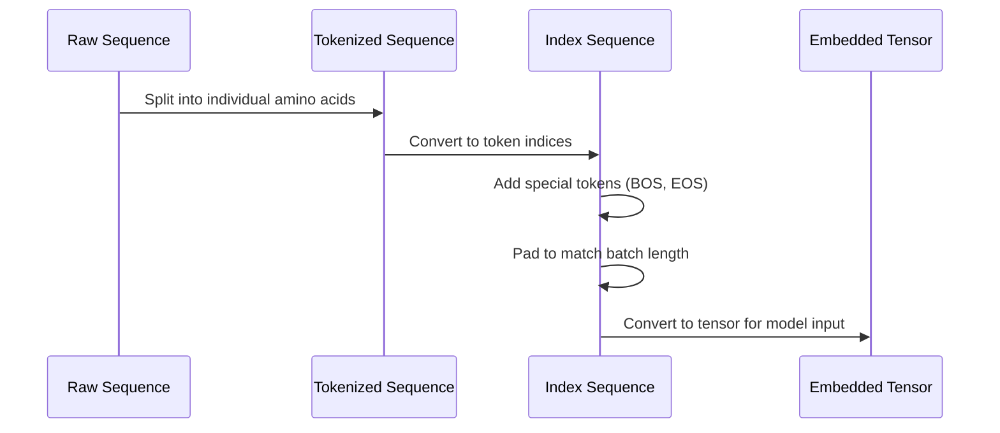
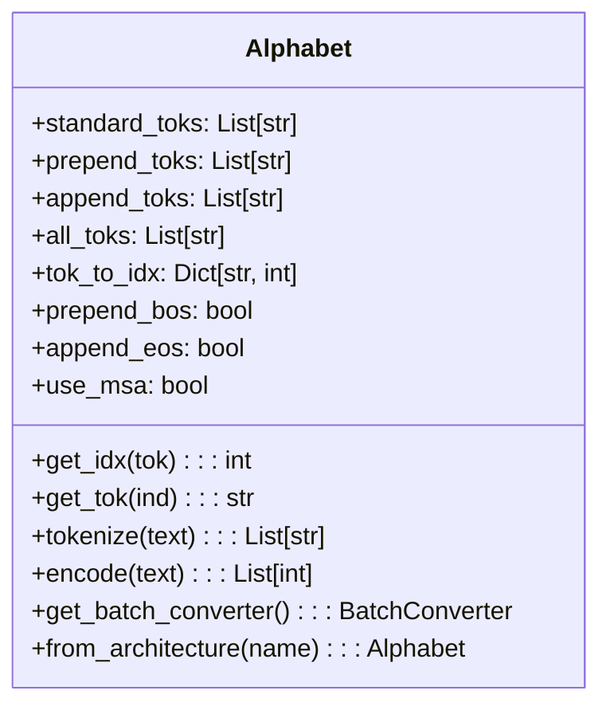
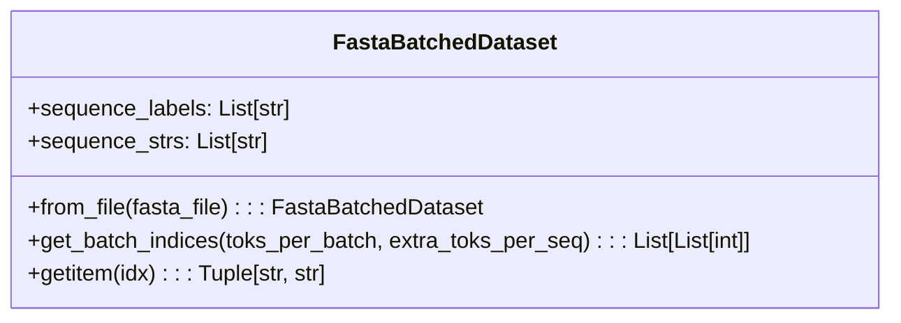
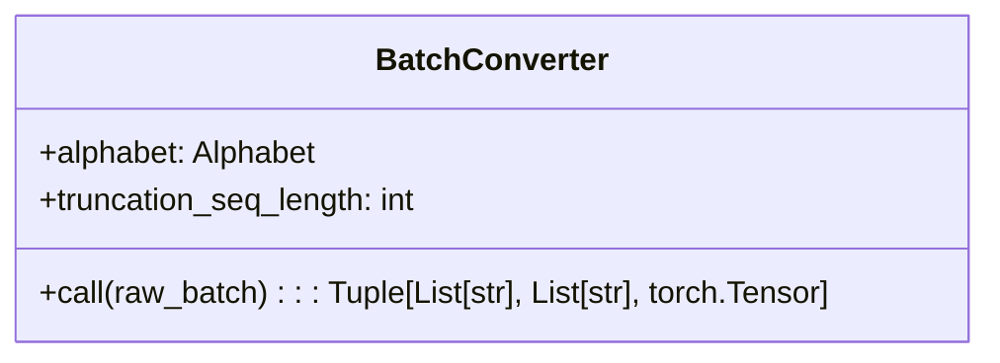
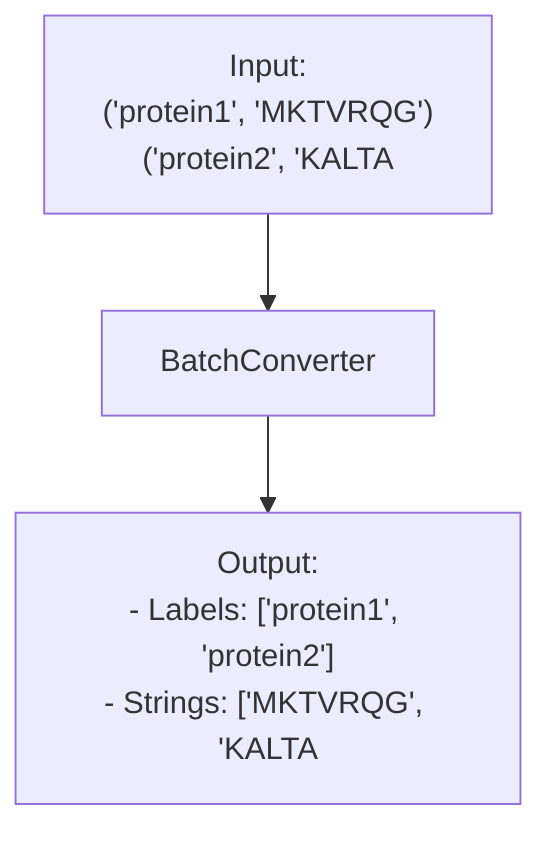
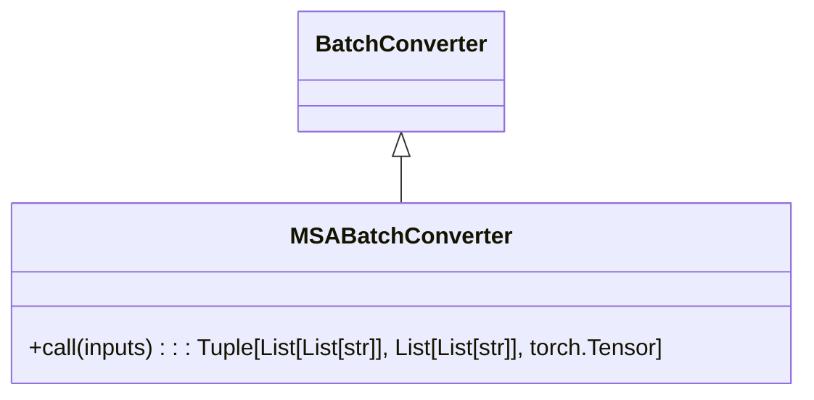
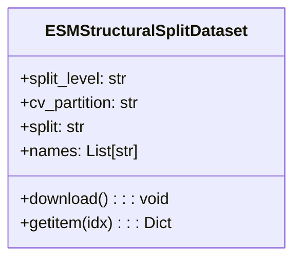
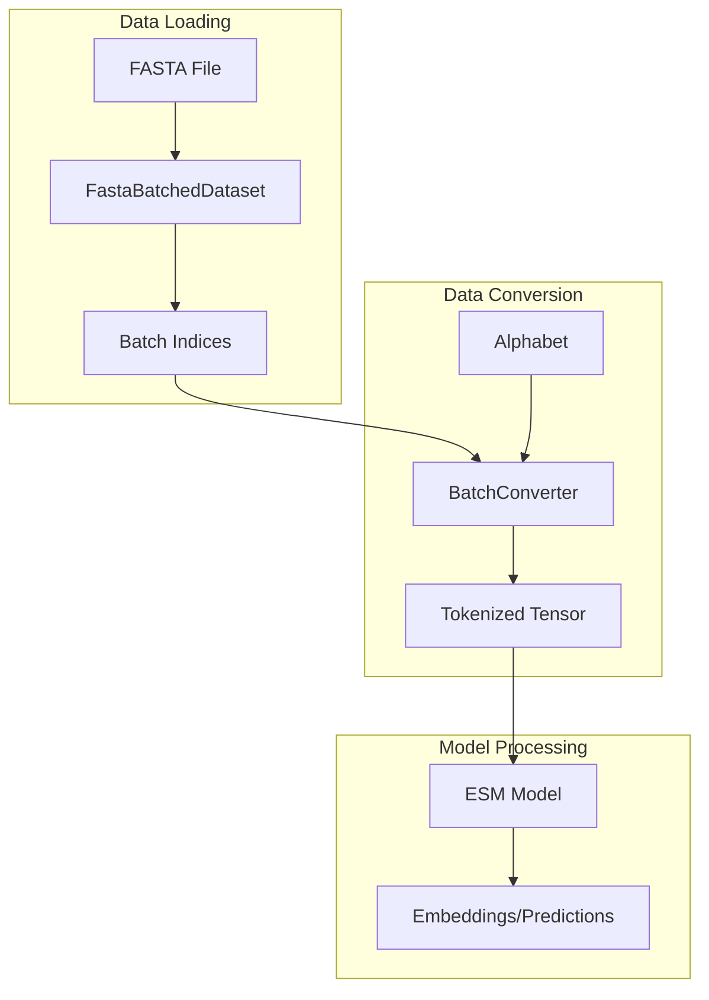

# Data Handling

> **Relevant source files**
> * [LICENSE](https://github.com/facebookresearch/esm/blob/2b369911/LICENSE)
> * [esm/axial_attention.py](https://github.com/facebookresearch/esm/blob/2b369911/esm/axial_attention.py)
> * [esm/constants.py](https://github.com/facebookresearch/esm/blob/2b369911/esm/constants.py)
> * [esm/data.py](https://github.com/facebookresearch/esm/blob/2b369911/esm/data.py)
> * [tests/test_alphabet.py](https://github.com/facebookresearch/esm/blob/2b369911/tests/test_alphabet.py)
> * [tests/test_notebooks.py](https://github.com/facebookresearch/esm/blob/2b369911/tests/test_notebooks.py)

## Purpose and Scope

This document describes how protein sequence data is processed, tokenized, and batched in the ESM (Evolutionary Scale Modeling) system. It covers the core data handling components that transform raw protein sequences into a format suitable for input to ESM models. For information about the models themselves, see [Models](/facebookresearch/esm/2-models), and for specific tools that use these data handling components, see [Tools and Utilities](/facebookresearch/esm/4-tools-and-utilities).

## Data Handling Overview

ESM's data handling system provides a pipeline for processing protein sequences from raw text format (typically FASTA files) to tokenized tensors that can be fed into the models. The system has several key components that work together:



Sources: [esm/data.py L19-L88](https://github.com/facebookresearch/esm/blob/2b369911/esm/data.py#L19-L88)

 [esm/data.py L91-L251](https://github.com/facebookresearch/esm/blob/2b369911/esm/data.py#L91-L251)

 [esm/data.py L253-L297](https://github.com/facebookresearch/esm/blob/2b369911/esm/data.py#L253-L297)

 [esm/data.py L300-L336](https://github.com/facebookresearch/esm/blob/2b369911/esm/data.py#L300-L336)

## Protein Sequence Representation

### Tokenization Process

Protein sequences in ESM are represented as strings of amino acid characters, which are then tokenized into indices for model input. The tokenization process follows these steps:



Sources: [esm/data.py L176-L247](https://github.com/facebookresearch/esm/blob/2b369911/esm/data.py#L176-L247)

### Amino Acid Vocabulary

ESM uses a standard amino acid vocabulary defined in `constants.py`:

```
L, A, G, V, S, E, R, T, I, D, P, K, Q, N, F, Y, M, H, W, C, X, B, U, Z, O, ., -
```

Special tokens are added depending on the model architecture, such as:

* `<cls>`: Classification token
* `<pad>`: Padding token
* `<eos>`: End of sequence token
* `<mask>`: Masked token for masked language modeling
* `<unk>`: Unknown token

Sources: [esm/constants.py L6-L10](https://github.com/facebookresearch/esm/blob/2b369911/esm/constants.py#L6-L10)

 [esm/data.py L91-L124](https://github.com/facebookresearch/esm/blob/2b369911/esm/data.py#L91-L124)

## The Alphabet Class

The `Alphabet` class is the central component for managing tokenization. It defines the vocabulary and provides methods for converting between amino acid characters and token indices.



### Creating an Alphabet for Different Models

The `Alphabet` class provides a factory method `from_architecture` that creates appropriate configurations for different model architectures:

| Architecture | Standard Tokens | Special Tokens | BOS | EOS | Use MSA |
| --- | --- | --- | --- | --- | --- |
| ESM-1 | 20 amino acids + extras | `<null_0>`, `<pad>`, `<eos>`, `<unk>`, `<cls>`, `<mask>`, `<sep>` | Yes | No | No |
| ESM-1b | 20 amino acids + extras | `<cls>`, `<pad>`, `<eos>`, `<unk>`, `<mask>` | Yes | Yes | No |
| MSA Transformer | 20 amino acids + extras | `<cls>`, `<pad>`, `<eos>`, `<unk>`, `<mask>` | Yes | No | Yes |

Sources: [esm/data.py L91-L174](https://github.com/facebookresearch/esm/blob/2b369911/esm/data.py#L91-L174)

## Data Loading and Batching

### FastaBatchedDataset

The `FastaBatchedDataset` class loads and manages protein sequences from FASTA files:



Key functionalities include:

* Loading sequences from FASTA files
* Storing sequence labels and strings
* Creating efficiently sized batches based on sequence lengths

### Efficient Batching

The `get_batch_indices` method creates batches of sequences that minimize padding while staying within a token limit:

1. Sequences are sorted by length
2. Batches are formed by adding sequences until the batch would exceed the token limit
3. This approach minimizes wasted computation on padding tokens

Sources: [esm/data.py L19-L88](https://github.com/facebookresearch/esm/blob/2b369911/esm/data.py#L19-L88)

## Sequence Conversion for Models

### BatchConverter

The `BatchConverter` class converts batches of raw sequences into tokenized tensors ready for model input:



The conversion process:

1. Takes a list of (label, sequence) pairs
2. Encodes each sequence using the Alphabet
3. Optionally truncates sequences if too long
4. Pads all sequences to the same length
5. Adds special tokens (BOS/EOS) as configured in the Alphabet
6. Returns labels, raw strings, and a tensor of token indices

Sources: [esm/data.py L253-L297](https://github.com/facebookresearch/esm/blob/2b369911/esm/data.py#L253-L297)

### Example Conversion Flow



Sources: [tests/test_alphabet.py L6-L24](https://github.com/facebookresearch/esm/blob/2b369911/tests/test_alphabet.py#L6-L24)

### MSABatchConverter

For multiple sequence alignments, the `MSABatchConverter` extends `BatchConverter` to handle batches of aligned sequences:



The MSA conversion process:

1. Takes a list of MSAs, where each MSA is a list of (label, sequence) pairs
2. Ensures all sequences in each MSA have the same length
3. Creates a 3D tensor of shape [batch_size, num_sequences, sequence_length]

Sources: [esm/data.py L300-L336](https://github.com/facebookresearch/esm/blob/2b369911/esm/data.py#L300-L336)

## Structural Data Handling

The `ESMStructuralSplitDataset` class provides access to the structural split dataset described in the ESM paper:



This dataset includes:

* Protein sequences
* Secondary structure labels
* Distance maps
* 3D coordinates
* Split configurations for cross-validation

It's primarily used for structure prediction and contact prediction tasks.

Sources: [esm/data.py L381-L493](https://github.com/facebookresearch/esm/blob/2b369911/esm/data.py#L381-L493)

## Integration with Model Inputs

When integrating with models, the data handling flow typically follows this pattern:



This standardized data handling pipeline ensures that all ESM models receive consistently processed inputs, allowing for interoperability between different components of the system.

Sources: [esm/data.py L136-L140](https://github.com/facebookresearch/esm/blob/2b369911/esm/data.py#L136-L140)

 [tests/test_alphabet.py L48-L62](https://github.com/facebookresearch/esm/blob/2b369911/tests/test_alphabet.py#L48-L62)