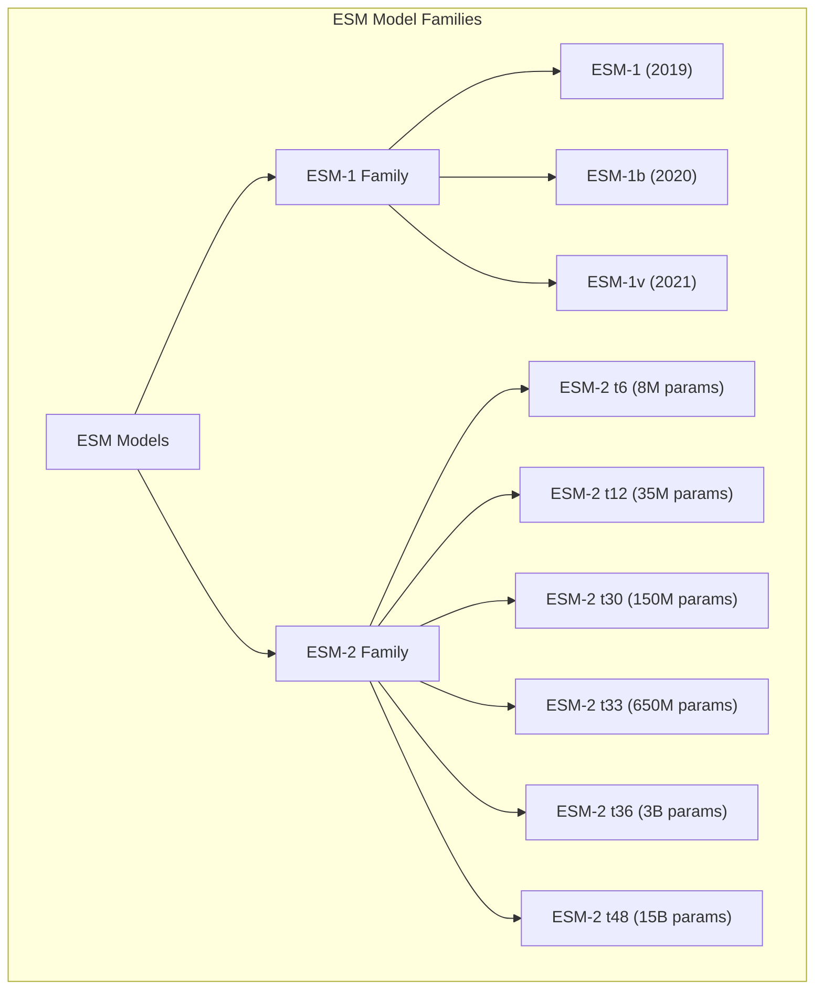
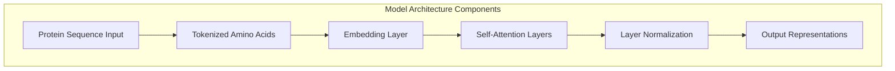
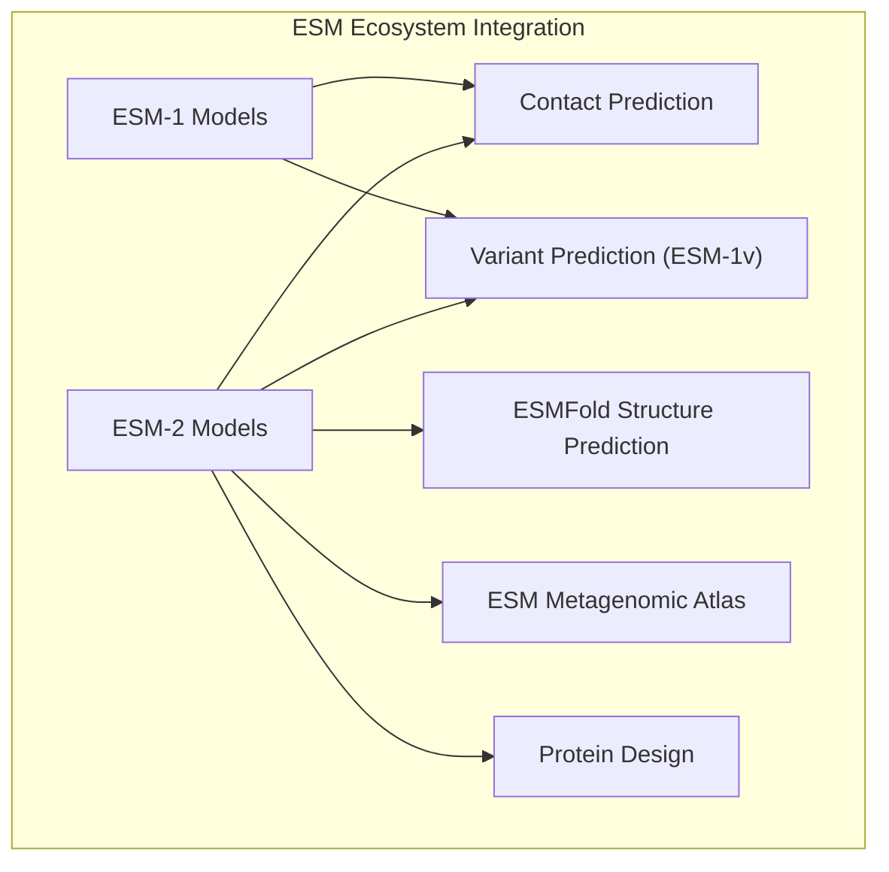

# ESM-1 and ESM-2

> **Relevant source files**
> * [README.md](https://github.com/facebookresearch/esm/blob/2b369911/README.md?plain=1)
> * [esm/__init__.py](https://github.com/facebookresearch/esm/blob/2b369911/esm/__init__.py)
> * [esm/pretrained.py](https://github.com/facebookresearch/esm/blob/2b369911/esm/pretrained.py)
> * [hubconf.py](https://github.com/facebookresearch/esm/blob/2b369911/hubconf.py)
> * [tests/test_readme.py](https://github.com/facebookresearch/esm/blob/2b369911/tests/test_readme.py)

This page documents the core protein language models in the ESM (Evolutionary Scale Modeling) repository: ESM-1 and ESM-2. These models serve as the foundation for protein sequence understanding and enable various downstream tasks like structure prediction, variant effect prediction, and contact prediction. For information about structure prediction using these language models, see [ESMFold](/facebookresearch/esm/2.3-esmfold), and for multiple sequence alignment modeling, see [MSA Transformer](/facebookresearch/esm/2.2-msa-transformer).

## Introduction

ESM-1 and ESM-2 are transformer-based protein language models that learn protein sequence representations by training on large protein sequence databases. These models encode proteins as sequences of amino acids and learn contextual representations that capture evolutionary and structural information, despite being trained solely on sequence data.

Sources: [README.md L7-L11](https://github.com/facebookresearch/esm/blob/2b369911/README.md?plain=1#L7-L11)

## Model Families

ESM-1 and ESM-2 represent successive generations of protein language models with increasing capabilities.



Sources: [README.md L99-L105](https://github.com/facebookresearch/esm/blob/2b369911/README.md?plain=1#L99-L105)

 [hubconf.py L1-L43](https://github.com/facebookresearch/esm/blob/2b369911/hubconf.py#L1-L43)

 [esm/pretrained.py L224-L397](https://github.com/facebookresearch/esm/blob/2b369911/esm/pretrained.py#L224-L397)

### ESM-1 Family

The ESM-1 family includes several variants of the original protein language model:

* **ESM-1**: Original transformer models with 6-34 layers (43M-670M parameters)
* **ESM-1b**: Improved 33-layer model (650M parameters) with better performance
* **ESM-1v**: Specialized variant effect prediction models (ensemble of 5 models)

These models were trained on different versions of the UniRef database, designated by the suffix in their names:

* **UR50S**: UniRef50 sparse
* **UR50D**: UniRef50 dense
* **UR90S**: UniRef90 sparse
* **UR100**: UniRef100

Sources: [esm/pretrained.py L224-L336](https://github.com/facebookresearch/esm/blob/2b369911/esm/pretrained.py#L224-L336)

 [README.md L39-L54](https://github.com/facebookresearch/esm/blob/2b369911/README.md?plain=1#L39-L54)

### ESM-2 Family

ESM-2 represents the state-of-the-art generation of protein language models, significantly outperforming ESM-1 models. It includes models of various sizes:

| Model | Layers | Parameters | Embedding Dim | Training Data |
| --- | --- | --- | --- | --- |
| ESM-2 t6 | 6 | 8M | 320 | UR50D |
| ESM-2 t12 | 12 | 35M | 480 | UR50D |
| ESM-2 t30 | 30 | 150M | 640 | UR50D |
| ESM-2 t33 | 33 | 650M | 1280 | UR50D |
| ESM-2 t36 | 36 | 3B | 2560 | UR50D |
| ESM-2 t48 | 48 | 15B | 5120 | UR50D |

The larger ESM-2 models (especially the 3B and 15B parameter versions) form the basis for ESMFold's structure prediction capabilities.

Sources: [README.md L477-L486](https://github.com/facebookresearch/esm/blob/2b369911/README.md?plain=1#L477-L486)

 [esm/pretrained.py L350-L397](https://github.com/facebookresearch/esm/blob/2b369911/esm/pretrained.py#L350-L397)

## Model Architecture and Implementation



Both ESM-1 and ESM-2 use transformer architectures, but with different implementations:

### ESM-1 Implementation

ESM-1 models are implemented as `ProteinBertModel` in the codebase. They follow the BERT-style architecture with bidirectional attention.

Key components:

* Tokenization using a protein-specific alphabet
* Embedding layer that converts amino acid tokens to vectors
* Multiple transformer layers with self-attention
* Layer normalization and residual connections

Sources: [esm/__init__.py L9](https://github.com/facebookresearch/esm/blob/2b369911/esm/__init__.py#L9-L9)

 [esm/pretrained.py L85-L110](https://github.com/facebookresearch/esm/blob/2b369911/esm/pretrained.py#L85-L110)

### ESM-2 Implementation

ESM-2 models are implemented as `ESM2` class and represent an improved architecture over ESM-1.

Key improvements in ESM-2:

* Optimized architecture for protein sequences
* Scaled to much larger model sizes (up to 15B parameters)
* Better training methodology
* Uses the same alphabet as ESM-1b for tokenization

Sources: [esm/__init__.py L10](https://github.com/facebookresearch/esm/blob/2b369911/esm/__init__.py#L10-L10)

 [esm/pretrained.py L164-L183](https://github.com/facebookresearch/esm/blob/2b369911/esm/pretrained.py#L164-L183)

## Loading and Using the Models

ESM-1 and ESM-2 models can be loaded using the `pretrained` module:

```javascript
import esm # Load an ESM-1 modelmodel1, alphabet1 = esm.pretrained.esm1b_t33_650M_UR50S() # Load an ESM-2 modelmodel2, alphabet2 = esm.pretrained.esm2_t33_650M_UR50D() # For the largest model (may require special handling for memory)model_large, alphabet_large = esm.pretrained.esm2_t48_15B_UR50D()
```

Each model function returns the model itself and the associated alphabet for tokenization.


### Basic Usage Pattern

1. Load the model and alphabet
2. Create a batch converter from the alphabet
3. Convert protein sequences to tokens
4. Pass tokens through the model to get representations
5. Extract representations for downstream tasks

Sources: [tests/test_readme.py L22-L60](https://github.com/facebookresearch/esm/blob/2b369911/tests/test_readme.py#L22-L60)

 [README.md L162-L200](https://github.com/facebookresearch/esm/blob/2b369911/README.md?plain=1#L162-L200)

 [esm/pretrained.py L24-L221](https://github.com/facebookresearch/esm/blob/2b369911/esm/pretrained.py#L24-L221)

## Performance Comparison

ESM-2 models outperform ESM-1 models across a range of structure prediction and sequence understanding tasks. The performance scales with model size, with the largest ESM-2 models (3B and 15B parameters) achieving state-of-the-art results for single-sequence protein language models.

Key metrics where ESM-2 excels compared to ESM-1:

* Unsupervised contact prediction
* Structure prediction accuracy
* Zero-shot prediction of functional effects

Benchmark performance from the README shows that ESM-2 (650M parameters) achieves 52.7% precision on the CASP14 benchmark for unsupervised contact prediction, compared to 41.1% for ESM-1b of comparable size.

Sources: [README.md L551-L623](https://github.com/facebookresearch/esm/blob/2b369911/README.md?plain=1#L551-L623)

## Common Applications

ESM-1 and ESM-2 models can be used for:

1. **Feature Extraction**: Obtaining protein embeddings for machine learning tasks
2. **Contact Prediction**: Predicting amino acid residue contacts from attention maps
3. **Variant Effect Prediction**: Zero-shot prediction of mutation effects
4. **Structure Prediction**: When combined with structural modules (in ESMFold)
5. **Protein Design**: Designing novel protein sequences

The models support extracting embeddings at different levels:

* Per-token representations for each amino acid position
* Mean representations for whole proteins
* Attention maps for contact prediction

Sources: [README.md L276-L319](https://github.com/facebookresearch/esm/blob/2b369911/README.md?plain=1#L276-L319)

 [tests/test_readme.py L62-L91](https://github.com/facebookresearch/esm/blob/2b369911/tests/test_readme.py#L62-L91)

## Integration with Other ESM Components

ESM-1 and ESM-2 models serve as the foundation for other components in the ESM ecosystem:



The ESM-2 models form the backbone of ESMFold and other advanced applications in the ecosystem. ESM-2 (particularly the 3B parameter version) is used as the language model component of ESMFold's end-to-end structure prediction pipeline.

Sources: [README.md L7-L18](https://github.com/facebookresearch/esm/blob/2b369911/README.md?plain=1#L7-L18)

 [README.md L405-L418](https://github.com/facebookresearch/esm/blob/2b369911/README.md?plain=1#L405-L418)

## Tools for Working with ESM-1 and ESM-2

The repository provides utilities for working with these models:

1. **`esm-extract`**: Command-line tool for extracting embeddings from protein sequences
2. **PyTorch Hub**: Direct loading of models through `torch.hub`
3. **CPU Offloading**: Utilities for working with large models on limited hardware
4. **Batch Processing**: Tools for efficiently processing large datasets

Sources: [README.md L276-L336](https://github.com/facebookresearch/esm/blob/2b369911/README.md?plain=1#L276-L336)

 [hubconf.py L8-L43](https://github.com/facebookresearch/esm/blob/2b369911/hubconf.py#L8-L43)

## Memory Considerations

The larger ESM-2 models, particularly the 15B parameter model, require significant GPU memory. The repository provides functionality for CPU offloading and FSDP (Fully Sharded Data Parallel) to handle large models on limited hardware resources.

For the 15B parameter model, special handling may be required:

```markdown
# See examples/esm2_infer_fairscale_fsdp_cpu_offloading.py for details
```

Sources: [README.md L333-L338](https://github.com/facebookresearch/esm/blob/2b369911/README.md?plain=1#L333-L338)

 [esm/pretrained.py L390-L397](https://github.com/facebookresearch/esm/blob/2b369911/esm/pretrained.py#L390-L397)