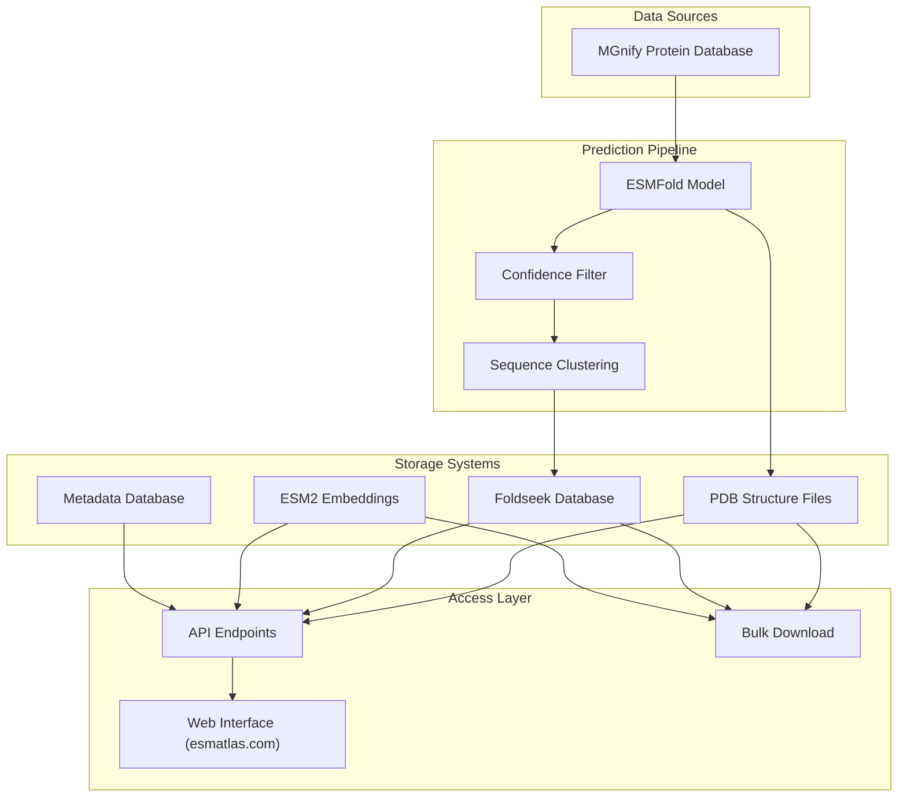
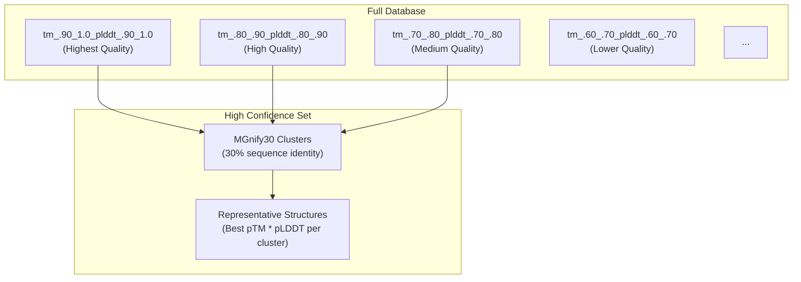
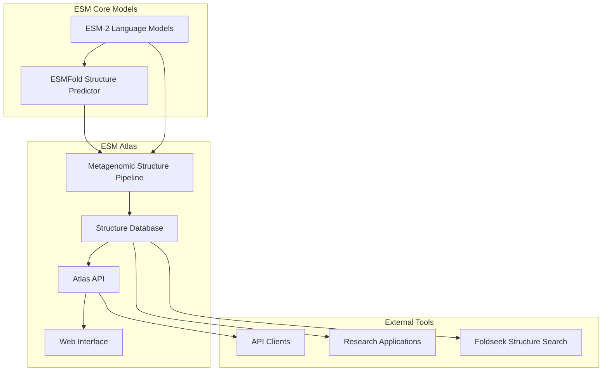

# ESM Metagenomic Atlas

> **Relevant source files**
> * [README.md](https://github.com/facebookresearch/esm/blob/2b369911/README.md?plain=1)
> * [scripts/atlas/README.md](https://github.com/facebookresearch/esm/blob/2b369911/scripts/atlas/README.md?plain=1)
> * [tests/test_readme.py](https://github.com/facebookresearch/esm/blob/2b369911/tests/test_readme.py)

## Purpose and Scope

This document details the ESM Metagenomic Atlas system, a comprehensive resource containing more than 700 million predicted metagenomic protein structures generated using ESMFold. It explains the Atlas architecture, data organization, access methods, and overall system design. For information about the ESMFold structure prediction model itself that powers the Atlas, see [ESMFold](/facebookresearch/esm/2.3-esmfold).

Sources: [README.md L404-L411](https://github.com/facebookresearch/esm/blob/2b369911/README.md?plain=1#L404-L411)

 [scripts/atlas/README.md L1-L9](https://github.com/facebookresearch/esm/blob/2b369911/scripts/atlas/README.md?plain=1#L1-L9)

## Overview

The ESM Metagenomic Atlas (also called ESM Atlas) is an open database of protein structures predicted from metagenomic sequences. It applies the ESM protein language models to large-scale structure prediction across the microbial universe, providing structural information for proteins identified in environmental samples. The Atlas integrates with the ESM ecosystem while providing its own dedicated API, web interface, and data storage systems.

### Atlas Versions

| Version | Release Date | Data Source | Structures | ESMFold Version | Features |
| --- | --- | --- | --- | --- | --- |
| v0 | November 2022 | MGnify 2022_05 | ~617 million | esmfold_v0 | PDB structures, Foldseek DB |
| v2023_02 | March 2023 | MGnify 2023_02 | ~150 million additional | esmfold_v1 | Adds pre-computed ESM2 embeddings |

Sources: [README.md L11-L14](https://github.com/facebookresearch/esm/blob/2b369911/README.md?plain=1#L11-L14)

 [scripts/atlas/README.md L6-L9](https://github.com/facebookresearch/esm/blob/2b369911/scripts/atlas/README.md?plain=1#L6-L9)

## System Architecture

### ESM Atlas System Components



Sources: [README.md L404-L418](https://github.com/facebookresearch/esm/blob/2b369911/README.md?plain=1#L404-L418)

 [scripts/atlas/README.md L10-L23](https://github.com/facebookresearch/esm/blob/2b369911/scripts/atlas/README.md?plain=1#L10-L23)

### Data Processing Flow

```mermaid
flowchart TD

Protein["Metagenomic Protein Sequence"]
ESMFold["ESMFold Structure Prediction"]
ESM2["ESM2 Embedding Generation"]
QualityEval["Quality Evaluation (pLDDT & pTM)"]
Binning["Confidence-based Binning"]
HighConf["High Confidence Set"]
FullDB["Full Database"]
Embeddings["Embedding Storage"]

Protein --> ESMFold
Protein --> ESM2
Binning --> HighConf
Binning --> FullDB
ESM2 --> Embeddings

subgraph Storage ["Storage"]
    HighConf
    FullDB
    Embeddings
end

subgraph Processing ["Processing"]
    ESMFold
    ESM2
    QualityEval
    Binning
    ESMFold --> QualityEval
    QualityEval --> Binning
end

subgraph Input ["Input"]
    Protein
end
```



Sources: [scripts/atlas/README.md L10-L17](https://github.com/facebookresearch/esm/blob/2b369911/scripts/atlas/README.md?plain=1#L10-L17)

 [README.md L406-L410](https://github.com/facebookresearch/esm/blob/2b369911/README.md?plain=1#L406-L410)

## Data Organization

The Atlas organizes structures based on their confidence scores derived from the ESMFold prediction process. Each structure in the Atlas has associated metadata that includes quality metrics and identifiers.

### Quality Metrics

The Atlas uses two key metrics to evaluate structure prediction quality:

1. **pLDDT (predicted Local Distance Difference Test)**: Measures local structural accuracy
2. **pTM (predicted Template Modeling)**: Measures global structural alignment quality

Structures with pLDDT > 0.7 and pTM > 0.7 are considered high confidence predictions.

### Confidence Binning System

Structures are organized into bins based on their prediction confidence scores, allowing users to select structures based on quality thresholds relevant to their research needs. For example, bins are named using the pattern: `tm_.60_.70_plddt_.80_.90` to indicate pTM scores from 0.60-0.70 and pLDDT scores from 0.80-0.90.



Sources: [scripts/atlas/README.md L46-L54](https://github.com/facebookresearch/esm/blob/2b369911/scripts/atlas/README.md?plain=1#L46-L54)

 [scripts/atlas/README.md L60-L68](https://github.com/facebookresearch/esm/blob/2b369911/scripts/atlas/README.md?plain=1#L60-L68)

### Metadata Structure

Each structure in the Atlas has associated metadata stored in a SQLite/Parquet database with the following key fields:

| Field | Description |
| --- | --- |
| id | MGnify identifier |
| ptm | Predicted TM score |
| plddt | Predicted average LDDT |
| num_conf | Number of residues with pLDDT > 0.7 |
| len | Total residues in the protein |
| is_fragment | Fragment status in MGnify90 |
| sequenceChecksum | CRC64 hash of the sequence |
| esmfold_version | Version of ESMFold used |
| atlas_version | Atlas version where structure first appeared |
| sequence_dbs | Source metagenomic databases |

Sources: [scripts/atlas/README.md L20-L37](https://github.com/facebookresearch/esm/blob/2b369911/scripts/atlas/README.md?plain=1#L20-L37)

## Access Methods

The ESM Metagenomic Atlas provides multiple ways to access and interact with the data:

### Web Interface

The [ESM Atlas website](https://esmatlas.com) provides an interface for:

* Folding new sequences with ESMFold
* Searching the Atlas by structure or sequence
* Visualizing and analyzing protein structures
* Accessing documentation and resources

### API Endpoints

The Atlas provides programmatic access through API endpoints:

```markdown
# Example API call to fold a protein sequence
curl -X POST --data "SEQUENCE" https://api.esmatlas.com/foldSequence/v1/pdb/

# Fetch an embedding for a specific ID
GET /fetchEmbedding/ESM2/:id
```

Sources: [README.md L119-L125](https://github.com/facebookresearch/esm/blob/2b369911/README.md?plain=1#L119-L125)

 [README.md L412-L416](https://github.com/facebookresearch/esm/blob/2b369911/README.md?plain=1#L412-L416)

### Bulk Downloads

For large-scale analysis, the Atlas provides bulk download functionality for:

1. **Structure Tarballs**: PDB structure files organized by confidence bins
2. **Foldseek Databases**: Optimized for structure-based searching
3. **ESM2 Embeddings**: Pre-computed embeddings for all sequences

The recommended download method uses `aria2c` or `s5cmd`:

```
aria2c --dir=/path/to/download/to --input-file=url-file-provided.txt
```

Sources: [scripts/atlas/README.md L38-L57](https://github.com/facebookresearch/esm/blob/2b369911/scripts/atlas/README.md?plain=1#L38-L57)

## High Confidence MGnify30 Dataset

The Atlas includes a special high-confidence subset created through:

1. Clustering MGnify90 down to 30% sequence similarity using `mmseqs easy-linclust`
2. Filtering structures to >0.7 pTM and pLDDT
3. Sorting by `pTM * pLDDT` and selecting the best structure from each cluster

This subset provides a non-redundant collection of high-quality structures representing the diversity of the metagenomic protein space.

Sources: [scripts/atlas/README.md L60-L72](https://github.com/facebookresearch/esm/blob/2b369911/scripts/atlas/README.md?plain=1#L60-L72)

## Integration with ESM Ecosystem



Sources: [README.md L9-L17](https://github.com/facebookresearch/esm/blob/2b369911/README.md?plain=1#L9-L17)

 [README.md L404-L418](https://github.com/facebookresearch/esm/blob/2b369911/README.md?plain=1#L404-L418)

## Technical Implementation

The ESM Atlas uses a variety of technologies for structure storage, search, and access:

1. **PDB File Storage**: Structures stored in standard PDB format, organized by confidence bins
2. **Foldseek Databases**: Specialized database for rapid structure-based searching
3. **SQLite/Parquet Metadata**: Efficient storage of structure metadata
4. **ESM2 Embeddings**: Machine learning representations for each protein sequence

The total size of the Atlas data varies by component:

* High confidence structures: ~1TB
* Full database (PDB structures): ~15TB for v0
* Metadata: ~25GB

Sources: [scripts/atlas/README.md L18-L22](https://github.com/facebookresearch/esm/blob/2b369911/scripts/atlas/README.md?plain=1#L18-L22)

 [scripts/atlas/README.md L46-L57](https://github.com/facebookresearch/esm/blob/2b369911/scripts/atlas/README.md?plain=1#L46-L57)

## Licensing Information

The ESM Metagenomic Atlas data is available under a CC BY 4.0 license for both academic and commercial use. Copyright belongs to Meta Platforms, Inc. When using Atlas structures in research, proper citation of the relevant publications is required.

Sources: [scripts/atlas/README.md L88-L100](https://github.com/facebookresearch/esm/blob/2b369911/scripts/atlas/README.md?plain=1#L88-L100)

 [README.md L793-L795](https://github.com/facebookresearch/esm/blob/2b369911/README.md?plain=1#L793-L795)